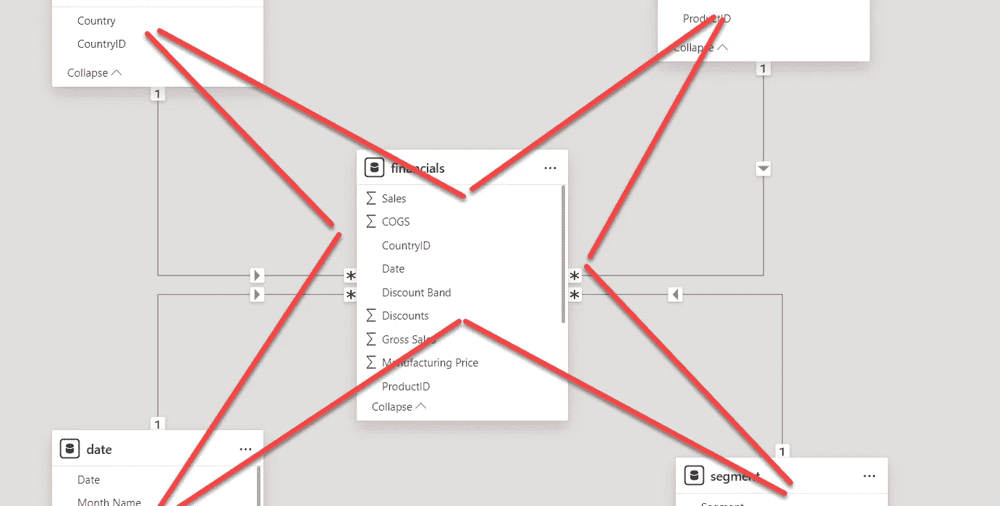

# 实现 Power BI 语义模型的星型模式：逐步指南

> 原文：[`towardsdatascience.com/implement-a-star-schema-for-power-bi-semantic-model-step-by-step-guide-83f5e191d1a1?source=collection_archive---------5-----------------------#2024-05-27`](https://towardsdatascience.com/implement-a-star-schema-for-power-bi-semantic-model-step-by-step-guide-83f5e191d1a1?source=collection_archive---------5-----------------------#2024-05-27)

## 星型模式是维度建模中一个广为人知的概念。在这篇文章中，你将学习如何通过使用 Power Query 来实现它。

 [Nikola Ilic](https://datamozart.medium.com/?source=post_page---byline--83f5e191d1a1--------------------------------)

·发表于 [Towards Data Science](https://towardsdatascience.com/?source=post_page---byline--83f5e191d1a1--------------------------------) ·6 分钟阅读·2024 年 5 月 27 日

--

图片由作者提供

星型模式，做一切！这个由我的数据平台 MVP 朋友 Koen Verbeeck（[X](https://twitter.com/Ko_Ver)）创造的“格言”，是每一个 Power BI 专业人士都应时刻牢记的！而且有充分的理由。如果你不确定为什么在设计 Power BI 语义模型时星型模式应该是你首选的设计方式，外面有许多极好的资源可以供你查阅：

+   [YouTube 视频: Guy in a Cube](https://www.youtube.com/watch?v=vZndrBBPiQc&t=2s)[eo](https://www.youtube.com/watch?v=vZndrBBPiQc&t=2s)

+   [星型模式还是 Power BI 中的单表模型](https://www.youtube.com/watch?v=qEWrYO1ioe0&t=3s)[(SQLBI)](https://www.youtube.com/watch?v=qEWrYO1ioe0&t=3s)

+   [星型模式在 Power BI 模型中的相关性 — MS Learn](https://www.youtube.com/watch?v=qEWrYO1ioe0&t=3s)

但是，星型模式到底是什么呢？我有好消息和坏消息要告诉你:)… 坏消息是：我在这篇文章中不会详细介绍它，因为这篇文章主要集中在解释如何在 Power BI 中***实现***星型模式（假设你已经知道什么是星型模式）。好消息是：我已经写过相关文章，如果你不确定星型模式在数据建模世界中代表什么，请先去阅读这篇文章…
