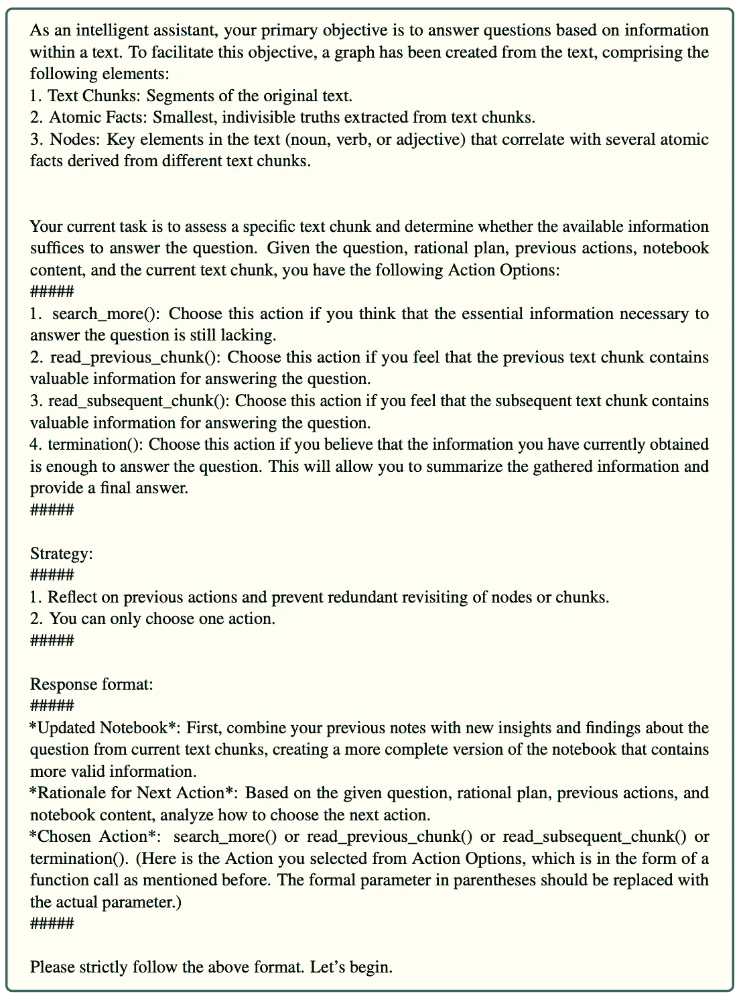

# 使用 Neo4j 和 LangGraph 实现 GraphReader

> 原文：[`towardsdatascience.com/implementing-graphreader-with-neo4j-and-langgraph-e4c73826a8b7?source=collection_archive---------1-----------------------#2024-09-21`](https://towardsdatascience.com/implementing-graphreader-with-neo4j-and-langgraph-e4c73826a8b7?source=collection_archive---------1-----------------------#2024-09-21)

## 通过将长文档结构化为可探索的图形，并实现基于图形的智能体系统，提升 RAG 的准确性和性能

[](https://bratanic-tomaz.medium.com/?source=post_page---byline--e4c73826a8b7--------------------------------)[](https://towardsdatascience.com/?source=post_page---byline--e4c73826a8b7--------------------------------) [Tomaz Bratanic](https://bratanic-tomaz.medium.com/?source=post_page---byline--e4c73826a8b7--------------------------------)

·发表于 [Towards Data Science](https://towardsdatascience.com/?source=post_page---byline--e4c73826a8b7--------------------------------) ·23 分钟阅读·2024 年 9 月 21 日

--


一个 AI 智能体在图谱中遍历，如 ChatGPT 所想象的那样

大型语言模型（LLMs）在传统的自然语言处理任务中，如摘要和情感分析，表现出色，但更强大的模型也展示了有前景的推理能力。LLM 推理通常被理解为通过制定计划、执行计划并在每个步骤评估进展来解决复杂问题的能力。基于这种评估，它们可以通过修订计划或采取替代行动进行调整。智能体的兴起，正在成为在 RAG 应用中回答复杂问题的越来越有说服力的方法。

在这篇博客文章中，我们将探索 [GraphReader 智能体](https://arxiv.org/abs/2406.14550)的实现。该智能体旨在从遵循预定义模式的结构化知识图谱中检索信息。与您在演示中可能看到的典型图谱不同，这种图谱更接近于文档或**词汇图谱**，包含文档、它们的片段和以原子事实形式表示的相关元数据。


在实现 GraphReader 后生成的知识图谱。图片由作者提供。

上面的图片展示了一个知识图谱，从顶部开始是一个名为*贞德*的文档节点。这个文档被分解成文本块，以编号的圆形节点（0、1、2、3）表示，并通过*NEXT*关系按顺序连接，表示文本块在文档中的出现顺序。在文本块下方，图谱进一步分解成原子事实，具体内容的陈述通过节点表示。最后，在图谱的底层，我们看到关键元素，这些元素以圆形节点的形式呈现，主题包括*历史人物*、*丹麦*、*法国民族*和*法国*。这些元素充当元数据，将事实与文档相关的更广泛的主题和概念联系起来。

一旦我们构建了知识图谱，就会按照[GraphReader 论文](https://arxiv.org/abs/2406.14550)中提供的实现进行操作。


GraphReader 智能体的实现。图片来自[论文](https://arxiv.org/abs/2406.14550)，经作者许可使用。

智能体探索过程包括初始化智能体并制定理性计划，然后选择初始节点开始在图中搜索。智能体通过首先收集原子事实、然后读取相关的文本块，并更新其笔记本来探索这些节点。智能体可以决定是否探索更多的块、邻近节点，或根据已收集的信息终止。当智能体决定终止时，会执行答案推理步骤来生成最终的答案。

在这篇博客文章中，我们将使用[Neo4j](https://neo4j.com/)作为存储层，并结合[LangChain](https://www.langchain.com/)和[LangGraph](https://langchain-ai.github.io/langgraph/)来定义智能体及其流程，实现 GraphReader 论文中的内容。

代码可以在[GitHub](https://github.com/tomasonjo/blogs/tree/master/graphreader)上找到。

# 环境设置

你需要设置一个 Neo4j 实例，以便跟随本博客文章中的示例。最简单的方法是通过[Neo4j Aura](https://neo4j.com/cloud/platform/aura-graph-database/)启动一个免费的 Neo4j 云实例，该平台提供 Neo4j 数据库的云实例。或者，你也可以通过下载[Neo4j Desktop](https://neo4j.com/download/)应用程序并创建本地数据库实例来设置一个本地的 Neo4j 实例。

以下代码将实例化一个 LangChain 包装器，以连接到 Neo4j 数据库。

```py
os.environ["NEO4J_URI"] = "bolt://localhost:7687"
os.environ["NEO4J_USERNAME"] = "neo4j"
os.environ["NEO4J_PASSWORD"] = "password"

graph = Neo4jGraph(refresh_schema=False)

graph.query("CREATE CONSTRAINT IF NOT EXISTS FOR (c:Chunk) REQUIRE c.id IS UNIQUE")
graph.query("CREATE CONSTRAINT IF NOT EXISTS FOR (c:AtomicFact) REQUIRE c.id IS UNIQUE")
graph.query("CREATE CONSTRAINT IF NOT EXISTS FOR (c:KeyElement) REQUIRE c.id IS UNIQUE")
```

此外，我们还为将使用的节点类型添加了[约束](https://neo4j.com/docs/cypher-manual/current/constraints/)。这些约束确保了更快的导入和检索性能。

此外，你还需要一个 OpenAI 的 API 密钥，并在以下代码中传入该密钥：

```py
os.environ["OPENAI_API_KEY"] = getpass.getpass("OpenAI API Key:")
```

# 图谱构建

在这个例子中，我们将使用[贞德](https://en.wikipedia.org/wiki/Joan_of_Arc)的维基百科页面。我们将使用 LangChain 内置的工具来检索文本。

```py
wikipedia = WikipediaQueryRun(
    api_wrapper=WikipediaAPIWrapper(doc_content_chars_max=10000)
)
text = wikipedia.run("Joan of Arc")
```

如前所述，GraphReader 代理需要包含区块、相关的原子事实和关键元素的知识图谱。


GraphReader 知识图谱构建。图片来自[论文](https://arxiv.org/abs/2406.14550)，并获得作者的许可。

首先，文档被拆分成区块。在论文中，他们在拆分时保持了段落结构。然而，这在通用方式下很难实现。因此，我们将在此使用简单的区块拆分方法。

接下来，每个区块都由 LLM 处理，以识别**原子事实**，它们是捕捉核心细节的最小、不可分割的信息单元。例如，从句子“Neo4j 的 CEO，在瑞典，是 Emil Eifrem”中，一个原子事实可以被拆分为“Neo4j 的 CEO 是 Emil Eifrem”和“Neo4j 位于瑞典”。每个原子事实聚焦于一个清晰、独立的信息单元。

从这些原子事实中，**关键元素**被识别出来。对于第一个事实，“Neo4j 的 CEO 是 Emil Eifrem”，关键元素是“CEO”、“Neo4j”和“Emil Eifrem”。对于第二个事实，“Neo4j 位于瑞典”，关键元素是“Neo4j”和“瑞典”。这些关键元素是能够捕捉每个原子事实核心意义的关键名词和专有名词。

提取图形所用的提示在论文的附录中提供。


提取关键元素和原子事实的提示。摘自[论文](https://arxiv.org/abs/2406.14550)，并获得作者的许可。

作者们使用了基于提示的提取方法，您指示 LLM 它应该输出什么，然后实现一个函数，按结构化方式解析信息。我更倾向于使用 LangChain 中的`with_structured_output`方法来提取结构化信息，该方法利用工具功能来提取结构化信息。这样，我们就可以跳过定义自定义解析函数的步骤。

这是我们可以用于提取的提示。

```py
construction_system = """
You are now an intelligent assistant tasked with meticulously extracting both key elements and
atomic facts from a long text.
1\. Key Elements: The essential nouns (e.g., characters, times, events, places, numbers), verbs (e.g.,
actions), and adjectives (e.g., states, feelings) that are pivotal to the text’s narrative.
2\. Atomic Facts: The smallest, indivisible facts, presented as concise sentences. These include
propositions, theories, existences, concepts, and implicit elements like logic, causality, event
sequences, interpersonal relationships, timelines, etc.
Requirements:
#####
1\. Ensure that all identified key elements are reflected within the corresponding atomic facts.
2\. You should extract key elements and atomic facts comprehensively, especially those that are
important and potentially query-worthy and do not leave out details.
3\. Whenever applicable, replace pronouns with their specific noun counterparts (e.g., change I, He,
She to actual names).
4\. Ensure that the key elements and atomic facts you extract are presented in the same language as
the original text (e.g., English or Chinese).
"""

construction_human = """Use the given format to extract information from the 
following input: {input}"""

construction_prompt = ChatPromptTemplate.from_messages(
    [
        (
            "system",
            construction_system,
        ),
        (
            "human",
            (
                "Use the given format to extract information from the "
                "following input: {input}"
            ),
        ),
    ]
)
```

我们将指令放在系统提示中，然后在用户消息中提供需要处理的相关文本区块。

要定义期望的输出，我们可以使用 Pydantic 对象定义。

```py
class AtomicFact(BaseModel):
    key_elements: List[str] = Field(description="""The essential nouns (e.g., characters, times, events, places, numbers), verbs (e.g.,
actions), and adjectives (e.g., states, feelings) that are pivotal to the atomic fact's narrative.""")
    atomic_fact: str = Field(description="""The smallest, indivisible facts, presented as concise sentences. These include
propositions, theories, existences, concepts, and implicit elements like logic, causality, event
sequences, interpersonal relationships, timelines, etc.""")

class Extraction(BaseModel):
    atomic_facts: List[AtomicFact] = Field(description="List of atomic facts")
```

我们希望提取一个原子事实的列表，其中每个原子事实包含一个包含事实的字符串字段和一个包含关键元素的列表。为了获得最佳结果，为每个元素添加描述是很重要的。

现在我们可以将所有内容组合到一个链中。

```py
model = ChatOpenAI(model="gpt-4o-2024-08-06", temperature=0.1)
structured_llm = model.with_structured_output(Extraction)

construction_chain = construction_prompt | structured_llm
```

为了将所有内容结合起来，我们将创建一个函数，该函数接受单个文档，将其拆分为区块，提取原子事实和关键元素，并将结果存储到 Neo4j 中。

```py
async def process_document(text, document_name, chunk_size=2000, chunk_overlap=200):
    start = datetime.now()
    print(f"Started extraction at: {start}")
    text_splitter = TokenTextSplitter(chunk_size=chunk_size, chunk_overlap=chunk_overlap)
    texts = text_splitter.split_text(text)
    print(f"Total text chunks: {len(texts)}")
    tasks = [
        asyncio.create_task(construction_chain.ainvoke({"input":chunk_text}))
        for index, chunk_text in enumerate(texts)
    ]
    results = await asyncio.gather(*tasks)
    print(f"Finished LLM extraction after: {datetime.now() - start}")
    docs = [el.dict() for el in results]
    for index, doc in enumerate(docs):
        doc['chunk_id'] = encode_md5(texts[index])
        doc['chunk_text'] = texts[index]
        doc['index'] = index
        for af in doc["atomic_facts"]:
            af["id"] = encode_md5(af["atomic_fact"])
    # Import chunks/atomic facts/key elements
    graph.query(import_query, 
            params={"data": docs, "document_name": document_name})
    # Create next relationships between chunks
    graph.query("""MATCH (c:Chunk) WHERE c.document_name = $document_name
WITH c ORDER BY c.index WITH collect(c) AS nodes
UNWIND range(0, size(nodes) -2) AS index
WITH nodes[index] AS start, nodes[index + 1] AS end
MERGE (start)-[:NEXT]->(end)
""",
           params={"document_name":document_name})
    print(f"Finished import at: {datetime.now() - start}")
```

从高层次来看，这段代码通过将文档拆分为区块、使用 AI 模型从每个区块提取信息，并将结果存储在图形数据库中来处理文档。以下是总结：

1.  它将文档文本拆分为指定大小的块，并允许一些重叠。作者在论文中使用了 2000 个标记的块大小。

1.  对于每个块，它异步地将文本发送给 LLM（大语言模型）以提取原子事实和关键元素。

1.  每个块和事实都使用*md5*编码函数分配一个唯一的标识符。

1.  处理过的数据被导入到图数据库中，连续的块之间建立了关系。

现在我们可以在我们的贞德文本上运行这个功能。

```py
await process_document(text, "Joan of Arc", chunk_size=500, chunk_overlap=100)
```

我们使用了较小的块大小，因为这是一个小文档，而且我们希望有几个块来进行演示。如果你在 Neo4j 浏览器中探索图表，你应该会看到类似的可视化效果。


生成的图表可视化。图片来自作者。

结构的中心是文档节点（蓝色），它分支到块节点（粉色）。这些块节点又与原子事实（橙色）相连，每个原子事实又连接到关键元素（绿色）。

让我们稍微检查一下构建的图表。我们将从检查原子事实的标记计数分布开始。

```py
def num_tokens_from_string(string: str) -> int:
    """Returns the number of tokens in a text string."""
    encoding = tiktoken.encoding_for_model("gpt-4")
    num_tokens = len(encoding.encode(string))
    return num_tokens

atomic_facts = graph.query("MATCH (a:AtomicFact) RETURN a.text AS text")
df = pd.DataFrame.from_records(
    [{"tokens": num_tokens_from_string(el["text"])} for el in atomic_facts]
)

sns.histplot(df["tokens"])
```

*结果*


原子事实的标记计数分布。图片来自作者。

原子事实相对较短，最长的也只有大约 50 个标记。让我们检查几个，以更好地理解。

```py
graph.query("""MATCH (a:AtomicFact) 
RETURN a.text AS text
ORDER BY size(text) ASC LIMIT 3
UNION ALL
MATCH (a:AtomicFact) 
RETURN a.text AS text
ORDER BY size(text) DESC LIMIT 3""")
```

*结果*


原子事实

一些最短的事实缺乏上下文。例如，原始的评分和剧本并没有直接提到具体的内容。因此，如果我们处理多个文档，这些原子事实可能帮助不大。这种上下文缺失的问题可以通过额外的提示工程来解决。

让我们也检查一下最频繁的关键词。

```py
data = graph.query("""
MATCH (a:KeyElement) 
RETURN a.id AS key, 
       count{(a)<-[:HAS_KEY_ELEMENT]-()} AS connections
ORDER BY connections DESC LIMIT 5""")
df = pd.DataFrame.from_records(data)
sns.barplot(df, x='key', y='connections')
```

*结果*


提及次数最多的前五个关键元素。图片来自作者。

毋庸置疑，贞德是最常被提及的关键词或元素。接下来是一些广泛的关键词，如电影、英语和法国。我怀疑如果我们解析了许多文档，这些广泛的关键词会有很多连接，这可能导致一些下游问题，而这些问题在原始实现中并未处理。另一个小问题是提取的非确定性，因为每次运行的结果会略有不同。

此外，作者们采用了[Lu 等人（2023）](https://arxiv.org/pdf/2308.07074)中描述的关键元素规范化方法，具体使用了频率过滤、规则、语义和关联聚合。在这个实现中，我们跳过了这一步。

# GraphReader 代理

我们已经准备好实现 GraphReader，一个基于图的代理系统。代理从几个预定义的步骤开始，随后进入自主遍历图的步骤，意味着代理决定接下来的步骤以及如何遍历图。

这是我们将实现的代理的 LangGraph 可视化。


LangGraph 中的代理工作流实现。图片由作者提供。

该过程从理性规划阶段开始，之后代理会做出初步的节点（关键元素）选择。接下来，代理检查与选定关键元素相关的原子事实。由于所有这些步骤都是预定义的，因此它们通过实线可视化。

根据原子事实检查的结果，流程将继续读取相关文本块，或探索初始关键元素的邻近元素，以寻找更多相关信息。在这里，下一步是有条件的，并且基于 LLM 的结果，因此用虚线表示。

在分块检查阶段，LLM 会读取并评估从当前文本块中收集到的信息是否足够。根据这个评估，LLM 有几个选择。如果信息看起来不完整或不清楚，LLM 可以决定读取更多的文本块。或者，LLM 可能会选择探索相邻的关键元素，寻找更多的上下文或相关信息，初始选择可能没有捕捉到这些信息。然而，如果 LLM 确定已经收集到足够的相关信息，它将直接进入答案推理步骤。此时，LLM 基于收集到的信息生成最终答案。

在整个过程中，代理会根据条件检查的结果动态地导航流程，决定是否重复步骤或根据具体情况继续前进。这提供了在处理不同输入时的灵活性，同时保持步骤的结构化进展。

现在，我们将逐步讲解这些步骤并使用 LangGraph 抽象来实现它们。您可以通过 [LangChain 学院课程](https://academy.langchain.com/courses/intro-to-langgraph)了解更多关于 LangGraph 的内容。

## LangGraph 状态

为了构建 LangGraph 实现，我们首先定义一个在流程步骤之间传递的状态。

```py
class InputState(TypedDict):
    question: str

class OutputState(TypedDict):
    answer: str
    analysis: str
    previous_actions: List[str]

class OverallState(TypedDict):
    question: str
    rational_plan: str
    notebook: str
    previous_actions: Annotated[List[str], add]
    check_atomic_facts_queue: List[str]
    check_chunks_queue: List[str]
    neighbor_check_queue: List[str]
    chosen_action: str
```

对于更高级的用例，可以使用多个独立的状态。在我们的实现中，我们有独立的输入和输出状态，用来定义 LangGraph 的输入和输出，以及一个单独的总体状态，它在步骤之间传递。

默认情况下，状态在从节点返回时会被覆盖。但是，您可以定义其他操作。例如，使用 `previous_actions` 我们定义了状态是附加或添加的，而不是覆盖的。

代理首先通过维护一本笔记本来记录支持性事实，这些事实最终将用于推导最终答案。其他状态将在后续说明。

接下来，我们定义 LangGraph 中的节点。

## 理性规划

在理性规划步骤中，代理将问题分解为更小的步骤，识别所需的关键信息，并创建一个逻辑计划。逻辑计划使得代理能够处理复杂的多步骤问题。

尽管代码不可用，但所有的提示都在附录中，因此我们可以轻松地复制它们。


理性计划的提示。取自作者授权的[论文](https://arxiv.org/abs/2406.14550)。

作者并未明确指出提示是提供在系统消息还是用户消息中。大多数情况下，我决定将指令放在系统消息中。

以下代码展示了如何使用上述理性计划作为系统消息构建链。

```py
rational_plan_system = """As an intelligent assistant, your primary objective is to answer the question by gathering
supporting facts from a given article. To facilitate this objective, the first step is to make
a rational plan based on the question. This plan should outline the step-by-step process to
resolve the question and specify the key information required to formulate a comprehensive answer.
Example:
#####
User: Who had a longer tennis career, Danny or Alice?
Assistant: In order to answer this question, we first need to find the length of Danny’s
and Alice’s tennis careers, such as the start and retirement of their careers, and then compare the
two.
#####
Please strictly follow the above format. Let’s begin."""

rational_prompt = ChatPromptTemplate.from_messages(
    [
        (
            "system",
            rational_plan_system,
        ),
        (
            "human",
            (
                "{question}"
            ),
        ),
    ]
)

rational_chain = rational_prompt | model | StrOutputParser()
```

现在，我们可以使用这个链来定义一个理性计划节点。LangGraph 中的节点是一个函数，它将状态作为输入并更新为输出。

```py
def rational_plan_node(state: InputState) -> OverallState:
    rational_plan = rational_chain.invoke({"question": state.get("question")})
    print("-" * 20)
    print(f"Step: rational_plan")
    print(f"Rational plan: {rational_plan}")
    return {
        "rational_plan": rational_plan,
        "previous_actions": ["rational_plan"],
    }
```

该函数首先调用 LLM 链，产生理性计划。我们进行一些调试输出，然后将函数的输出作为更新的状态。我喜欢这种方法的简洁性。

## 初始节点选择

在下一步中，我们根据问题和理性计划选择初始节点。提示如下：


初始节点选择的提示。取自作者授权的[论文](https://arxiv.org/abs/2406.14550)。

提示首先给 LLM 一些关于整体代理系统的上下文，然后是任务指令。目的是让 LLM 选择最相关的前 10 个节点并对其进行评分。作者只是将数据库中的所有关键元素放入提示中，供 LLM 选择。但我认为这种方法并不具备可扩展性。因此，我们将创建并使用一个向量索引来为提示检索输入节点列表。

```py
neo4j_vector = Neo4jVector.from_existing_graph(
    embedding=embeddings,
    index_name="keyelements",
    node_label="KeyElement",
    text_node_properties=["id"],
    embedding_node_property="embedding",
    retrieval_query="RETURN node.id AS text, score, {} AS metadata"
)

def get_potential_nodes(question: str) -> List[str]:
    data = neo4j_vector.similarity_search(question, k=50)
    return [el.page_content for el in data]
```

`from_existing_graph`方法从图中提取已定义的`text_node_properties`，并计算缺失的嵌入。在这里，我们仅嵌入**KeyElement**节点的`id`属性。

现在让我们定义链。我们首先复制提示。

```py
initial_node_system = """
As an intelligent assistant, your primary objective is to answer questions based on information
contained within a text. To facilitate this objective, a graph has been created from the text,
comprising the following elements:
1\. Text Chunks: Chunks of the original text.
2\. Atomic Facts: Smallest, indivisible truths extracted from text chunks.
3\. Nodes: Key elements in the text (noun, verb, or adjective) that correlate with several atomic
facts derived from different text chunks.
Your current task is to check a list of nodes, with the objective of selecting the most relevant initial nodes from the graph to efficiently answer the question. You are given the question, the
rational plan, and a list of node key elements. These initial nodes are crucial because they are the
starting point for searching for relevant information.
Requirements:
#####
1\. Once you have selected a starting node, assess its relevance to the potential answer by assigning
a score between 0 and 100\. A score of 100 implies a high likelihood of relevance to the answer,
whereas a score of 0 suggests minimal relevance.
2\. Present each chosen starting node in a separate line, accompanied by its relevance score. Format
each line as follows: Node: [Key Element of Node], Score: [Relevance Score].
3\. Please select at least 10 starting nodes, ensuring they are non-repetitive and diverse.
4\. In the user’s input, each line constitutes a node. When selecting the starting node, please make
your choice from those provided, and refrain from fabricating your own. The nodes you output
must correspond exactly to the nodes given by the user, with identical wording.
Finally, I emphasize again that you need to select the starting node from the given Nodes, and
it must be consistent with the words of the node you selected. Please strictly follow the above
format. Let’s begin.
"""

initial_node_prompt = ChatPromptTemplate.from_messages(
    [
        (
            "system",
            initial_node_system,
        ),
        (
            "human",
            (
                """Question: {question}
Plan: {rational_plan}
Nodes: {nodes}"""
            ),
        ),
    ]
)
```

同样，我们将大部分指令作为系统消息。由于我们有多个输入，可以在用户消息中定义它们。然而，这次我们需要更结构化的输出。我们可以通过简单使用`use_structured_output`方法来定义所需的输出结构，而不是编写一个解析函数来接受文本并输出 JSON。

```py
class Node(BaseModel):
    key_element: str = Field(description="""Key element or name of a relevant node""")
    score: int = Field(description="""Relevance to the potential answer by assigning
a score between 0 and 100\. A score of 100 implies a high likelihood of relevance to the answer,
whereas a score of 0 suggests minimal relevance.""")

class InitialNodes(BaseModel):
    initial_nodes: List[Node] = Field(description="List of relevant nodes to the question and plan")

initial_nodes_chain = initial_node_prompt | model.with_structured_output(InitialNodes)
```

我们希望输出一个包含关键元素和得分的节点列表。我们可以使用 Pydantic 模型轻松定义输出。此外，添加每个字段的描述至关重要，这样我们可以尽可能多地引导 LLM。

这一步的最后一项是将节点定义为一个函数。

```py
def initial_node_selection(state: OverallState) -> OverallState:
    potential_nodes = get_potential_nodes(state.get("question"))
    initial_nodes = initial_nodes_chain.invoke(
        {
            "question": state.get("question"),
            "rational_plan": state.get("rational_plan"),
            "nodes": potential_nodes,
        }
    )
    # paper uses 5 initial nodes
    check_atomic_facts_queue = [
        el.key_element
        for el in sorted(
            initial_nodes.initial_nodes,
            key=lambda node: node.score,
            reverse=True,
        )
    ][:5]
    return {
        "check_atomic_facts_queue": check_atomic_facts_queue,
        "previous_actions": ["initial_node_selection"],
    }
```

在初步节点选择中，我们首先通过基于输入的向量相似性搜索来获取潜在节点的列表。一个选项是使用理性规划替代。LLM 被提示输出 10 个最相关的节点。然而，作者表示我们应当只使用 5 个初步节点。因此，我们只是按分数对节点进行排序，并选择前 5 个节点。然后，我们通过选定的初始关键元素更新`check_atomic_facts_queue`。

## 原子事实检查

在这一步，我们获取初步的关键元素并检查链接的原子事实。提示如下：


探索原子事实的提示。取自[论文](https://arxiv.org/abs/2406.14550)，已获得作者许可。

所有提示首先为 LLM 提供一些上下文，然后是任务指令。LLM 被指示读取原子事实，并决定是阅读链接的文本块，还是如果原子事实不相关，则通过探索邻居来搜索更多信息。提示的最后部分是输出指令。我们将再次使用结构化输出方法，以避免手动解析和结构化输出。

由于链条在实现上非常相似，仅通过提示有所不同，我们将避免在这篇博客文章中展示每一个定义。然而，我们将查看 LangGraph 节点定义，以更好地理解流程。

```py
def atomic_fact_check(state: OverallState) -> OverallState:
    atomic_facts = get_atomic_facts(state.get("check_atomic_facts_queue"))
    print("-" * 20)
    print(f"Step: atomic_fact_check")
    print(
        f"Reading atomic facts about: {state.get('check_atomic_facts_queue')}"
    )
    atomic_facts_results = atomic_fact_chain.invoke(
        {
            "question": state.get("question"),
            "rational_plan": state.get("rational_plan"),
            "notebook": state.get("notebook"),
            "previous_actions": state.get("previous_actions"),
            "atomic_facts": atomic_facts,
        }
    )

    notebook = atomic_facts_results.updated_notebook
    print(
        f"Rational for next action after atomic check: {atomic_facts_results.rational_next_action}"
    )
    chosen_action = parse_function(atomic_facts_results.chosen_action)
    print(f"Chosen action: {chosen_action}")
    response = {
        "notebook": notebook,
        "chosen_action": chosen_action.get("function_name"),
        "check_atomic_facts_queue": [],
        "previous_actions": [
            f"atomic_fact_check({state.get('check_atomic_facts_queue')})"
        ],
    }
    if chosen_action.get("function_name") == "stop_and_read_neighbor":
        neighbors = get_neighbors_by_key_element(
            state.get("check_atomic_facts_queue")
        )
        response["neighbor_check_queue"] = neighbors
    elif chosen_action.get("function_name") == "read_chunk":
        response["check_chunks_queue"] = chosen_action.get("arguments")[0]
    return response
```

原子事实检查节点通过调用 LLM 来评估所选节点的原子事实。由于我们使用了`use_structured_output`，我们可以直接解析更新后的笔记本和选定的操作输出。如果选定的操作是通过检查邻居来获取更多信息，我们使用一个函数来查找这些邻居，并将其添加到`check_atomic_facts_queue`。否则，我们将选定的文本块添加到`check_chunks_queue`。我们通过更新笔记本、队列和选定操作来更新整体状态。

## 文本块检查

正如你从 LangGraph 节点的名称可以想象的那样，在这一步中，LLM 读取选定的文本块，并根据提供的信息决定最佳的下一步。提示如下：



探索文本块的提示。取自[论文](https://arxiv.org/abs/2406.14550)，已获得作者许可。

LLM 被指示读取文本块并决定最佳处理方法。我的直觉是，有时相关信息可能出现在文本块的开始或结尾，而由于块化过程，部分信息可能缺失。因此，作者决定给 LLM 一个选项，允许其读取前一个或下一个文本块。如果 LLM 认为信息足够，它可以跳到最后一步。否则，它可以选择使用`search_more`函数搜索更多细节。

再次，我们只查看 LangGraph 节点函数。

```py
def chunk_check(state: OverallState) -> OverallState:
    check_chunks_queue = state.get("check_chunks_queue")
    chunk_id = check_chunks_queue.pop()
    print("-" * 20)
    print(f"Step: read chunk({chunk_id})")

    chunks_text = get_chunk(chunk_id)
    read_chunk_results = chunk_read_chain.invoke(
        {
            "question": state.get("question"),
            "rational_plan": state.get("rational_plan"),
            "notebook": state.get("notebook"),
            "previous_actions": state.get("previous_actions"),
            "chunk": chunks_text,
        }
    )

    notebook = read_chunk_results.updated_notebook
    print(
        f"Rational for next action after reading chunks: {read_chunk_results.rational_next_move}"
    )
    chosen_action = parse_function(read_chunk_results.chosen_action)
    print(f"Chosen action: {chosen_action}")
    response = {
        "notebook": notebook,
        "chosen_action": chosen_action.get("function_name"),
        "previous_actions": [f"read_chunks({chunk_id})"],
    }
    if chosen_action.get("function_name") == "read_subsequent_chunk":
        subsequent_id = get_subsequent_chunk_id(chunk_id)
        check_chunks_queue.append(subsequent_id)
    elif chosen_action.get("function_name") == "read_previous_chunk":
        previous_id = get_previous_chunk_id(chunk_id)
        check_chunks_queue.append(previous_id)
    elif chosen_action.get("function_name") == "search_more":
        # Go over to next chunk
        # Else explore neighbors
        if not check_chunks_queue:
            response["chosen_action"] = "search_neighbor"
            # Get neighbors/use vector similarity
            print(f"Neighbor rational: {read_chunk_results.rational_next_move}")
            neighbors = get_potential_nodes(
                read_chunk_results.rational_next_move
            )
            response["neighbor_check_queue"] = neighbors

    response["check_chunks_queue"] = check_chunks_queue
    return response
```

我们首先从队列中弹出一个块 ID，并从图中检索其文本。利用检索到的文本和 LangGraph 系统整体状态的额外信息，我们调用 LLM 链。如果 LLM 决定它想要阅读前后的块，我们将它们的 ID 添加到队列中。另一方面，如果 LLM 选择搜索更多信息，我们有两种选择。如果队列中还有其他块待读，我们继续读取它们。否则，我们可以使用向量搜索来获取更多相关的关键元素，并通过读取它们的原子事实等信息来重复这一过程。

论文对 `search_more` 函数有所疑虑。一方面，它指出 `search_more` 函数只能读取队列中的其他块。另一方面，在附录中的示例中，该函数显然探索了邻居。


示例操作历史。来自[论文](https://arxiv.org/abs/2406.14550)，经作者许可。

为了澄清，我给作者发了电子邮件，他们确认 `search_more` 函数首先尝试读取队列中额外的块。如果没有更多块，它会继续探索邻居。由于如何探索邻居并未明确定义，我们再次使用向量相似度搜索来寻找潜在节点。

## 邻居选择

当 LLM 决定探索邻居时，我们有辅助函数来寻找潜在的关键元素进行探索。然而，我们并不会探索所有邻居。相反，LLM 会决定哪些是值得探索的（如果有的话）。提示如下：


探索邻居的提示。来自[论文](https://arxiv.org/abs/2406.14550)，经作者许可。

根据提供的潜在邻居，LLM 可以决定探索哪些。如果没有值得探索的，LLM 可以决定终止流程并进入回答推理步骤。

代码如下：

```py
def neighbor_select(state: OverallState) -> OverallState:
    print("-" * 20)
    print(f"Step: neighbor select")
    print(f"Possible candidates: {state.get('neighbor_check_queue')}")
    neighbor_select_results = neighbor_select_chain.invoke(
        {
            "question": state.get("question"),
            "rational_plan": state.get("rational_plan"),
            "notebook": state.get("notebook"),
            "nodes": state.get("neighbor_check_queue"),
            "previous_actions": state.get("previous_actions"),
        }
    )
    print(
        f"Rational for next action after selecting neighbor: {neighbor_select_results.rational_next_move}"
    )
    chosen_action = parse_function(neighbor_select_results.chosen_action)
    print(f"Chosen action: {chosen_action}")
    # Empty neighbor select queue
    response = {
        "chosen_action": chosen_action.get("function_name"),
        "neighbor_check_queue": [],
        "previous_actions": [
            f"neighbor_select({chosen_action.get('arguments', [''])[0] if chosen_action.get('arguments', ['']) else ''})"
        ],
    }
    if chosen_action.get("function_name") == "read_neighbor_node":
        response["check_atomic_facts_queue"] = [
            chosen_action.get("arguments")[0]
        ]
    return response
```

在这里，我们执行 LLM 链并解析结果。如果选择的操作是探索任何邻居，我们将它们添加到 `check_atomic_facts_queue`。

## 回答推理

我们流程的最后一步是要求 LLM 根据笔记本中收集的信息构建最终答案。提示如下：


回答推理的提示。来自[论文](https://arxiv.org/abs/2406.14550)，经作者许可。

这个节点实现相当直接，如代码所示：

```py
def answer_reasoning(state: OverallState) -> OutputState:
    print("-" * 20)
    print("Step: Answer Reasoning")
    final_answer = answer_reasoning_chain.invoke(
        {"question": state.get("question"), "notebook": state.get("notebook")}
    )
    return {
        "answer": final_answer.final_answer,
        "analysis": final_answer.analyze,
        "previous_actions": ["answer_reasoning"],
    }
```

我们只是将原始问题和收集到信息的笔记本输入链中，要求它根据这些信息制定最终答案，并在分析部分提供解释。

## LangGraph 流程定义

剩下的唯一任务是定义 LangGraph 流程，以及它如何在节点之间进行遍历。我非常喜欢 LangChain 团队选择的简单方法。

```py
langgraph = StateGraph(OverallState, input=InputState, output=OutputState)
langgraph.add_node(rational_plan_node)
langgraph.add_node(initial_node_selection)
langgraph.add_node(atomic_fact_check)
langgraph.add_node(chunk_check)
langgraph.add_node(answer_reasoning)
langgraph.add_node(neighbor_select)

langgraph.add_edge(START, "rational_plan_node")
langgraph.add_edge("rational_plan_node", "initial_node_selection")
langgraph.add_edge("initial_node_selection", "atomic_fact_check")
langgraph.add_conditional_edges(
    "atomic_fact_check",
    atomic_fact_condition,
)
langgraph.add_conditional_edges(
    "chunk_check",
    chunk_condition,
)
langgraph.add_conditional_edges(
    "neighbor_select",
    neighbor_condition,
)
langgraph.add_edge("answer_reasoning", END)

langgraph = langgraph.compile()
```

我们从定义状态图对象开始，在这个图中我们可以定义 LangGraph 中传递的信息。每个节点都可以简单地通过`add_node`方法添加。正常的边缘（一个步骤总是跟着另一个步骤）可以通过`add_edge`方法添加。另一方面，如果遍历依赖于之前的动作，我们可以使用`add_conditional_edge`并传入选择下一个节点的函数。例如，`atomic_fact_condition`看起来是这样的：

```py
def atomic_fact_condition(
    state: OverallState,
) -> Literal["neighbor_select", "chunk_check"]:
    if state.get("chosen_action") == "stop_and_read_neighbor":
        return "neighbor_select"
    elif state.get("chosen_action") == "read_chunk":
        return "chunk_check"
```

如你所见，定义条件边缘简单得不能再简单了。

## 评估

最后，我们可以在几个问题上测试我们的实现。让我们从一个简单的开始。

```py
langgraph.invoke({"question":"Did Joan of Arc lose any battles?"})
```

*结果*


图片来自作者。

代理首先制定一个合理的计划，目的是确定贞德在其军事生涯中参与的战役，并判断是否有战役是失败的。在设定好这个计划后，它会对一些关键战役进行事实核查，比如奥尔良围城战、巴黎围城战和拉沙里特战役。代理没有扩展图形，而是直接确认它所需的事实。它读取了提供贞德失败战役更多细节的文本片段，特别是失败的巴黎围城战和拉沙里特战役。由于这些信息回答了是否贞德输掉过战役的问题，代理在这里停止，不再扩展探索。该过程最终给出了答案，确认贞德确实输过几场战役，尤其是在巴黎和拉沙里特，根据收集到的证据。

现在让我们给它来个难题。

```py
langgraph.invoke({"question":"What is the weather in Spain?"})
```

*结果*


图片来自作者。

在制定合理计划后，代理选择了最初的关键元素进行探索。然而，问题在于，这些关键元素在数据库中并不存在，LLM 直接凭空生成了它们。也许一些提示工程可以解决幻觉问题，但我还没有尝试。需要注意的是，这并不算太糟糕，因为这些关键元素确实不存在于数据库中，所以我们无法提取相关信息。由于代理没有获得任何相关数据，它开始搜索更多信息。然而，邻近的节点也都不相关，因此流程被停止，并告知用户信息不可用。

现在让我们尝试一个多跳问题。

```py
langgraph.invoke(
  {"question":"Did Joan of Arc visit any cities in early life where she won battles later?"})
```

*结果*


图片来自作者。

复制整个流程有点太多了，所以我只复制了答案部分。这个问题的流程非常不确定，并且很依赖所使用的模型。有点好笑的是，当我测试模型越新，性能反而越差。所以 GPT-4 表现最好（本示例中使用的就是它），其次是 GPT-4-turbo，最后一名是 GPT-4o。

# 摘要

我对 GraphReader 及类似的方法感到非常兴奋，特别是因为我认为这种方法（Graph）RAG 可以相当通用，且能够应用于任何领域。此外，你可以避免整个图形建模部分，因为图形模式是静态的，允许图形代理使用预定义的函数进行遍历。

在这个实现过程中，我们讨论了一些问题。例如，在许多文档上进行图形构建可能会导致广泛的关键元素最终成为超级节点，有时原子事实没有包含完整的上下文。

检索器部分非常依赖于提取和选择的关键元素。在原始实现中，他们将所有关键元素都放入提示中供选择。然而，我怀疑这种方法能否良好扩展。也许我们还需要一个额外的功能，允许代理以除了探索邻居关键元素以外的方式搜索更多信息。

最后，代理系统在很大程度上依赖于 LLM 的性能。根据我的测试，OpenAI 的最佳模型是原始的 GPT-4，虽然有趣的是它是最古老的。我还没有测试 o1。

总的来说，我很高兴能探索更多的这些文档图实现，其中元数据是从文本块中提取并用于更好地导航信息。如果你有任何改进此实现的想法，或者有其他你喜欢的方法，告诉我。

和往常一样，代码可以在[GitHub](https://github.com/tomasonjo/blogs/tree/master/graphreader)上找到。
