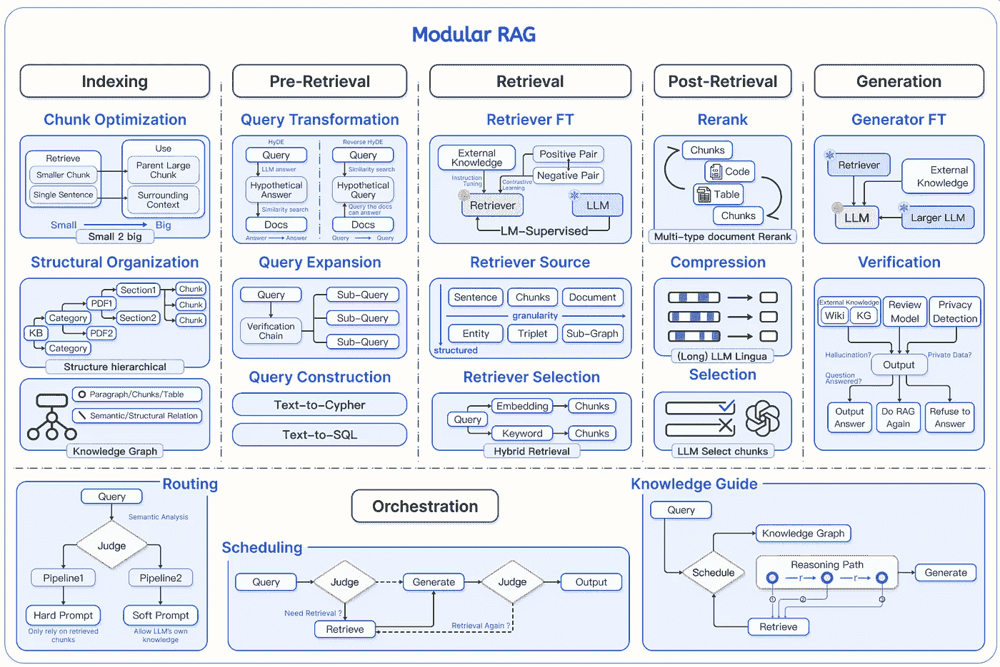
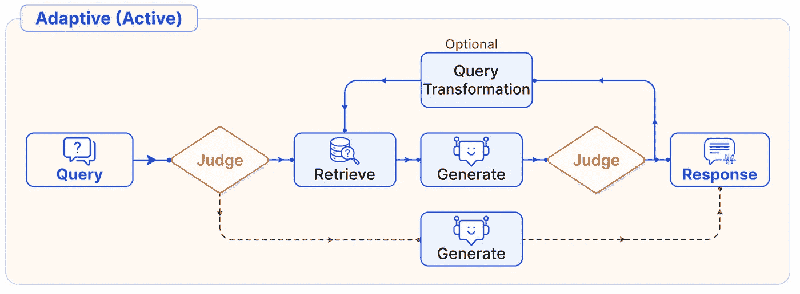
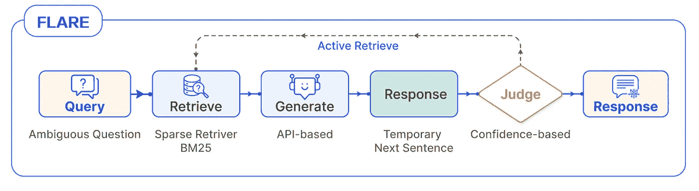
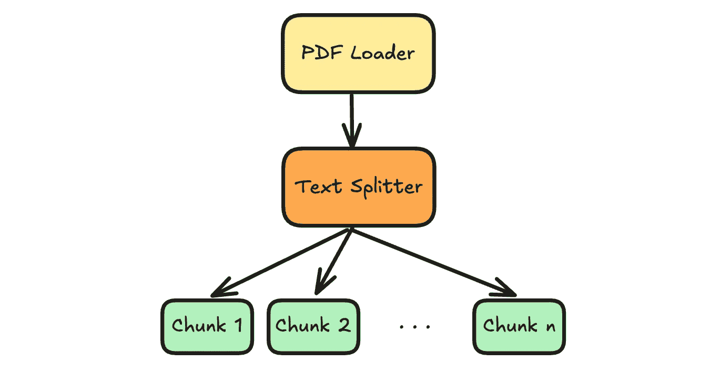
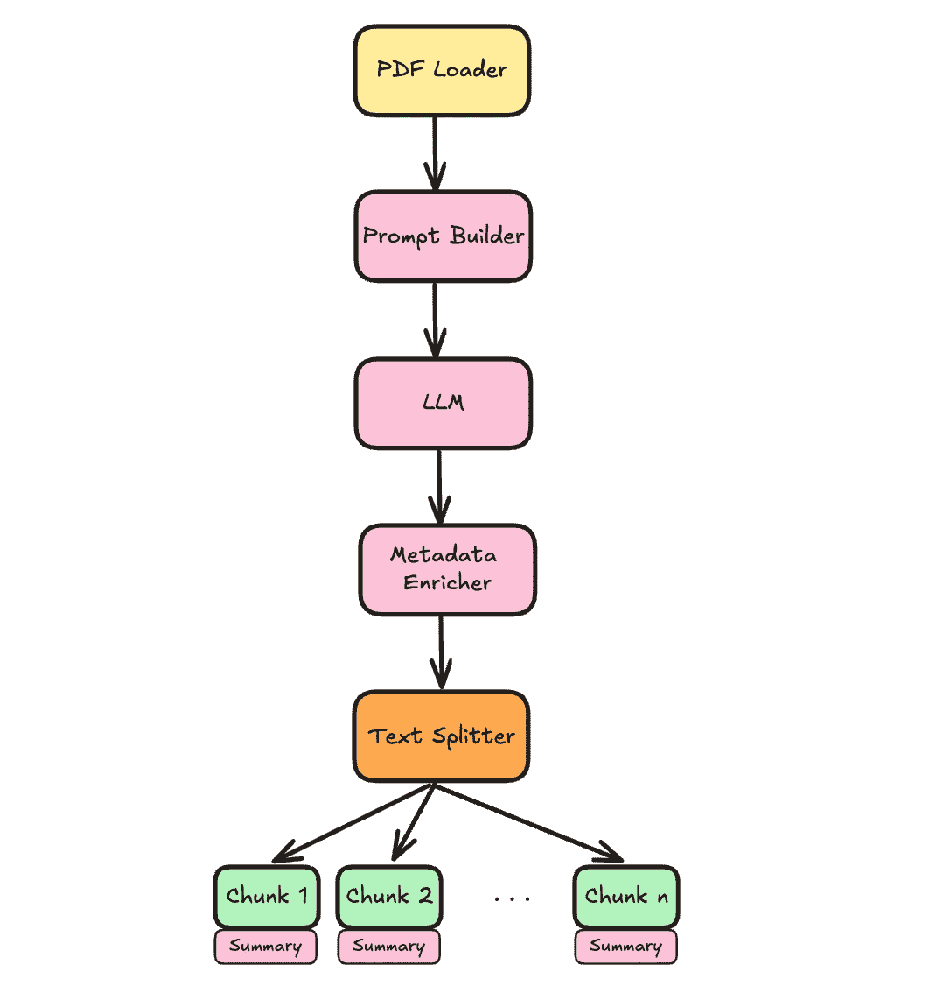
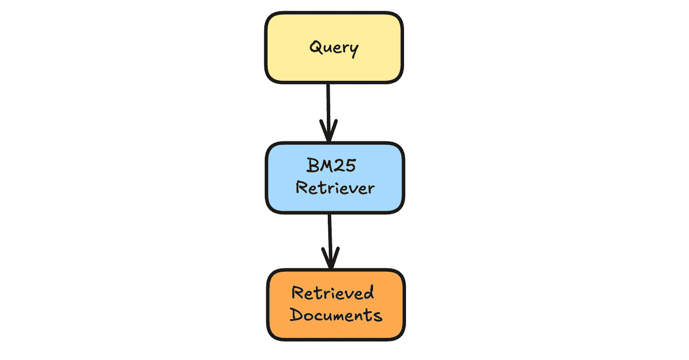
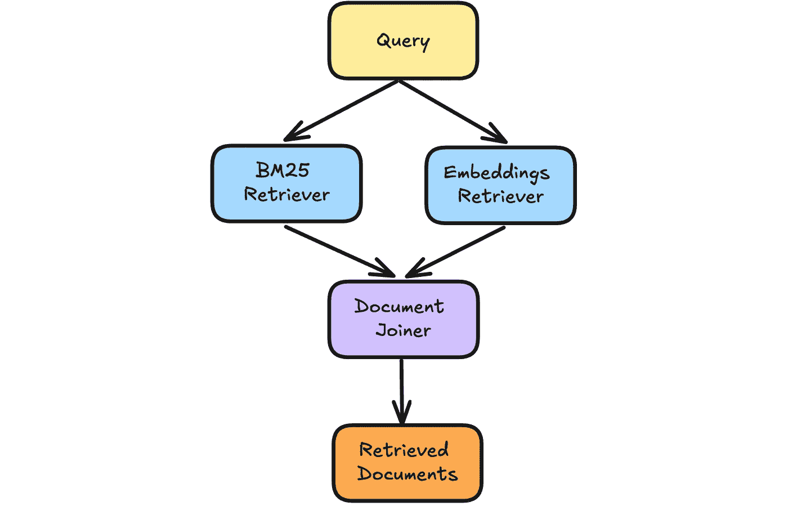
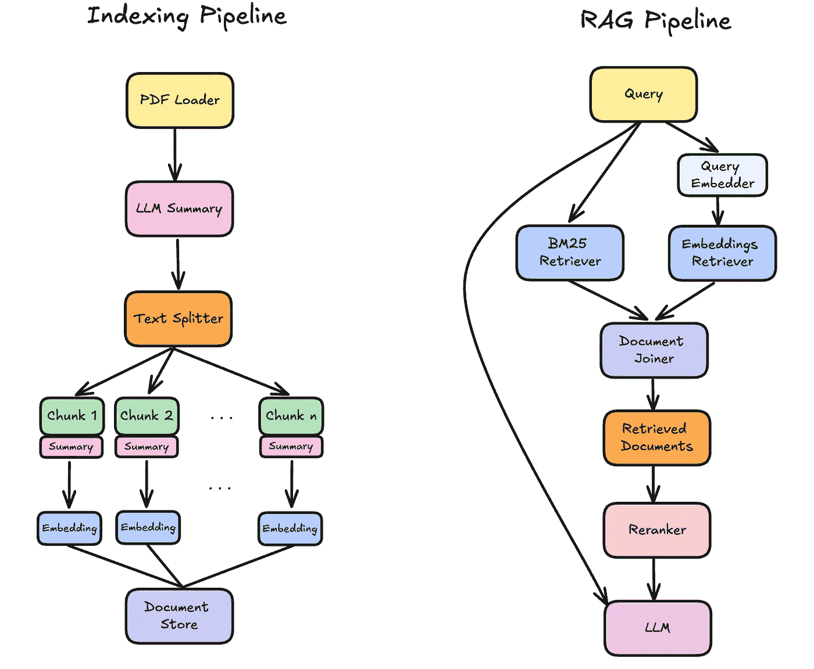

# 实现“模块化 RAG”与 Haystack 和 Hypster

> 原文：[`towardsdatascience.com/implementing-modular-rag-with-haystack-and-hypster-d2f0ecc88b8f?source=collection_archive---------3-----------------------#2024-10-18`](https://towardsdatascience.com/implementing-modular-rag-with-haystack-and-hypster-d2f0ecc88b8f?source=collection_archive---------3-----------------------#2024-10-18)

## 将 RAG 系统转变为类似乐高的可重构框架

[](https://medium.com/@giladrubin?source=post_page---byline--d2f0ecc88b8f--------------------------------)[](https://towardsdatascience.com/?source=post_page---byline--d2f0ecc88b8f--------------------------------) [Gilad Rubin](https://medium.com/@giladrubin?source=post_page---byline--d2f0ecc88b8f--------------------------------)

·发表于[Towards Data Science](https://towardsdatascience.com/?source=post_page---byline--d2f0ecc88b8f--------------------------------) ·11 分钟阅读·2024 年 10 月 18 日

--


使用[Midjourney AI](https://www.midjourney.com/)生成的图像，提示由作者提供

# 简介

跟上人工智能的最新动态可能是一个挑战，特别是当涉及到像检索增强生成（RAG）这样日新月异的领域时。面对如此多的不同解决方案和实现方式，人们很容易感到迷失。

我自己也为此困扰了很长时间，试图理解每篇新文章或“技巧”，以便以某种方式提升 RAG 系统的表现。每一篇新论文、教程或博客文章都像是完全崭新的内容，且越来越难以跟上所有最新方法的缩写——HyDE、RAPTOR、CRAG、FLARE——它们开始听起来像是宝可梦角色的名字。

然后，我遇到了高等人（2024 年）的这篇论文《[**模块化 RAG：将 RAG 系统转变为类似乐高的可重构框架**](https://arxiv.org/abs/2407.21059)**》。



论文中的主要图示展示了作者构建 RAG 解决方案的组件。来源：[模块化 RAG](https://arxiv.org/abs/2407.21059)

# 模块化 RAG

本文提供了一种结构化方法，将 RAG 系统分解为一个统一的框架，以涵盖多种解决方案和方法。作者提出了六个主要组件：

+   **索引：** 为高效检索组织数据。

+   **预检索：** 在搜索前处理用户的查询。

+   **检索：** 找到最相关的信息。

+   **后检索：** 精炼检索到的信息。

+   **生成：** 使用 LLM 生成响应。

+   **编排：** 控制系统的整体流程。

这篇论文的关键见解是，许多现有的 RAG 解决方案可以通过这些组件以类似 LEGO 的方式进行描述。这种模块化为理解、设计和导航构建 RAG 系统的过程提供了一个框架，使其更加灵活和清晰。

在这篇论文中，作者展示了如何通过举例现有的 RAG 解决方案，并使用相同的构建模块来表达它们。例如：



**自适应 RAG 流程** —— “判断者”决定是否使用检索。来源：[模块化 RAG](https://arxiv.org/abs/2407.21059)



**FLARE - 前向**（**F**orward）**主动检索**（**L**ooking **A**ctive **RE**trieval），每个句子都可以触发一次检索步骤。来源：[模块化 RAG](https://arxiv.org/abs/2407.21059)

我强烈推荐阅读这篇论文以及作者高云帆的博客系列文章：模块化 RAG 和 RAG 流程：[第一部分](https://medium.com/@yufan1602/modular-rag-and-rag-flow-part-%E2%85%B0-e69b32dc13a3)、[第二部分](https://medium.com/@yufan1602/modular-rag-and-rag-flow-part-ii-77b62bf8a5d3)。

个人而言，这个框架帮助我理解了不同的 RAG 方法之间的关系，现在我可以轻松理解新的论文和实现。

# 实现模块化 RAG

那么，我们如何实际实现这个“模块化 RAG”框架呢？

由于它更像是一个元框架——这在实际操作中意味着什么？是否意味着我们需要实现*所有*可能的组件组合？还是我们只需构建单独的组件，让开发人员自己决定如何将它们组合起来？

我相信，在大多数现实情况中——并不需要尝试覆盖*每一个*可能的 RAG 配置，而是根据每个项目的需求和约束，缩小相关配置的范围。

在本教程中，我将向你展示一个如何使用少量选项构建可配置系统的具体示例。希望这能为你提供正确的视角和工具，帮助你创建适合特定用例的模块化 RAG 版本，并包含相关配置集。

让我们继续探索我们将使用的两个主要工具：

# Haystack — 主要组件库

`haystack` 是一个开源框架，用于构建生产就绪的 LLM 应用、增强检索的生成管道以及在大型文档集合上智能工作的最先进搜索系统。

[](https://haystack.deepset.ai/?source=post_page-----d2f0ecc88b8f--------------------------------) [## Haystack | Haystack

### Haystack，Composable 开源 AI 框架

haystack.deepset.ai](https://haystack.deepset.ai/?source=post_page-----d2f0ecc88b8f--------------------------------)

**优点：**

+   出色的组件设计

+   这个管道非常灵活，允许动态配置

+   极其（！）完善的文档

+   该框架包含许多现有的实现和与生成式 AI 提供者的集成。

**缺点：**

+   管道接口可能会有些冗长

+   在管道外使用组件不是很符合人体工程学。

我尝试过一些不同的生成式 AI 框架，而 Haystack 是我理解、使用和定制最简单的框架。

# Hypster — 管理配置空间

`**hypster**` 是一个轻量级的 Pythonic 配置系统，适用于 AI 和机器学习项目。它提供了简洁、直观的 Pythonic 语法，支持层次化和可交换的配置。

[](https://medium.com/@giladrubin/introducing-hypster-a-pythonic-framework-for-managing-configurations-to-build-highly-optimized-ai-5ee004dbd6a5?source=post_page-----d2f0ecc88b8f--------------------------------) [## 介绍 HyPSTER：一个用于构建高度优化 AI 的 Pythonic 配置管理框架…

### 图片由作者提供

[medium.com](https://medium.com/@giladrubin/introducing-hypster-a-pythonic-framework-for-managing-configurations-to-build-highly-optimized-ai-5ee004dbd6a5?source=post_page-----d2f0ecc88b8f--------------------------------)

Hypster 是一个新开源项目，我开发它是为了实现一种新的编程范式，用于 AI 和 ML 工作流 —— 这种范式不仅仅依赖单一的解决方案，而是朝着“工作流的叠加”或“超工作流”的方向发展。

Hypster 允许你定义一系列可能的配置，并轻松在它们之间切换以进行实验和优化。这使得添加和定制你自己的配置空间变得简单，你可以使用不同的设置实例化它们，最终为你的生产环境选择最佳配置。

**注意：** Hypster 当前处于活跃开发中。暂时不建议在生产环境中使用。

# 代码库

**这是一个高级教程。** 它假设你已经熟悉 RAG 的主要组件。

我会在接下来的过程中逐步讲解代码库的主要部分，并分享我的一些见解。

完整且更新的代码在以下代码库中。别忘了添加你的⭐️

[](https://github.com/gilad-rubin/modular-rag?source=post_page-----d2f0ecc88b8f--------------------------------) [## GitHub - gilad-rubin/modular-rag

### 通过在 GitHub 上创建帐户，参与 gilad-rubin/modular-rag 的开发。

[github.com](https://github.com/gilad-rubin/modular-rag?source=post_page-----d2f0ecc88b8f--------------------------------)

# LLM

让我们从我们的 LLM 配置空间定义开始：

```py
from hypster import config, HP
```

```py
@config
def llm_config(hp: HP):
  anthropic_models = {"haiku": "claude-3-haiku-20240307", 
                      "sonnet": "claude-3-5-sonnet-20240620"}
  openai_models = {"gpt-4o-mini": "gpt-4o-mini", 
                   "gpt-4o": "gpt-4o", 
                   "gpt-4o-latest": "gpt-4o-2024-08-06"}

  model_options = {**anthropic_models, **openai_models}
  model = hp.select(model_options, default="gpt-4o-mini")
  temperature = hp.number(0.0)

  if model in openai_models.values():
    from haystack.components.generators import OpenAIGenerator

    llm = OpenAIGenerator(model=model, 
                          generation_kwargs={"temperature": temperature})
  else: #anthropic
    from haystack_integrations.components.generators.anthropic import AnthropicGenerator

    llm = AnthropicGenerator(model=model, 
                             generation_kwargs={"temperature": temperature})
```

这个代码片段演示了一个 Hypster 和 Haystack 的基础示例。通过使用 `@config` 装饰器，我们定义了一个名为 `llm_config` 的函数，封装了我们 LLM 的配置空间。这个空间包括选择不同 LLM 提供者（Anthropic 或 OpenAI）及其相应模型的选项，还有一个控制温度的参数。

在`llm_config`函数中，我们使用条件逻辑来实例化适当的 Haystack 组件，具体取决于所选的模型。这使得我们能够在不修改代码结构的情况下，轻松地在不同的 LLM 之间切换。

例如，要创建一个 Anthropic 生成器，使用“haiku”模型和温度为 0.5，我们可以如下实例化配置：

```py
result = llm_config(final_vars=["llm"], 
                    values={"model" : "haiku", "temperature" : 0.5})
```

# 索引管道

让我们继续创建索引管道，在那里我们将定义如何处理输入文件。在我们的例子中——是 PDF 文件。

```py
@config
def indexing_config(hp: HP):
    from haystack import Pipeline
    from haystack.components.converters import PyPDFToDocument
    pipeline = Pipeline()
    pipeline.add_component("loader", PyPDFToDocument())
```

接下来，我们将添加一个可选功能——根据文档的前 1000 个字符通过 LLM 摘要来增强文档。

这是一种很棒的技巧，我们使用文档的前`n`个字符，然后，在将文档分割成块后，每个块都会“继承”这些增强信息，用于其嵌入和响应生成。

```py
 enrich_doc_w_llm = hp.select([True, False], default=True)
  if enrich_doc_w_llm:
    from textwrap import dedent
    from haystack.components.builders import PromptBuilder
    from src.haystack_utils import AddLLMMetadata

    template = dedent("""
        Summarize the document's main topic in one sentence (15 words max). 
        Then list 3-5 keywords or acronyms that best \
        represent its content for search purposes.
        Context:
        {{ documents[0].content[:1000] }}

        ============================

        Output format:
        Summary:
        Keywords:
    """)

    llm = hp.nest("configs/llm.py")
    pipeline.add_component("prompt_builder", PromptBuilder(template=template))
    pipeline.add_component("llm", llm["llm"])
    pipeline.add_component("document_enricher", AddLLMMetadata())

    pipeline.connect("loader", "prompt_builder")
    pipeline.connect("prompt_builder", "llm")
    pipeline.connect("llm", "document_enricher")
    pipeline.connect("loader", "document_enricher")
    splitter_source = "document_enricher"
  else:
    splitter_source = "loader"

  split_by = hp.select(["sentence", "word", "passage", "page"], 
                       default="sentence")
  splitter = DocumentSplitter(split_by=split_by, 
                              split_length=hp.int(10), 
                              split_overlap=hp.int(2))
  pipeline.add_component("splitter", splitter)
  pipeline.connect(splitter_source, "splitter")
```

在这里，我们可以看到 Haystack 的管道在运行。如果用户选择`enrich_doc_w_llm==True`，我们继续添加组件和连接，以实现这种增强功能。在我们的例子中：PromptBuilder → LLM → AddLLMMetadata。

正如你所看到的——它非常灵活，我们可以使用条件逻辑动态构建它。这非常强大。

现在我们可以通过几种方式实例化配置对象。例如：

```py
results = indexing_config(values={"enrich_doc_w_llm": False, 
                                  "split_by" : "page", 
                                  "split_length" : 1})
```

在这里，我们得到了一个简单的管道，包含加载器和分割器，以及选定的分割器配置。



否则，我们可以选择通过 LLM 摘要来增强文档：

```py
results = indexing_config(values={"enrich_doc_w_llm": True})
```

请注意，Hypster 采用了在每个参数中定义的默认值，因此无需每次都指定所有的参数选择。下面是生成的管道示例：



注意我们是如何巧妙地将`llm_config`插入到索引管道中的，使用了`hp.nest(“configs/llm_config.py")`。这种嵌套能力使我们能够以层级方式创建嵌套配置。我们可以使用点符号在嵌套的`llm_config`中定义参数值。例如：

```py
results = indexing_config(values={"llm.model" : "gpt-4o-latest"})
```

这将导致使用 OpenAI 的`gpt-4o-2024–08`模型实例化一个带有 LLM 增强任务的索引管道。

到目前为止，我们已经为许多潜在的索引管道构建了一个紧凑的配置空间。

为了简洁起见，我将跳过嵌入配置部分，其中我使用了`fastembed`和`jina`嵌入。如果你感兴趣，请查看[完整实现](https://github.com/gilad-rubin/modular-rag)。

让我们继续查看检索管道。

# 检索

Haystack 提供了一个内存中的文档存储，便于快速实验。它包括一个嵌入检索器和一个 BM25 检索器。在这一部分——我们将构建一个配置空间，允许使用 BM25、嵌入检索器或两者结合。

```py
@config
def in_memory_retrieval(hp: HP):
  from haystack import Pipeline
  from haystack.document_stores.in_memory import InMemoryDocumentStore
  from src.haystack_utils import PassThroughDocuments, PassThroughText

  pipeline = Pipeline()
  # utility components for the first and last parts of the pipline  
  pipeline.add_component("query", PassThroughText())
  pipeline.add_component("retrieved_documents", PassThroughDocuments())

  retrieval_types = hp.multi_select(["bm25", "embeddings"], 
                                    default=["bm25", "embeddings"])
  if len(retrieval_types) == 0:
      raise ValueError("At least one retrieval type must be selected.")

  document_store = InMemoryDocumentStore()

  if "embedding" in retrieval_types:
    from haystack.components.retrievers.in_memory import InMemoryEmbeddingRetriever
    embedding_similarity_function = hp.select(["cosine", "dot_product"], default="cosine")
    document_store.embedding_similarity_function = embedding_similarity_function
    pipeline.add_component("embedding_retriever", InMemoryEmbeddingRetriever(document_store=document_store))

  if "bm25" in retrieval_types:
    from haystack.components.retrievers.in_memory import InMemoryBM25Retriever
    bm25_algorithm = hp.select(["BM25Okapi", "BM25L", "BM25Plus"], default="BM25L")
    document_store.bm25_algorithm = bm25_algorithm
    pipeline.add_component("bm25_retriever", InMemoryBM25Retriever(document_store=document_store))
    pipeline.connect("query", "bm25_retriever")

  if len(retrieval_types) == 2:  # both bm25 and embeddings
    from haystack.components.joiners.document_joiner import DocumentJoiner

    bm25_weight = hp.number(0.5)
    join_mode = hp.select(["distribution_based_rank_fusion", 
                          "concatenate", "merge", 
                          "reciprocal_rank_fusion"],
                          default="distribution_based_rank_fusion")
    joiner = DocumentJoiner(join_mode=join_mode, top_k=hp.int(10),
                            weights=[bm25_weight, 1-bm25_weight])

    pipeline.add_component("document_joiner", joiner)
    pipeline.connect("bm25_retriever", "document_joiner")
    pipeline.connect("embedding_retriever", "document_joiner")
    pipeline.connect("document_joiner", "retrieved_documents")
  elif "embeddings" in retrieval_types: #only embeddings retriever
    pipeline.connect("embedding_retriever", "retrieved_documents")
  else:  # only bm25
    pipeline.connect("bm25_retriever", "retrieved_documents")
```

在这里，我们使用了一些“技巧”来使它工作。首先，我们使用`hp.multi_select`，它允许我们从选项中选择多个选项。其次，我们在管道的开始和结束部分添加了“助手”组件（PassThroughText，PassThroughDocuments），以确保任何选择都会以`query`开始，以`retrieved_documents`结束，其余部分相对简单。

一些示例实例化的代码如下：

```py
in_memory_retrieval(values={"retrieval_types": ["bm25"], 
                                "bm25_algorithm": "BM25Okapi"})
```



图片由作者提供

并且：

```py
in_memory_retrieval(values={"join_mode": "reciprocal_rank_fusion"})
```



在完整的实现中，我添加了一个 Qdrant 向量存储，一个可选的重排序步骤，以及一个最终的生成管道。这些都作为示例，展示了如何在这些管道中添加和自定义不同的组件，你也可以在完整的代码库中找到它们。

最终，我们得到了一个主配置，它将所有这些设置绑定在一起：

```py
@config
def rag_config(hp: HP):
  indexing = hp.nest("configs/indexing.py")
  indexing_pipeline = indexing["pipeline"]

  embedder_type = hp.select(["fastembed", "jina"], default="fastembed")
  match embedder_type:
    case "fastembed":
      embedder = hp.nest("configs/fast_embed.py")
    case "jina":
      embedder = hp.nest("configs/jina_embed.py")

  indexing_pipeline.add_component("doc_embedder", embedder["doc_embedder"])
  document_store_type = hp.select(["in_memory", "qdrant"], 
                                  default="in_memory")
  match document_store_type:
    case "in_memory":
      retrieval = hp.nest("configs/in_memory_retrieval.py")
    case "qdrant":
      retrieval = hp.nest("configs/qdrant_retrieval.py", 
                  values={"embedding_dim": embedder["embedding_dim"]})

  from haystack.components.writers import DocumentWriter
  from haystack.document_stores.types import DuplicatePolicy

  document_writer = DocumentWriter(retrieval["document_store"], 
                                   policy=DuplicatePolicy.OVERWRITE)
  indexing_pipeline.add_component("document_writer", document_writer)
  indexing_pipeline.connect("splitter", "doc_embedder")
  indexing_pipeline.connect("doc_embedder", "document_writer")

  # Retrieval + Generation Pipeline
  pipeline = retrieval["pipeline"]
  pipeline.add_component("text_embedder", embedder["text_embedder"])
  pipeline.connect("query", "text_embedder")
  pipeline.connect("text_embedder", "embedding_retriever.query_embedding")

  from src.haystack_utils import PassThroughDocuments
  pipeline.add_component("docs_for_generation", PassThroughDocuments())

  use_reranker = hp.select([True, False], default=True)
  if use_reranker:
      reranker = hp.nest("configs/reranker.py")
      pipeline.add_component("reranker", reranker["reranker"])
      pipeline.connect("retrieved_documents", "reranker")
      pipeline.connect("reranker", "docs_for_generation")
      pipeline.connect("query", "reranker")
  else:
      pipeline.connect("retrieved_documents", "docs_for_generation")

  response = hp.nest("configs/response.py")
  from haystack.components.builders import PromptBuilder
  pipeline.add_component("prompt_builder", PromptBuilder(template=response["template"]))
  pipeline.add_component("llm", response["llm"])
  pipeline.connect("prompt_builder", "llm")
  pipeline.connect("query.text", "prompt_builder.query")
  pipeline.connect("docs_for_generation", "prompt_builder")
```

从这里开始，我们几乎可以在任何子组件内部定义任何我们想要的内容。例如：

```py
results = rag_config(values={"indexing.enrich_doc_w_llm": True,
                             "indexing.llm.model": "gpt-4o-mini",
                             "document_store": "qdrant",
                             "embedder_type": "fastembed",
                             "reranker.model": "tiny-bert-v2",
                             "response.llm.model": "sonnet",
                             "indexing.splitter.split_length": 6,
                             "reranker.top_k": 3})
```

我们已经实例化了一组具体的工作管道：



我们现在可以顺序执行它们：

```py
indexing_pipeline = results["indexing_pipeline"]
indexing_pipeline.warm_up()

file_paths = ["data/raw/modular_rag.pdf", "data/raw/enhancing_rag.pdf"]
for file_path in file_paths:  # this can be parallelized
    indexing_pipeline.run({"loader": {"sources": [file_path]}})

query = "What are the 6 main modules of the modular RAG framework?"

pipeline = results["pipeline"]
pipeline.warm_up()
response = pipeline.run({"query": {"text": query}})

print("Response: ", response["llm"]["replies"][0])
```

```py
Response: The six main modules of the modular RAG framework are 
Indexing, Pre-retrieval, Retrieval, Post-retrieval, Generation, 
and Orchestration.

Supporting quote from Document 1: "Based on the current stage of RAG 
development, we have established six main modules: Indexing, 
Pre-retrieval, Retrieval, Post-retrieval, Generation, and Orchestration."
```

很棒的反馈！👏

# 总结

对于你们中的一些人来说，这可能一下子接受的信息量有点大。你可能是第一次接触 Haystack，可能也是第一次遇到 Hypster。这完全可以理解！

代码很复杂，但我相信这来自于构建这样一个模块化系统本身的复杂性。此外，定义工作流的精确路由是一个视觉任务，有时候通过文本来阅读它会更困难。

话虽如此，这是我第一次看到一个完全可配置、模块化的 RAG 系统。对我来说，这很令人兴奋，我也希望对你来说同样如此！

我相信这代表了一种根本不同的 AI/ML 项目方法。我们不是为单一的解决方案构建代码库，而是构建一个可以容纳多种潜在工作流的代码库——一种“工作流叠加”或“超工作流”。

一旦你进入这种编程方式——你将立即解锁难以置信的好处：

1.  **超参数优化** 很容易实现（关于这一点将在未来的文章中详细讨论）

1.  **为不同场景利用不同配置**。例如，X 类型的查询可以使用一个将 BM25 检索器权重设置得很高的 RAG 系统，而 Y 类型的查询则主要聚焦于密集嵌入技术。

1.  **工具性使用 -** 将其封装成一个可以在不同场景下实例化和使用的工具是相对简单的，这意味着……是的！我们可以将其变成一个 AI 代理使用的工具。想象一下那里的可能性。

1.  **生产环境中的 A/B 测试 -** 我们可以将这个 RAG 超空间部署到生产环境中，并仅通过为每个单独的 API 请求指定配置来执行 A/B 测试。

# **结束语**

那么，你觉得怎么样？

使这些知识变得易于获取对我来说非常重要，因此你的意见对我很有价值。如果你对这个实现或整体方法有任何问题或意见，欢迎随时在本文中添加你的评论。

我还为需要使用最先进的生成性人工智能和机器学习工具解决商业问题、寻找结构化且符合常理方法的公司提供咨询和自由职业服务。

随时可以通过**电子邮件**、[**LinkedIn**](https://www.linkedin.com/in/gilad-rubin-2b72b3218/)或我的[**个人网站**](http://www.giladrubin.com)联系我 **🌟**

# 资源

+   Gao, Y., Xiong, Y., Wang, M., & Wang, H. (2024). [Modular RAG: 将 RAG 系统转化为类似乐高的可重配置框架](https://arxiv.org/abs/2407.21059)。arXiv 预印本 arXiv:2407.21059。

# **进一步阅读**

+   **Haystack**的[文档](https://docs.haystack.deepset.ai/docs/intro) | [DeepLearning.ai 课程](https://www.deeplearning.ai/short-courses/building-ai-applications-with-haystack/) | [Github 仓库](https://github.com/deepset-ai/haystack)

+   **Hypster**的[介绍](https://medium.com/@giladrubin/introducing-hypster-a-pythonic-framework-for-managing-configurations-to-build-highly-optimized-ai-5ee004dbd6a5) | [文档](https://gilad-rubin.gitbook.io/hypster) | [Github 仓库](https://github.com/gilad-rubin/hypster)

+   **Modular-RAG** [Github 仓库](https://github.com/gilad-rubin/modular-rag)

# 备注

+   所有没有说明文字的图片均由作者创作

+   我与 Deepset/Haystack 没有任何关联。
