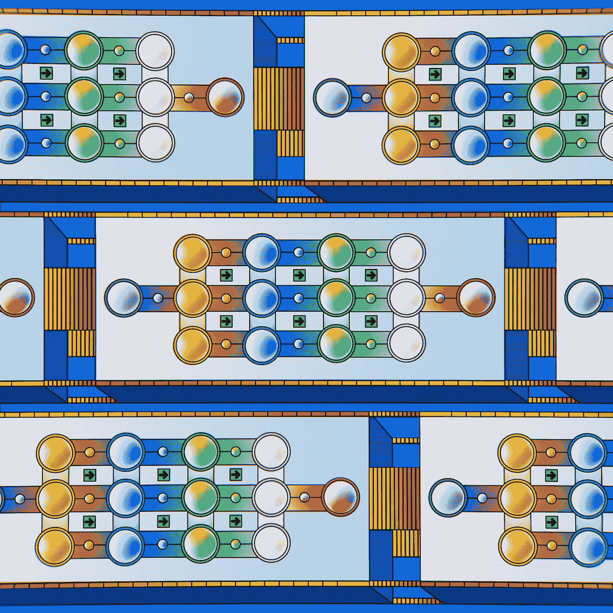

# 从零开始实现简单神经网络的反向传播

> 原文：[`towardsdatascience.com/implementing-simple-neural-network-backpropagation-from-scratch-baba8a92d232?source=collection_archive---------6-----------------------#2024-03-20`](https://towardsdatascience.com/implementing-simple-neural-network-backpropagation-from-scratch-baba8a92d232?source=collection_archive---------6-----------------------#2024-03-20)

## 解决 XOR 门问题——仅使用 NumPy 实现，并与 PyTorch 实现进行比较。

 [Siqi Sun](https://medium.com/@siqiyuanyuan?source=post_page---byline--baba8a92d232--------------------------------)

·发布于 [Towards Data Science](https://towardsdatascience.com/?source=post_page---byline--baba8a92d232--------------------------------) ·9 分钟阅读·2024 年 3 月 20 日

--

## 我写这篇文章的原因：

我一直在使用机器学习库，但最近意识到自己并没有完全探索反向传播是如何工作的。

> **理解基础原理对于跟上最新技术发展并在机器学习项目中识别错误至关重要。**

在本文中，我分享了从零开始使用 NumPy 构建简单神经网络的经验，并将其与 PyTorch 实现进行性能对比。这将帮助你实际理解反向传播背后的基本概念。

## 大纲

**・XOR 门问题简介**

**・构建一个 2 层神经网络**

**・前向传播**

**・反向传播的链式法则**

**・使用 NumPy 的实现**

**・与 PyTorch 结果的比较**

**・总结**

**・参考文献**

图片来源：[Google DeepMind](https://unsplash.com/@googledeepmind?utm_source=medium&utm_medium=referral) 在 [Unsplash](https://unsplash.com/?utm_source=medium&utm_medium=referral)

## **XOR 门问题简介**
