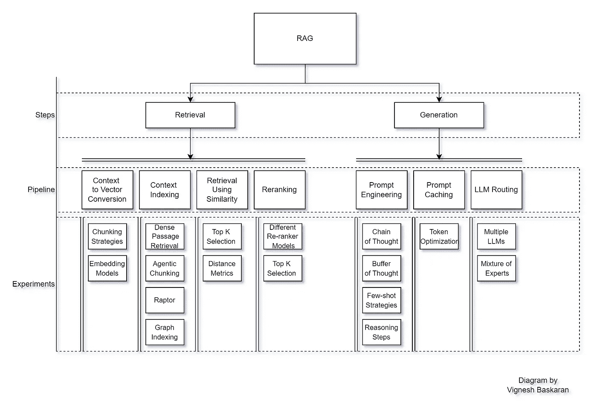

# 使用改进的嵌入模型将你的 RAG 上下文召回率提升 95%

> 原文：[`towardsdatascience.com/improve-your-rag-context-recall-by-40-with-an-adapted-embedding-model-5d4a8f583f32?source=collection_archive---------0-----------------------#2024-10-12`](https://towardsdatascience.com/improve-your-rag-context-recall-by-40-with-an-adapted-embedding-model-5d4a8f583f32?source=collection_archive---------0-----------------------#2024-10-12)

## 附上逐步模型适配代码和结果

 [Vignesh Baskaran](https://medium.com/@vignesh865?source=post_page---byline--5d4a8f583f32--------------------------------)

·发表于 [Towards Data Science](https://towardsdatascience.com/?source=post_page---byline--5d4a8f583f32--------------------------------) ·阅读时间 10 分钟·2024 年 10 月 12 日

--

检索增强生成（RAG）是一种重要的技术，旨在将 LLM 融入业务场景，允许将专有知识注入 LLM。本文假设你已经具备 RAG 的相关知识，目的是提升你的 RAG 准确性。

让我们简要回顾一下这个过程。RAG 模型包括两个主要步骤：检索和生成。在检索步骤中，涉及多个子步骤，包括将上下文文本转换为向量、对上下文向量进行索引、根据用户查询检索上下文向量以及重新排序上下文向量。一旦查询的上下文被检索到，我们就进入生成阶段。在生成阶段，查询上下文与提示结合并发送给大语言模型（LLM）以生成回应。在发送到 LLM 之前，结合上下文的提示可能会经历缓存和路由步骤，以优化效率。

对于每个管道步骤，我们将进行大量实验，协同提高 RAG 的准确性。你可以参考下方的图片，其中列出了（但不限于）每个步骤中执行的实验。

