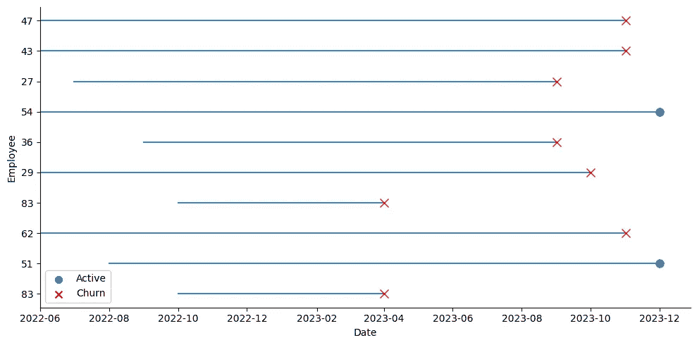
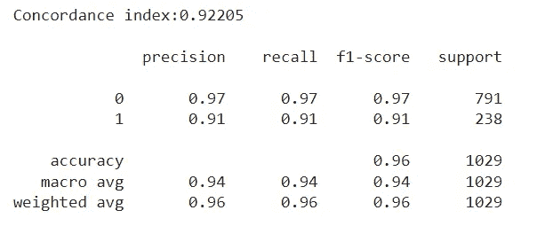
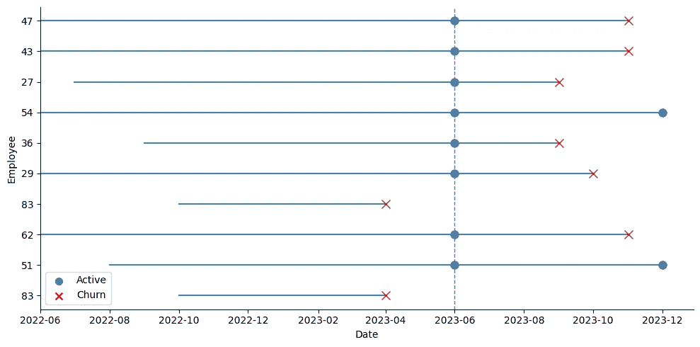
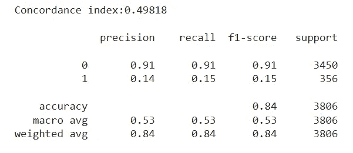
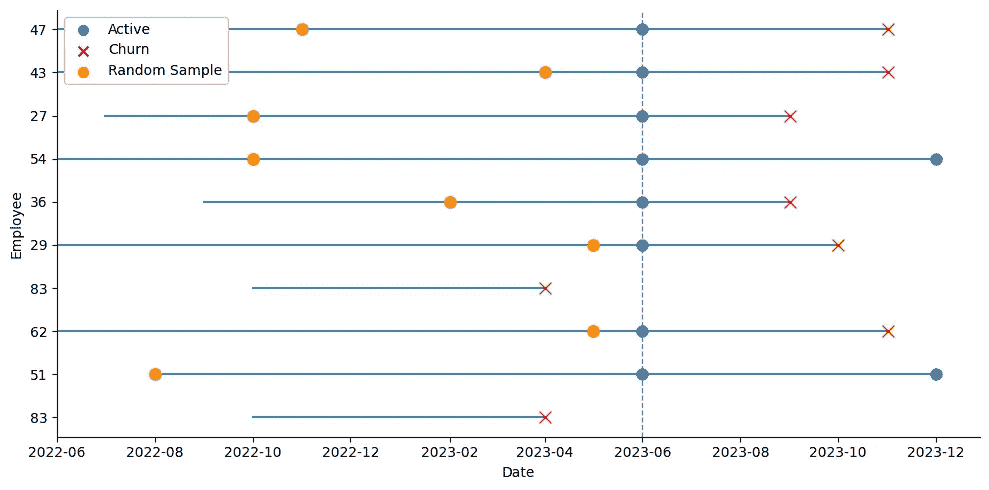
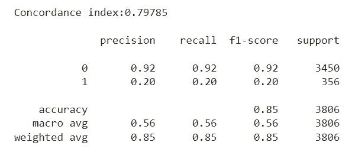

# 提高生存模型的泛化能力

> 原文：[`towardsdatascience.com/improving-generalization-in-survival-models-bb7bc045bfc6?source=collection_archive---------8-----------------------#2024-04-05`](https://towardsdatascience.com/improving-generalization-in-survival-models-bb7bc045bfc6?source=collection_archive---------8-----------------------#2024-04-05)

## 关于估算和提高员工流失预测准确性的建议

[](https://medium.com/@nicolupi.2?source=post_page---byline--bb7bc045bfc6--------------------------------)[](https://towardsdatascience.com/?source=post_page---byline--bb7bc045bfc6--------------------------------) [Nicolas Lupi](https://medium.com/@nicolupi.2?source=post_page---byline--bb7bc045bfc6--------------------------------)

·发表于 [Towards Data Science](https://towardsdatascience.com/?source=post_page---byline--bb7bc045bfc6--------------------------------) ·阅读时长 10 分钟·2024 年 4 月 5 日

--


图片由 [Israel Andrade](https://unsplash.com/@israelandrxde?utm_source=medium&utm_medium=referral) 提供，来源于 [Unsplash](https://unsplash.com/?utm_source=medium&utm_medium=referral)

最近，我在进行生存分析时遇到了一个问题：我拟合的许多模型在理论上表现良好，测试指标很强，但在实际操作中却未能准确预测观察到的真实结果。在本文中，我将讨论如何更好地估算生存模型的表现，并分享一个帮助外推的实用技巧。注意：这里的主要假设是**我们在一段时间内对个体进行了多次观察**（例如，公司中所有员工的月度观察数据）。

我处理的问题是员工流失的案例。我拥有一家公司若干员工的信息，目标是预测哪些员工在未来最有可能离职。如果你想深入了解员工流失问题，确保查看这篇有用的文章。

## 传统方法

许多现有的生存分析实现从包含**每个个体一条观察数据**的数据集开始（如健康研究中的患者、员工流失案例中的员工、客户流失案例中的客户等）。对于这些个体，我们通常有两个关键变量：一个表示感兴趣事件的发生（员工辞职），另一个测量时间（他们在公司工作的时长，直到今天或他们的离职时间）。结合这两个变量，我们接着有一些解释变量，用来预测每个个体的风险。这些特征可以包括员工的职位、年龄或薪酬等。

接下来，大多数现有的实现都会采用一个生存模型（从简单的估计器，如 Kaplan Meier，到更复杂的模型，如集成模型甚至神经网络），将其在训练集上拟合，然后在测试集上评估。通常，这种训练-测试拆分是基于个体观察数据进行的，通常会进行分层拆分。

在我的案例中，我从一个数据集开始，数据集记录了几名员工在公司每月的情况，直到 2023 年 12 月（如果该员工仍在公司），或者直到他们离职的月份——即事件日期：



采用每个员工的最后记录 — 图片来源：作者

为了将我的数据适配到生存分析的案例中，我采集了每个员工的最后一次观察，如上图所示（蓝色点表示在职员工，红色叉表示离职员工）。在这一时刻，对于每个员工，我记录了该事件是否发生（即他们是否仍在职或已经离职），他们当时的在职时长（按月计算），以及他们的所有解释变量。然后，我在这些数据上进行了分层的训练-测试拆分，过程如下：

```py
import numpy as np
import pandas as pd
from sklearn.model_selection import train_test_split

# We load our dataset with several observations (record_date) per employee (employee_id)
# The event column indicates if the employee left on that given month (1) or if the employee was still active (0)
df = pd.read_csv(f'{FILE_NAME}.csv')

# Creating a label where positive events have tenure and negative events have negative tenure - required by Random Survival Forest
df_model['label'] = np.where(df_model['event'], df_model['tenure_in_months'], - df_model['tenure_in_months'])

df_train, df_test = train_test_split(df_model, test_size=0.2, stratify=df_model['event'], random_state=42)
```

拆分完成后，我开始拟合一个模型。在这种情况下，我选择了使用[scikit-survival](https://scikit-survival.readthedocs.io/en/stable/)库进行**随机生存森林**的实验。

```py
from sklearn.preprocessing import OrdinalEncoder
from sksurv.datasets import get_x_y
from sksurv.ensemble import RandomSurvivalForest

cat_features = [] # list of all the categorical features
features = [] # list of all the features (both categorical and numeric)

# Categorical Encoding
encoder = OrdinalEncoder(handle_unknown='use_encoded_value', unknown_value=-1)
encoder.fit(df_train[cat_features])

df_train[cat_features] = encoder.transform(df_train[cat_features])
df_test[cat_features] = encoder.transform(df_test[cat_features])

# X & y
X_train, y_train = get_x_y(df_train, attr_labels=['event','tenure_in_months'], pos_label=1)
X_test, y_test = get_x_y(df_test, attr_labels=['event','tenure_in_months'], pos_label=1)

# Fit the model
estimator = RandomSurvivalForest(random_state=RANDOM_STATE)
estimator.fit(X_train[features], y_train)

# Store predictions
y_pred = estimator.predict(X_test[features])
```

在使用模型默认设置快速运行后，我对测试集上看到的度量结果感到非常兴奋。首先，我在测试集中获得了**一致性指数**高于 0.90。一致性指数是衡量模型预测事件顺序的准确度：它反映了是否预测为高风险的员工确实是首先离开公司的员工。指数为 1 表示完美的预测准确性，而 0.5 则表示预测与随机猜测一样糟糕。

我特别感兴趣的是，测试集中离职的员工是否与模型认为风险最高的员工相匹配。在随机生存森林模型的情况下，模型返回了每个观察值的风险分数。我取了测试集中离职员工的比例，并用它来筛选模型认为最有风险的员工。结果非常可靠，风险最高的员工几乎完全与实际离职员工匹配，少数类的 F1 得分超过了 0.90。

```py
from lifelines.utils import concordance_index
from sklearn.metrics import classification_report

# Concordance Index
ci_test = concordance_index(df_test['tenure_in_months'], -y_pred, df_test['event'])
print(f'Concordance index:{ci_test:0.5f}\n')

# Match the most risky employees (according to the model) with the employees who left
q_test = 1 - df_test['event'].mean()

thr = np.quantile(y_pred, q_test)
risky_employees = (y_pred >= thr) * 1

print(classification_report(df_test['event'], risky_employees))
```



在第一次运行时获得+0.9 的指标应该引起警觉：模型真的能如此自信地预测一个员工是否会留下吗？想象一下：我们提交了预测结果，指出哪些员工最有可能离职。然而，几个月后，人力资源部门联系了我们，表示他们对上个周期离职的员工与我们的预测结果并不完全匹配，至少从我们的测试指标来看，并没有达到预期的离职率。

我们这里有两个主要问题：第一个问题是我们的模型的外推能力没有我们想象的那么好。第二个问题，更糟糕的是，我们无法衡量这种性能缺失。首先，我将展示一种简单的方法，用来估计我们的模型究竟外推得怎么样，然后我将讨论一个可能的原因，为什么它可能没有做到这一点，并且如何缓解这个问题。

## 估计泛化能力

这里的关键是拥有面板数据，也就是我们在一段时间内记录的多个个体的记录，直到事件发生时或研究结束时（在员工流失的情况下，指的是快照的日期）。我们可以利用这些信息，而不是仅仅丢弃这些数据，只保留每个员工的最后一条记录，从而创建一个更能反映模型未来表现的测试集。这个想法很简单：假设我们有员工直到 2023 年 12 月的每月记录。我们可以往回推，比如 6 个月，假装我们是在六月而不是十二月拍摄了快照。然后，我们将之前离职的员工的最后一条记录（即 2023 年 6 月之前离职的员工）作为正事件，而 2023 年 6 月之后仍然留在公司员工的记录则作为负事件，即使我们已经知道其中一些员工之后离职了。我们假装我们现在还不知道这一点。



我们在 2023 年 6 月拍摄了一张快照，并使用接下来的时间段作为我们的测试集——图像来源：作者

如上图所示，我在六月拍摄了一张快照，所有当时活跃的员工都被视为活跃员工。测试数据集使用了这些六月时活跃的员工，以及他们在那一天的解释变量，并且使用了他们到十二月为止的最新任期：

```py
test_date = '2023-07-01'

# Selecting training data from records before the test date and taking the last observation per employee
df_train = df[df.record_date < test_date].reset_index(drop=True).copy()
df_train = df_train.groupby('employee_id').tail(1).reset_index(drop=True)
df_train['label'] = np.where(df_train['event'], df_train['tenure_in_months'], - df_train['tenure_in_months'])

# Preparing test data with records of active employees at the test date
df_test = df[(df.record_date == test_date) & (df['event']==0)].reset_index(drop=True).copy()
df_test = df_test.groupby('employee_id').tail(1).reset_index(drop=True)
df_test = df_test.drop(columns = ['tenure_in_months','event'])

# Fetching the last tenure and event status for employees in the test dataset
df_last_tenure = df[df.employee_id.isin(df_test.employee_id.unique())].reset_index(drop=True).copy()
df_last_tenure = df_last_tenure.groupby('employee_id').tail(1).reset_index(drop=True)

df_test = df_test.merge(df_last_tenure[['employee_id','tenure_in_months','event']], how='left')
df_test['label'] = np.where(df_test['event'], df_test['tenure_in_months'], - df_test['tenure_in_months'])
```

我们再次在这组新的训练数据上训练模型，完成后我们为所有在六月份仍然活跃的员工做出预测。然后，我们将这些预测与 2023 年 7 月至 12 月的实际结果进行比较——这就是我们的测试集。如果我们标记为风险最高的员工在学期中离开，而标记为风险最低的员工没有离开，或者在较晚的时间离开，那么我们的模型在推断方面表现良好。通过将分析回溯到过去一段时间，并将最后一段时间用于评估，我们可以更好地理解模型的泛化能力。当然，我们还可以进一步采取一些时间序列交叉验证。例如，我们可以多次迭代这个过程，每次将时间向后移动 6 个月，并评估模型在多个时间段上的准确性。

经过再次训练我们的模型后，我们现在看到性能出现了显著下降。首先，协和指数现在大约为 0.5——相当于一个随机预测器的表现。而且，如果我们根据模型将“n”个最具风险的员工与测试集中离职的“n”个员工进行匹配，我们会看到非常差的分类效果，少数类的 F1 值为 0.15：



所以显然存在一些问题，但至少现在我们能够检测到这一点，而不是被误导。这里的主要结论是，我们的模型在传统的训练/测试集划分下表现良好，但在时间基础的划分下却无法进行良好的推断。这明显表明可能存在某种时间偏差。简而言之，时间依赖性信息正在泄露，导致我们的模型对其过拟合。这在像员工流失问题这样的情况下很常见，当数据集来自某个时间点的快照时。

## 时间偏差

问题归结为这一点：我们所有的正向观测（离职的员工）都属于过去的日期，而所有的负向观测（当前活跃的员工）都在同一个日期上进行测量——今天。如果有一个特征能够揭示这一点给模型，那么**我们将预测的不是风险，而是在预测一个员工是否在 2023 年 12 月或之前被记录下来**。这可能是非常微妙的。例如，我们可能使用的一个特征是员工的参与度评分。这个特征可能会表现出某些季节性模式，而在同一时间测量所有活跃员工的参与度评分，肯定会引入一些偏差。比如在 12 月，假期季节时，参与度评分可能会下降。模型会看到所有活跃员工的低评分，因此它可能学会预测每当参与度低时，流失风险也会下降，然而实际上应该是相反的！

到现在为止，一个简单而有效的解决方案应该已经很清楚：我们可以不再取每个活跃员工的最后一次观察记录，而是从他们在公司里的所有历史中随机选择一个月。这样可以大大减少模型过拟合任何我们不希望它拟合的时间模式的可能性。



对于活跃员工，我们选择随机记录，而不是他们的最后一条记录——图片由作者提供

在上面的图片中，我们可以看到现在对于活跃员工，我们涵盖了更广泛的日期范围。我们不再使用 2023 年 6 月的蓝点，而是使用随机的橙点，并记录当时的变量以及他们在公司的任期：

```py
np.random.seed(0)

# Select training data before the test date
df_train = df[df.record_date < test_date].reset_index(drop=True).copy()

# Create an indicator for whether an employee eventually churns within the train set
df_train['indicator'] = df_train.groupby('employee_id').event.transform(max)

# Isolate records of employees who left, and store their last observation
churn = df_train[df_train.indicator==1].reset_index(drop=True).copy()
churn = churn.groupby('employee_id').tail(1).reset_index(drop=True)

# For employees who stayed, randomly pick one observation from their historic records
stay = df_train[df_train.indicator==0].reset_index(drop=True).copy()
stay = stay.groupby('employee_id').apply(lambda x: x.sample(1)).reset_index(drop=True)

# Combine churn and stay samples into the new training dataset
df_train = pd.concat([churn,stay], ignore_index=True).copy()
df_train['label'] = np.where(df_train['event'], df_train['tenure_in_months'], - df_train['tenure_in_months'])
del df_train['indicator']

# Prepare the test dataset similarly, using only the snapshot from the test date
df_test = df[(df.record_date == test_date) & (df.event==0)].reset_index(drop=True).copy()
df_test = df_test.groupby('employee_id').tail(1).reset_index(drop=True)
df_test = df_test.drop(columns = ['tenure_in_months','event'])

# Get the last known tenure and event status for employees in the test set
df_last_tenure = df[df.employee_id.isin(df_test.employee_id.unique())].reset_index(drop=True).copy()
df_last_tenure = df_last_tenure.groupby('employee_id').tail(1).reset_index(drop=True)

df_test = df_test.merge(df_last_tenure[['employee_id','tenure_in_months','event']], how='left')
df_test['label'] = np.where(df_test['event'], df_test['tenure_in_months'], - df_test['tenure_in_months'])
```

然后我们再次训练模型，并在之前相同的测试集上评估它。我们现在看到的协调指数大约为 0.80。虽然没有之前的+0.90，但它确实比随机机会水平 0.5 有所提升。就我们对员工分类的兴趣而言，尽管仍远未达到之前的+0.9 F1 分数，但与之前的方法相比，我们确实看到了一些提高，尤其是在少数类别上。



## 结束语

总结一下，以下是我们讨论的主要要点：

+   重要的是要注意观察记录的日期——如果所有某一事件类别的观察记录共享相同的日期，那么很可能存在某种时间偏差。

+   如果我们拥有个体的过去观察记录，我们可以通过预留一段时间用于测试，而不是对个体观察记录进行传统的训练-测试拆分，从而更好地评估模型的表现。

+   如果传统方法与基于时间的测试集拆分之间存在明显的性能下降，这可能是时间偏差的一个迹象。

+   一种简单的缓解方法（至少部分缓解）是随机选择每个个体的观察记录，而不是取他们的最后一次记录。

希望这次讲解对你有所帮助。如果你在生存分析中遇到类似的问题，我很想知道这种方法是否对你也有效。感谢阅读！
