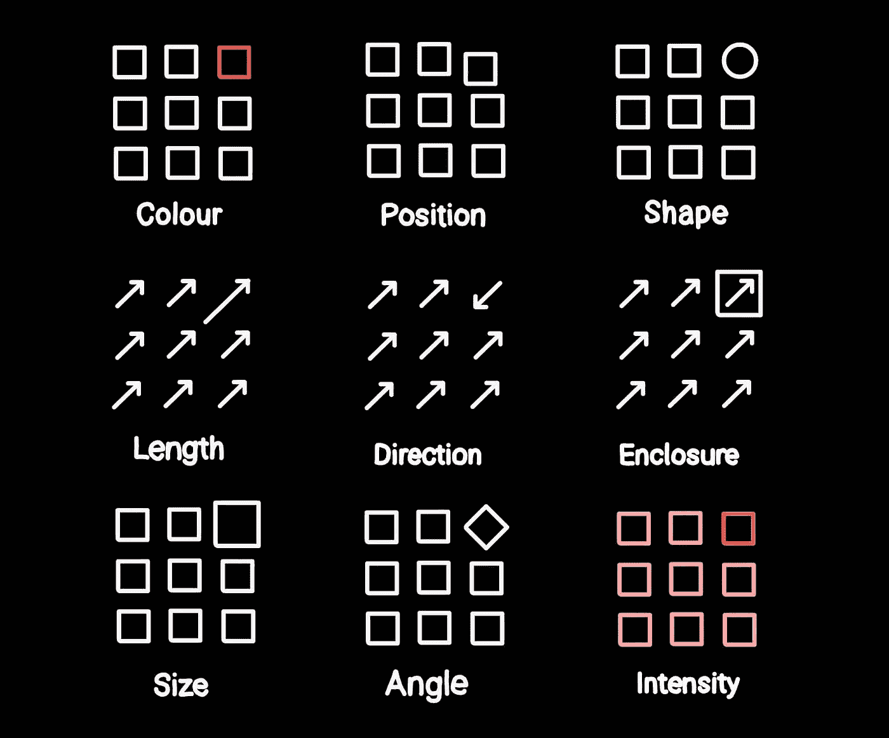

# 一目了然：你的图表差吗？

> 原文：[`towardsdatascience.com/information-at-a-glance-do-your-charts-suck-8b4167a18b88?source=collection_archive---------7-----------------------#2024-12-04`](https://towardsdatascience.com/information-at-a-glance-do-your-charts-suck-8b4167a18b88?source=collection_archive---------7-----------------------#2024-12-04)

## 前注意处理、格式塔理论和视觉数据编码如何影响数据设计决策

 [詹姆斯·威尔金斯](https://medium.com/@jdhwilkins?source=post_page---byline--8b4167a18b88--------------------------------)

·发布于 [Towards Data Science](https://towardsdatascience.com/?source=post_page---byline--8b4167a18b88--------------------------------) ·9 分钟阅读·2024 年 12 月 4 日

--

图像由 DALL-E 生成，OpenAI

让我们面对现实：你做的那份报告——实际上没有人会*真心*去读它。

在最佳情况下，人们可能会浏览一遍，短暂停留在明亮的图表上。

但如果你设计的图表得当，一瞥就足以让人理解数据所表达的内容——至少在高层次上是这样。

快速传达信息的能力是将一张普通图表与优秀图表区分开来的关键。让我们来看看一些心理学技巧，看看我们如何能让图表更容易解读。

## **前注意特征**

***前注意特征***是图表设计中可以无需专门关注即可感知的元素。

它们是我们在首次查看某物时立即吸引注意力的特征。

