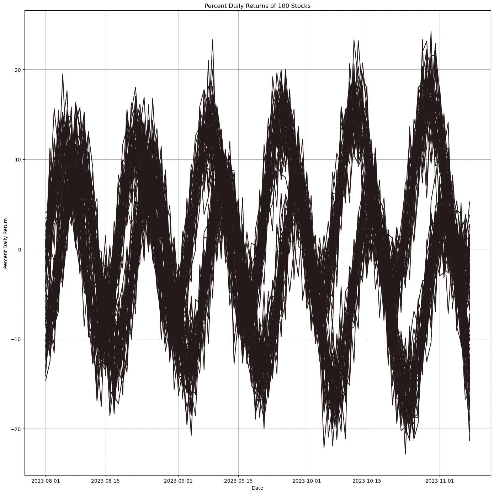
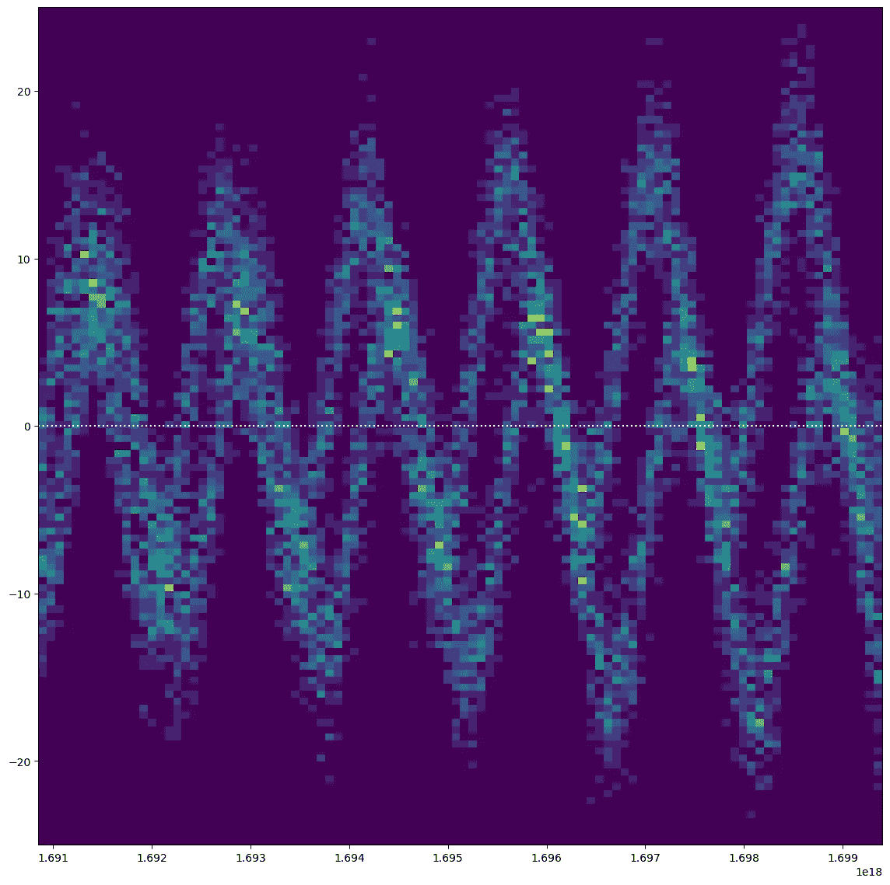
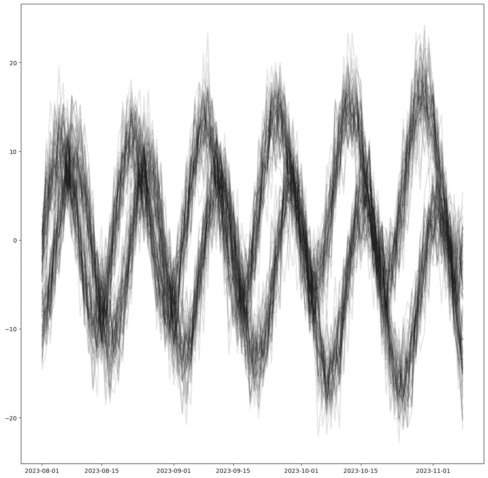
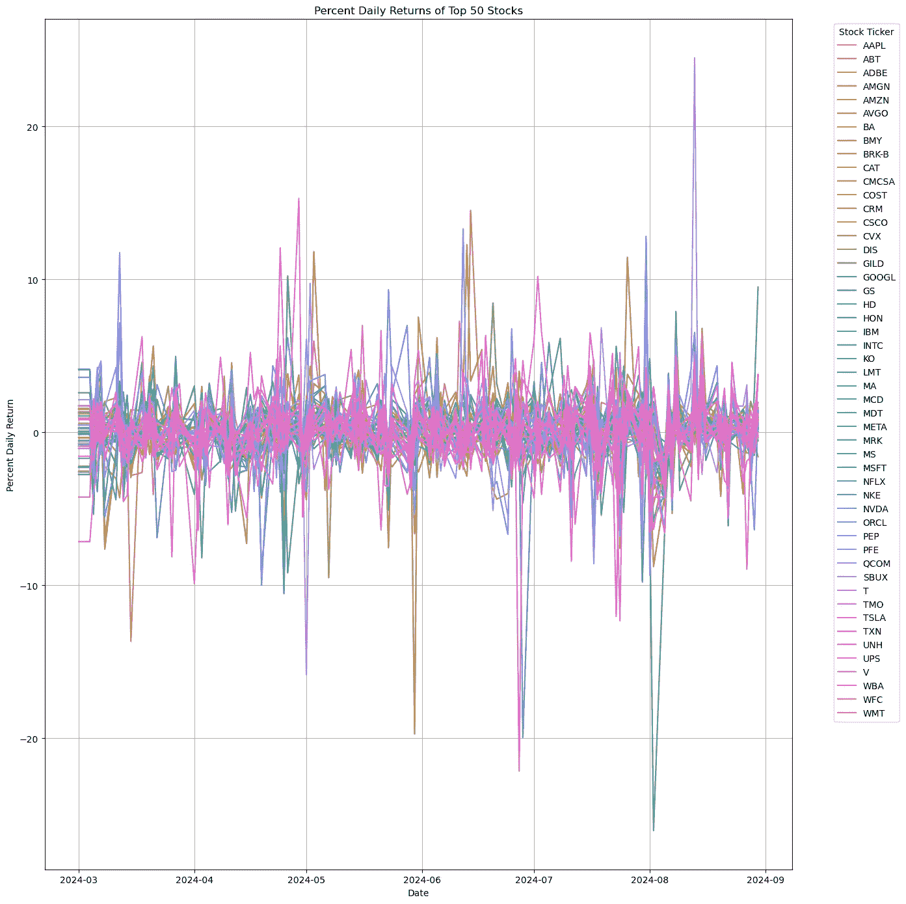
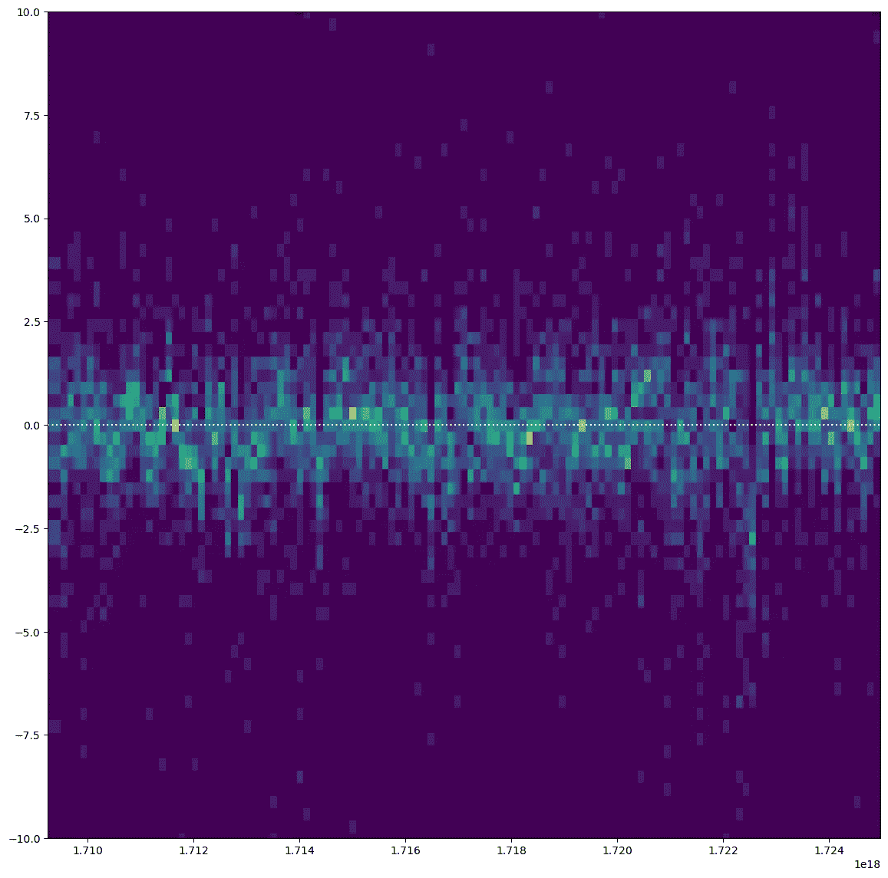
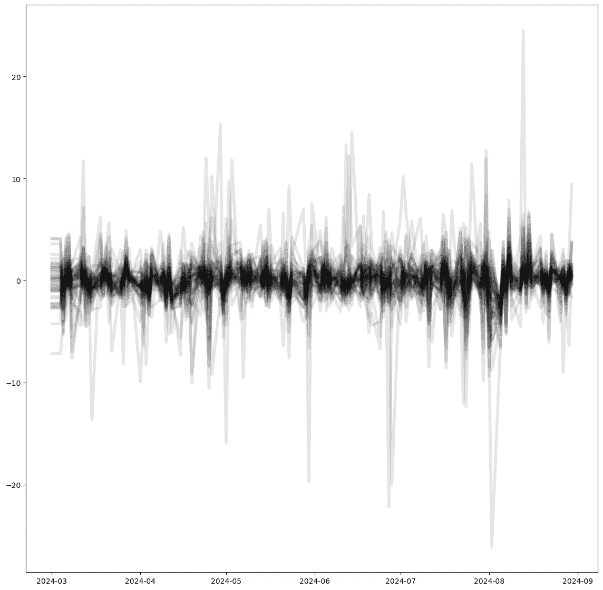

# 噪声中的信息

> 原文：[`towardsdatascience.com/information-in-noise-08bc05bf6484?source=collection_archive---------5-----------------------#2024-09-03`](https://towardsdatascience.com/information-in-noise-08bc05bf6484?source=collection_archive---------5-----------------------#2024-09-03)

## **一次可视化多个时间序列的两种技巧**

[](https://medium.com/@lenixc210?source=post_page---byline--08bc05bf6484--------------------------------)[](https://towardsdatascience.com/?source=post_page---byline--08bc05bf6484--------------------------------) [Lenix Carter](https://medium.com/@lenixc210?source=post_page---byline--08bc05bf6484--------------------------------)

·发表于 [Towards Data Science](https://towardsdatascience.com/?source=post_page---byline--08bc05bf6484--------------------------------) ·阅读时长 4 分钟 ·2024 年 9 月 3 日

--

想象一下：你手头有一堆折线图，而且你有信心在这些数据中至少隐藏着一个趋势。无论你是在追踪公司成千上万种产品的销售数据，还是深入分析股市数据，你的目标是揭示这些子趋势，并使它们在你的可视化中脱颖而出。让我们探索几种帮助你实现这一目标的技巧。



绘制了数百条线，但不清楚子趋势是什么。这些合成数据可以展示这些策略的好处。(*图片来源：作者*)

# 选项 1 — 密度折线图：

密度折线图是一种巧妙的绘图技巧，由 Dominik Moritz 和 Danyel Fisher 在他们的论文中提出，[*Visualizing a Million Time Series with the Density Line Chart*](https://idl.cs.washington.edu/files/2018-DenseLines-arXiv.pdf)*。* 这种方法将众多折线图转化为热力图，揭示了线条重叠最多的区域。

当我们将密度折线图应用到我们之前展示的合成数据时，结果如下所示：



PyDLC 使我们能够看到线条高度重叠的“热点”区域。(*图片来源：作者*)

这种实现使我们能够看到趋势出现的位置，并识别出使这些数据变得有趣的子趋势。

在这个例子中，我们使用了 [Charles L. Bérubé](https://github.com/clberube) 提供的 Python 库 [PyDLC](https://github.com/clberube/pydlc)。由于该库的用户友好设计，实施起来非常简单。

```py
plt.figure(figsize=(14, 14))
im = dense_lines(synth_df.to_numpy().T, 
                 x=synth_df.index.astype('int64'), 
                 cmap='viridis',
                 ny=100,
                 y_pad=0.01
                )

plt.ylim(-25, 25)

plt.axhline(y=0, color='white', linestyle=':')

plt.show()
```

使用密度折线图时，请记住，像 `ny` 和 `y_pad` 这样的参数可能需要调整才能获得最佳结果。

# 选项 2 — 线条的密度图：

这种技术并未得到广泛讨论，也没有一个公认的名称。然而，它本质上是“折线密度图”或“折线密度可视化”的一种变体，我们通过使用较粗且低透明度的线条来揭示重叠区域和密集区。



这种技术非常适合展示子趋势，并且能减少多条折线带来的认知负担。 (*图片来自作者*)

我们可以清晰地识别出似乎存在的两种不同趋势，并观察到在正弦波下行运动期间，它们有高度的重叠。然而，要准确指出哪里效果最强，还是有些困难。

这种方法的代码也非常简单：

```py
plt.figure(figsize=(14, 14))

for column in synth_df.columns:
    plt.plot(synth_df.index, 
             synth_df[column], 
             alpha=0.1, 
             linewidth=2, 
             label=ticker,
             color='black'
            )
```

在这里，可能需要调整的两个参数是`alpha`和`linewidth`。

# 一个例子

假设我们正在寻找 50 只股票的日收益率中的子趋势。第一步是提取数据并计算日收益率。

```py
import yfinance as yf
import pandas as pd
import numpy as np
import matplotlib.pyplot as plt
import seaborn as sns

stock_tickers = [
    'AAPL', 'MSFT', 'GOOGL', 'AMZN', 'TSLA', 'META', 'NVDA', 'BRK-B', 'UNH', 'V',
    'HD', 'MA', 'KO', 'DIS', 'PFE', 'NKE', 'ADBE', 'CMCSA', 'NFLX', 'CSCO',
    'INTC', 'AMGN', 'COST', 'PEP', 'TMO', 'AVGO', 'QCOM', 'TXN', 'ABT', 'ORCL',
    'MCD', 'MDT', 'CRM', 'UPS', 'WMT', 'BMY', 'GILD', 'BA', 'SBUX', 'IBM',
    'MRK', 'WBA', 'CAT', 'CVX', 'T', 'MS', 'LMT', 'GS', 'WFC', 'HON'
]

start_date = '2024-03-01'
end_date = '2024-09-01'

percent_returns_df = pd.DataFrame()

for ticker in stock_tickers:
    stock_data = yf.download(ticker, start=start_date, end=end_date)

    stock_data = stock_data.fillna(method='ffill').fillna(method='bfill')

    if len(stock_data) >= 2:
        stock_data['Percent Daily Return'] = stock_data['Close'].pct_change() * 100

        stock_data['Ticker'] = ticker
        percent_returns_df = pd.concat([percent_returns_df, stock_data[['Ticker', 'Percent Daily Return']]], axis=0)

percent_returns_df.reset_index(inplace=True)

display(percent_returns_df)
```

然后我们可以绘制数据。

```py
pivot_df = percent_returns_df.pivot(index='Date', columns='Ticker', values='Percent Daily Return')

pivot_df = pivot_df.fillna(method='ffill').fillna(method='bfill')

plt.figure(figsize=(14, 14))
sns.lineplot(data=pivot_df, dashes=False)
plt.title('Percent Daily Returns of Top 50 Stocks')
plt.xlabel('Date')
plt.ylabel('Percent Daily Return')
plt.legend(title='Stock Ticker', bbox_to_anchor=(1.05, 1), loc='upper left')
plt.grid(True)
plt.tight_layout()
```



一个非常杂乱的多条折线图，几乎没有明显的信息。 (*图片来自作者*)

密度折线图由于数据的零散性，确实面临一些挑战。然而，它仍然能提供关于整体市场趋势的有价值的见解。例如，你可以观察到密度最高的区域对应于显著的市场下跌，突出显示了市场的低迷时期。



(*图片来自作者*)

```py
plt.figure(figsize=(14, 14))
im = dense_lines(pivot_df[stock_tickers].to_numpy().T, 
                 x=pivot_df.index.astype('int64'), 
                 cmap='viridis',
                 ny=200,
                 y_pad=0.1
                )

plt.axhline(y=0, color='white', linestyle=':')
plt.ylim(-10, 10)

plt.show()
```

然而，我们发现透明度技术在这个特定问题上表现得明显更好。我们之前提到的市场下跌变得更加清晰易见。



(*图片来自作者*)

```py
plt.figure(figsize=(14, 14))

for ticker in pivot_df.columns:
    plt.plot(pivot_df.index, 
             pivot_df[ticker], 
             alpha=0.1, 
             linewidth=4, 
             label=ticker,
             color='black'
            )
```

# 结论

两种策略各有其优点和强项，哪种方法最适合你的工作可能在你尝试过两者之后才会变得明显。我希望这些技巧能对你未来的项目有所帮助。如果你有其他处理大量折线图的技巧或应用案例，我很想听听你的分享！

感谢阅读，保重。
