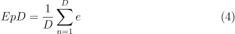

# 检查神经网络模型在边缘部署中的表现

> 原文：[`towardsdatascience.com/inspecting-neural-network-model-performance-for-edge-deployment-d4f8f18dbfd5?source=collection_archive---------11-----------------------#2024-01-05`](https://towardsdatascience.com/inspecting-neural-network-model-performance-for-edge-deployment-d4f8f18dbfd5?source=collection_archive---------11-----------------------#2024-01-05)

## 详细探讨量化 CNN 和基于变换器的模型以及评估和理解它们在边缘硬件上效果的技术

 [Lindo St. Angel](https://medium.com/@lindo.st.angel?source=post_page---byline--d4f8f18dbfd5--------------------------------)

·发表于 [Towards Data Science](https://towardsdatascience.com/?source=post_page---byline--d4f8f18dbfd5--------------------------------) ·阅读时长 16 分钟·2024 年 1 月 5 日

--

图片由 [Gavin Allanwood](https://unsplash.com/@gavla?utm_source=medium&utm_medium=referral) 提供，来源：[Unsplash](https://unsplash.com/?utm_source=medium&utm_medium=referral)

# 引言

本文将向你展示如何将神经网络模型进行转换和量化，以便在边缘设备上进行推理，并且如何检查它们的量化效果，了解运行时延迟和模型内存使用情况，从而优化性能。尽管本文主要集中在使用卷积神经网络（CNN）和基于变换器的神经网络解决非侵入式负载监测（NILM）问题，作为展示这些技巧的方式，但你也可以使用该通用方法来训练、量化和分析模型，从而解决其他问题。

NILM 的目标是从总电源信号中恢复各个电器的能耗，该信号反映了建筑或家庭的总电力消耗。NILM 也被称为能量分解，你可以交替使用这两个术语。

你可以在我的 GitHub 上找到用于生成本文所示结果的代码，链接为 [Energy Management Using Real-Time Non-Intrusive Load Monitoring](https://github.com/goruck/nilm)，以及为简便起见此处省略的其他细节。

# 非侵入式负载监测（NILM）算法选择与模型

## 算法选择

能源拆分是一个高度欠定且单通道的[盲源分离](https://en.wikipedia.org/wiki/Signal_separation)（BSS）问题，这使得获得准确预测变得具有挑战性。设 *M* 为家电的数量，*i* 为指代第 *i* 个家电的索引。给定时间 *t* 时的总功率消耗 *x* 是所有家电 *M* 的功率消耗之和，记为 *yᵢ*，对于所有 {i=1,…,M}。因此，给定时间 *t* 时的总功率消耗 *x* 可以通过方程 1 表达，其中 *e* 是噪声项。

目标是求解逆问题，并在给定总功率信号 *x* 的情况下估计家电功率消耗 *yᵢ*，并以适合在边缘部署的方式进行估计。

你可以通过使用序列到点（seq2point）学习与神经网络来解决单通道 BSS 问题，并且可以通过使用变换器（transformers）、卷积神经网络（CNN）和循环神经网络来应用于 NILM 问题。序列到点学习涉及训练一个神经网络，将输入时间序列（例如，在 NILM 的情况下为总功率读数）与输出信号之间进行映射。你使用一个滑动输入窗口来训练网络，该网络会在窗口的中点生成一个对应的单点输出。

我选择了 seq2point 学习方法，我的实现受到了 Michele D’Incecco 等人¹和 Zhenrui Yue 等人²的工作的启发和指导。我开发了各种 seq2point 学习模型，但将重点放在基于变换器和 CNN 架构的模型上。

## 神经网络模型

你可以在图 1 中看到 CNN 模型，该模型适用于长度为 599 样本的输入序列。你可以在[这里](https://github.com/goruck/nilm/blob/main/ml/define_models.py#L72)查看完整的模型代码。该模型遵循传统的 CNN 概念，源自计算机视觉领域的应用，其中多个卷积层从输入的功率序列中提取特征，随着输入在网络中传递，细节逐渐变得更精细。这些特征是家电的开关模式和功率消耗水平。最大池化操作在每个卷积层后管理模型的复杂性。最后，密集层输出窗口的最终单点功率消耗估计值，该值在用于下游处理之前会被去归一化。该模型使用默认值时有大约 4000 万个参数。

图 1 — CNN 模型

你可以在图 2 中看到输入序列长度为 599 个样本的变换器模型，其中变换器模块是 BERT 风格的编码器。你可以在[这里](https://github.com/goruck/nilm/blob/main/ml/transformer_model.py)查看完整代码。输入序列首先通过卷积层扩展到潜在空间，类似于 CNN 模型中的特征提取。池化和 L2 归一化减少了模型复杂性并缓解了异常值的影响。接着，BERT 风格的变换器队列处理潜在空间序列，包括位置嵌入和应用重要性加权的变换器模块。多个层级处理变换器模块的输出，包括相对位置嵌入（使用围绕信号中点的对称权重）、平均池化（将序列简化为每个特征的单一值），最后是密集层，输出窗口的最终单一估算功率值，然后进行去归一化以便后续处理。使用默认值时，该模型有约 160 万个参数。

图 2 — 整体变换器模型

你可以在下图的图 3 中看到 BERT 风格的变换器编码器。

图 3 — 变换器编码器。

## NILM 数据集

为了解决 NILM 问题，捕获了多个大型公开可用的数据集，这些数据集专门设计用于此目的，数据采集地点为来自不同国家的家庭建筑。这些数据集通常包含数千万个有功功率、无功功率、电流和电压的样本，但采样频率各异，因此需要在使用前对数据进行预处理。大多数 NILM 算法仅使用真实（有功或真实）功率数据。能源分解研究通常考虑五种家电：水壶、微波炉、冰箱、洗碗机和洗衣机。这些就是我在本文中使用的家电，我主要关注的是[REFIT](https://pureportal.strath.ac.uk/en/datasets/refit-electrical-load-measurements-cleaned)³ 数据集。

请注意，这些数据集通常非常不平衡，因为大部分时间，家电处于关闭状态。

## 模型训练与结果

我使用了[TensorFlow](https://www.tensorflow.org/)来训练和测试模型。你可以在[这里](https://github.com/goruck/nilm/tree/main/ml)找到与本节相关的代码。我对各个家电的 seq2point 学习模型进行了训练，使用的是经过 z-score 标准化的 REFIT 数据，或标准化至[0, *Pₘ*]，其中 *Pₘ* 是家电在其活动状态下的最大功率消耗。标准化数据往往能带来最佳的模型性能，因此我默认使用了它。

我使用了以下度量标准来评估模型的性能。你可以在[这里](https://github.com/goruck/nilm/blob/main/ml/nilm_metric.py)查看计算这些度量标准的代码。

+   平均绝对误差（*MAE*）评估预测值与真实功率之间的绝对差异，并计算其平均值，按照以下公式定义。

+   标准化信号聚合误差（*SAE*）表示总能量的相对误差。设 *r* 为家电的总能耗，*rₚ* 为预测的总能耗，则 *SAE* 按以下公式定义。

+   每日能量（*EpD*）衡量一天内预测的能耗，对于家庭用户关注一段时间内的总能耗时非常有价值。设 *D* 为总天数，*e* 为每日家电能耗，则 *EpD* 按以下公式定义。

+   标准化去聚合误差（*NDE*）衡量预测值与家电真实功率之间平方差的标准化误差，按以下公式定义。

+   我还使用了准确率（*ACC*）、F1 分数（*F1*）和 Matthew’s 相关系数（*MCC*）来评估模型是否能够在用于训练和测试模型的严重不平衡数据集上表现良好。这些指标依赖于家电设备的开关状态的计算结果。*ACC* 等于在测试数据集上正确预测的时间点数。以下公式定义了 *F1* 和 *MCC*，其中 *TP* 代表真正例，*TN* 代表真反例，*FP* 代表假正例，*FN* 代表假反例。

*MAE, SAE, NDE* 和 *EpDₑ* 定义为 100% 乘以（预测的 EpD 减去真实值的 EpD）再除以真实值的 EpD，反映了模型正确预测家电能耗水平的能力。*F1* 和 *MCC* 表示模型在使用不平衡类别时正确预测家电开关状态的能力。在此应用中，*ACC* 的价值不如 *F1* 或 *MCC*，因为大多数情况下，模型会准确预测占主导地位的家电（在数据集中占比最大的家电）处于关闭状态。

我使用了一个包含 599 个样本的滑动窗口，这些样本是聚合的实际功率消耗信号，作为 seq2point 模型的输入。我使用对应家电窗口的中点作为目标。您可以通过 [window_generator.py](https://github.com/goruck/nilm/blob/main/ml/window_generator.py) 模块中定义的 WindowGenerator 类的实例查看生成这些样本和目标的代码。

你可以在[train.py](https://github.com/goruck/nilm/blob/main/ml/train.py)中看到我用来训练模型的代码，它使用了[tf.distribute.MirroredStrategy](https://www.tensorflow.org/api_docs/python/tf/distribute/MirroredStrategy)分布式训练策略。我使用了 Keras Adam 优化器，并且通过提前停止来减少过拟合。

训练和优化器的关键超参数总结如下：

+   输入窗口大小：599 个样本

+   全局批次大小：1024 个样本。

+   学习率：1e-04

+   Adam 优化器：beta_1=0.9, beta_2=0.999, epsilon=1e-08

+   提前停止准则：6 个 epoch。

我使用下面的损失函数计算训练梯度，并在每个批次上评估验证损失。该损失函数结合了均方误差、二元交叉熵和均值绝对误差，且在分布式模型副本批次上求平均。

其中 x, x_hat ∈ [0, 1]表示实际功率使用值和预测功率使用值，二者除以每个电器的最大功率限制；s, s_hat ∈ {0, 1}是电器状态标签和预测值。绝对误差项仅在状态标签为开启时，或者预测错误时才应用。超参数 lambda 调节每个电器的绝对损失项。

你可以在下表中看到 CNN 模型的典型性能指标。

表 1 — CNN 模型性能

你可以在下表中看到变压器模型的典型性能指标。

表 2 — 变压器模型性能

你可以看到，尽管变压器模型的参数比 CNN 模型少约 26 倍，但两者的性能相似。然而，由于变压器模型使用了自注意力机制，其计算复杂度为 O(*n*²)，而 CNN 模型的复杂度为 O(*n*)，其中*n*是输入序列的长度，因此每一步变压器的训练时间大约是 CNN 的七倍。根据训练（和推理）效率，你可以看到 CNN 在模型性能损失很小的情况下更为可取。

# 模型转换与量化

将浮点数形式的模型图转换为适用于边缘硬件推理的形式，包括基于 CPU、MCU 和专门优化 int8 操作的计算硬件，所涉及的步骤如下：

+   使用 Nvidia GPU 以 float32 或类似 TensorFloat-32 的表示法训练模型。输出将是一个完整的网络图；我使用了 TensorFlow 的 SavedModel 格式，它是一个完整的 TensorFlow 程序，包括变量和计算。

+   使用 TensorFlow Lite 或等效工具将浮点图转换为优化后的边缘硬件格式。输出将是一个可以在 CPU 上运行的平面文件，但所有操作仍将以 float32 进行。请注意，并非所有 TensorFlow 操作符都可以转换为 TFLite 等效操作符。大多数在 CNN 网络中使用的层和操作符都可以转换，但我在设计 Transformer 网络时小心避免了 TFLite 转换问题。参见[TensorFlow Lite 和 TensorFlow 操作符兼容性](https://www.tensorflow.org/lite/guide/ops_compatibility)。

+   量化并优化转换后模型的权重、偏差和激活值。我使用了不同的量化模式，将模型部分或完全量化为 int8、int16 或它们的组合，导致在目标硬件上的推理延迟不同。

我使用[TensorFlow Lite (TFLite)转换器 AP](https://www.tensorflow.org/lite/models/convert/)在 CNN 和 Transformer 模型上执行了[训练后量化](https://www.tensorflow.org/lite/performance/post_training_quantization)，并采用了不同的量化模式，以提高在边缘硬件（包括树莓派和 Google Edge TPU）上的推理速度，同时管理对准确性的影响。您可以在下面看到我使用的量化模式。

+   **convert_only**：转换为 tflite 格式，但保持所有参数为 Float32（不进行量化）。

+   **w8**：将权重从 float32 量化为 int8，偏差量化为 int64。激活值保留为 Float32。

+   **w8_a8_fallback**：与 w8 相同，但将激活值从 float32 量化为 int8。如果某个操作符没有整数实现，则回退为 float。

+   **w8_a8**：与 w8 相同，但将激活值从 float32 量化为 int8。对所有操作符强制执行完整的 int8 量化。

+   **w8_a16**：与 w8 相同，但将激活值量化为 int16。

CNN 模型使用所有模式进行了量化，以了解延迟和准确性之间的最佳折衷。只有 Transformer 模型的权重使用 w8 模式量化为 int8；激活值需要保持为 float32，以保持可接受的准确性。请参见[convert_keras_to_tflite.py](https://github.com/goruck/nilm/blob/main/ml/convert_keras_to_tflite.py)了解执行此量化的代码，该代码还使用[TensorFlow Lite 的量化调试器](https://www.tensorflow.org/lite/performance/quantization_debugger)检查模型中每一层的量化效果。我使用[TensorFlow Lite 模型基准工具](https://github.com/tensorflow/tensorflow/tree/master/tensorflow/lite/tools/benchmark)对转换后的模型进行了性能分析，以量化推理延迟。

完全量化模型需要通过代表实际数据的训练和测试数据集来校准模型的激活。对于高度不平衡的数据，校准可能具有挑战性，因为随机选择样本可能会导致较差的校准和量化模型精度。为了解决这个问题，我使用了一种算法构建了一个平衡的家电开关状态代表数据集。你可以在[这里](https://github.com/goruck/nilm/blob/main/ml/convert_model.py#L91)找到该代码，并在下面的代码片段中查看。

图 4 — 代表性生成器代码片段

你可以在下表中找到量化推理结果，其中 Lx86 是使用八个 TFlite 解释器线程的 3.8 GHz x86 机器的平均推理延迟，Larm 是使用四个线程的 ARM aarch-64 架构 Raspberry Pi 4 的平均推理延迟，两个计算机都使用 TensorFlow Lite 的[XNNPACK](https://github.com/google/XNNPACK) CPU 委托。Ltpu 是 Google Coral Edge TPU 上的平均推理延迟。我保持了 x86 和 ARM 架构机器上的模型输入输出为 float32，以最大化推理速度。对于边缘 TPU，我将它们设置为 int8。

## CNN 模型结果与讨论

你可以在下表中看到量化模式 w8 下 CNN 模型的量化结果。

表 4 — 模式 w8 的量化 CNN 模型

以下展示了 CNN 水壶模型在其他量化模式下的量化结果。你可以看到，边缘 TPU 的延迟远高于其他机器。因此，我将分析重点放在了 x86 和 ARM 架构上。

表 5 — 其他模式下的量化 CNN 水壶模型

其他家电模型的结果由于篇幅问题已省略，但它们在量化模式下呈现出相似的特性。

你可以看到激活量化的负面影响，但由于正则化效应，权重量化对某些模型性能指标有适度的益处。如预期，完全量化模式导致最低的延迟。通过 w8_a16 模式将激活量化为 int16 会导致最高的延迟，因为目前在 TensorFlow Lite 中仅提供非优化的参考内核实现，但该方案在权重量化带来的正则化效益和更好地保留激活数值方面，能实现最佳的模型指标。

你还可以看到，x86 机器的推理延迟模式为 w8 > convert_only > w8_a8，而 aarch64 机器则为 convert_only > w8 > w8_a8，尽管对于 x86 的变化更为显著。为了更好地理解这一点，我使用 [TFLite 模型基准工具](https://github.com/tensorflow/tensorflow/tree/master/tensorflow/lite/tools/benchmark%29)对转换后的模型进行了性能分析。下文展示了代表其他模型的 CNN 微波模型的性能分析结果摘要。

1.  在 x86 上的模型性能分析（从最慢到最快）

可以看到，完全连接和卷积操作在所有情况下都需要最长的执行时间，但在 w8_a8 完全量化模式下，它们的速度要快得多。

表 6 — CNN x86 模型在 w8 模式下的性能分析

表 7 — CNN x86 模型在 convert_only 模式下的性能分析

表 8 — CNN x86 模型在 w8_a8 模式下的性能分析

2. 在 aarch64 上的模型性能分析（从最慢到最快）

复制和最大池化操作在 x86 上比在 aarch64 上慢，可能是由于内存带宽和微架构差异造成的。

表 9 — CNN aarch64 模型在 convert_only 模式下的性能分析

表 10 — CNN aarch64 模型在 w8 模式下的性能分析

表 11 — CNN aarch64 模型在 w8_a8 模式下的性能分析

3. 量化效能

当量化分布与原始浮动分布相似时，RMSE / scale 指标接近 1 / sqrt(12)（约为 0.289），这表示模型量化效果良好。值越大，说明该层可能没有得到很好的量化。以下表格显示了 CNN kettle 模型的 RMSE / Scale 指标，"Suspected?" 列表示那些显著超过 0.289 的层。其他模型为了简洁起见省略，但结果类似。这些层可以保留为浮动类型，以生成一个选择性量化的模型，从而提高准确性，代价是牺牲推理性能。然而，在 CNN 模型中这样做并没有实质性地提高准确性。参见 [使用量化调试器检查量化误差](https://www.tensorflow.org/lite/performance/quantization_debugger)。

你可以在下面找到使用 w8_a8 模式的 CNN kettle 模型的层量化效能指标。

表 12 — 使用 w8_a8 模式的 CNN kettle 模型的层量化效能指标

4. 模型内存占用

我使用了[TFLite 模型基准工具](https://github.com/tensorflow/tensorflow/tree/master/tensorflow/lite/tools/benchmark)，获得了 TFLite CNN 微波模型在运行时的近似 RAM 消耗情况，结果如表格所示，分别列出了每种量化模式下的 RAM 消耗和 TFLite 模型的磁盘空间。其他 CNN 模型表现出类似的特性。对于 x86 架构的结果与 arm 架构相同。注意，Keras 模型在磁盘上消耗约 42.49MB。可以看到，由于 float32 到 int8 的权重转换，磁盘存储空间大约减少了四倍。

有趣的是，RAM 的运行时使用情况因 TFLite 算法优化中间张量的使用而大幅变化。这些张量是预先分配的，以减少推理延迟，但会以牺牲内存空间为代价。请参见[优化 TensorFlow Lite 运行时内存](https://blog.tensorflow.org/2020/10/optimizing-tensorflow-lite-runtime.html)。

表 13 — CNN 模型的内存使用情况

## 变压器模型的结果与讨论

尽管我在变压器模型推理评估时启用了 XNNPACK 委托，但由于变压器模型包含动态张量，因此没有加速。在使用 TFLite 解释器进行推理时，我遇到了以下警告：

> 尝试在包含动态大小张量的图形中使用仅支持静态大小张量的委托（tensor#94 是一个动态大小的张量）。

这个警告意味着 XNNPACK 不支持所有操作符，将回退到默认的 CPU 内核实现。未来的工作将涉及重构变压器模型，仅使用静态大小的张量。请注意，当 TFLite 运行时遇到控制流操作（例如 if、while）时，张量可能会被标记为动态。换句话说，即使模型图中没有任何动态形状的张量，模型在运行时仍可能包含动态张量。目前的变压器模型使用了`if`控制流操作。

你可以在下表中看到变压器模型在量化模式 w8 下的量化结果。

表 14 — 变压器模型在量化模式 w8 下的量化结果

变压器壶和微波模型在量化模式 convert_only 下的量化结果如表格所示。

表 15 — 变压器壶和微波模型在量化模式 convert_only 下的量化结果

1.  x86 模型性能分析（从最慢到最快）

在 w8 模式下，完全连接层占据了主要计算负载，但在 convert_only 模式下较少。这种行为可能与 x86 内存微架构对 int8 权重的处理有关。

表 16 — x86 变压器模型在 w8 模式下的性能分析

表 17 — x86 变压器模型剖析（模式：convert_only）

2\. 在 aarch64 上的模型剖析（从最慢到最快）

你可以看到，在 w8 模式下，ARM 架构似乎比 x86 架构更高效地计算完全连接层（FULLY_CONNECTED）。

表 18 — aarch64 变压器模型剖析（模式：convert_only）

表 19 — aarch64 变压器模型剖析（模式：w8）

3\. 量化效能

你可以在[这里](https://github.com/goruck/nilm?tab=readme-ov-file#quantization-efficacy-1)找到使用 w8_a8 模式的变压器 kettle 模型的层量化效能指标，尽管如上所述，量化变压器模型的激活值会导致模型性能下降。你可以看到，RSQRT 运算符，尤其不适合量化；这些运算符在高斯误差线性激活函数中使用，帮助解释了模型性能差的原因。其他变压器设备模型显示出类似的效能指标。

4\. 模型内存占用

与 CNN 情况相同，我使用了[TFLite 模型基准测试工具](https://github.com/tensorflow/tensorflow/tree/master/tensorflow/lite/tools/benchmark)来获取 TFLite 微波模型在运行时的近似 RAM 消耗，下面的表格展示了每种相关量化模式和 TFLite 模型的磁盘空间。其他变压器模型显示了类似的特性。请注意，Keras 模型在磁盘上大约消耗 6.02MB。你可以看到，由于权重从 float32 量化到 int8，模型大小减少了大约三倍，这比 CNN 案例中看到的四倍减少要小，可能是因为变压器模型中的层数较少。你还可以看到，x86 的 TFLite 运行时比 aarch64 架构更节省内存。

表 20 — 变压器模型的磁盘和内存使用情况

# 结论

你可以使用 TensorFlow 和 TensorFlow Lite 在边缘有效地开发和部署模型。TensorFlow Lite 提供了有助于生产中理解和修改模型行为的工具，包括层量化检查和运行时剖析。

与变压器模型所用的典型运算符相比，CNN 模型中使用的运算符支持更好。你应该仔细选择如何设计你的网络，考虑这些约束，并在开发和训练模型之前，运行一个完整的端到端训练-转换-量化周期。

后训练量化非常适合对 CNN 网络进行完全量化，但我只能量化变压器网络的权重，以保持可接受的性能。为了更好的整数性能，应该使用[量化感知方法](https://www.tensorflow.org/model_optimization/guide/quantization/training)训练变压器网络。

本文中用于解决 NILM 问题的 CNN 模型比它们的变换器模型大得多，但由于具有线性复杂性，训练速度更快，延迟更低。如果磁盘空间和 RAM 不是主要限制因素，CNN 模型是更好的解决方案。

# 参考文献

1.  [arXiv:1902.08835](https://arxiv.org/abs/1902.08835) | Michele D'Incecco、Stefano Squartini 和 Mingjun Zhong 的《用于非侵入性负载监测的迁移学习》。

1.  [BERT4NILM](https://github.com/Yueeeeeeee/BERT4NILM)：Zhenrui Yue 等人提出的用于非侵入性负载监测的双向变换器模型。

1.  可在[知识共享署名 4.0 国际公共许可证](https://creativecommons.org/licenses/by/4.0/)下使用。
