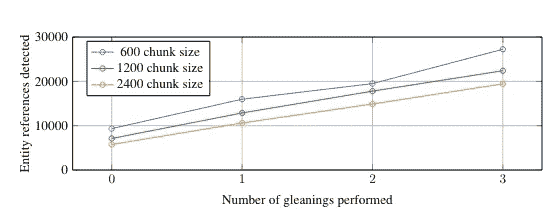
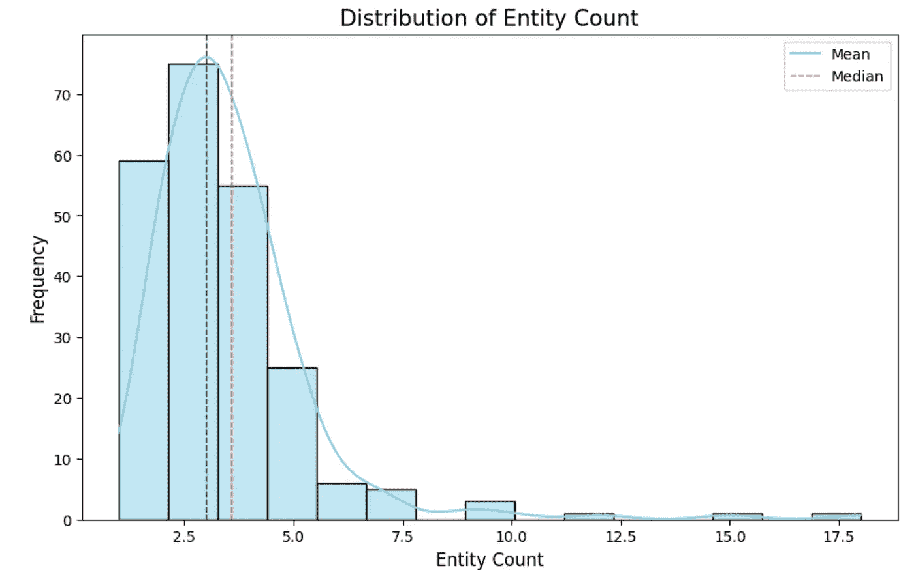

# 将微软的 GraphRAG 集成到 Neo4j 中

> 原文：[`towardsdatascience.com/integrating-microsoft-graphrag-into-neo4j-e0d4fa00714c?source=collection_archive---------0-----------------------#2024-07-31`](https://towardsdatascience.com/integrating-microsoft-graphrag-into-neo4j-e0d4fa00714c?source=collection_archive---------0-----------------------#2024-07-31)

## 将 MSFT GraphRAG 输出存储到 Neo4j 中，并使用 LangChain 或 LlamaIndex 实现本地和全局检索器

[](https://bratanic-tomaz.medium.com/?source=post_page---byline--e0d4fa00714c--------------------------------)[](https://towardsdatascience.com/?source=post_page---byline--e0d4fa00714c--------------------------------) [Tomaz Bratanic](https://bratanic-tomaz.medium.com/?source=post_page---byline--e0d4fa00714c--------------------------------)

·发布于 [Towards Data Science](https://towardsdatascience.com/?source=post_page---byline--e0d4fa00714c--------------------------------) ·16 分钟阅读·2024 年 7 月 31 日

--


图像由 ChatGPT 创建。

[微软的 GraphRAG 实现](https://microsoft.github.io/graphrag/)最近引起了广泛关注。在我的[上一篇博客文章](https://medium.com/neo4j/implementing-from-local-to-global-graphrag-with-neo4j-and-langchain-constructing-the-graph-73924cc5bab4)中，我讨论了图谱的构建过程，并探讨了在[研究论文](https://arxiv.org/abs/2404.16130)中突出的一些创新方面。总体来看，GraphRAG 库的输入是包含各种信息的源文档。通过大型语言模型（LLM）处理这些文档，从中提取关于文档中出现的实体及其关系的结构化信息。然后，这些提取的结构化信息被用于构建知识图谱。


如微软在 GraphRAG 论文中实现的高层次索引管道 — 图片由作者提供

在构建知识图谱后，GraphRAG 库结合了图算法，特别是 Leiden 社区检测算法和 LLM 提示，生成关于知识图谱中实体和关系社区的自然语言摘要。

在这篇文章中，我们将使用来自[GraphRAG 库](https://github.com/microsoft/graphrag)的输出，将其存储在 Neo4j 中，然后使用 LangChain 和 LlamaIndex 协同框架直接从 Neo4j 设置检索器。

代码和 GraphRAG 输出可以在[GitHub](https://github.com/tomasonjo/blogs/tree/master/msft_graphrag)上访问，让你跳过 GraphRAG 提取过程。

## 数据集

本博客文章中使用的数据集是查理斯·狄更斯的《圣诞颂歌》，该书可以通过古腾堡计划免费访问。

[](https://www.gutenberg.org/ebooks/19337?source=post_page-----e0d4fa00714c--------------------------------) [## 查理斯·狄更斯的《圣诞颂歌》

### 免费的 Kindle 电子书和 EPUB 格式由志愿者进行数字化和校对。

[www.gutenberg.org](https://www.gutenberg.org/ebooks/19337?source=post_page-----e0d4fa00714c--------------------------------)

我们选择这本书作为源文档，因为它在[入门文档](https://microsoft.github.io/graphrag/posts/get_started/)中有所突出，允许我们轻松进行提取。

## 图谱构建

尽管你可以跳过图谱提取部分，但我们还是会谈论几个我认为最重要的配置选项。例如，图谱提取可能非常依赖令牌且成本较高。因此，使用一个相对便宜但表现良好的 LLM（如 gpt-4o-mini）进行提取测试是有意义的。通过使用 gpt-4-turbo 可以显著降低成本，同时保持良好的准确性，正如这篇[博客文章](https://blog.cubed.run/graphrag-gpt-4o-mini-building-an-ai-knowledge-graph-at-low-cost-a4282440d92e)中所描述的那样。

```py
GRAPHRAG_LLM_MODEL=gpt-4o-mini
```

最重要的配置项是我们想要提取的实体类型。默认情况下，会提取组织、人物、事件和地理信息。

```py
GRAPHRAG_ENTITY_EXTRACTION_ENTITY_TYPES=organization,person,event,geo
```

这些默认的实体类型可能适用于一本书，但请确保根据你正在处理的文档的领域以及具体用例进行相应的更改。

另一个重要的配置项是最大提取值。作者们已经识别并且我们也单独验证了，LLM 在一次提取过程中并不会提取所有可用信息。



根据文本块的大小提取的实体数量 — 来自[GraphRAG 论文](https://arxiv.org/abs/2404.16130)的图像，遵循 CC BY 4.0 许可协议

提取配置允许 LLM 执行多次提取。通过上述图像，我们可以清楚地看到，当进行多次提取（gleanings）时，我们提取的信息更多。多次提取需要大量令牌，因此像 gpt-4o-mini 这样的便宜模型有助于保持成本低廉。

```py
GRAPHRAG_ENTITY_EXTRACTION_MAX_GLEANINGS=1
```

此外，声明或协变量信息默认不会提取。你可以通过设置`GRAPHRAG_CLAIM_EXTRACTION_ENABLED`配置来启用它。

```py
GRAPHRAG_CLAIM_EXTRACTION_ENABLED=False
GRAPHRAG_CLAIM_EXTRACTION_MAX_GLEANINGS=1
```

看起来，不是所有的结构化信息都能在一次提取中提取出来似乎是一个反复出现的主题。因此，我们也在这里有了提取配置选项。

另外有趣的是，尽管我没有时间深入挖掘的是提示调整部分。提示调整是可选的，但强烈建议使用，因为它能提高准确性。

[## 提示调整 ⚙️

### GraphRAG 提供了创建领域适应模板以生成知识图谱的功能。这个步骤……

[microsoft.github.io](https://microsoft.github.io/graphrag/posts/prompt_tuning/auto_prompt_tuning/?source=post_page-----e0d4fa00714c--------------------------------)

配置完成后，我们可以按照[说明运行图形提取管道](https://microsoft.github.io/graphrag/posts/get_started/)，该管道包括以下步骤。


流程中的步骤 — 图片来自[GraphRAG 论文](https://arxiv.org/abs/2404.16130)，根据 CC BY 4.0 许可证使用

提取管道执行上述图片中的所有蓝色步骤。查看我的[上一篇博客文章](https://medium.com/neo4j/implementing-from-local-to-global-graphrag-with-neo4j-and-langchain-constructing-the-graph-73924cc5bab4)了解更多关于图谱构建和社区总结的信息。MSFT GraphRAG 库的图形提取管道输出是一个 Parquet 文件集，如[Operation Dulce 示例](https://github.com/microsoft/graphrag/tree/main/examples_notebooks/inputs/operation%20dulce)所示。

这些 Parquet 文件可以轻松导入到 Neo4j 图数据库中，用于后续分析、可视化和检索。我们可以[使用免费的云 Aura 实例或设置本地 Neo4j 环境](https://neo4j.com/docs/operations-manual/current/installation/)。我的朋友[Michael Hunger](https://medium.com/u/3865848842f9?source=post_page---user_mention--e0d4fa00714c--------------------------------)完成了大部分工作，将 Parquet 文件导入到 Neo4j 中。在这篇博客中，我们跳过了导入的解释，但它包括从五六个 CSV 文件导入并构建知识图谱。如果你想了解更多关于 CSV 导入的内容，可以查看[Neo4j Graph Academy 课程](https://graphacademy.neo4j.com/courses/importing-cypher/)。

导入代码作为[Jupyter notebook 在 GitHub 上提供](https://github.com/tomasonjo/blogs/blob/master/msft_graphrag/ms_graphrag_import.ipynb)，并附带示例 GraphRAG 输出。

[](https://github.com/tomasonjo/blogs/blob/master/msft_graphrag/ms_graphrag_import.ipynb?source=post_page-----e0d4fa00714c--------------------------------) [## blogs/msft_graphrag/ms_graphrag_import.ipynb at master · tomasonjo/blogs

### 支持我的图数据科学博客文章的 Jupyter Notebook，网址：[`bratanic-tomaz.medium.com/`](https://bratanic-tomaz.medium.com/)

[github.com](https://github.com/tomasonjo/blogs/blob/master/msft_graphrag/ms_graphrag_import.ipynb?source=post_page-----e0d4fa00714c--------------------------------)

导入完成后，我们可以打开 Neo4j 浏览器来验证和可视化部分导入的图形数据。


导入的部分图形。图片由作者提供。

## 图形分析

在进行检索器实现之前，我们将执行一个简单的图分析，以便熟悉提取的数据。我们首先定义数据库连接和一个执行 Cypher 语句（图数据库查询语言）并输出 Pandas DataFrame 的函数。

```py
NEO4J_URI="bolt://localhost"
NEO4J_USERNAME="neo4j"
NEO4J_PASSWORD="password"

driver = GraphDatabase.driver(NEO4J_URI, auth=(NEO4J_USERNAME, NEO4J_PASSWORD))

def db_query(cypher: str, params: Dict[str, Any] = {}) -> pd.DataFrame:
    """Executes a Cypher statement and returns a DataFrame"""
    return driver.execute_query(
        cypher, parameters_=params, result_transformer_=Result.to_df
    )
```

在执行图提取时，我们使用了 300 的块大小。从那时起，作者已将默认块大小更改为 1200。我们可以使用以下 Cypher 语句验证块大小。

```py
db_query(
  "MATCH (n:__Chunk__) RETURN n.n_tokens as token_count, count(*) AS count"
)
# token_count count
# 300         230
# 155         1
```

230 个块有 300 个标记，而最后一个只有 155 个标记。现在让我们检查一个示例实体及其描述。

```py
db_query(
  "MATCH (n:__Entity__) RETURN n.name AS name, n.description AS description LIMIT 1"
)
```

*结果*


示例实体名称和描述。图片来自作者。

看起来项目 Gutenberg 在书中某处有所描述，可能是在开头。我们可以观察到描述如何捕获比仅仅是实体名称更详细、更复杂的信息，这也是 MSFT GraphRAG 论文提出的，目的是从文本中保留更复杂和更细致的数据。

让我们也检查一下示例关系。

```py
db_query(
  "MATCH ()-[n:RELATED]->() RETURN n.description AS description LIMIT 5"
)
```

*结果*


示例关系描述。图片来自作者。

MSFT GraphRAG 不仅仅是提取实体之间简单的关系类型，它通过捕获详细的关系描述超越了这一点。这一能力使其能够捕获比简单关系类型更细致的信息。

我们还可以检查单个社区及其生成的描述。

```py
db_query("""
  MATCH (n:__Community__) 
  RETURN n.title AS title, n.summary AS summary, n.full_content AS full_content LIMIT 1
""")
```

*结果*


示例社区描述。图片来自作者。

一个社区有标题、摘要和使用 LLM 生成的完整内容。我还没有看到作者在检索时是否使用完整的上下文或只是使用摘要，但我们可以在两者之间选择。我们可以在 full_content 中观察到引用，它指向实体和关系，这些是信息的来源。很有趣的是，如果引用太长，LLM 有时会删减它们，就像以下示例一样。

```py
[Data: Entities (11, 177); Relationships (25, 159, 20, 29, +more)]
```

由于无法展开`+more`标志，这是 LLM 处理长引用的一种有趣方式。

现在让我们评估一些分布。我们将首先检查从文本块中提取的实体数量的分布。

```py
entity_df = db_query(
    """
MATCH (d:__Chunk__)
RETURN count {(d)-[:HAS_ENTITY]->()} AS entity_count
"""
)
# Plot distribution
plt.figure(figsize=(10, 6))
sns.histplot(entity_df['entity_count'], kde=True, bins=15, color='skyblue')
plt.axvline(entity_df['entity_count'].mean(), color='red', linestyle='dashed', linewidth=1)
plt.axvline(entity_df['entity_count'].median(), color='green', linestyle='dashed', linewidth=1)
plt.xlabel('Entity Count', fontsize=12)
plt.ylabel('Frequency', fontsize=12)
plt.title('Distribution of Entity Count', fontsize=15)
plt.legend({'Mean': entity_df['entity_count'].mean(), 'Median': entity_df['entity_count'].median()})
plt.show()
```

*结果*



从文本块中提取的实体数量分布。图片来自作者。

记住，文本块有 300 个标记。因此，提取的实体数量相对较小，每个文本块平均大约有三个实体。提取是一次性完成的（没有进行任何额外提取）。如果我们增加提取次数，观察分布可能会更有趣。

接下来，我们将评估节点度数分布。节点度数是一个节点所拥有的关系数量。

```py
degree_dist_df = db_query(
    """
MATCH (e:__Entity__)
RETURN count {(e)-[:RELATED]-()} AS node_degree
"""
)
# Calculate mean and median
mean_degree = np.mean(degree_dist_df['node_degree'])
percentiles = np.percentile(degree_dist_df['node_degree'], [25, 50, 75, 90])
# Create a histogram with a logarithmic scale
plt.figure(figsize=(12, 6))
sns.histplot(degree_dist_df['node_degree'], bins=50, kde=False, color='blue')
# Use a logarithmic scale for the x-axis
plt.yscale('log')
# Adding labels and title
plt.xlabel('Node Degree')
plt.ylabel('Count (log scale)')
plt.title('Node Degree Distribution')
# Add mean, median, and percentile lines
plt.axvline(mean_degree, color='red', linestyle='dashed', linewidth=1, label=f'Mean: {mean_degree:.2f}')
plt.axvline(percentiles[0], color='purple', linestyle='dashed', linewidth=1, label=f'25th Percentile: {percentiles[0]:.2f}')
plt.axvline(percentiles[1], color='orange', linestyle='dashed', linewidth=1, label=f'50th Percentile: {percentiles[1]:.2f}')
plt.axvline(percentiles[2], color='yellow', linestyle='dashed', linewidth=1, label=f'75th Percentile: {percentiles[2]:.2f}')
plt.axvline(percentiles[3], color='brown', linestyle='dashed', linewidth=1, label=f'90th Percentile: {percentiles[3]:.2f}')
# Add legend
plt.legend()
# Show the plot
plt.show()
```

*结果*


节点度数分布。图片来自作者。

大多数现实世界的网络遵循幂律节点度分布，大多数节点的度数较小，而一些重要节点的度数较大。尽管我们的图较小，但节点度数依然符合幂律分布。找出哪个实体拥有 120 个关系（与 43%的实体相连）将是很有趣的。

```py
db_query("""
  MATCH (n:__Entity__) 
  RETURN n.name AS name, count{(n)-[:RELATED]-()} AS degree
  ORDER BY degree DESC LIMIT 5""")
```

*结果*


拥有最多关系的实体。图片由作者提供。

毫不犹豫地，我们可以假设斯克鲁奇是这本书的主角。我还会大胆猜测，**埃比尼泽·斯克鲁奇**和**斯克鲁奇**实际上是同一个实体，但由于 MSFT GraphRAG 缺少实体解析步骤，它们没有被合并。

这也表明，分析和清理数据是减少噪音信息的一个重要步骤，因为项目古腾堡有 13 个关系，尽管它们并不属于书本的故事情节。

最后，我们将检查每个层级的社区大小分布。

```py
community_data = db_query("""
  MATCH (n:__Community__)
  RETURN n.level AS level, count{(n)-[:IN_COMMUNITY]-()} AS members
""")

stats = community_data.groupby('level').agg(
    min_members=('members', 'min'),
    max_members=('members', 'max'),
    median_members=('members', 'median'),
    avg_members=('members', 'mean'),
    num_communities=('members', 'count'),
    total_members=('members', 'sum')
).reset_index()

# Create box plot
plt.figure(figsize=(10, 6))
sns.boxplot(x='level', y='members', data=community_data, palette='viridis')
plt.xlabel('Level')
plt.ylabel('Members')

# Add statistical annotations
for i in range(stats.shape[0]):
    level = stats['level'][i]
    max_val = stats['max_members'][i]
    text = (f"num: {stats['num_communities'][i]}\n"
            f"all_members: {stats['total_members'][i]}\n"
            f"min: {stats['min_members'][i]}\n"
            f"max: {stats['max_members'][i]}\n"
            f"med: {stats['median_members'][i]}\n"
            f"avg: {stats['avg_members'][i]:.2f}")
    plt.text(level, 85, text, horizontalalignment='center', fontsize=9)

plt.show()
```

*结果*


每个层级的社区大小分布。图片由作者提供。

Leiden 算法识别了三层社区，其中高层社区的平均规模较大。然而，有一些技术细节我不太了解，因为如果你检查所有成员的数量，你会发现每一层的所有节点数量不同，尽管理论上应该是相同的。此外，如果社区在更高层级合并，为什么第 0 层有 19 个社区，第 1 层有 22 个社区呢？作者在这里做了一些优化和技巧，我还没有时间深入探索。

# 实现检索器

在本博客的最后部分，我们将讨论 MSFT GraphRAG 中指定的本地和全局检索器。这些检索器将与 LangChain 和 LlamaIndex 一起实现和集成。

## 本地检索器

本地检索器首先使用向量搜索来识别相关节点，然后收集链接信息并将其注入到 LLM 提示中。


本地检索器架构。图片来源：[`microsoft.github.io/graphrag/posts/query/1-local_search/`](https://microsoft.github.io/graphrag/posts/query/1-local_search/)

虽然这个图表看起来可能很复杂，但其实很容易实现。我们首先通过基于实体描述文本嵌入的向量相似度搜索来识别相关实体。一旦识别出相关实体，我们就可以遍历与之相关的文本块、关系、社区摘要等。使用向量相似度搜索，然后在图中遍历的模式可以很容易地通过 LangChain 和 LlamaIndex 中的`retrieval_query`功能来实现。

首先，我们需要配置向量索引。

```py
index_name = "entity"

db_query(
    """
CREATE VECTOR INDEX """
    + index_name
    + """ IF NOT EXISTS FOR (e:__Entity__) ON e.description_embedding
OPTIONS {indexConfig: {
 `vector.dimensions`: 1536,
 `vector.similarity_function`: 'cosine'
}}
"""
)
```

我们还将计算并存储社区权重，社区权重定义为社区中实体出现的不同文本块的数量。

```py
db_query(
    """
MATCH (n:`__Community__`)<-[:IN_COMMUNITY]-()<-[:HAS_ENTITY]-(c)
WITH n, count(distinct c) AS chunkCount
SET n.weight = chunkCount"""
)
```

每个部分的候选数量（文本单元、社区报告等）是[可配置的](https://microsoft.github.io/graphrag/posts/query/notebooks/local_search_nb/)。虽然原始实现基于标记计数进行了略微复杂的过滤，但我们在这里进行简化。我根据默认配置值开发了以下简化的顶级候选过滤值。

```py
topChunks = 3
topCommunities = 3
topOutsideRels = 10
topInsideRels = 10
topEntities = 10
```

我们将从 LangChain 实现开始。我们需要定义的唯一内容是 `retrieval_query`，这是一个较为复杂的部分。

```py
lc_retrieval_query = """
WITH collect(node) as nodes
// Entity - Text Unit Mapping
WITH
collect {
    UNWIND nodes as n
    MATCH (n)<-[:HAS_ENTITY]->(c:__Chunk__)
    WITH c, count(distinct n) as freq
    RETURN c.text AS chunkText
    ORDER BY freq DESC
    LIMIT $topChunks
} AS text_mapping,
// Entity - Report Mapping
collect {
    UNWIND nodes as n
    MATCH (n)-[:IN_COMMUNITY]->(c:__Community__)
    WITH c, c.rank as rank, c.weight AS weight
    RETURN c.summary 
    ORDER BY rank, weight DESC
    LIMIT $topCommunities
} AS report_mapping,
// Outside Relationships 
collect {
    UNWIND nodes as n
    MATCH (n)-[r:RELATED]-(m) 
    WHERE NOT m IN nodes
    RETURN r.description AS descriptionText
    ORDER BY r.rank, r.weight DESC 
    LIMIT $topOutsideRels
} as outsideRels,
// Inside Relationships 
collect {
    UNWIND nodes as n
    MATCH (n)-[r:RELATED]-(m) 
    WHERE m IN nodes
    RETURN r.description AS descriptionText
    ORDER BY r.rank, r.weight DESC 
    LIMIT $topInsideRels
} as insideRels,
// Entities description
collect {
    UNWIND nodes as n
    RETURN n.description AS descriptionText
} as entities
// We don't have covariates or claims here
RETURN {Chunks: text_mapping, Reports: report_mapping, 
       Relationships: outsideRels + insideRels, 
       Entities: entities} AS text, 1.0 AS score, {} AS metadata
"""

lc_vector = Neo4jVector.from_existing_index(
    OpenAIEmbeddings(model="text-embedding-3-small"),
    url=NEO4J_URI,
    username=NEO4J_USERNAME,
    password=NEO4J_PASSWORD,
    index_name=index_name,
    retrieval_query=lc_retrieval_query
)
```

这个 Cypher 查询对一组节点执行多个分析操作，以提取和组织相关的文本数据：

1\. **实体-文本单元映射**：对于每个节点，查询会识别链接的文本块（`__Chunk__`），根据与每个文本块关联的不同节点的数量进行聚合，并按频率排序。排名靠前的文本块将作为 `text_mapping` 返回。

2\. **实体-报告映射**：对于每个节点，查询会查找相关的社区（`__Community__`），并返回按排名和权重排序的排名靠前的社区的摘要。

3\. **外部关系**：本节提取描述关系的部分（`RELATED`），其中相关实体（`m`）不属于初始节点集。关系按排名排序，并限制为最顶端的外部关系。

4\. **内部关系**：与外部关系类似，但这次仅考虑两个实体都属于初始节点集的关系。

5\. **实体描述**：简单地收集初始节点集中每个节点的描述。

最后，查询将收集的数据合并成一个结构化结果，包括文本块、报告、内部和外部关系，以及实体描述，并附带默认评分和空的元数据对象。您可以选择移除某些检索部分，以测试它们对结果的影响。

现在，您可以使用以下代码运行检索器：

```py
docs = lc_vector.similarity_search(
    "What do you know about Cratchitt family?",
    k=topEntities,
    params={
        "topChunks": topChunks,
        "topCommunities": topCommunities,
        "topOutsideRels": topOutsideRels,
        "topInsideRels": topInsideRels,
    },
)
# print(docs[0].page_content)
```

相同的检索模式可以使用 LlamaIndex 实现。对于 LlamaIndex，我们首先需要为节点添加元数据，以便向量索引能够正常工作。*如果未将默认元数据添加到相关节点，向量索引将返回错误*。

```py
# https://github.com/run-llama/llama_index/blob/main/llama-index-core/llama_index/core/vector_stores/utils.py#L32
from llama_index.core.schema import TextNode
from llama_index.core.vector_stores.utils import node_to_metadata_dict

content = node_to_metadata_dict(TextNode(), remove_text=True, flat_metadata=False)

db_query(
    """
  MATCH (e:__Entity__)
  SET e += $content""",
    {"content": content},
)
```

同样，我们可以在 LlamaIndex 中使用 `retrieval_query` 功能来定义检索器。与 LangChain 不同的是，我们将使用 f-string，而不是查询参数来传递顶级候选过滤参数。

```py
retrieval_query = f"""
WITH collect(node) as nodes
// Entity - Text Unit Mapping
WITH
nodes,
collect {{
    UNWIND nodes as n
    MATCH (n)<-[:HAS_ENTITY]->(c:__Chunk__)
    WITH c, count(distinct n) as freq
    RETURN c.text AS chunkText
    ORDER BY freq DESC
    LIMIT {topChunks}
}} AS text_mapping,
// Entity - Report Mapping
collect {{
    UNWIND nodes as n
    MATCH (n)-[:IN_COMMUNITY]->(c:__Community__)
    WITH c, c.rank as rank, c.weight AS weight
    RETURN c.summary 
    ORDER BY rank, weight DESC
    LIMIT {topCommunities}
}} AS report_mapping,
// Outside Relationships 
collect {{
    UNWIND nodes as n
    MATCH (n)-[r:RELATED]-(m) 
    WHERE NOT m IN nodes
    RETURN r.description AS descriptionText
    ORDER BY r.rank, r.weight DESC 
    LIMIT {topOutsideRels}
}} as outsideRels,
// Inside Relationships 
collect {{
    UNWIND nodes as n
    MATCH (n)-[r:RELATED]-(m) 
    WHERE m IN nodes
    RETURN r.description AS descriptionText
    ORDER BY r.rank, r.weight DESC 
    LIMIT {topInsideRels}
}} as insideRels,
// Entities description
collect {{
    UNWIND nodes as n
    RETURN n.description AS descriptionText
}} as entities
// We don't have covariates or claims here
RETURN "Chunks:" + apoc.text.join(text_mapping, '|') + "\nReports: " + apoc.text.join(report_mapping,'|') +  
       "\nRelationships: " + apoc.text.join(outsideRels + insideRels, '|') + 
       "\nEntities: " + apoc.text.join(entities, "|") AS text, 1.0 AS score, nodes[0].id AS id, {{_node_type:nodes[0]._node_type, _node_content:nodes[0]._node_content}} AS metadata
"""
```

此外，返回结果略有不同。我们需要将节点类型和内容作为元数据返回；否则，检索器将无法正常工作。现在，我们只需实例化 Neo4j 向量存储，并将其用作查询引擎。

```py
neo4j_vector = Neo4jVectorStore(
    NEO4J_USERNAME,
    NEO4J_PASSWORD,
    NEO4J_URI,
    embed_dim,
    index_name=index_name,
    retrieval_query=retrieval_query,
)
loaded_index = VectorStoreIndex.from_vector_store(neo4j_vector).as_query_engine(
    similarity_top_k=topEntities, embed_model=OpenAIEmbedding(model="text-embedding-3-large")
)
```

我们现在可以测试 GraphRAG 本地检索器。

```py
response = loaded_index.query("What do you know about Scrooge?")
print(response.response)
#print(response.source_nodes[0].text)
# Scrooge is an employee who is impacted by the generosity and festive spirit 
# of the Fezziwig family, particularly Mr. and Mrs. Fezziwig. He is involved 
# in the memorable Domestic Ball hosted by the Fezziwigs, which significantly 
# influences his life and contributes to the broader narrative of kindness 
# and community spirit.
```

有一点立刻想到的是，我们可以通过使用混合方法（向量 + 关键字）来改进本地检索，而不是仅仅使用向量搜索来查找相关实体。

## 全局检索器

[全局检索器架构](https://microsoft.github.io/graphrag/posts/query/notebooks/global_search_nb/)稍微更直接一些。它似乎遍历了指定层级的所有社区摘要，生成中间摘要，然后基于这些中间摘要生成最终响应。


全局检索器架构。图片来自[`microsoft.github.io/graphrag/posts/query/0-global_search/`](https://microsoft.github.io/graphrag/posts/query/0-global_search/)

我们必须提前决定要迭代哪个层次级别，这是一个不简单的决定，因为我们无法预知哪个级别会更有效。你越往上走，层级越高，社区越大，但数量越少。这是我们在没有手动检查摘要的情况下能获得的唯一信息。

其他参数允许我们忽略低于排名或权重阈值的社区，但我们在这里不使用这些参数。我们将使用 LangChain 实现全局检索器，并使用与 GraphRAG 论文中相同的[映射](https://github.com/microsoft/graphrag/blob/main/graphrag/query/structured_search/global_search/map_system_prompt.py)和[归约提示](https://github.com/microsoft/graphrag/blob/main/graphrag/query/structured_search/global_search/reduce_system_prompt.py)。由于系统提示非常长，我们在此不包括它们或链式构建过程。不过，所有代码可以在[笔记本](https://github.com/tomasonjo/blogs/blob/master/msft_graphrag/ms_graphrag_retriever.ipynb)中找到。

```py
def global_retriever(query: str, level: int, response_type: str = response_type) -> str:
    community_data = graph.query(
        """
    MATCH (c:__Community__)
    WHERE c.level = $level
    RETURN c.full_content AS output
    """,
        params={"level": level},
    )
    intermediate_results = []
    for community in tqdm(community_data, desc="Processing communities"):
        intermediate_response = map_chain.invoke(
            {"question": query, "context_data": community["output"]}
        )
        intermediate_results.append(intermediate_response)
    final_response = reduce_chain.invoke(
        {
            "report_data": intermediate_results,
            "question": query,
            "response_type": response_type,
        }
    )
    return final_response
```

现在让我们来测试一下。

```py
print(global_retriever("What is the story about?", 2))
```

*结果*

> 故事主要围绕 Ebenezer Scrooge 展开，他是一个吝啬鬼，最初对生活持愤世嫉俗的态度，且厌恶圣诞节。当他的已故商业伙伴 Jacob Marley 的幽灵造访时，他的转变开始了，随后三位幽灵的出现——代表着过去、现在和未来的圣诞节。这些遭遇促使 Scrooge 反思自己的生活和行为的后果，最终使他接受了圣诞精神，并经历了显著的个人成长。[数据：报告（32，17，99，86，+更多）]
> 
> ### Jacob Marley 和三位幽灵的角色
> ### 
> Jacob Marley 的幽灵作为超自然的催化剂，警告 Scrooge 即将到来的三位幽灵的造访。每个幽灵都引导 Scrooge 进行一次自我发现之旅，展示他选择的影响和同情心的重要性。这些幽灵向 Scrooge 显示了他的行为如何影响到不仅仅是他自己的人生，还包括他人的生活，特别突出了救赎和相互联系的主题。[数据：报告（86，17，99，+更多）]
> 
> ### Scrooge 的人际关系和转变
> ### 
> 斯克鲁奇与克雷奇特一家，特别是与鲍勃·克雷奇特及其儿子小蒂姆的关系，对于他的转变至关重要。通过鬼魂们展示的幻象，斯克鲁奇逐渐培养了同情心，这激发了他采取切实行动，改善克雷奇特一家的生活条件。故事强调了个人行为对社会的深远影响，斯克鲁奇新获得的慷慨心态在社区中激发了同情和社会责任感。[数据：报告（25, 158, 159，+更多）]
> 
> ### 救赎与希望的主题
> ### 
> 总体而言，这个故事是希望的永恒象征，强调了同情心、内省以及个人改变的潜力等主题。斯克鲁奇从一个孤独的吝啬鬼转变为一个仁慈的形象，说明了改变永远不晚；小小的善举可以对个人和更广泛的社区产生深远的积极影响。[数据：报告（32, 102, 126, 148, 158, 159，+更多）]
> 
> 总结来说，这个故事浓缩了圣诞节的转变力量和人际关系的重要性，是一个关于救赎的感人叙事，讲述了一个人在假期期间对他人产生的影响。

这个回答非常长且详尽，因为它适用于全局检索器，该检索器会遍历指定级别上的所有社区。如果你改变社区的层级水平，可以测试回答如何变化。

## 总结

在这篇博客文章中，我们展示了如何将微软的 GraphRAG 集成到 Neo4j 中，并使用 LangChain 和 LlamaIndex 实现检索器。这将允许你无缝地将 GraphRAG 与其他检索器或代理集成。局部检索器结合了向量相似性搜索和图遍历，而全局检索器则通过遍历社区摘要来生成全面的回答。这种实现展示了将结构化知识图与语言模型相结合的力量，从而增强了信息检索和问答能力。值得注意的是，这样的知识图还有定制和实验的空间，我们将在下一篇博客文章中进一步探讨。

和往常一样，代码可以在[GitHub](https://github.com/tomasonjo/blogs/tree/master/msft_graphrag)上找到。
