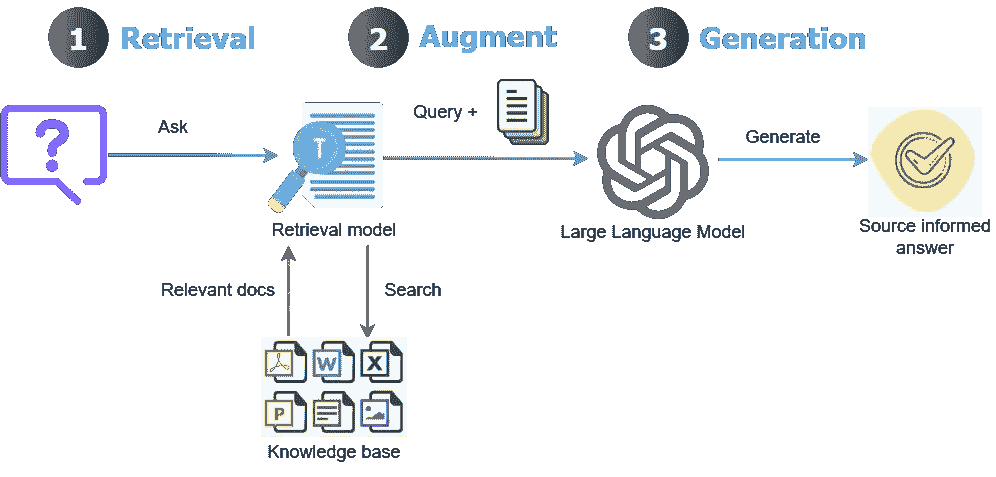

# 将多模态数据集成到大型语言模型中

> 原文：[`towardsdatascience.com/integrating-multimodal-data-into-a-large-language-model-d1965b8ab00c?source=collection_archive---------0-----------------------#2024-10-17`](https://towardsdatascience.com/integrating-multimodal-data-into-a-large-language-model-d1965b8ab00c?source=collection_archive---------0-----------------------#2024-10-17)

## 使用高级解析、语义和关键字搜索以及重新排序开发上下文检索多模态 RAG

 [Umair Ali Khan](https://medium.com/@umairali.khan?source=post_page---byline--d1965b8ab00c--------------------------------)

·发表于 [Towards Data Science](https://towardsdatascience.com/?source=post_page---byline--d1965b8ab00c--------------------------------) ·阅读时间：15 分钟 ·2024 年 10 月 17 日

--

***如果您不是 Medium 会员，可以通过*** ***此链接******阅读完整文章。***

大型语言模型（LLMs）具有知识截止日期，无法回答其知识库中不存在的特定数据查询。例如，LLMs 无法回答关于某公司去年会议纪要的数据查询。类似地，LLMs 容易产生幻觉，给出看似合理但错误的答案。

为了克服这个问题，检索增强生成（RAG）解决方案越来越受欢迎。RAG 的主要思想是将外部文档集成到 LLM 中，并引导其行为仅从外部知识库中回答问题。这是通过将文档拆分成更小的块，计算每个块的嵌入（数值表示），并将这些嵌入作为索引存储在专门的向量数据库中来实现的。

RAG 工作流程：查询被转换为嵌入，通过检索模型与向量数据库匹配，并与检索到的数据结合，通过 LLM 生成响应（图像来源：作者）。

## 上下文检索 RAG

将用户查询与向量数据库中的小块匹配的过程通常运行良好；然而，它存在以下问题：
