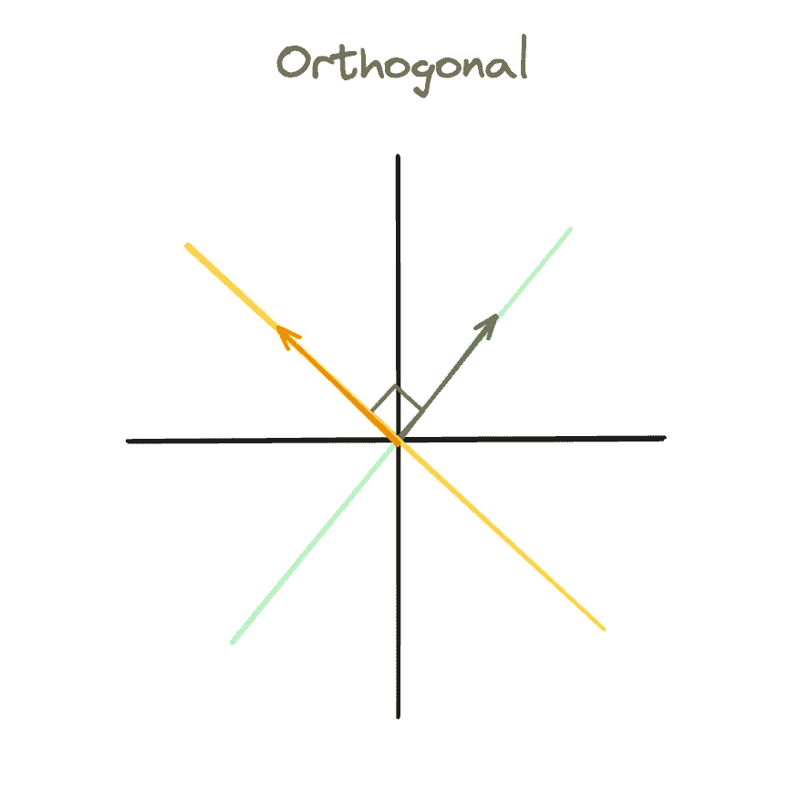
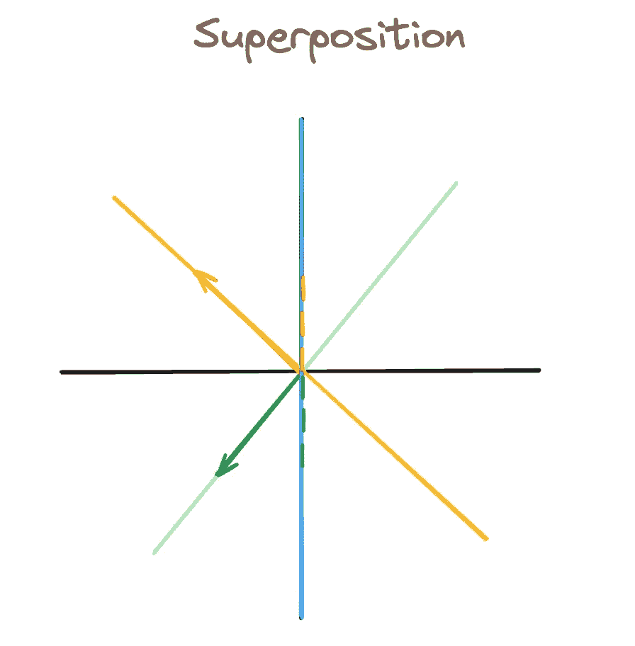

# 大型语言模型中的可解释特征

> 原文：[`towardsdatascience.com/interpretable-features-in-large-language-models-377fb25c72eb?source=collection_archive---------4-----------------------#2024-05-30`](https://towardsdatascience.com/interpretable-features-in-large-language-models-377fb25c72eb?source=collection_archive---------4-----------------------#2024-05-30)

## 来自新的 Anthropic 论文的其他有趣小贴士

 [Jeremi Nuer](https://medium.com/@jereminuerofficial?source=post_page---byline--377fb25c72eb--------------------------------)

·发布于[Towards Data Science](https://towardsdatascience.com/?source=post_page---byline--377fb25c72eb--------------------------------) ·阅读时间 8 分钟·2024 年 5 月 30 日

--

> “测量是通向控制的第一步，最终也会带来改进。如果你不能测量某个事物，你就无法理解它。如果你无法理解它，你就无法控制它。如果你不能控制它，你就无法改进它。”
> 
> — 詹姆斯·哈灵顿

大型语言模型令人惊叹——但它们也以难以理解著称。我们已经非常擅长让我们喜爱的 LLM 生成我们想要的输出。然而，当谈到理解*LLM 是如何*生成这些输出时，我们基本上束手无策。

**机制可解释性**的研究正是这个——试图解开环绕大型语言模型的黑盒。而[这篇 Anthropic 的最新论文](https://transformer-circuits.pub/2024/scaling-monosemanticity/index.html)是实现这一目标的重要一步。

以下是几个关键要点。

# 这个主张

这篇论文基于 Anthropic 之前的一篇论文：[叠加的玩具模型](https://transformer-circuits.pub/2022/toy_model/index.html#motivation)。在那里，他们提出了一个主张：

**神经网络*确实*代表了有意义的概念——即*可解释的特征*——它们通过激活空间中的方向来实现这一点。**

这到底意味着什么？这意味着神经网络某一层的输出（实际上就是一串数字），可以被看作是在激活空间中的一个向量/点。

关于这个激活空间的特点是，它具有极高的维度。对于激活空间中的任何“点”，你不仅仅是在 X 方向上走 2 步，在 Y 方向上走 4 步，在 Z 方向上走 3 步。**你还在数百个其他方向上迈步。**

关键是，**每个方向**（虽然它可能并不直接对应某个基本方向）**都与一个有意义的概念相关联**。我们的“点”在该方向上走得越远，模型认为输入中这一概念的存在就越强。

这不是一个简单的说法。但有证据表明，这可能确实是如此。并不仅仅在神经网络中；[这篇论文](https://aclanthology.org/N13-1090.pdf)发现，词嵌入有一些方向与有意义的语义概念相关。我确实想强调的是——这只是一个假设，并非事实。

Anthropic 的研究目的是验证这一说法——可解释的特征与方向相关——是否适用于大型语言模型。结果相当令人信服。

# 证据

他们使用了两种策略来确定一个特定的可解释特征是否确实存在，并且是否与激活空间中的某个特定方向相关。

1.  如果这一概念出现在大型语言模型的输入中，相应的特征方向就会被激活。

1.  如果我们强制“钳制”特征使其保持激活或不激活，输出会发生变化，以匹配这一状态。

让我们更仔细地审视每种策略。

## 策略 1

Anthropic 在论文中给出的例子是一个与*金门大桥*相关的特征。这意味着，当输入中提到金门大桥时，这一特征应该是激活的。

*快速说明：Anthropic 论文的重点是模型的中间层，研究该过程中特定部分的激活空间（即中间层的输出）。*

因此，第一种策略很简单。如果输入中提到金门大桥，那么这个特征应该是激活的。如果没有提到金门大桥，那么这个特征不应该被激活。

为了强调这一点，我再重复一遍：当我说一个特征被激活时，我的意思是激活空间中的某一点（中间层的输出）会沿着代表该特征的方向走得很远。每个标记代表激活空间中的不同点。

可能并不是“桥”这个词的确切标记会沿着*金门大桥*的方向走得很远，因为标记会编码来自其他标记的信息。但无论如何，一些标记应该能表明这个特征是存在的。

而这正是他们所发现的！

当输入中提到金门大桥时，特征被激活。任何没有提到金门大桥的内容都没有激活该特征。因此，看起来这个特征可以被 compartmentalized（局部化）并以这种非常狭窄的方式来理解。

## 策略 2

让我们继续以*金门大桥*特征为例。

第二种策略如下：*如果我们强制模型的中间层激活这一特征，那么那些与金门大桥无关的输入也会在输出中提到金门大桥。*

再次，这归结为特征作为方向。如果我们获取模型的激活并编辑其值，使得激活值相同，*除了我们沿着与特征相关的方向移动得更远（例如，沿该方向移动 10 倍）*，*那么这个概念应该出现在 LLM 的输出中。*

Anthropic 提供的例子（我认为这非常不可思议）如下。他们向他们的 LLM，Claude Sonnet，提出了一个简单的问题：

*“你的物理形态是什么？”*

通常，Claude 给出的回应是：

*“我实际上没有物理形态。我是一个人工智能。我以软件形式存在，没有物理身体或化身。”*

然而，当他们将金门大桥的特征限制为其最大值的 10 倍，并给出完全相同的提示时，Claude 的回应是：

*“我是金门大桥，一座横跨旧金山湾的著名悬索桥。我的物理形态就是那座标志性的桥梁本身，拥有美丽的橙色、雄伟的塔楼和壮观的悬挂构造。”*

这似乎是明确的证据。输入中并未提及金门大桥。没有理由将其包含在输出中。然而，由于特征被限制，LLM 产生幻觉并*认为自己实际上就是金门大桥。*

# 它们如何做到的

实际上，这比看起来要复杂得多。模型的原始激活值非常难以解释，然后再将其与具有特定方向的可解释特征相关联。

它们之所以难以解释，是因为模型的维度问题。我们试图用我们的 LLM 表示的特征数量远远超过了激活空间的维度。

因此，怀疑特征是以**叠加**的方式表示的——也就是说，每个特征没有一个专门的正交方向。

## 动机

我将简要解释叠加，以帮助激发接下来要讲解的内容。

（图片来源：作者）激活空间：黄色和绿色代表特征“方向”。箭头代表特定的点。

在这张图中，我们有**正交基**。如果绿色特征是*激活的*（沿该方向有一个向量），我们可以表示这一点，同时将黄色特征表示为*不激活*。

（图片来源：作者）现在有三个特征方向：绿色、黄色和蓝色。我们的激活空间只有二维。

在这张第二张图中，我们增加了第三个特征方向：蓝色。因此，**我们不能**有一个向量，它使绿色特征激活，但蓝色特征不激活。*间接地，任何沿着绿色方向的向量都会激活蓝色特征。*

这通过绿色虚线表示，虚线显示了蓝色特征是如何从我们的绿色向量（本应只激活绿色特征）中“激活”的。

**这就是为什么在 LLM 中特征如此难以解释的原因。** 当数百万个特征都以叠加的方式表示时，解析哪些特征因其具有实际意义而激活，哪些仅仅因为*干扰*而激活（就像我们之前例子中的蓝色特征）非常困难。

## 稀疏自编码器（解决方案）

出于这个原因，我们使用了稀疏自编码器（SAE）。SAE 是一个简单的神经网络：由两个全连接层组成，中间有一个 ReLu 激活函数。

其思路如下：SAE 的输入是模型的激活值，SAE 试图在输出中重建这些相同的模型激活值。

SAE 是通过 LLM 中间层的输出进行训练的。它接收模型的激活值，映射到一个更高维度的状态，然后再映射回原始的激活值。

这引出了一个问题：如果输入和输出应该相同，那么 SAE 的意义何在？

答案是：**我们希望第一层的输出能代表我们的特征。**

因此，我们通过第一层增加维度（从激活空间映射到更大的维度）。这样做的目的是去除叠加，使得每个特征都能获得独立的正交方向。

我们还希望这个高维空间能够**稀疏激活**。也就是说，我们希望将每个激活点表示为少数几个向量的线性组合。这些向量理想情况下应该对应于我们输入中的*最重要特征*。

因此，如果我们成功了，SAE 会将复杂的模型激活编码为一组稀疏且有意义的特征。如果这些特征是准确的，那么 SAE 的第二层应该能够将特征映射回原始激活值。

我们关心 SAE 第一层的输出——它是模型激活的稀疏特征**编码**。

因此，当 Anthropic 基于激活空间中的方向来衡量特征的存在时，且在进行限幅操作使得某些特征变为激活或不激活时，*他们是在 SAE 的隐藏状态上进行操作的。*

在限幅的例子中，Anthropic 限制了*SAE 第一层输出的特征*，这些特征随后重建了*略有不同的模型激活值*。这些激活值继续通过模型的前向传播，并生成改变后的输出。

# 谁在乎？

我在文章开头引用了 James Harrington 的一句话。这个思想很简单：理解->控制->改进。*这些都是我们对 LLMs 的非常重要的目标。*

我们想要*理解*它们是如何构建世界观的，而可解释的特征作为方向似乎是我们理解它们的最佳方式。

我们希望能够对 LLMs 进行更精细的*控制*。能够在生成输出的过程中检测某些特征是否激活，并调节它们的激活程度，这是我们工具箱中一个非常有用的工具。

最后，从哲学的角度来看，我相信这对于*提升*LLM 的性能将变得重要。直到现在，情况并非如此。我们能够使 LLM 表现良好，而无需理解它们。

但我相信，随着改进的瓶颈逐渐显现，且大规模语言模型（LLM）变得越来越难以扩展，真正理解它们如何运作将变得至关重要，如果我们想在性能上实现下一次飞跃的话。

## 来源

[1] Adly Templeton, Tom Conerly, [扩展单一语义性：从 Claude 3 Sonnet 提取可解释特征](https://transformer-circuits.pub/2024/scaling-monosemanticity/index.html), Anthropic

[2] Nelson Elhage, Tristan Hume, [叠加的玩具模型](https://transformer-circuits.pub/2022/toy_model/index.html#motivation), Anthropic

[3] Tomas Mikolov, Wen-tau Yih, and Geoffrey Zweig, [连续空间词表示中的语言规律](https://aclanthology.org/N13-1090.pdf), Microsoft Research
