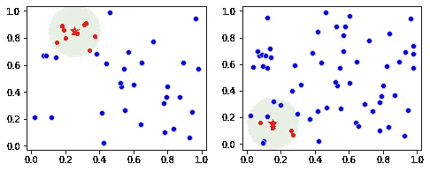
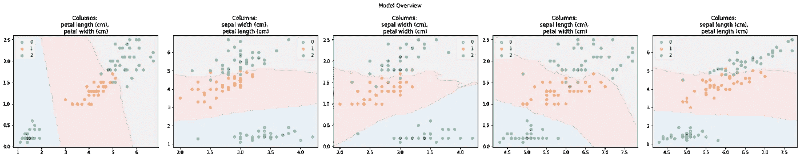
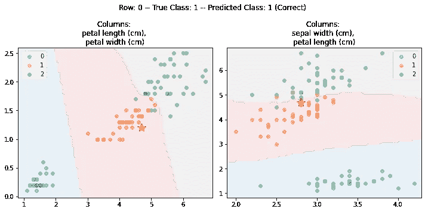

# 可解释的 kNN（ikNN）

> 原文：[`towardsdatascience.com/interpretable-knn-iknn-33d38402b8fc?source=collection_archive---------3-----------------------#2024-05-14`](https://towardsdatascience.com/interpretable-knn-iknn-33d38402b8fc?source=collection_archive---------3-----------------------#2024-05-14)

## 一个可解释的分类器

[](https://medium.com/@wkennedy934?source=post_page---byline--33d38402b8fc--------------------------------)[](https://towardsdatascience.com/?source=post_page---byline--33d38402b8fc--------------------------------) [W Brett Kennedy](https://medium.com/@wkennedy934?source=post_page---byline--33d38402b8fc--------------------------------)

·发表于[Towards Data Science](https://towardsdatascience.com/?source=post_page---byline--33d38402b8fc--------------------------------) ·10 分钟阅读·2024 年 5 月 14 日

--

在机器学习中的分类或回归问题中，我们通常最关心的是获得最准确的模型。然而，在某些情况下，我们还对模型的可解释性感兴趣。虽然像 XGBoost、CatBoost 和 LGBM 这样的模型可能非常强大，但有时我们很难确定它们为什么做出某些预测，或者它们在面对未见过的数据时会如何表现。这些被称为黑箱模型，即我们并不完全理解它们为什么做出这些预测。

在许多情况下，这是可以接受的；只要我们知道它们在大多数情况下是相当准确的，它们就非常有用，而且大家理解它们偶尔会出现不准确的情况。例如，在一个网站上，我们可能有一个模型，用来预测哪些广告在展示给当前用户时最有可能产生销售。如果模型在少数情况下表现不佳，这可能会影响收入，但并不会造成重大问题；我们只不过有一个次优的模型，但通常是有用的。

但是，在其他一些情况下，了解模型做出预测的原因可能非常重要。这包括高风险环境，如医疗和安全领域。它还包括我们需要确保模型在种族、性别或其他受保护群体方面没有偏见的环境。它在审计环境中也很重要：在这些环境中，需要理解模型，以确保它们的表现符合预期。

即使在这些情况下，有时也可以使用黑箱模型（例如，提升模型、神经网络、随机森林等），然后进行所谓的事后分析。这种方法在事后提供了一个解释，说明为什么模型做出了这样的预测。这就是可解释人工智能（XAI）领域，它使用代理模型、特征重要性（例如 SHAP）、反事实推理或 ALE 图等技术。这些都是非常有用的工具，但在其他条件相同的情况下，最好还是有一个一开始就可解释的模型，至少在可能的情况下是这样。XAI 方法非常有用，但它们确实有局限性。

使用代理模型时，我们训练一个可解释的模型（例如，一个浅层决策树），让它学习黑箱模型的行为。这可以提供一定程度的解释，但并不总是准确的，只能提供近似的解释。

特征重要性也非常有用，但它们仅能指示哪些特征是相关的，并不能说明这些特征如何与预测相关，或者它们如何相互作用来形成预测。它们也无法判断模型在未见数据上的表现是否合理。

对于可解释模型，我们没有这些问题。模型本身是可以理解的，我们可以确切地知道它为何做出每个预测。然而，问题是：可解释模型的准确性可能低于黑箱模型。对于大多数问题来说，大多数可解释模型的表现无法与提升模型或神经网络竞争。对于任何给定的问题，可能需要尝试几个可解释模型，才能找到一个准确性足够的可解释模型，如果有的话。

今天有许多可解释模型，但不幸的是，选择非常有限。其中包括决策树、规则列表（和规则集）、GAMs（广义加性模型，如可解释提升机器）以及线性/逻辑回归。这些模型在适用的情况下是有用的，但选择有限。这意味着：对于许多项目来说，找到一个表现令人满意的可解释模型可能是不可能的。如果有更多的选择，可能会带来真正的好处。

我们在这里介绍另一个可解释的模型，称为 ikNN，或可解释的 k 最近邻。这个模型基于一组 2D kNN 模型。虽然这个想法非常直接，但它也出奇的有效，并且相当可解释。尽管它在准确性方面无法与最先进的表格数据预测模型（如 CatBoost）竞争，但它通常能提供接近的准确性，这对于某些问题来说已经足够。它在决策树和其他现有可解释模型中也具有较强的竞争力。

有趣的是，它的准确性似乎比普通的 kNN 模型更强。

项目的主页是：[`github.com/Brett-Kennedy/ikNN`](https://github.com/Brett-Kennedy/ikNN)

该项目定义了一个名为 iKNNClassifier 的类。任何项目只需复制 interpretable_knn.py 文件并导入即可包含此类。它提供了与 scikit-learn 分类器一致的接口。也就是说，我们通常只需创建一个实例，调用 fit()，然后调用 predict()，类似于使用随机森林或其他 scikit-learn 模型。

在后台使用二维 kNN 集成方法提供了许多优势。其中一个是我们在集成方法中通常看到的优势：相比依赖单一模型，我们能够获得更可靠的预测。

另一个优势是二维空间易于可视化。该模型目前需要数值型输入（就像 kNN 模型一样），因此所有类别特征需要进行编码，但完成编码后，每个二维空间都可以像散点图一样进行可视化。这提供了较高的可解释性。

而且，可以确定每个预测最相关的二维空间，这使我们能够为每个记录展示少量的图表。这为每个记录提供了相当简单且完整的可视化解释。

因此，ikNN 是一个有趣的模型，因为它基于集成方法，但实际上提高了可解释性，而相反的情况更为常见。

# 标准 kNN 分类器

kNN 模型比许多其他模型使用得较少，因为它们通常不如提升模型或神经网络准确，也不如决策树具有可解释性。然而，它们仍然被广泛使用。它们基于一个直观的思想：一个项目的类别可以基于与其最相似的项目的类别来预测。

例如，如果我们查看鸢尾花数据集（如下例所示），我们有三类，代表三种鸢尾花。如果我们收集另一个鸢尾花样本并希望预测它属于哪一种鸢尾花，我们可以查看训练数据中最相似的 10 条记录，确定它们的类别，并选择这些记录中最常见的类别。

在这个例子中，我们选择 10 作为用于估计每条记录类别的最近邻数量，但也可以使用其他值。这作为超参数（k 参数）在 kNN 和 ikNN 模型中进行指定。我们希望设置 k 以使用合理数量的相似记录。如果使用的记录太少，结果可能不稳定（每个预测基于非常少的记录）。如果使用的记录太多，结果可能会基于一些不太相似的记录。

我们还需要一种方法来确定哪些是最相似的项目。为此，至少默认情况下，我们使用欧几里得距离。如果数据集有 20 个特征，并且我们使用 k=10，那么我们将根据它们的欧几里得距离在 20 维空间中找到最接近的 10 个点。

对于一条记录的预测，我们会找到训练数据中离它最近的 10 条记录，并查看它们的类别。如果 10 条记录中有 8 条是 Setosa 类别（鸢尾花的三种类型之一），那么我们可以假设这条记录很可能也是 Setosa，或者至少这是我们能做出的最佳猜测。

这个问题在于，当特征很多时，算法会出现问题，这就是所谓的*维度灾难*。高维空间的一个有趣特性是，当特征足够多时，点与点之间的距离开始变得没有意义。

kNN 还会平等地使用所有特征，尽管有些特征对目标的预测能力可能远远超过其他特征。点之间的距离是基于欧几里得（有时是曼哈顿或其他距离度量）计算的，考虑所有特征是相等的。这种方法简单，但并不总是最有效的，因为许多特征可能与目标无关。如果已经进行了特征选择，这种情况会有所减少，但特征的相关性仍然不等同。

而且，kNN 预测器做出的预测是不可解释的。算法本身非常直观，但预测结果可能难以理解。虽然可以列出任何记录的 k 个最近邻，这为预测提供了一些见解，但很难理解为什么某一组记录是最相似的，尤其是在特征很多的情况下。

# ikNN 算法

ikNN 模型首先会取每一对特征，并使用这些特征创建一个标准的二维 kNN 分类器。所以，如果一个表格有 10 个特征，这将创建(10 选 2)，即 45 个模型，每个模型对应一对独特的特征。

然后，模型会根据使用训练数据来预测目标列的准确度进行评估。基于这一点，ikNN 模型确定每个二维子空间的预测能力。在 45 个二维模型中，有些会比其他的更具预测力。为了进行预测，会使用已知最具预测力的二维子空间，且可以根据它们在训练数据上的预测能力进行加权。

此外，在推理时，可能会考虑每个二维空间中给定行的最近邻集的纯度，从而使模型能够更加重视那些在训练数据中证明最具预测性的子空间，以及那些在当前实例预测中表现出最高一致性的子空间。

考虑两个子空间和一个在这里显示为星形的点。在这两种情况下，我们都可以找到离该点最近的 k 个点。这里我们画了一个绿色圆圈围绕星形，尽管这些点集并不实际形成一个圆形（尽管第 k 个最近邻的半径实际上定义了一个邻域）。



这些图每个代表一对特征。在左侧的图中，星号邻居之间具有非常高的一致性：它们完全是红色的。在右侧的图中，邻居之间几乎没有一致性：有些是红色的，有些是蓝色的。第一对特征似乎比第二对特征更能预测记录，ikNN 正是利用了这一点。

这种方法使得模型能够考虑所有输入特征的影响，但以一种方式加权，使得更具预测性的特征的影响得到放大，而较少预测性的特征的影响则被削弱。

# 示例

我们首先使用一个玩具数据集来演示 ikNN，具体来说是鸢尾花数据集。我们加载数据，进行训练-测试集拆分，并在测试集上进行预测。

```py
from sklearn.datasets import load_iris
from interpretable_knn import ikNNClassifier

iris = load_iris()
X, y = iris.data, iris.target

clf = ikNNClassifier()
X_train, X_test, y_train, y_test = train_test_split(
   X, y, test_size=0.33, random_state=42)
clf.fit(X_train, y_train)
y_pred = clf.predict(X_test)
```

对于预测，这是所需的一切。但 ikNN 还提供了理解模型的工具，具体来说是 `graph_model()` 和 `graph_predictions()` API。

以下是 `graph_model()` 的示例：

```py
ikNN.graph_model(X.columns)
```



这提供了数据空间的快速概览，默认情况下绘制了五个二维空间。点显示了训练数据的类别。背景颜色显示了 2D kNN 对每个二维空间区域所做的预测。

`graph_predictions()` API 将解释特定的行，例如：



这里，被解释的行（第 0 行）以红色星号显示。再次强调，默认情况下使用五个图，但为了简化，这里仅使用了两个。在这两个图中，我们可以看到第 0 行相对于训练数据的位置，以及 2D kNN 对该 2D 空间所做的预测。

# 可视化

虽然是可配置的，但默认情况下，每个 ikNN 预测仅使用五个二维空间。这确保了预测速度较快且可视化简单。这也意味着这些可视化展示了真实的预测，而不是对预测的简化，确保了预测的完全可解释性。

对于大多数数据集的大多数行，所有或几乎所有的二维空间在预测上趋于一致。然而，在预测不准确的地方，可能需要检查更多的二维图，以便更好地调节超参数，使其更适应当前的数据集。

# 准确性测试

使用 OpenML 上的 100 个分类数据集的随机集合进行了多组测试。在比较标准 kNN 和 ikNN 模型的 F1（宏观）得分时，ikNN 在 58 个数据集上得分较高，而 kNN 在 42 个数据集上得分较高。

ikNN 在执行网格搜索以寻找最佳超参数时，表现得更好。在对所有 100 个数据集的两个模型进行网格搜索后，ikNN 在 100 个案例中有 76 个表现最好。它还倾向于在训练和测试分数之间有较小的差距，表明它比标准 kNN 模型更加稳定。

ikNN 模型可能稍微慢一些，但它们通常比提升型模型快得多，而且依然非常快速，通常只需不到一分钟的训练时间，通常仅需几秒钟。

GitHub 页面提供了一些更多的示例和准确性的分析。

# 结论

虽然 ikNN 可能不是在准确性为主要目标时最强的模型（尽管像任何模型一样，它偶尔也能做到），但在需要可解释性模型的场合，它很可能是一个应该尝试的模型。

本页面提供了使用该工具所需的基本信息。只需下载 .py 文件（[`github.com/Brett-Kennedy/ikNN/blob/main/ikNN/interpretable_knn.py`](https://github.com/Brett-Kennedy/ikNN/blob/main/ikNN/interpretable_knn.py)），将其导入到你的代码中，创建实例，进行训练和预测，并在需要时调用 graph_predictions() 来查看你希望查看的任何记录的解释。

所有图片均由作者提供。
