# 机器学习中的权重正则化解释

> 原文：[`towardsdatascience.com/interpreting-weight-regularization-in-machine-learning-99f2677f7ef5?source=collection_archive---------7-----------------------#2024-08-23`](https://towardsdatascience.com/interpreting-weight-regularization-in-machine-learning-99f2677f7ef5?source=collection_archive---------7-----------------------#2024-08-23)

## 为什么 L1 和 L2 正则化会导致模型稀疏和权重收缩？L3 正则化又会怎样呢？继续阅读，了解更多！

 [Dhruv Matani](https://medium.com/@dhruvbird?source=post_page---byline--99f2677f7ef5--------------------------------)

·发表于 [Towards Data Science](https://towardsdatascience.com/?source=post_page---byline--99f2677f7ef5--------------------------------) ·阅读时长 9 分钟·2024 年 8 月 23 日

--

图片来自 [D koi](https://unsplash.com/@dkoi?utm_source=medium&utm_medium=referral) 于 [Unsplash](https://unsplash.com/?utm_source=medium&utm_medium=referral)

与 [Naresh Singh](https://medium.com/@brocolishbroxoli) 合著。

# 介绍

阅读本文后，您将具备足够的工具和推理能力来思考任何 Lk 正则化项的效果，并决定它是否适用于您的情况。

## 机器学习中的正则化是什么？

让我们先看看互联网上的一些定义，并基于这些定义进行概括。

1.  正则化是一组减少机器学习模型过拟合的方法。通常，正则化通过牺牲训练准确度的微小下降来换取模型泛化能力的提高。 ([IBM](https://www.ibm.com/topics/regularization))

1.  正则化使得模型在不同的数据子集上保持稳定。它减少了模型输出对训练集细微变化的敏感度。 ([geeksforgeeks](https://www.geeksforgeeks.org/regularization-in-machine-learning/))

1.  机器学习中的正则化是一种防止模型过拟合的方法。 ([simplilearn](https://www.simplilearn.com/tutorials/machine-learning-tutorial/regularization-in-machine-learning))

通常，正则化是一种防止模型过拟合的技术，使模型能够在未见过的数据上进行泛化预测。接下来，我们特别讨论一下权重正则化的作用。

## 为什么使用权重正则化？

在训练机器学习模型时，可以采用多种形式的正则化。权重正则化就是一种技术，本文将重点讨论它。权重正则化意味着对机器学习模型中可学习的权重施加一些约束，以使它们能够使模型对未见过的输入具有较好的泛化能力。

权重正则化通过惩罚节点的权重矩阵来提高神经网络的性能。这种惩罚抑制了模型拥有大参数（权重）值的情况。它有助于控制模型拟合训练数据噪声的能力。通常，机器学习模型中的偏置项不受正则化约束。

## 在深度神经网络中，正则化是如何实现的？

通常，正则化损失会在训练过程中添加到模型的损失中。它允许我们在训练过程中控制模型的权重。公式如下所示：

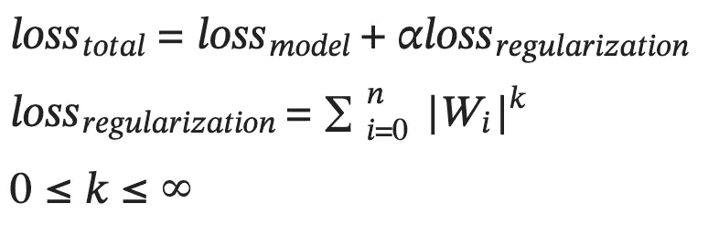

*图-1：总损失是模型损失和正则化损失的总和。k 是一个浮动值，表示正则化范数。Alpha 是正则化损失的加权因子。*

实践中常用的 k 值是 1 和 2。这些被称为 L1 和 L2 正则化方案。

但是，为什么我们大多数时候只使用这两个值，事实上 k 还有无数个可能的值？让我们通过对 L1 和 L2 正则化方案的解释来回答这个问题。

# 不同权重正则化类型的解释

在机器学习模型中，最常用的两种正则化类型是 L1 和 L2 正则化。我们将从这两种开始，并继续讨论一些不常见的正则化类型，如 L0.5 和 L3 正则化。我们将查看正则化损失的梯度，并将其绘制出来，以直观地理解它们如何影响模型的权重。

## L1 正则化

L1 正则化通过将权重的绝对值的平均值加起来作为正则化损失。

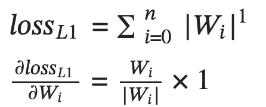

*图-2：L1 正则化损失及其对每个权重 Wi 的偏导数。*

它通过一个常数（在此情况下为 alpha 乘以学习率）来调整权重，方向是最小化损失的方向。图 3 显示了该函数及其导数的图示。

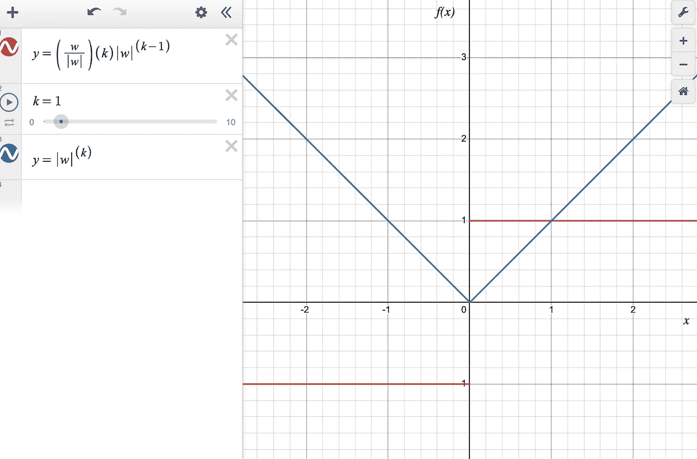

*图-3：蓝线表示 |w|，红线表示 |w| 的导数。*

你可以看到，L1 范数的导数是常数（取决于 w 的符号），这意味着该函数的梯度仅取决于 w 的符号，而不取决于其大小。L1 范数在 w=0 时的梯度是未定义的。

这意味着在每次反向传播步骤中，权重将通过一个常数值向零移动。在整个训练过程中，它有助于将权重收敛到零。这就是为什么 L1 正则化会使模型变得稀疏（即一些权重变为 0）。在某些情况下，如果它使模型过于稀疏，可能会导致问题。L2 正则化则没有这种副作用。我们将在下一节讨论这一点。

## L2 正则化

L2 正则化将权重绝对值的平方的平均值加总作为正则化损失。

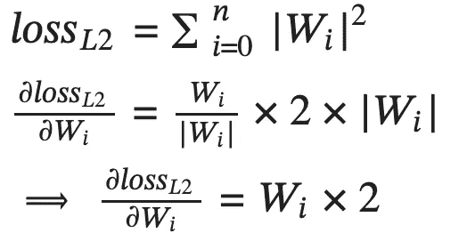

*图 4：L2 正则化损失及其相对于每个权重 Wi 的偏导数。*

它有助于在使损失最小化的方向上，通过权重本身的倍数调整每个权重。图 5 展示了该函数及其导数的图形表示。

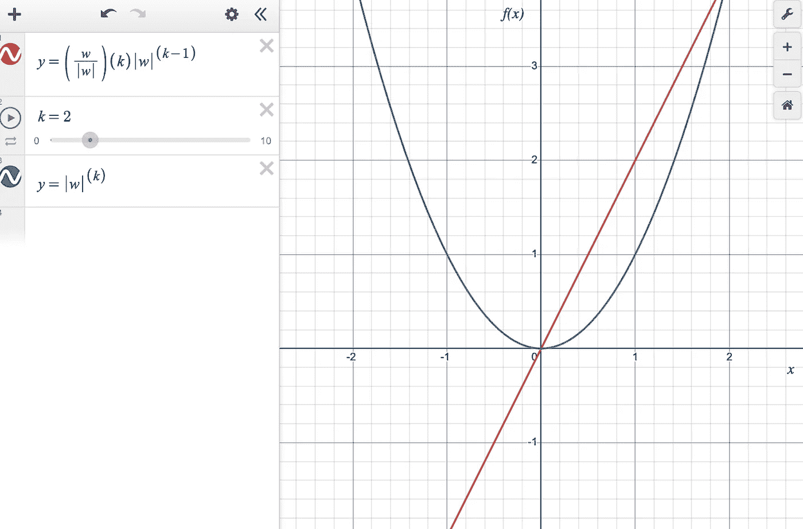

*图 5：蓝线是 pow(|w|, 2)，红线是 pow(|w|, 2) 的导数。*

你可以看到，L2 范数的导数只是该范数本身的符号调整后的平方根。L2 范数的梯度依赖于权重的符号和大小。

这意味着在每次梯度更新步骤中，权重将根据权重值的大小按比例调整到接近零。随着时间的推移，这会将权重拉向零，但永远不会完全为零，因为从一个值中减去常数因子本身，除非该值本来就为零，否则结果永远不会精确为零。L2 范数通常用于机器学习模型训练中的权重衰减。

让我们接下来考虑 L0.5 正则化。

## L0.5 正则化

L0.5 正则化将权重绝对值的平方根的平均值加总作为正则化损失。

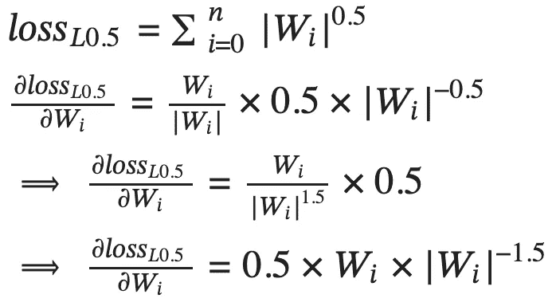

*图 6：L0.5 正则化损失及其相对于每个权重 Wi 的偏导数。*

这意味着在每次反向传播步骤中，权重将通过一个常数倍（在此情况下为 alpha 乘以学习率）调整，调整的方向是使损失最小化，并且调整量是权重自身的平方根的倒数。图 7 展示了该函数及其导数的图形。

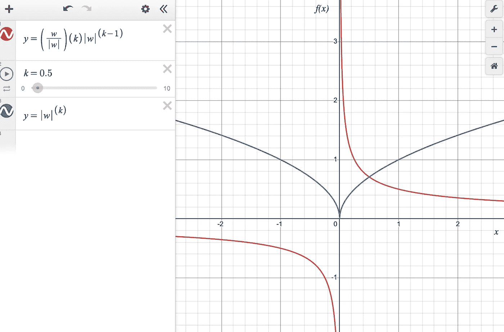

*图 7：蓝线是 pow(|w|, 0.5)，红线是 pow(|w|, 0.5) 的导数。*

你可以看到，L0.5 范数的导数是一个不连续的函数，在接近零的正值 w 处达到峰值，并且在接近零的负值 w 处达到负无穷大。此外，我们可以从图中得出以下结论：

1.  当|w|趋近于 0 时，梯度的大小趋向于无穷大。在反向传播过程中，这些 w 值会迅速跳过 0，因为大的梯度会导致 w 值发生剧烈变化。换句话说，负的 w 将变为正，反之亦然。这种反转的循环会持续重复。

1.  当|w|增加时，梯度的大小会减小。这些 w 值是稳定的，因为梯度较小。然而，每一次反向传播步骤后，w 的值都会被拉向 0。

这种情况几乎不是人们希望从权重正则化过程中得到的结果，因此可以安全地说 L0.5 不是一个好的权重正则化器。接下来我们考虑 L3 正则化。

## L3 正则化

L3 正则化将权重绝对值的立方的平均值作为正则化损失进行求和。

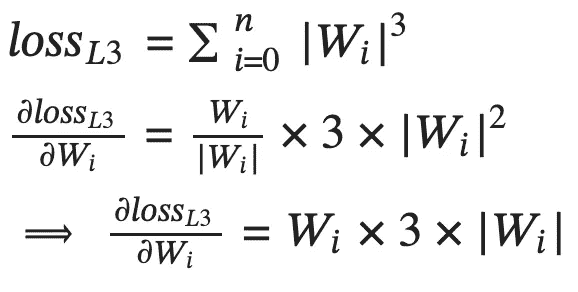

*图 8：L3 正则化损失及其相对于每个权重 Wi 的偏导数。*

这会通过一个倍数（在这种情况下是 alpha 倍学习率）调整每个权重的平方值，朝着最小化损失的方向进行调整。

从图形上看，这就是函数及其导数的样子。

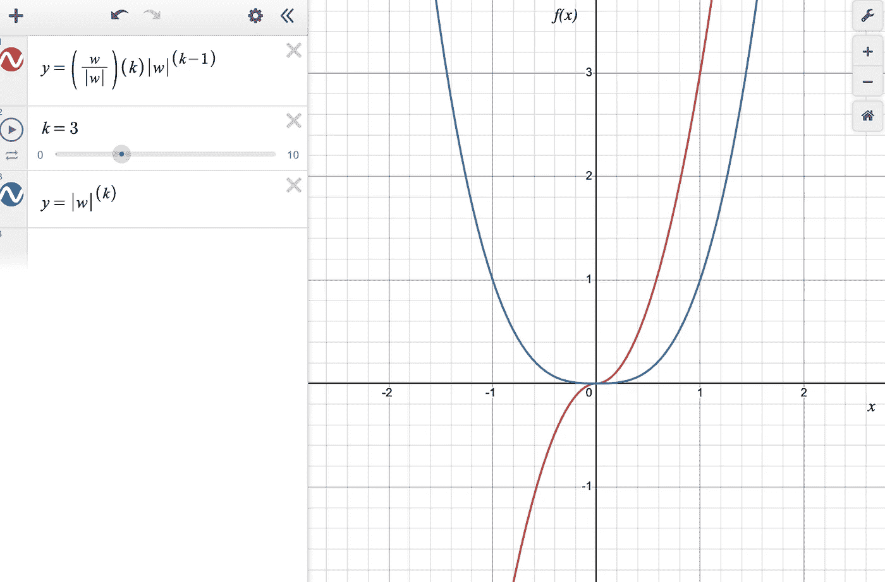

*图 9：蓝线表示 pow(|w|, 3)，红线表示 pow(|w|, 3)的导数。*

为了真正理解这里发生了什么，我们需要放大 w=0 点附近的图表。

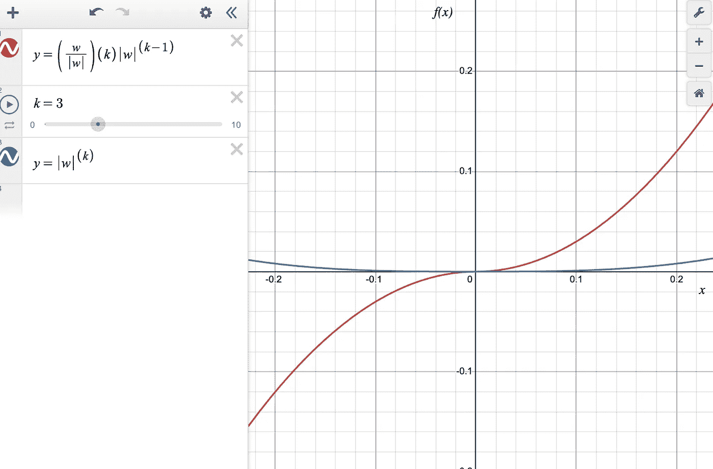

*图 10：蓝线表示 pow(|w|, 3)，红线表示 pow(|w|, 3)的导数，放大显示 w 值接近 0.0 时的情况。*

可以看到，L3 范数的导数是一个连续且可微的函数（尽管导数中有|w|），它在大值 w 时具有较大的幅度，而在小值 w 时具有较小的幅度。

有趣的是，对于非常小的 w 值，接近 0.0 时，梯度几乎为零。

L3 的梯度解释很有趣。

1.  对于较大的 w 值，梯度的大小很大。在反向传播过程中，这些值将被推向 0。

1.  一旦权重 w 达到拐点（接近 0.0），梯度几乎消失，权重将停止更新。

其效果是将大幅度的权重拉近 0，但不会完全变为 0。

让我们考虑更高的范数，看看在极限情况下会发生什么。

## 超越 L3 正则化

要理解 Linfinity 的情况，我们需要看看 L10 正则化的情况。

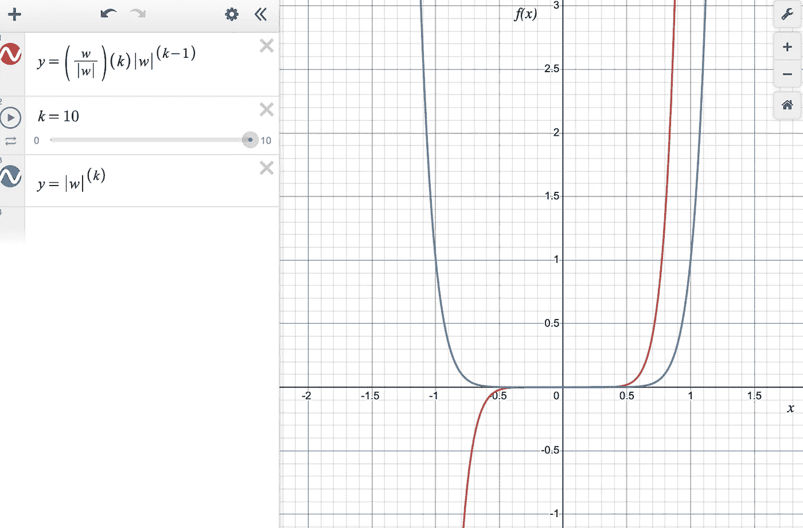

*图 11：蓝线表示 pow(|w|, 10)，红线表示 pow(|w|, 10)的导数，放大显示 w 值接近 0.0 时的情况。*

可以看出，当|w| < 0.5 时，梯度非常小，这意味着对于这些 w 值，正则化将不会起作用。

## 练习

基于我们上述的所有观察，L1 和 L2 正则化根据你想要实现的目标是相当实用的。作为一个练习，尝试推理一下 L1.5 正则化的行为，其图表如下所示。

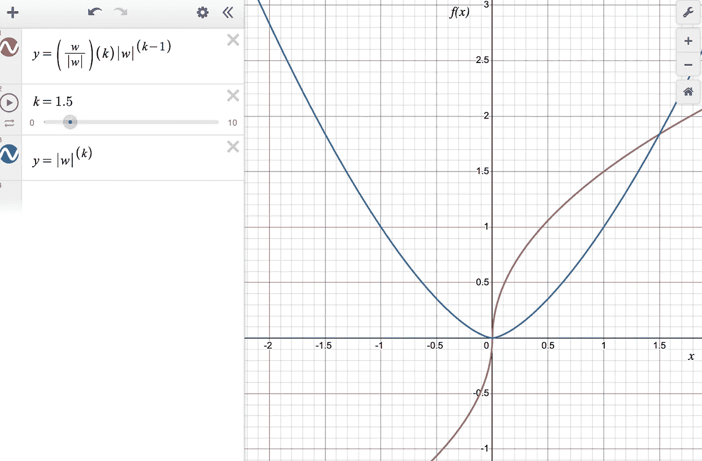

*图 12：蓝线是 pow(|w|, 1.5)，红线是 pow(|w|, 1.5) 的导数。*

# 结论

我们从视觉和直观的角度审视了 L1 和 L2（以及一般的 Lk）正则化项，以理解为什么 L1 正则化会导致稀疏的模型权重，而 L2 正则化会使模型权重接近 0。在本次练习中，将解决方案框定为检查结果的梯度是非常有价值的。

我们探索了 L0.5、L3 和 L10 正则化项，并以图形方式呈现，你（读者）推理了 L1 和 L2 正则化之间的正则化项，并形成了对它们对模型权重影响的直观理解。

我们希望本文能够为你在模型训练和微调时考虑正则化策略时提供更多的技巧。

本文中的所有图表均使用在线 Desmos 图形计算器创建。[这是一个链接](https://www.desmos.com/calculator/hp5bjnh8ul)，供你在需要时玩弄这些函数。

所有图片均由作者创建，除非另有说明。

# 参考文献

在研究这一主题时，我们发现以下文章非常有用，我们希望你也能从中受益！

1.  [Stackexchange 讨论](https://stats.stackexchange.com/questions/269298/why-do-we-only-see-l-1-and-l-2-regularization-but-not-other-norms)

1.  TDS: 解密 L1 和 L2 正则化（第三部分）

1.  [L1 和 L2 正则化的视觉解释](https://www.linkedin.com/pulse/intuitive-visual-explanation-differences-between-l1-l2-xiaoli-chen/)

1.  Ian Goodfellow 的《深度学习》

1.  Gareth James 的《统计学习简介》
