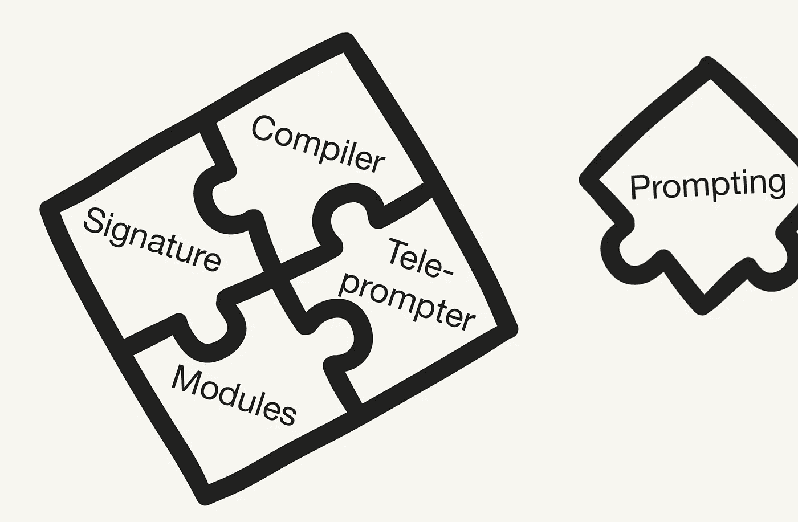

# DSPy 介绍：告别提示，迎接编程！

> 原文：[`towardsdatascience.com/intro-to-dspy-goodbye-prompting-hello-programming-4ca1c6ce3eb9?source=collection_archive---------0-----------------------#2024-02-27`](https://towardsdatascience.com/intro-to-dspy-goodbye-prompting-hello-programming-4ca1c6ce3eb9?source=collection_archive---------0-----------------------#2024-02-27)

## DSPy 框架通过将提示替换为编程和编译，解决了基于 LLM 的应用中的脆弱性问题

 [Leonie Monigatti](https://medium.com/@iamleonie?source=post_page---byline--4ca1c6ce3eb9--------------------------------)

·发布于[Towards Data Science](https://towardsdatascience.com/?source=post_page---byline--4ca1c6ce3eb9--------------------------------) ·13 分钟阅读·2024 年 2 月 27 日

--

DSPy（图像由作者手绘）

目前，使用大型语言模型（LLMs）构建应用程序不仅复杂，而且脆弱。典型的管道通常使用提示来实现，而提示是通过反复试验手工制作的，因为[LLMs 对如何被提示非常敏感](https://www.anthropic.com/news/claude-2-1-prompting)。因此，当你更改管道中的某个部分，比如 LLM 或数据时，性能很可能会减弱——除非你适应提示（或微调步骤）。

> 当你更改管道中的某个部分时，比如 LLM 或数据，性能很可能会变弱……

[DSPy](https://github.com/stanfordnlp/dspy) [1] 是一个框架，旨在通过优先考虑编程而非提示，解决基于语言模型（LM）应用中的脆弱性问题。它允许你重新编译整个管道，优化它以适应你的特定任务——而不是每次更改一个组件时都重复手工编写提示工程。

尽管关于该框架的[论文](https://arxiv.org/abs/2310.03714) [1] 已于 2023 年 10 月发布，我最近才了解它。在短短的……
