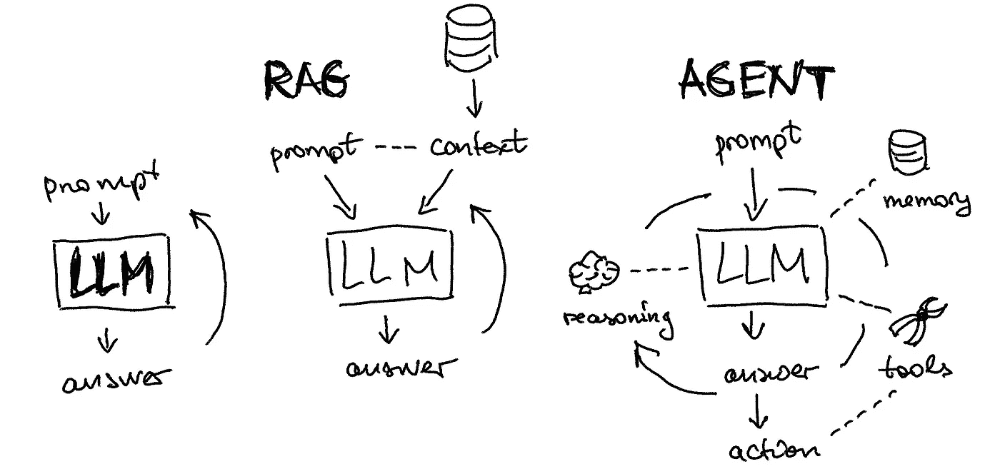
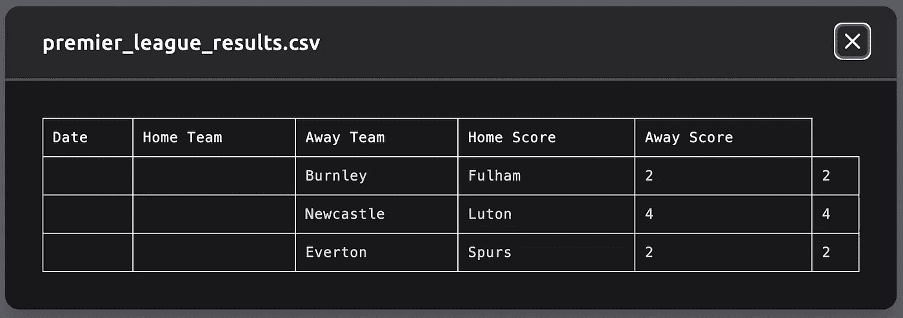

# 使用 Langchain 介绍 LLM 代理：当 RAG 不足以满足需求时

> 原文：[`towardsdatascience.com/intro-to-llm-agents-with-langchain-when-rag-is-not-enough-7d8c08145834?source=collection_archive---------0-----------------------#2024-03-15`](https://towardsdatascience.com/intro-to-llm-agents-with-langchain-when-rag-is-not-enough-7d8c08145834?source=collection_archive---------0-----------------------#2024-03-15)

## AI 助手的脑结构一阶原则

[](https://alexhonchar.medium.com/?source=post_page---byline--7d8c08145834--------------------------------)[](https://towardsdatascience.com/?source=post_page---byline--7d8c08145834--------------------------------) [Alex Honchar](https://alexhonchar.medium.com/?source=post_page---byline--7d8c08145834--------------------------------)

·发表于[Towards Data Science](https://towardsdatascience.com/?source=post_page---byline--7d8c08145834--------------------------------) ·7 分钟阅读·2024 年 3 月 15 日

--

大家好，本文是我两周前与[Neurons Lab](https://neurons-lab.com/)进行的教程的书面形式。如果你更喜欢叙述性引导，可以在这里找到 YouTube 视频：

和往常一样，你可以在[GitHub 上找到代码](https://github.com/Rachnog/intro_to_llm_agents)，这里还有独立的 Colab 笔记本：

1.  [规划与推理](https://colab.research.google.com/drive/1SplDwEIbVfo9zNt6JOK0gJlV0wCNuz0F?usp=sharing)

1.  [不同类型的记忆](https://colab.research.google.com/drive/13b_pD27aqcNXYI2M7fBxK1fRIO2pygZJ?usp=sharing)

1.  [各种类型的工具](https://colab.research.google.com/drive/1-VpwkmSvzA-zQ_iVK-xjOQf5kA-Lzwg9?usp=sharing)

1.  [构建完整的代理](https://colab.research.google.com/drive/1aC9AUNNYYz36atE8BUJH4fZIfknHa9Pk?usp=sharing)

# 代理介绍



图示由作者提供。LLM 通常通过 RAG 架构增强外部记忆。代理将这一概念扩展到记忆、推理、工具、答案和行动。

让我们通过探索各种 LLM 代理的示例来开始这堂讲座。虽然这个话题被广泛讨论，但实际上很少有在积极使用代理的；我们通常认为是代理的，往往只是大型语言模型。我们可以考虑一个简单的任务——**搜索足球比赛结果并将其保存为 CSV 文件**。我们可以比较几种现有的工具：

+   **带有搜索和插件的 GPT-4**：正如你在[这里的聊天历史](https://chat.openai.com/share/2ecd61a9-dbd9-4287-aa75-14618106a34c)中看到的，GPT-4 因代码错误未能完成任务。

+   **AutoGPT** 通过[`evo.ninja/`](https://evo.ninja/)至少可以生成某种形式的 CSV（尽管不理想）：



+   **AgentGPT** 通过[`agentgpt.reworkd.ai/`](https://agentgpt.reworkd.ai/)：决定将此任务视为合成数据生成器，但这并不是我们所要求的，查看[聊天历史记录](https://agentgpt.reworkd.ai/agent?id=clsyfh1t101t9jv08yaof890k)

**由于现有的工具不太理想**，让我们从构建代理的基本原理开始学习。我正在使用[丽莉安的博客文章](https://lilianweng.github.io/posts/2023-06-23-agent/)作为结构参考，但同时加入了更多我自己的例子。

# 步骤 1：规划


简单的“输入-输出”LLM 使用和像思维链、带自一致性的思维链、思维树等技术之间的视觉差异

你可能遇到过各种旨在提升大型语言模型性能的技术，例如[提供建议](https://twitter.com/literallydenis/status/1730965217125839142)或甚至开玩笑地威胁它们。一种流行的技术叫做“[思维链](https://www.promptingguide.ai/techniques/cot)”，在这种方法中，**模型被要求一步步思考，从而实现自我修正**。这种方法已经发展成更高级的版本，如“[带自一致性的思维链](https://www.promptingguide.ai/techniques/consistency)”和广义的“[思维树](https://medium.com/@astropomeai/implementing-the-tree-of-thoughts-in-langchains-chain-f2ebc5864fac)”，**其中多个思维被创造、重新评估并整合，以提供输出**。

在本教程中，我重度使用[Langsmith](https://www.langchain.com/langsmith)，这是一个将 LLM 应用生产化的平台。例如，在构建思维树提示时，我将我的子提示保存在**提示仓库**中并加载它们：

```py
from langchain import hub
from langchain.chains import SequentialChain

cot_step1 = hub.pull("rachnogstyle/nlw_jan24_cot_step1")
cot_step2 = hub.pull("rachnogstyle/nlw_jan24_cot_step2")
cot_step3 = hub.pull("rachnogstyle/nlw_jan24_cot_step3")
cot_step4 = hub.pull("rachnogstyle/nlw_jan24_cot_step4")

model = "gpt-3.5-turbo"

chain1 = LLMChain(
    llm=ChatOpenAI(temperature=0, model=model),
    prompt=cot_step1,
    output_key="solutions"
)

chain2 = LLMChain(
    llm=ChatOpenAI(temperature=0, model=model),
    prompt=cot_step2,
    output_key="review"
)

chain3 = LLMChain(
    llm=ChatOpenAI(temperature=0, model=model),
    prompt=cot_step3,
    output_key="deepen_thought_process"
)

chain4 = LLMChain(
    llm=ChatOpenAI(temperature=0, model=model),
    prompt=cot_step4,
    output_key="ranked_solutions"
)

overall_chain = SequentialChain(
    chains=[chain1, chain2, chain3, chain4],
    input_variables=["input", "perfect_factors"],
    output_variables=["ranked_solutions"],
    verbose=True
)
```

你可以在[这个笔记本](https://github.com/Rachnog/intro_to_llm_agents/blob/main/1_planning.ipynb)中看到这种推理的结果，我想在这里强调的是定义推理步骤和在**像 Langsmith 这样的 LLMOps 系统中进行版本控制的正确过程**。另外，你还可以在像 ReAct 或 Self-ask with search 这样的公开仓库中看到其他流行的推理技术示例：

```py
prompt = hub.pull("hwchase17/react")
prompt = hub.pull("hwchase17/self-ask-with-search")
```

其他值得注意的方法有：

+   **反思**（[Shinn & Labash 2023](https://arxiv.org/abs/2303.11366)）是一个框架，通过动态记忆和自我反思能力来装备代理，从而提高推理技能。

+   **后见之明链**（CoH；[Liu et al. 2023](https://arxiv.org/abs/2302.02676)）鼓励模型通过明确地展示一系列过去的输出，每个输出都附有反馈，来改进其自身的输出。

# 步骤 2：记忆


我们可以将大脑中不同类型的记忆映射到 LLM 代理架构的各个组件上。

+   **感官记忆：** 记忆的这一部分捕捉即时的感官输入，比如我们看到、听到或感受到的东西。在提示工程和 AI 模型的上下文中，提示作为一种瞬时输入，类似于短暂的触摸或感觉。它是触发模型处理的初步刺激。

+   **短期记忆：** 短期记忆暂时保存信息，通常与当前的任务或对话相关。在提示工程中，这等同于保留最近的聊天记录。这种记忆使得代理能够保持上下文和连贯性，确保响应与当前对话一致。**在代码中，通常将其作为对话历史添加**：

```py
from langchain_community.chat_message_histories import ChatMessageHistory
from langchain_core.runnables.history import RunnableWithMessageHistory
from langchain.agents import AgentExecutor
from langchain.agents import create_openai_functions_agent

llm = ChatOpenAI(model="gpt-3.5-turbo", temperature=0)
tools = [retriever_tool]
agent = create_openai_functions_agent(
    llm, tools, prompt)
agent_executor = AgentExecutor(agent=agent, tools=tools, verbose=True)

message_history = ChatMessageHistory()
agent_with_chat_history = RunnableWithMessageHistory(
    agent_executor,
    lambda session_id: message_history,
    input_messages_key="input",
    history_messages_key="chat_history",
)
```

+   **长期记忆：** 长期记忆储存事实性知识和过程性指令。在 AI 模型中，这通过用于训练和微调的数据来表示。此外，长期记忆支持 RAG 框架的运作，允许代理访问并将学到的信息整合到它们的响应中。它就像是代理用来生成有根据和相关输出的综合知识库。**在代码中，通常将其作为向量化数据库添加**：

```py
from langchain.text_splitter import RecursiveCharacterTextSplitter
from langchain_community.document_loaders import WebBaseLoader
from langchain_community.vectorstores import FAISS
from langchain_openai import OpenAIEmbeddings

loader = WebBaseLoader("https://neurons-lab.com/")
docs = loader.load()
documents = RecursiveCharacterTextSplitter(
    chunk_size=1000, chunk_overlap=200
).split_documents(docs)
vector = FAISS.from_documents(documents, OpenAIEmbeddings())
retriever = vector.as_retriever()
```

# 第 3 步：工具


在实际应用中，你可能希望通过独立的推理线路增强你的代理（这可以是另一个 LLM，例如领域特定的 LLM，或者是用于图像分类的其他 ML 模型），或者通过一些更基于规则或 API 的方式来增强。

ChatGPT [插件](https://openai.com/blog/chatgpt-plugins)和**OpenAI API** [函数调用](https://platform.openai.com/docs/guides/gpt/function-calling)是 LLM 增强工具使用能力在实际中工作的良好示例。

+   **内置 Langchain 工具：** Langchain 提供了一个[内置工具库](https://python.langchain.com/docs/integrations/tools/)，包括互联网搜索、Arxiv 工具包、Zapier 和 Yahoo Finance 等。对于这个简单的教程，我们将尝试使用[Tavily](https://tavily.com/)提供的互联网搜索功能：

```py
from langchain.utilities.tavily_search import TavilySearchAPIWrapper
from langchain.tools.tavily_search import TavilySearchResults

search = TavilySearchAPIWrapper()
tavily_tool = TavilySearchResults(api_wrapper=search)

llm = ChatOpenAI(model_name="gpt-3.5-turbo", temperature=0.0)
agent_chain = initialize_agent(
    [retriever_tool, tavily_tool],
    llm,
    agent=AgentType.STRUCTURED_CHAT_ZERO_SHOT_REACT_DESCRIPTION,
    verbose=True,
)
```

+   **自定义工具：** 定义自己的工具也非常简单。让我们分析一个计算字符串长度的简单工具示例。你需要使用`@tool`装饰器让 Langchain 知道它的存在。然后，不要忘记输入和输出的类型。但最重要的部分是`""" """`之间的函数注释 —— 这是你的代理知道这个工具做什么的方式，并且会将这个描述与其他工具的描述进行比较：

```py
from langchain.pydantic_v1 import BaseModel, Field
from langchain.tools import BaseTool, StructuredTool, tool

@tool
def calculate_length_tool(a: str) -> int:
    """The function calculates the length of the input string."""
    return len(a)

llm = ChatOpenAI(model_name="gpt-3.5-turbo", temperature=0.0)
agent_chain = initialize_agent(
    [retriever_tool, tavily_tool, calculate_length_tool],
    llm,
    agent=AgentType.ZERO_SHOT_REACT_DESCRIPTION,
    verbose=True,
)
```

你可以在[这个脚本](https://github.com/Rachnog/intro_to_llm_agents/blob/main/3_tools.ipynb)中找到它是如何工作的示例，**但你也可以看到一个错误** —— 它没有提取到正确的 Neurons Lab 公司描述，尽管调用了正确的自定义长度计算函数，但最终结果还是错误的。让我们尝试修复它！

# 步骤 4：所有内容合并

我提供了一个干净的版本，将所有架构的部分组合在一起，[请参见这个脚本](https://github.com/Rachnog/intro_to_llm_agents/blob/main/4_agents.ipynb)。注意，我们如何轻松地将其分解并分别定义：

+   各种**工具**（搜索、自定义工具等）

+   各种**记忆**（**感官**作为提示，**短期**作为可运行的消息历史，以及作为提示中的草图板，**长期**作为从向量数据库中检索的内容）

+   任何类型的**规划策略**（作为从 LLMOps 系统提取的**提示**的一部分）

代理的最终定义看起来将是如此简单：

```py
llm = ChatOpenAI(model="gpt-3.5-turbo", temperature=0)
agent = create_openai_functions_agent(llm, tools, prompt)
agent_executor = AgentExecutor(agent=agent, tools=tools, verbose=True)
agent_with_chat_history = RunnableWithMessageHistory(
    agent_executor,
    lambda session_id: message_history,
    input_messages_key="input",
    history_messages_key="chat_history",
)
```

如你在[脚本输出](https://github.com/Rachnog/intro_to_llm_agents/blob/main/4_agents.ipynb)中看到的（或者你也可以自己运行它），它解决了前面部分中与工具相关的问题。发生了什么变化？我们定义了一个**完整的架构**，其中短期记忆起着至关重要的作用。我们的代理获得了**消息历史和草图板作为推理结构的一部分**，这使得它能够提取正确的网站描述并计算其长度。

# 结束语

我希望这次对 LLM 代理架构核心元素的讲解能帮助你设计出能够自动化认知任务的功能性机器人。在此，我再次强调，确保代理的所有元素都到位的重要性。正如我们所看到的，缺失短期记忆或工具描述不完整，会干扰代理的推理，甚至导致非常简单任务（如摘要生成和长度计算）给出错误答案。祝你的 AI 项目好运，如果你在公司遇到问题，欢迎随时[联系我](https://linktr.ee/alexhonchar)！
