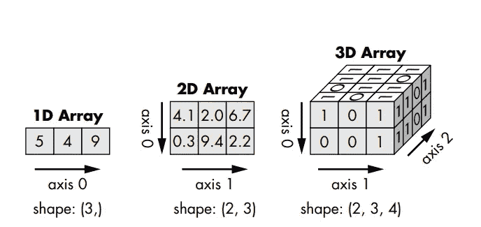

# 介绍 NumPy，第二部分：数组索引

> 原文：[`towardsdatascience.com/introducing-numpy-part-2-indexing-arrays-5b381b90d1d0?source=collection_archive---------9-----------------------#2024-09-12`](https://towardsdatascience.com/introducing-numpy-part-2-indexing-arrays-5b381b90d1d0?source=collection_archive---------9-----------------------#2024-09-12)

## 快速成功的数据科学

## 像专业人士一样切片和切割

 [Lee Vaughan](https://medium.com/@lee_vaughan?source=post_page---byline--5b381b90d1d0--------------------------------)

·发表于 [Towards Data Science](https://towardsdatascience.com/?source=post_page---byline--5b381b90d1d0--------------------------------) ·阅读时长 13 分钟·2024 年 9 月 12 日

--

使用 DALL-E3 对数组进行索引

NumPy 是 Python 的基础库，用于数值计算。有了 NumPy，*数组*（数组本质上是相同数据类型元素的表格）处理了繁重的计算任务。数组经过优化，能够比传统的 Python 数据类型（如列表）执行更快的数学和逻辑运算。

在 [第一部分](https://medium.com/towards-data-science/introducing-numpy-part-1-understanding-arrays-3f6fecc97e3d)中，我们讨论了如何创建数组、描述它们并使用点号表示法访问它们的属性。在本文中，我们将探讨如何使用 *索引* 和 *切片* 访问数组中的元素，这样你就可以提取元素的值并通过赋值语句进行修改。数组索引使用方括号 `[]`，就像 Python 列表一样。

# 数组的维度和轴

为了复习第一部分，这里是 1D、2D 和 3D 数组的图形表示，轴已经标注。你需要理解轴的方向才能正确索引。

1D、2D 和 3D 数组的图形表示（来自 [Python 科学工具](https://a.co/d/86EgobI)）（这篇以及未来几篇指向我书籍的链接为联盟链接）

# 索引和切片 1D 数组
