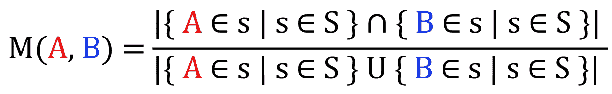

# 介绍语义标签过滤：通过标签相似性增强检索

> 原文：[`towardsdatascience.com/introducing-semantic-tag-filtering-enhancing-retrieval-with-tag-similarity-4f1b2d377a10?source=collection_archive---------2-----------------------#2024-09-09`](https://towardsdatascience.com/introducing-semantic-tag-filtering-enhancing-retrieval-with-tag-similarity-4f1b2d377a10?source=collection_archive---------2-----------------------#2024-09-09)

## 语义标签过滤

## 如何利用语义相似度改进标签过滤

 [Michelangiolo Mazzeschi](https://medium.com/@ardito.bryan?source=post_page---byline--4f1b2d377a10--------------------------------)

·发表于 [Towards Data Science](https://towardsdatascience.com/?source=post_page---byline--4f1b2d377a10--------------------------------) ·阅读时长 9 分钟·2024 年 9 月 9 日

--

> ***要理解这篇文章，需要掌握**Jaccard 相似度**和**向量搜索**的知识。此算法的实现已发布在[GitHub](https://github.com/atlantis-nova/simtag)上，并且完全开源。

多年来，我们已经掌握了如何从不同模态中检索信息，如**数字**、**原始文本**、**图像**，以及**标签**。

随着定制化用户界面（UI）越来越受欢迎，**标签搜索系统**成为了一种方便的方式，可以高效且准确地过滤信息。一些常见的**标签搜索应用场景**包括社交媒体帖子、文章、游戏、电影，甚至是简历的检索。

然而，传统的标签搜索缺乏灵活性。如果我们要筛选包含精确标签的样本，可能会遇到一些情况，尤其是对于只包含几千个样本的数据库，**可能没有（或仅有少数）匹配的样本**。

两种搜索方式在结果稀缺情况下的区别，图片来源：作者

> ****通过以下文章，我试图介绍几种新的算法，据我所知，我一直没有找到相关的资料。***我愿意接受批评*** *并且* ***欢迎任何反馈。***

## 传统的标签搜索是如何工作的？

传统系统使用一种叫做**Jaccard 相似度**的算法（通常通过**minhash 算法**执行），它能够计算两个元素集合之间的相似度（在我们的例子中，这些元素是标签）。如前所述，这种搜索方法根本不灵活（集合要么**包含**，要么**不包含**查询的标签）。

**简单与位运算**示例（这不是 Jaccard 相似度，但可以让你大致了解过滤方法），图像由作者提供

## 我们能做得更好吗？

那么，如果我们不仅仅是从匹配标签中过滤样本，而是考虑样本中所有其他不完全相同但与我们选择的标签**相似**的标签呢？我们可以使算法更加灵活，将结果扩展到非完美匹配的项，但仍然是较好的匹配。我们将直接将**语义相似性**应用于标签，而不是文本。

# 引入语义标签搜索

如前所述，这种新方法试图将**语义搜索的能力**与标签过滤系统相结合。为了构建这个算法，我们只需要一件事：

+   一个**带标签的样本数据库**

我将使用的参考数据是开源的**Steam 游戏库**（[可从 Kaggle 下载](https://www.kaggle.com/datasets/fronkongames/steam-games-dataset) — [MIT 许可证](https://www.mit.edu/~amini/LICENSE.md)） — 大约 40,000 个样本，这是测试我们算法的一个不错的样本量。从显示的数据框中可以看到，每个游戏都有多个分配的标签，在我们的数据库中有超过 400 个独特的标签。

示例笔记本中的 Steam 数据框截图，图像由作者提供

现在我们有了起始数据，我们可以继续：算法将在以下步骤中进行阐述：

1.  提取标签关系

1.  编码查询和样本

1.  使用向量检索进行语义标签搜索

1.  验证

在本文中，**我将仅探讨**这种新方法背后的数学（有关带有工作演示的代码的详细[解释](https://github.com/atlantis-nova/simtag/blob/main/notebooks/steam_example.ipynb)，请参阅以下笔记本：如何使用 simtag 的说明请参见[根目录的 README.md 文件](https://github.com/atlantis-nova/simtag)）。

## 1\. 提取标签关系

第一个想到的问题是我们如何找到**标签之间的关系**。请注意，有几种算法可以用于获得相同的结果：

+   使用**统计方法**我们可以使用的最简单的方法来提取标签关系叫做**共现矩阵**，这是我在本文中将采用的格式（因其高效性和简单性）。

+   使用**深度学习**：最先进的深度学习方法都基于嵌入式神经网络（例如，过去使用[Word2Vec](https://projector.tensorflow.org/)，现在常用的则是变换器模型，如 LLMs），这些方法能够提取样本之间的语义关系。创建一个神经网络来提取标签关系（以自编码器的形式）是一个可能的选项，并且在面对特定情境时，通常建议这样做。

+   使用**预训练模型**：由于标签是使用人类语言定义的，因此可以使用现有的预训练模型来计算已经存在的相似度。这通常会更快，也不会那么麻烦。然而，每个数据集都有其独特性。使用预训练模型**将忽略客户行为**。

    例如，我们稍后会看到 2D 与 Fantasy 之间有强关联：这种配对使用预训练模型永远无法发现。

算法的选择可能取决于许多因素，特别是当我们需要处理庞大的数据池或存在可扩展性问题时（例如，**# 标签将等于我们的向量长度**：如果标签太多，我们需要使用机器学习来解决这个问题）。

## a. 使用米开朗基罗相似度构建共现矩阵

如前所述，我将使用**共现矩阵**来提取这些关系。我的目标是找到**每一对标签**之间的关系，我将通过对整个样本集合（S）应用以下计数来做到这一点，使用 IoU（交集除以并集）：

计算**标签对之间相似度**的公式，作者提供的图像

这个算法与 Jaccard 相似度非常相似。虽然它作用于样本，但我介绍的这个算法作用于元素，然而（**据我所知**）这个特定的应用尚未被正式化，所以我们可以将其称为**米开朗基罗相似度**。（**公平地说，这个算法的使用曾在[StackOverflow 问题](https://stackoverflow.com/questions/76910725/pyspark-getting-jaccard-similarity-from-co-ocurrence-matrix)中提到过，但从未被正式化**）。

**Jaccard 相似度**和**米开朗基罗相似度**的区别，作者提供的图像

对于 40,000 个样本，提取**相似度矩阵**大约需要一个小时，结果将是：

我们样本列表中所有独特标签的**共现矩阵** **S，**作者提供的图像

让我们手动检查一些非常常见标签的前 10 个样本，看看结果是否合理：

从**共现矩阵**中提取的样本关系，作者提供的图像

结果看起来非常有前景！我们从纯粹的分类数据（仅能转换为 0 和 1）开始，但我们已经提取了标签之间的语义关系（甚至没有使用神经网络）。

## b. 使用预训练神经网络

同样，我们可以使用[预训练编码器](https://huggingface.co/sentence-transformers/all-MiniLM-L6-v2)提取我们样本之间的现有关系。然而，这种解决方案忽略了只能从我们的数据中提取的关系，仅关注人类语言的现有语义关系。这可能不是在零售数据上工作的最佳解决方案。

另一方面，通过使用神经网络，我们不需要构建关系矩阵：因此，这是一个适合可扩展性的解决方案。例如，如果我们必须分析大量的 Twitter 数据，我们将达到 53,300 个标签。从这个标签数计算共现矩阵将得到一个大小为**2,500,000,000**的稀疏矩阵（这相当不切实际）。相反，通过使用一个标准的编码器，输出长度为 384 的向量，结果矩阵的总大小将是**19,200,200**。

使用预训练编码器编码标签集的快照

## 2\. 编码查询和样本

我们的目标是构建一个能够支持语义标签搜索的搜索引擎：在我们一直在构建的格式下，唯一能够支持此类企业的技术是**向量搜索**。因此，我们需要找到一个合适的编码算法，将我们的样本和查询转换为向量。

在大多数编码算法中，**我们使用相同的算法对查询和样本进行编码**。然而，每个样本包含多个标签，每个标签由一组不同的关系表示，**我们需要在单个向量中捕捉这些关系**。

**协变量编码，** 图片由作者提供

此外，我们需要解决前面提到的可扩展性问题，我们将通过使用**PCA 模块**来解决（如果我们使用共现矩阵，则可以跳过 PCA，因为不需要压缩我们的向量）。

当标签数量变得过大时，我们需要放弃计算共现矩阵的可能性，因为其计算量是平方级别的。因此，我们可以使用预训练的神经网络提取每个现有标签的向量（PCA 模块的第一步）。例如，**all-MiniLM-L6-v2**将每个标签转换为长度为 384 的向量。

我们可以转置获得的矩阵，并对其进行压缩：我们最初使用 1 和 0 编码我们的查询/样本，代表可用的标签索引，结果是一个与我们初始矩阵（53,300）长度相同的初始向量。此时，我们可以使用我们预计算的 PCA 实例**来压缩相同的稀疏向量至 384 维**。

## 编码样本

在我们的样本中，过程在 PCA 压缩后（激活时）刚好结束。

## 编码查询：协变量编码

然而，我们的查询需要不同的编码方式：我们需要考虑**每个现有标签相关的关系**。这个过程首先通过将我们的压缩向量加到压缩矩阵上（所有现有关系的总和）来执行。现在我们得到了一个矩阵（384x384），**我们需要对其进行平均**，从而得到我们的查询向量。

因为我们将使用欧几里得搜索，它会首先优先搜索得分最高的特征（理想情况下是我们用数字 1 激活的那个），但它也会考虑其他较小的得分。

## 加权搜索

因为我们是在对向量进行平均计算，我们甚至可以为这个计算应用一个权重，向量将会根据查询标签的不同而受到不同的影响。

## 3\. 使用向量检索执行语义标签搜索

你可能会问：为什么我们要经历**这个复杂的编码过程**，而不是直接将标签对输入到一个函数中并获得一个得分——**f(query, sample)**？

如果你熟悉基于向量的搜索引擎，你已经知道答案了。通过对每一对进行计算，在仅仅 40,000 个样本的情况下，所需的计算力是巨大的（单次查询可能需要**10 秒**）：这不是一种可扩展的做法。然而，如果我们选择对 40,000 个样本进行向量检索，搜索将在**0.1 秒**内完成：这是一个高度可扩展的做法，在我们的案例中非常完美。

## 4\. 验证

为了让一个算法有效，必须进行验证。目前，我们缺乏适当的数学验证（乍一看，从 M 中平均相似度得分已经显示出非常有前景的结果，但仍需要进一步研究，以便有一个客观的度量并且有证据支持）。

然而，当使用对比示例进行可视化时，现有的结果是相当直观的。以下是两种搜索方法的**顶部搜索结果（您看到的是分配给此游戏的标签）**。

**传统标签搜索**与**语义标签搜索**的对比，图片由作者提供

+   **传统标签搜索**我们可以看到，传统搜索可能（没有额外规则时，样本是基于所有标签的可用性过滤的，而不是排序的）返回一个拥有更多标签的样本，但其中许多标签可能并不相关。

+   **语义标签搜索**

    语义标签搜索根据所有标签的相关性对所有样本进行排序，简而言之，它**排除包含无关标签的样本**。

这个新系统的真正优势在于，当传统搜索未能返回足够的样本时，**我们可以使用语义标签搜索选择任意数量的样本**。

在结果稀缺时，两种搜索的区别，图片由作者提供

在上面的例子中，使用传统的标签过滤**无法从 Steam 库中返回任何游戏**。然而，通过使用语义标签过滤，我们仍然能获得结果，虽然这些结果并不完美，但**是最符合我们查询的那些**。你所看到的这些是与我们搜索最匹配的前五款游戏的标签。

# 结论

在此之前，无法在不依赖复杂方法的情况下过滤标签，同时考虑到它们的语义关系，**例如聚类、深度学习或多个 knn 搜索**。

该算法所提供的灵活性**应该使其脱离传统的人工标签方法**，这些方法迫使用户在预定义的标签集之间做出选择，同时也开辟了使用 LLM 或 VLM 的可能性，**可以自由地为文本或图像分配标签，而不受限于预先存在的结构**，从而为可扩展且改进的搜索方法提供了新的选项。

我怀着最好的祝愿将这个算法开放给全世界，并希望它能够被充分利用。
