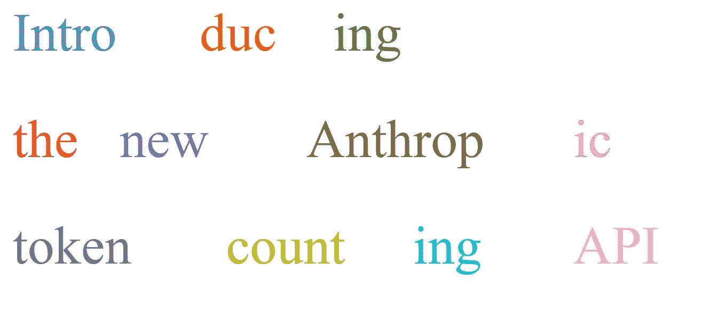

# 推出新的 Anthropic 令牌计数 API

> 原文：[`towardsdatascience.com/introducing-the-new-anthropic-token-counting-api-5afd58bad5ff?source=collection_archive---------6-----------------------#2024-11-08`](https://towardsdatascience.com/introducing-the-new-anthropic-token-counting-api-5afd58bad5ff?source=collection_archive---------6-----------------------#2024-11-08)

图片来自作者

## 使用 Claude 时，请更密切关注你的成本

 [Thomas Reid](https://medium.com/@thomas_reid?source=post_page---byline--5afd58bad5ff--------------------------------)

·发布于[Towards Data Science](https://towardsdatascience.com/?source=post_page---byline--5afd58bad5ff--------------------------------) ·9 分钟阅读·2024 年 11 月 8 日

--

Anthropic 最近几天发布了一些令人兴奋的 Beta 功能，这些功能在很大程度上未被注意到。其中一项功能是能够使用其模型处理 PDF，现在这些模型能够理解 PDF 文档中的文本和视觉内容。我可能会在稍后的时间写一篇关于这方面的文章。

另一个令人兴奋的 Beta 功能，也是本文的主题，是引入了令牌计数功能。关键是，在将内容发送给 Claude 之前，你可以计算用户消息、PDF 和图像中的令牌数量。对于那些喜欢密切监控令牌使用成本的人来说，这是一个好消息。

根据 Anthropic 的官方公告（链接[在这里](https://docs.anthropic.com/en/docs/build-with-claude/token-counting)），

> “令牌计数端点接受与创建消息相同结构的输入列表，包括支持系统提示、工具、图像和 PDF。响应包含输入令牌的总数。”

并支持以下模型，

> “Claude 3.5 叙事诗
> 
> Claude 3.5 俳句
> 
> Claude 3 俳句
> 
> Claude 3 大作”
