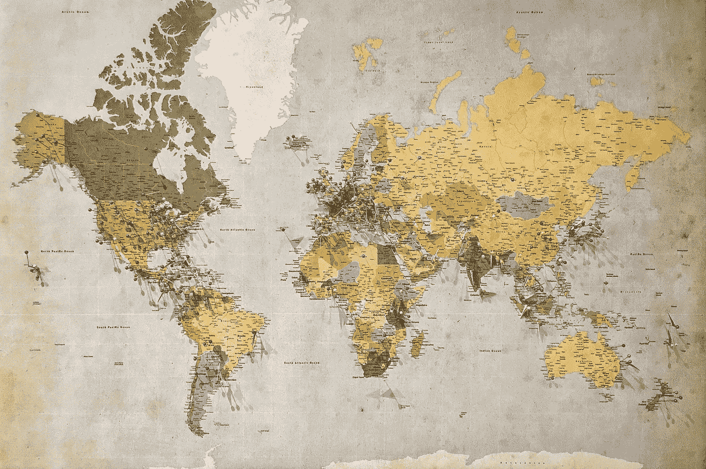

# 介绍 tmap 用于可视化和数据分析

> 原文：[`towardsdatascience.com/introducing-tmap-for-visualization-and-data-analysis-82c51cd17632?source=collection_archive---------7-----------------------#2024-02-24`](https://towardsdatascience.com/introducing-tmap-for-visualization-and-data-analysis-82c51cd17632?source=collection_archive---------7-----------------------#2024-02-24)

## 对 R 中用于地理空间数据探索的 tmap 库的简要介绍。

 [Gustavo R Santos](https://gustavorsantos.medium.com/?source=post_page---byline--82c51cd17632--------------------------------)

·发表于[Towards Data Science](https://towardsdatascience.com/?source=post_page---byline--82c51cd17632--------------------------------) ·11 分钟阅读·2024 年 2 月 24 日

--

图片来自[Andrew Stutesman](https://unsplash.com/@drwmrk?utm_content=creditCopyText&utm_medium=referral&utm_source=unsplash)，来源：[Unsplash](https://unsplash.com/photos/blue-green-and-yellow-world-map-l68Z6eF2peA?utm_content=creditCopyText&utm_medium=referral&utm_source=unsplash)

# 介绍

不是每个数据科学家都需要在 Python 和 R 之间做出选择。我经常看到围绕这个话题的讨论，其中一些让人烦恼，另一些则相当有趣。但事实是，会有很多数据科学家能够使用这两种语言，因为他们不需要部署任何东西或将整个应用程序上线。他们只需要分析一些数据，并创建一个简单的执行报告，当然也可以用传统的 PowerPoint 来展示。

最近，我需要做这件事。我必须获取一些包含*纬度*和*经度*信息的数据点，分析这些点，并做出一个好的数据故事，详细展示我的洞察。

我得说，我喜欢用 R 工作。我认为这个语言容易编程，而且包也做得非常好。我的宝藏库之一就是`tmap`库。

> 我的宝藏库之一是`**tmap**`**。

**Thematic Map**，简称`tmap`，是一个在 R 语言中构建的库，用于处理空间数据，名称中的*thematic*意味着我们可以通过自定义和可视化数据来进行…
