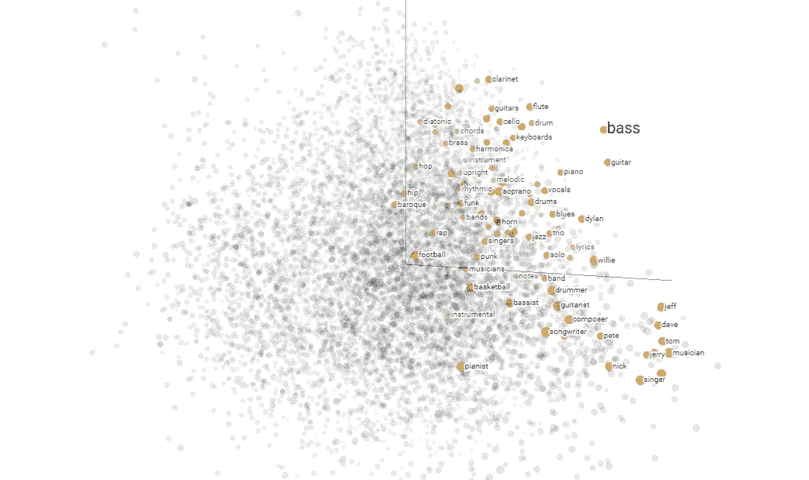
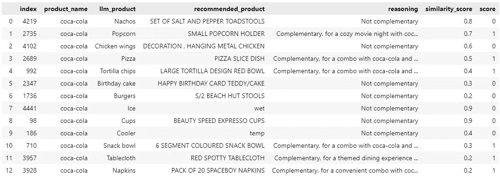

# 介绍 zeroCPR：寻找互补产品的一种方法

> 原文：[`towardsdatascience.com/introducing-zerocpr-an-approach-to-finding-complementary-products-20f2b98c5d03?source=collection_archive---------8-----------------------#2024-07-15`](https://towardsdatascience.com/introducing-zerocpr-an-approach-to-finding-complementary-products-20f2b98c5d03?source=collection_archive---------8-----------------------#2024-07-15)

## 推荐系统

## 当前的机器学习模型可以推荐相似产品，但互补产品呢？

[](https://medium.com/@ardito.bryan?source=post_page---byline--20f2b98c5d03--------------------------------)[](https://towardsdatascience.com/?source=post_page---byline--20f2b98c5d03--------------------------------) [Michelangiolo Mazzeschi](https://medium.com/@ardito.bryan?source=post_page---byline--20f2b98c5d03--------------------------------)

·发表于 [Towards Data Science](https://towardsdatascience.com/?source=post_page---byline--20f2b98c5d03--------------------------------) ·9 分钟阅读·2024 年 7 月 15 日

--

*完整的 zeroCPR 代码是开源的，可以在我的* [*Github 仓库*](https://github.com/atlantis-nova/zeroCPR) 上找到。

在**AI 推荐系统**领域，机器学习模型已广泛应用于推荐**相似样本**，无论是产品、内容，甚至是推荐相似的联系人。这些预训练模型大多数是开源的，可以直接使用，而无需从头开始训练模型。然而，由于缺乏大数据，我们没有任何可以依赖的开源技术来推荐互补产品。

在以下文章中，我提出了一个框架（以**用户友好型库**的形式提供代码），利用大语言模型（LLM）以一种不昂贵的方式发现互补产品。

我介绍这个框架的目标是：

+   **可扩展**

    这是一个框架，运行时不需要监督，不容易出错，输出应易于结构化，以便与其他工具结合使用。

+   **经济实惠**

    它应该足够经济实惠，可以以**最低花费（大约 1 美元每 1000 个计算产品——使用 Groq 定价）**找到成千上万产品的互补品，此外，不需要任何微调（这意味着它甚至可以在单一产品上进行测试）。

****如需支持或功能请求，请随时与我联系。在本文中，我介绍了框架（及其相应的库）* ***zeroCPR*** *以及一种新的提示技术，我称之为* ***Chain-of-DataFrame*** *，用于列表推理。*

# 理解问题

在深入研究 zeroCPR 框架的理论之前，让我们先理解一下为什么当前的技术在这一领域受到限制：

## 为什么神经网络在推荐相似产品方面表现突出？

这些模型在这一任务中表现出色，因为神经网络天生会将具有相似特征的样本分组到同一个空间区域。简而言之，举例来说，如果一个神经网络在人的语言上进行训练，它会将具有**相似意义**的单词或句子分配到同一个空间区域。按照同样的原理，如果在客户行为上进行训练，具有相似行为的客户将被安排到相似的空间区域。



嵌入可视化，图片来源：[`projector.tensorflow.org/`](https://projector.tensorflow.org/)

能够推荐相似句子的模型被称为语义模型，它们既**轻便又易于使用**，可以创建基于**语言相似性**而非客户行为的推荐系统。

缺乏客户数据的零售公司可以通过利用语义模型的能力轻松推荐相似产品。

## 那么，互补产品呢？

然而，推荐**互补产品**是一个完全不同的任务。据我所知，**没有开源模型**能够完成这样的任务。零售公司基于自己的数据训练定制的互补推荐系统，导致这些模型难以泛化，并且是行业特定的。

# zeroCPR 框架

**zeroCPR**代表**零-shot 互补产品推荐系统**。其工作原理很简单。通过接收**可用产品列表**和**参考产品**，它试图找出在你的列表中是否有可以推荐的互补产品。

大型语言模型（LLM）可以轻松推荐互补产品。你可以要求 ChatGPT 输出哪些产品可以与牙刷搭配，它很可能会推荐**牙线**和**牙膏**。

然而，我的目标是创建一个**企业级工具**，能够与我们的自定义数据协作。ChatGPT 可能是正确的，但它生成的是一个无法与我们的产品列表集成的非结构化输出。

**zeroCPR 框架**可以概述如下，我们对每个产品应用以下 3 个步骤：


zeroCPR 框架，图片由作者提供

## 1\. 列出互补产品

如前所述，首先需要解决的瓶颈是找到实际的互补产品。由于相似性模型不可行，我们需要使用 LLM。第一步的执行非常简单。给定一个**输入产品（例如可口可乐）**，生成一个用户可能购买的有效互补产品列表。

我已经要求 LLM 使用 Python 输出一个完全可解析的列表：一旦解析完成，我们就可以可视化输出结果。


有效补充产品列表，图片来源：作者

结果其实并不差：这些都是很可能与**可口可乐（Coca-Cola）**一起购买的产品。然而，有一个小问题：这些产品**可能不在我们的数据中**。

## 2\. 匹配我们数据中的可用产品

下一步是尝试将 LLM 建议的每个补充产品与我们数据集中的相应产品匹配。例如，我们想将“玉米片（Nachos）”与我们数据集中最接近的产品进行匹配。

我们可以使用向量搜索来执行这种匹配。对于每个 LLM 产品，我们将与数据集中语义上最相似的产品进行匹配。


相似度匹配，图片来源：作者

如我们所见，结果远非准确。**“玉米片（Nachos）”**将与**“盐和胡椒蘑菇套装（SET OF SALT AND PEPPER TOADSTOOLS）”**匹配，而与**“汉堡（Burgers）”**最接近的匹配是**“沙滩小屋凳子（S/2 BEACH HUT STOOLS）”**。其中一些匹配是有效的（例如餐巾纸），但如果没有有效的匹配，语义搜索仍然会将其与一个无关的候选项匹配。根据经验，使用**余弦相似度阈值**来选择有效的匹配是一种糟糕的方法。相反，我将再次使用 LLM 来验证数据。

## 3\. 使用数据框链（Chain-of-DataFrame）选择正确的补充产品

现在的目标是验证上一步的匹配结果。我第一次尝试将 LLM 推荐的产品进行匹配时，由于输出缺乏一致性，我感到非常沮丧。尽管是一个 70B 的模型，当我传入一个待匹配的产品列表时，输出结果却不尽如人意（格式上有错误，并且输出非常不现实）。

然而，我注意到，通过输入一系列产品并要求模型对每个样本进行**推理**并**输出一个分数（0 或 1）**：（遵循 pandas 数据框的格式，并对单列应用转换），模型在格式和输出上要可靠得多。我称这种提示方法为数据框链（Chain-of-Dataframe），这是对广为人知的 pandas 数据结构的参考：


数据框链（Chain-of-DataFrame），图片来源：作者

为了给你展示数据框链提示的思路。在下面的示例中，**{product_name}** 是可口可乐（Coca-Cola），而**{complementary_list}** 则是下图中我们可以看到的名为“recommended_product”的**列**：

```py
A customer is doing shopping and buys the following product
product_name: {product_name}

A junior shopping expert recommends the following products to be bought together, however he still has to learn:
given the following
complementary_list: {complementary_list}

Output a parsable python list using python, no comments or extra text, in the following format:
[
    [<product_name 1>, <reason why it is complementary or not>, <0 or 1>],
    [<product_name 2>, <reason why it is complementary or not>, <0 or 1>],
    [<product_name 3>, <reason why it is complementary or not>, <0 or 1>],
    ...
]
the customer is only interested in **products that can be paired with the existing one** to enrich his experience, not substitutes
THE ORDER OF THE OUTPUT MUST EQUAL THE ORDER OF ELEMENTS IN  complementary_list

Take it easy, take a big breath to relax and be accurate. Output must start with [, end with ], no extra text
```

输出是一个多维列表，可以轻松解析，并立即转换回**pandas 数据框**。



数据框链输出（Chain-of-Dataframe），图片来源：作者：Michelangiolo Mazzeschi

注意模型生成的**推理**和**分数**列，用于找到**最佳补充产品**。通过这一步骤，我们能够筛选出大多数无关的匹配项。

***该算法可能看起来与[CHAIN-OF-TABLE: EVOLVING TABLES IN THE REASONING CHAIN FOR TABLE UNDERSTANDING](https://arxiv.org/pdf/2401.04398)相似，但我认为上面提出的算法要简单得多，并使用了不同的结构。如果你有不同的看法，欢迎评论。

## 4\. 处理少量数据：最近替代品填充

有**一个最后需要解决的问题**。由于数据不足，推荐的产品数量可能非常少。在上面的示例中，我们可以推荐 6 个互补产品，但可能会出现只推荐 2 或 3 个的情况。在数据受限的情况下，我们如何改善用户体验，并扩展有效推荐的数量呢？


最近替代品填充，图片来源：作者

我想到的一个解决方案，像往常一样，十分简单。zeroCPR 的输出是所有互补产品（如上图中的第一行所示）。为了填补缺失的推荐项，我们可以通过语义相似性找到每个互补产品的 k 个替代品。

# 运行 zeroCPR 引擎

您可以参考以下[示例笔记本](https://github.com/atlantis-nova/zeroCPR/blob/main/notebooks/example_notebook.ipynb)来顺利运行代码：克隆整个代码库并保持文件结构，笔记本应当自动调整至正确路径并运行。

在这个代码库中，我使用了来自[以下 Kaggle 数据集](https://www.kaggle.com/datasets/ramzanzdemir/online-retail-gift-products)的产品列表。列表中的产品越多，搜索准确的机会就越大。目前，库仅支持[GroqCloud](https://groq.com/)。

同时，请记住，框架在 70B 模型上表现良好，并没有设计或测试以与小型语言模型（例如 llama3-8B）在性能上匹配。

```py
from zeroCPR import engine

# initiate engine
myagent = engine.agent(groq_api_key='<your_api_key>')
```

下一步是准备一个产品列表（以 Python 列表格式）。

```py
df = pd.read_excel('notebooks/df_raw.xlsx')
product_list = list(set(df['Description'].dropna().tolist()))
product_list = [x for x in product_list if isinstance(x, str)]
product_list = [x.strip() for x in product_list]
product_list

>>>
['BLACK AND WHITE PAISLEY FLOWER MUG',
 'ASSORTED MINI MADRAS NOTEBOOK',
 'VICTORIAN METAL POSTCARD CHRISTMAS',
 'METAL SIGN EMPIRE TEA',
 'RED WALL CLOCK',
 'CRYSTAL KEY+LOCK PHONE CHARM',
 'MOTORING TISSUE BOX',
 'SILK PURSE RUSSIAN DOLL PINK',
 'VINTAGE SILVER TINSEL REEL',
 'RETRO SPOT TRADITIONAL TEAPOT',
...
```

该库利用了[sentence-transformers](https://sbert.net/)来将列表编码为向量，因此您无需自己实现此功能：

```py
df_encoded = myagent.encode_products(product_list)

>>>
100%|██████████| 4678/4678 [02:01<00:00, 38.47it/s]
```

## 查找单个产品的互补项

这个功能是为了测试引擎在单个产品上的表现（这是一个非常廉价的测试，但结果令人印象深刻）。

```py
df_candidates, df_filtered = myagent.find_product_complementaries(['pizza'])
display(df_filtered)
```


单个商品的互补产品，图片来源：作者

## 查找列表的互补项

整个库的核心包含在这个函数中。该代码对一个列表运行前述的功能（它可以包含 10 个，甚至 1000 个产品），并构建一个包含所有互补产品的数据框。之所以这个函数与前一个不同，不仅因为它可以接受列表作为输入（否则我们可以简单地在前一个库中使用一个 for 循环）。

```py
df_complementaries = myagent.find_product_complementaries(product_list[50:60])

>>>
** SET 3 WICKER LOG BASKETS
** FUNKY GIRLZ ASST MAGNETIC MEMO PAD
** BLACK GEMSTONE BRACELET
ERR
** TOY TIDY PINK POLKADOT
** CROCHET WHITE RABBIT KEYRING
** MAGNETS PACK OF 4 HOME SWEET HOME
** POPCORN HOLDER , SMALL
** FLOWER BURST SILVER RING GREEN
** CRYSTAL DIAMANTE EXPANDABLE RING
** ASSORTED EASTER GIFT TAGS
```

由于我们在处理大型语言模型（LLM），这个过程有时可能会失败：我们不能让这个不便打破代码。这个函数被设计为对每个样本进行反复试验和错误的迭代过程。正如你从输出中看到的，当尝试为“黑色宝石手链”寻找互补产品时，第一次迭代失败了（可能是因为**解析错误**，或者可能是**HTTPS 请求失败**）。

该管道被设计为在放弃一个产品并继续下一个之前，最多尝试 5 次。


最终输出：输入产品的互补列表，图片来自作者

在这个过程的结束时，我将输出的数据框保存到一个文件中。

```py
df_complementaries.to_parquet('notebooks/df_complementaries.parquet', index=None)
```

# 享受吧！

这个库旨在解决在缺乏数据的情况下寻找互补产品的问题，这是新兴企业中常见的难题。结合其主要目标，它还展示了如何在结构化数据上使用大型语言模型，而不需要繁琐的提示调优。

拥有数据的企业与刚刚起步的企业之间存在巨大的差距。这类算法的目标是缓解这种差异，甚至让小型初创公司也能访问到企业级技术。

这是我基于最新实验之一开发的第一个开源库之一。带着一些好运，这个库有可能成长为一个更大的项目，吸引更多用户。我希望你喜欢这篇文章，且提供的代码能为你提供帮助。祝你好运！
