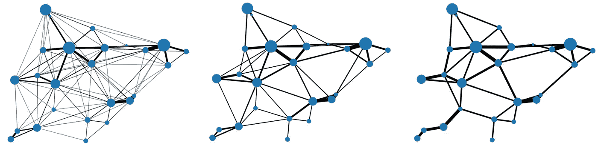

# 《利用混合整数规划优化航空旅行网络简介》

> 原文：[`towardsdatascience.com/introduction-0dd288ba9738?source=collection_archive---------7-----------------------#2024-02-18`](https://towardsdatascience.com/introduction-0dd288ba9738?source=collection_archive---------7-----------------------#2024-02-18)

## 如何设计一种算法，以最具成本效益的方式在网络中安排乘客需求

 [Rohan Nanda](https://medium.com/@rohan2465?source=post_page---byline--0dd288ba9738--------------------------------)

·发表于[Towards Data Science](https://towardsdatascience.com/?source=post_page---byline--0dd288ba9738--------------------------------) ·阅读时长 8 分钟·2024 年 2 月 18 日

--

# **简介：**

这是一个关于车辆路径问题的变种，但它被调整为适应航空运输网络，即**起始地到目的地**问题。

图片由[NASA](https://unsplash.com/@nasa?utm_source=medium&utm_medium=referral)提供，来源：[Unsplash](https://unsplash.com/?utm_source=medium&utm_medium=referral)

首先一点背景：航空公司常常面临如何解决城市间需求的问题——是开设直飞航班，还是提供中转航程，使得需求通过一个或多个枢纽进行疏导？从乘客的角度来看，后者当然更可取，但对航空公司来说，这样做成本更高，因此风险也更大——如果航班没有满员怎么办？运营一条航线非常昂贵。换句话说，我们正在尝试做这个*：

图 1：我们试图解决的问题的示意图。左侧是起始地-目的地（OD）需求，而右侧是航程（带有相关的流量路由），可以看作是市场对需求的响应。

**图论爱好者会将其视为图稀疏化问题的一个特殊案例，最近这个问题受到了相当多的关注。*

该行业通常使用所谓的行程选择模型来解决这个问题，这些模型仅仅是概率模型，用于根据连接数、路线长度、飞行时间等因素来确定乘客偏好的路线……当网络形态已经固定时，这种方法效果很好，但决定开通哪些路线就更加复杂了。这是因为有一些路线只有在能够吸引来自其他来源的足够连接流量时才是可行的——而这一点只有在没有直接路线能够服务该流量时才能发生。换句话说，每条路线的状态取决于其邻近路线的状态，从而将问题转化为一个组合优化问题。

这正是混合整数规划（MIP）设计用来解决的问题！具体来说，我们将提出一个问题，反映以下行为：**网络流量守恒**和**边激活成本以强制稀疏化。**

# 简单问题：

在本文的其余部分，我将使用一个简单的示例进行说明。为了完全描述这个问题，我们需要以下输入：

## **输入图：**

一个密集的起点-终点双向图 ***G = (V, E)***，其中 ***n*** 是顶点 ***V*** 的数量，***m*** 是边 ***E*** 的数量。每条边都有起点-终点需求（***O****）* 和每对城市间的距离（***Distance***）作为属性。通常，需求遵循帕累托分布，即少数边具有高需求，而其余边具有低需求*：

图 2：输入需求图（左）和按边分布的需求（右）

**通过随机实例化节点的坐标及其人口生成的图。使用所谓的引力模型进行运输，可以获得一个现实的需求曲线。更多信息，请参见* [*链接*](https://www.princeton.edu/~alaink/Orf467F12/The%20Gravity%20Model.pdf)**

## 成本假设：

根据边的距离和将分配的典型车辆类型，每条边将具有以下成本属性：

+   每位乘客的成本，***Costₚₐₓ***，其中 pax 是乘客的缩写。实际上，应该考虑的是每座位的成本，而不是每乘客的成本，因为并不是每辆车都一定是满员的。然而，这将需要对每辆车进行离散建模（并且需要一个相关的整数变量），这会导致问题规模急剧增大。

+   操作一条路线的最小成本，***Costₘᵢₙ***。可以将其视为边激活成本。

请记住，***Costₚₐₓ*** 和 ***Costₘᵢₙ*** 都是 *m × 1* 向量（每条边一个），且两者的成本都与距离成线性比例关系。

有了这些，我们就具备了设计 MIP 所需的所有条件。如你所猜测的那样，目标是最小化系统的成本函数，同时遵守网络流量约束。

# **网络流量守恒**

这是一个著名的条件，表明每个顶点的流入和流出必须平衡，除非它是源点或汇点：

这里的 ***(i, j, k)*** 是顶点索引。个人而言，我并不太喜欢这种表示方法，更喜欢使用图论中的边关联矩阵概念来表达等效的公式。通常，边关联矩阵用 *n × m* 的矩阵 ***B*** 来表示，其中每一行的条目除对应边的关联顶点外，其它均为零，关联顶点的值为 1 和 -1，分别表示源点和汇点：

如果我们初始化一个 *m × m* 的变量矩阵（我们称之为 ***R***，表示行程路线——见图 1）来表示 ***G*** 中每个需求边的流量路线，我们可以等价地通过以下方式来表达上述条件：

其中，***diag(O)*** 是一个 *m × m* 矩阵，其每个对角线元素对应于边 *i* 的需求。如果你展开右侧任意一行 *i*，立刻就能明白为什么任何满足这个方程的 ***R*** 从流量守恒的角度来看是有效的。

但是需要注意的是，***B*** 和 ***R*** 都是有方向的。在我们的成本函数的背景下，我们并不关心某些流量是否为负值——我们只关心边 *i* 上流动的乘客的绝对总数，以便量化运输它们的费用。为了表示这一点，我们可以定义 *m × 1* 的腿向量 ***L***：

有了这些定义，我们得到了一个与网络流量守恒原理兼容的函数映射 ***O → L***。从此以后，***L*** 代表每条边上的总乘客流量。

# 边激活

这就是问题的核心！考虑到如果 ***费用ₘᵢₙ=0***，解决方案将是显而易见的，***L*** 将与 ***O*** 一一对应映射。因为任何替代路线都必然比直线路程更长，所以最便宜的选择总是后者。然而，在存在 ***费用ₘᵢₙ*** 的情况下，存在一个权衡，即长途旅行带来的 ***△费用*** 与通过激活边所带来的 ***△费用***。换句话说，我们需要每条边的费用配置文件为：

图 3：带有边激活费用的成本函数示意图

这个函数有 3 部分：

+   如果乘客数量为零，则不产生任何费用（***费用*** ***=*** 0***）***

+   如果乘客数量在 0 和阈值之间，无论乘客数量是多少，都会产生固定费用（***费用*** ***=*** ***Cₘᵢₙ***）。

+   如果乘客数量超过阈值，费用将根据每位乘客的成本线性增长（***费用 = Cₚₐₓ.L***）

如果不是因为零点不连续性，这将是一个相当简单的问题可以解决。然而，实际上我们遇到了一个非凸组合优化问题，因为在某些边上，乘客数量是零与否会导致行为的突然变化。在这种情况下，我们需要一个激活（即二进制）变量来告诉算法应遵循哪种条件。使用大 M 法，我们可以将其表述如下：

其中，*m × 1* 的二进制变量***z***（即***z ∈ [0,1]***）表示某条路线是否开放，以及一个非常大的标量变量***M***。如果你不熟悉大 M 法，可以在[这里](https://en.wikipedia.org/wiki/Big_M_method)了解。在这个上下文中，它仅仅是强制执行以下条件：

+   ***Lᵢ = 0*** *→* ***zᵢ=0***

+   ***Lᵢ >0*** *→* ***zᵢ=1***

理想情况下，我们希望通过简单地将成本函数与这个激活变量相乘来指示应遵循哪种成本行为。然而，这样会使约束变为非线性，解起来非常复杂。相反，我们可以再次使用大 M 法，这次将问题线性化，同时达到相同的效果：

将成本最小化目标与≥不等式结合，我们基本上得到了一个 minmax 问题，其中：

+   ***zᵢ=0 → Costᵢ = minmax(0, -M) = 0***。

+   ***zᵢ=1 → Costᵢ = minmax(Cₘᵢₙ, CₚₐₓL)***。

就是这样！问题的完整公式如下：

我们现在只需要输入一些数字，就能看到这个“魔法”的发生。

# 对最小阈值的敏感性

从描述中应该可以清楚看出，最小阈值是这里的主要关注点，因为它定义了稀疏化的程度。看到逐渐提高阈值的影响非常有趣：

图 4：从左到右，应用低、中和高阈值对边缘成本的影响

请注意，无论阈值如何，图形始终保持连接——这是网络流量守恒原理的结果，确保所有需求都能得到满足。另一种形象化的方法是观察沿边的需求分布：

图 5：输入成本函数与输出流量分布的低、中和高阈值

在这里，我们可以看到阈值越高，整合的程度越高（更少的路线有更大的交通流量），同时对应有更多的没有流量的路线。

# 结论

这只是一个简单的介绍，实际上这是一个非常复杂的问题（航空公司网络的复杂性远不止最低阈值成本）。尽管如此，它展示了真实网络的核心行为之一，同时为制定整数线性规划（MIPs）问题提供了一些关键概念的基本介绍。相关代码可以在我的[Github](https://github.com/rn306/OD-to-LEG)上找到，欢迎尝试。

如果你尝试运行它，你很快就会注意到，求解时间会随着图中顶点数量的增加而呈指数级增长。特别是当你使用 cvxpy——一个常见的（但基础的）开源 Python 库用于简单优化问题时，情况尤为明显。尽管如此，即便是复杂的商业求解器也很快会遇到它们的极限。这是组合优化问题的不可避免的真相；它们扩展性差，且在问题规模超出一定范围后往往不再实用。

在下一篇文章中，我将介绍一种方法，通过使用图神经网络作为代理模型，尝试抽象化一些复杂性。

*除非另有说明，否则所有图片均由我，作者本人提供。*
