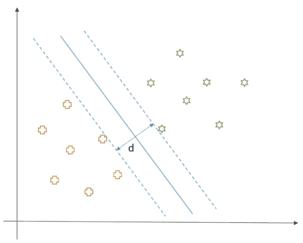

# 支持向量机简介——动机与基础

> 原文：[`towardsdatascience.com/introduction-to-support-vector-machines-motivation-and-basics-920e4c1e22e0?source=collection_archive---------5-----------------------#2024-08-10`](https://towardsdatascience.com/introduction-to-support-vector-machines-motivation-and-basics-920e4c1e22e0?source=collection_archive---------5-----------------------#2024-08-10)

## *学习使支持向量机成为强大线性分类器的基本概念*

 [Rishabh Misra](https://medium.com/@rishabh_misra_?source=post_page---byline--920e4c1e22e0--------------------------------)

·发表于 [Towards Data Science](https://towardsdatascience.com/?source=post_page---byline--920e4c1e22e0--------------------------------) ·阅读时长：8 分钟·2024 年 8 月 10 日

--

支持向量机的分类技术在实际中的应用

# 简介

在这篇文章中，你将学习支持向量机（SVM）的基础知识，SVM 是一种备受推崇的监督式机器学习算法。

> *这项技术应该是每个人工具包中的一部分，尤其是那些有志成为数据科学家的人。*

因为有很多内容要学习，所以我将通过两篇文章向你介绍支持向量机，这样你可以在两篇文章之间休息一下，喝杯咖啡 :)

# 动机

首先，让我们尝试在二分类问题的背景下理解支持向量机的动机。在二分类问题中，我们的数据属于两个类别，我们试图找到一个决策边界，将数据分成这两个类别，同时尽量减少错误。请看下面的图示，它代表了我们（假设的）数据在二维平面上的分布。如我们所见，数据被分成了两类：加号和星号。

注：为了简单起见，我们目前只考虑线性可分的数据，并将学习非线性可分的数据……
