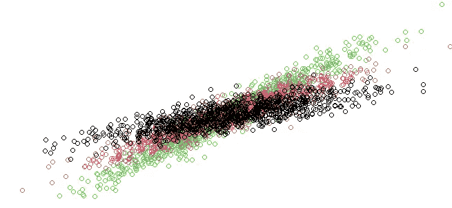

# 使用 R 进行回归的有限正态混合模型介绍

> 原文：[`towardsdatascience.com/introduction-to-the-finite-normal-mixtures-in-regression-with-6a884810a692?source=collection_archive---------7-----------------------#2024-11-15`](https://towardsdatascience.com/introduction-to-the-finite-normal-mixtures-in-regression-with-6a884810a692?source=collection_archive---------7-----------------------#2024-11-15)

## 如何使线性回归足够灵活以处理非线性数据

[](https://medium.com/@lukaszgatarek81?source=post_page---byline--6a884810a692--------------------------------)[](https://towardsdatascience.com/?source=post_page---byline--6a884810a692--------------------------------) [Lukasz Gatarek](https://medium.com/@lukaszgatarek81?source=post_page---byline--6a884810a692--------------------------------)

·发表于[Towards Data Science](https://towardsdatascience.com/?source=post_page---byline--6a884810a692--------------------------------) ·阅读时长 8 分钟·2024 年 11 月 15 日

--

线性回归通常被认为不够灵活，无法处理非线性数据。从理论角度来看，它无法应对这些数据。然而，通过在回归模型中使用有限正态混合模型，我们可以使其适用于任何数据集。这样，它就成为一个非常强大的机器学习工具，可以应用于几乎任何数据集，甚至是高度非正态且变量间具有非线性依赖的数据集。

这种方法特别有趣的地方在于其可解释性。尽管具有极高的灵活性，所有检测到的关系都可以直接解释。该模型与神经网络一样具有普适性，但它并不会变成一个黑盒子。你可以读取这些关系，并理解各个变量的影响。

在这篇文章中，我们展示了如何使用马尔可夫链蒙特卡洛（MCMC）采样来模拟回归的有限混合模型。我们将生成具有多个成分（组）的数据，并拟合一个混合模型，通过贝叶斯推断来恢复这些成分。这个过程涉及回归模型和混合模型，并结合 MCMC 技术进行参数估计。



数据模拟为三个线性回归的混合

# 加载所需的库

我们首先加载必要的库，以便处理回归模型、MCMC 和多元分布。

```py
# Loading the required libraries for various functions
library("pscl")         # For pscl specific functions, like regression models
library("MCMCpack")     # For MCMC sampling functions, including posterior distributions
library(mvtnorm)        # For multivariate normal distribution functio
```

+   **pscl**：用于各种统计功能，如回归模型。

+   **MCMCpack**：包含用于贝叶斯推断的函数，特别是 MCMC 采样。

+   **mvtnorm**：提供了处理多变量正态分布的工具。

# 数据生成

我们模拟一个数据集，其中每个观测值属于多个组之一（混合模型的组分），响应变量是使用回归模型生成的，并且具有随机系数。

我们考虑一个使用 G 个正态混合组件的回归模型的通用设置。


```py
## Generate the observations
# Set the length of the time series (number of observations per group)
N <- 1000
# Set the number of simulations (iterations of the MCMC process)
nSim <- 200
# Set the number of components in the mixture model (G is the number of groups)
G <- 3
```

+   **N**：每组的观测数。

+   **nSim**：MCMC 迭代次数。

+   **G**：混合模型中组件（组）的数量。

## 数据模拟

每个组都使用单变量回归模型进行建模，其中解释变量（X）和响应变量（y）是从正态分布中模拟出来的。`betas`表示每个组的回归系数，`sigmas`表示每个组的方差。

```py
# Set the values for the regression coefficients (betas) for each group
betas <- 1:sum(dimG) * 2.5  # Generating sequential betas with a multiplier of 2.5
# Define the variance (sigma) for each component (group) in the mixture
sigmas <- rep(1, G) / 1  # Set variance to 1 for each component, with a fixed divisor of 1
```

+   **betas**：这些是回归系数。每个组的系数会依次分配。

+   **sigmas**：表示混合模型中每个组的方差。

在这个模型中，我们允许每个混合组分拥有自己的方差参数和回归参数集。

## 组分配和混合

然后我们使用随机分配模拟每个观测值的组分配，并将所有组件的数据混合在一起。

我们通过一组组件标签向量来扩展模型，以表示


其中


因此，*z_gi=1* 表示第*i*个个体来自混合模型的第*g*个组分。

这种随机分配形成了`z_original`向量，表示每个观测值所属的真实组。

```py
# Initialize the original group assignments (z_original)
z_original <- matrix(NA, N * G, 1)
# Repeat each group label N times (assign labels to each observation per group)
z_original <- rep(1:G, rep(N, G))
# Resample the data rows by random order
sampled_order <- sample(nrow(data))
# Apply the resampled order to the data
data <- data[sampled_order,]
```

# 贝叶斯推断：先验分布与初始化

我们为回归系数和方差设置了先验分布。这些先验将指导我们的贝叶斯估计。


```py
## Define Priors for Bayesian estimation# Define the prior mean (muBeta) for the regression coefficients
muBeta <- matrix(0, G, 1)# Define the prior variance (VBeta) for the regression coefficients
VBeta <- 100 * diag(G)  # Large variance (100) as a prior for the beta coefficients# Prior for the sigma parameters (variance of each component)
ag <- 3  # Shape parameter
bg <- 1/2  # Rate parameter for the prior on sigma
shSigma <- ag
raSigma <- bg^(-1)
```

+   **muBeta**：回归系数的先验均值。我们将其设置为所有组的 0。

+   **VBeta**：先验方差，值较大（100），以允许回归系数有较大的灵活性。

+   **shSigma** 和 **raSigma**：每个组的方差（sigma）的先验分布的形状和速率参数。

对于组件指示符和组件概率，我们考虑以下先验分配。


多项式先验 M 是二项分布的多变量推广，而 Dirichlet 先验 D 是贝塔分布的多变量推广。

# MCMC 初始化

在本节中，我们通过设置矩阵来初始化 MCMC 过程，以存储回归系数、方差和混合比例的样本。

```py
## Initialize MCMC sampling# Initialize matrix to store the samples for beta
mBeta <- matrix(NA, nSim, G)# Assign the first value of beta using a random normal distribution
for (g in 1:G) {
  mBeta[1, g] <- rnorm(1, muBeta[g, 1], VBeta[g, g])
}# Initialize the sigma² values (variance for each component)
mSigma2 <- matrix(NA, nSim, G)
mSigma2[1, ] <- rigamma(1, shSigma, raSigma)# Initialize the mixing proportions (pi), using a Dirichlet distribution
mPi <- matrix(NA, nSim, G)
alphaPrior <- rep(N/G, G)  # Prior for the mixing proportions, uniform across groups
mPi[1, ] <- rdirichlet(1, alphaPrior)
```

+   **mBeta**：用于存储回归系数样本的矩阵。

+   **mSigma2**：用于存储每个组方差（sigma 平方）的矩阵。

+   **mPi**：用于存储混合比例的矩阵，通过 Dirichlet 分布初始化。

# MCMC 采样：后验更新

如果我们在组件指示变量 z 的值上进行条件化，则条件似然可以表示为


在 MCMC 采样循环中，我们基于后验分布更新组分配（`z`）、回归系数（`beta`）和方差（`sigma`）。计算每个组分配的似然，并选择具有最高后验概率的组。

以下完整的后验条件可以得到：


其中


表示后验中的所有参数，除了*x*。


其中，*n_g* 表示混合模型中第 *g* 个组的观测数。


和


以下算法按照顺序从上面的后验分布系列中提取样本。

```py
## Start the MCMC iterations for posterior sampling# Loop over the number of simulations
for (i in 2:nSim) {
  print(i)  # Print the current iteration number

  # For each observation, update the group assignment (z)
  for (t in 1:(N*G)) {
    fig <- NULL
    for (g in 1:G) {
      # Calculate the likelihood of each group and the corresponding posterior probability
      fig[g] <- dnorm(y[t, 1], X[t, ] %*% mBeta[i-1, g], sqrt(mSigma2[i-1, g])) * mPi[i-1, g]
    }
    # Avoid zero likelihood and adjust it
    if (all(fig) == 0) {
      fig <- fig + 1/G
    }

    # Sample a new group assignment based on the posterior probabilities
    z[i, t] <- which(rmultinom(1, 1, fig/sum(fig)) == 1)
  }

  # Update the regression coefficients for each group
  for (g in 1:G) {
    # Compute the posterior mean and variance for beta (using the data for group g)
    DBeta <- solve(t(X[z[i, ] == g, ]) %*% X[z[i, ] == g, ] / mSigma2[i-1, g] + solve(VBeta[g, g]))
    dBeta <- t(X[z[i, ] == g, ]) %*% y[z[i, ] == g, 1] / mSigma2[i-1, g] + solve(VBeta[g, g]) %*% muBeta[g, 1]

    # Sample a new value for beta from the multivariate normal distribution
    mBeta[i, g] <- rmvnorm(1, DBeta %*% dBeta, DBeta)

    # Update the number of observations in group g
    ng[i, g] <- sum(z[i, ] == g)

    # Update the variance (sigma²) for each group
    mSigma2[i, g] <- rigamma(1, ng[i, g]/2 + shSigma, raSigma + 1/2 * sum((y[z[i, ] == g, 1] - (X[z[i, ] == g, ] * mBeta[i, g]))²))
  }

  # Reorder the group labels to maintain consistency
  reorderWay <- order(mBeta[i, ])
  mBeta[i, ] <- mBeta[i, reorderWay]
  ng[i, ] <- ng[i, reorderWay]
  mSigma2[i, ] <- mSigma2[i, reorderWay]

  # Update the mixing proportions (pi) based on the number of observations in each group
  mPi[i, ] <- rdirichlet(1, alphaPrior + ng[i, ])
}
```

这段代码执行了 MCMC 中的关键步骤：

+   **组分配更新**：对于每个观测值，我们计算数据属于每个组的似然，并相应地更新组分配。

+   **回归系数更新**：每个组的回归系数使用后验均值和方差进行更新，这些值是根据观察到的数据计算得出的。

+   **方差更新**：每个组的响应变量方差使用逆伽马分布进行更新。

# 结果可视化

最后，我们可视化 MCMC 采样的结果。我们绘制每个回归系数的后验分布，将其与真实值进行比较，并绘制最可能的组分配。

```py
# Plot the posterior distributions for each beta coefficient
par(mfrow=c(G,1))
for (g in 1:G) {
  plot(density(mBeta[5:nSim, g]), main = 'True parameter (vertical) and the distribution of the samples')  # Plot the density for the beta estimates
  abline(v = betas[g])  # Add a vertical line at the true value of beta for comparison
}
```

该图显示了 MCMC 样本（后验分布）如何收敛到回归系数的真实值（`betas`）。

# 结论

通过这个过程，我们展示了如何在回归上下文中使用有限的正态混合模型，并结合 MCMC 进行参数估计。通过模拟具有已知分组的数据，并通过贝叶斯推断恢复参数，我们可以评估我们的模型在多大程度上捕捉到了数据的潜在结构。

*除非另有说明，所有图像均为作者提供。*
