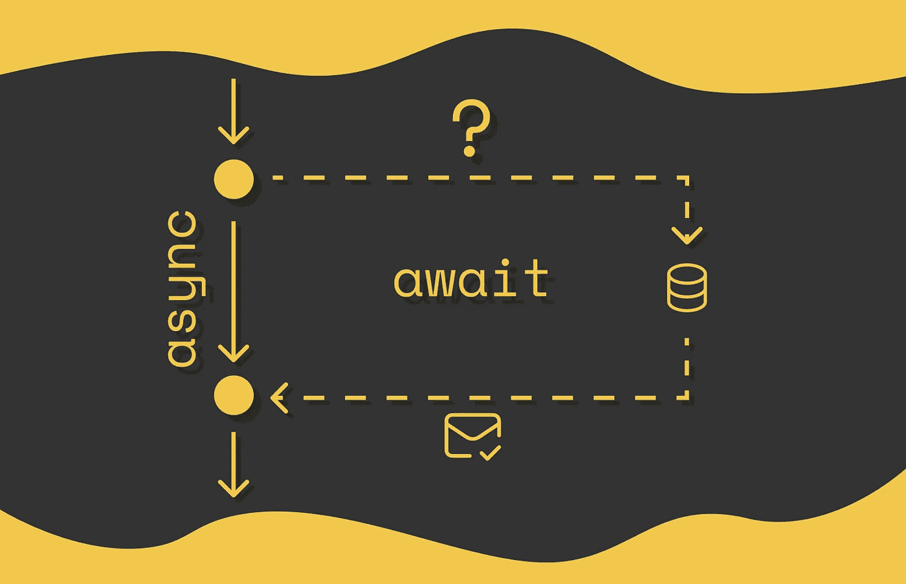

# JavaScript 中 async/await 的直观解释

> 原文：[`towardsdatascience.com/intuitive-explanation-of-async-await-in-javascript-730174c000bd?source=collection_archive---------1-----------------------#2024-09-08`](https://towardsdatascience.com/intuitive-explanation-of-async-await-in-javascript-730174c000bd?source=collection_archive---------1-----------------------#2024-09-08)

## 设计高效数据处理的异步管道

 [Vyacheslav Efimov](https://medium.com/@slavahead?source=post_page---byline--730174c000bd--------------------------------)

·发布于 [Towards Data Science](https://towardsdatascience.com/?source=post_page---byline--730174c000bd--------------------------------) ·阅读时长 10 分钟·2024 年 9 月 8 日

--

> **注意。** 本文假设你已经熟悉回调函数、Promise，并且对 JavaScript 中的异步编程模式有基本的理解。

# 引言

异步机制是 JavaScript 中最重要的概念之一，也是编程中的关键概念。它允许程序在后台独立执行次要任务，而不阻塞当前线程执行主要任务。当次要任务完成时，其结果被返回，程序继续正常运行。在这个背景下，这些次要任务被称为**异步**任务。

**异步任务通常包括向外部环境发送请求，比如数据库、Web API 或操作系统**。如果异步操作的结果不影响主程序的逻辑，那么与其只是等待任务完成，不如充分利用这段时间，继续执行主要任务。

然而，有时候异步操作的结果会立即在后续代码行中使用。在这种情况下，后续的代码行应该在异步操作完成之前不执行…
