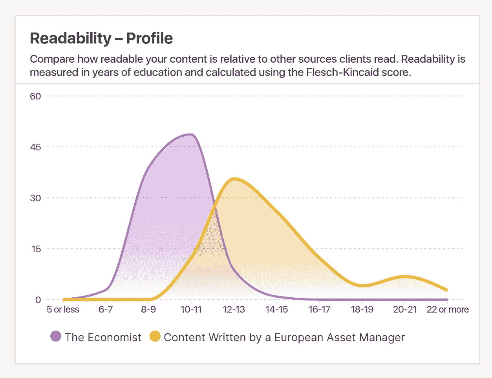
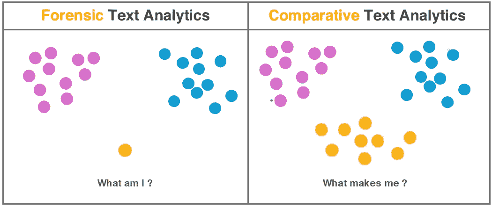
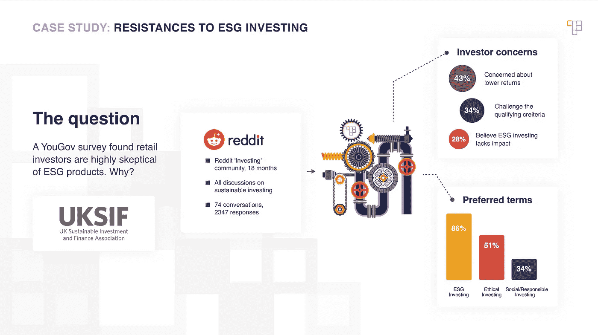

# 复杂写作仅仅是公式吗？

> 原文：[`towardsdatascience.com/is-complex-writing-nothing-but-formulas-289e0a33793f?source=collection_archive---------2-----------------------#2024-12-13`](https://towardsdatascience.com/is-complex-writing-nothing-but-formulas-289e0a33793f?source=collection_archive---------2-----------------------#2024-12-13)

## 文本分析揭示了大量写作是如何产生的

 [Vered Zimmerman](https://medium.com/@vered.t.zimmerman?source=post_page---byline--289e0a33793f--------------------------------)

·发表于[Towards Data Science](https://towardsdatascience.com/?source=post_page---byline--289e0a33793f--------------------------------)·阅读时长 8 分钟·2024 年 12 月 13 日

--

广义上来说，自然语言处理将语言转化为可以有效操作的结构。由于深度学习的嵌入方法已经证明其强大，它们也成为了默认选择：选择一个模型，嵌入数据，选择一个指标，进行一些 RAG 操作。为了创造新的价值，采用一种不同的方式来处理语言会有帮助。

今天我要分享的故事始于多年前，一本书。

*《兰花窃贼》*既是非小说类作品，又充满了恶作剧。我第一次读它是在二十多岁时，跳过了大部分历史轶事，只渴望阅读第一人称的叙述。当时，我大笑不止，但也在安静的愤怒中翻页，感叹有人竟能如此深入地生活，又能写得如此出色。我并不确定这两者是否真的是不同的事物。

一年后，我搬到了伦敦，重新开始。

我进入了金融服务行业，那简直像是为书呆子们准备的主题公园。而且，在接下来的十年里，我只会选择那些需要大量写作的工作。

“很多”是关键词。

在现代化的职业服务外表下，英国工业依然活跃于其古老的工厂和船厂。它雇佣 Alice 来做某项工作，然后交给 Bob；他拧动一些螺丝，再交给 Charlie。一月后，我们又开始了同样的工作。作为一个新来者，我发现这里的习惯不那么像一个会让人掉进去的沟渠，更像是一个可以立足的小山丘。

我也在读很多书。好吧，我读的是*《纽约客》*。我最喜欢的事情就是把一本新杂志翻到封面，倒过来从后面开始阅读其中一篇，作者 Anthony Lane 写的是电影评论。多年来，我从来没有去看过一部电影。

不时地，一个闪光点会让我措手不及。*《纽约客》*语料库和我那些非普利策奖作品之间的微弱联系。在这两个语料库中，每一篇作品都与它的兄弟姐妹不同，但也……*并不完全不同*。相似之处回响。而我知道，我的作品中的相似之处是由一个重复过程产生的。

在 2017 年，我开始冥思苦想，探索那条将*感觉公式化*的写作与能够*明确写出公式*的写作之间的界限。

这个论点是这样的：重复的量暗示了某种（通常是隐性）算法决策的形式。但是过程性重复会留下指纹。追踪这些指纹就能揭示出过程；推测出算法；软件几乎就能自己写出来。

在我的上一份工作中，我不再写大量文章了。是我的软件在写。

企业理论上可以了解足够多的自身流程，从而获得巨大的收益，但很少有人愿意去做。人们似乎更着迷于*别人*在做什么。

例如，我的上司，后来我的客户，一直希望他们的员工能够模仿*《经济学人》*的家风。但你如何找出*《经济学人》*是如何写出这些文章的？

作者提供的图片

## 进入文本分析

阅读一篇*《经济学人》*文章，你会觉得轻松且自信。阅读很多篇后，它们听起来有些相似。一整本印刷杂志每周都会出版一次。是的，我当时是在押注这个过程。

为了好玩，我们来对几百篇*《经济学人》*文章应用一个可读性函数（以教育年限为单位）。我们也对几百篇由一位沮丧的欧洲资产经理发布的文章进行同样的操作。

然后，我们来做一个直方图，看看这些可读性评分是如何分布的。

仅仅两个函数，看看我们得到的见解！

可读性分析图。来源：FinText

注意曲线的分离程度；这位资产经理的文章*并不像《经济学人》*。我们可以进一步深入分析，看看是什么导致了这种差异。（首先，通常是[疯狂长的句子](https://www.fintext.io/blog/in-charts-asset-managers-struggle-with-long-sentences/)。）

但同时，注意*《经济学人》*对它们允许的可读性评分设置了严格的上限。曲线看起来不自然，表明它们在编辑过程中应用了严格的可读性检查。

最后——这是许多我的客户难以应对的——*《经济学人》*承诺写得足够简明，让一个普通的高中生也能理解。

我曾期待过这些图表。我曾在纸上胡乱画过它们。但当真正的图表第一次出现在我的屏幕上时，就像语言本身笑了出来。

现在，我并不是第一个出现在这个领域的人。早在 1964 年，统计学家 Frederick Mosteller 和 David Wallace 就登上了*Time*杂志封面，他们的法医文学分析[解决了一个长达 140 年的争议](https://web.stanford.edu/group/cslipublications/cslipublications/site/1575865521.shtml)，争议的焦点是关于一系列匿名写作的文章作者归属问题。

但法医分析总是将单一项目与两个语料库进行比较：一个是怀疑的作者创作的，另一个是零假设。比较分析只关心比较文本集合。

作者提供的图片

## **构建文本分析引擎**

让我们回顾一下我们的步骤：给定一个语料库，我们对每个文本应用相同的函数（可读性函数）。这将语料库映射到一个集合（在这种情况下是数字）。在这个集合上，我们应用了另一个函数（直方图）。最后，我们对两个不同的语料库做了同样的操作——并比较了结果。

如果你眯起眼睛，你会发现我刚刚描述的是 Excel。

看起来像是一个表格，实际上是**一个 *管道***，依次处理列数据。首先沿列进行处理，然后对结果应用函数，再进行比较分析函数。

好吧，我想要的是 Excel，但它是针对文本的。

不是字符串——是文本。我想应用像`Count Verbs`（统计动词）或`First Paragraph Subject`（第一段主题）或`First Important Sentence`（第一重要句子）这样的函数。而且它必须足够灵活，这样我可以问*任何问题*；谁知道什么最终会变得重要？

到 2020 年，这种解决方案并不存在，所以我自己构建了它。哇，这个软件可真不是‘自己写出来的’！为了能够问任何问题，需要一些好的架构决策，而我在纠正问题之前错了两次。

最终，函数是一次性定义的，通过它们对单个输入文本所做的处理来定义。然后，你选择和挑选管道步骤，以及它们作用的语料库。

有了这些，我创办了一家写作技术咨询公司，[FinText](https://www.fintext.io/)。我打算在为客户服务的同时进行构建，看看什么能成功。

## **市场的声音**

我想到的第一个商业应用案例是[社交监听](https://www.fintext.io/case-studies/benchmarking/social-listening-for-investment-marketing/)。市场研究和民意调查是一个大生意。那时正值大流行的高峰期，每个人都待在家里。我想到通过处理专门在线社区中的活跃讨论，可能是获取客户思维的一种新方式。

任何第一个软件客户都会感觉特别，但[这个客户](https://www.fintext.io/case-studies/benchmarking/help-them-buy-your-esg-funds/)让我感到兴奋，因为我的创意确实帮助了真实的人走出困境：

在筹备一个大型活动时，他们计划推出一份旗舰报告，报告数据来自一项付费的 YouGov 调查。但调查结果平平。因此，他们用剩余的预算购买了 FinText 研究报告。正是我们的发现被他们放在了[最终报告](https://uksif.org/public-and-investor-attitudes-to-good-money-2020/)的核心位置。

Reddit‘投资’板块的社交聆听，2020 年。来源：FinText

但社交聆听并没有起飞。投资领域有其特殊性，因为资金池总是需要一个归宿；唯一的问题是，谁是房东。我与业内人士交谈时，大多数人只是想知道他们的竞争对手在做什么。

所以第二个用例——竞争性内容分析——得到了更热烈的反响。我成功说服了大约六家公司采用这一解决方案（例如，[Aviva Investors](https://www.fintext.io/case-studies/benchmarking/competitive-content-analytics-for-aviva-investors/)）。

一直以来，我们的引擎都在收集别人没有的数据。凭我的聪明才智，甚至都不是我想出来的举办培训课程的点子，是客户首先提出的需求。通过这个，我学到了公司很喜欢购买培训。

否则，我的蒸汽朋克式写作方式卖起来确实有些棘手。它太抽象了。我需要的是一个仪表盘：漂亮的图表，带有真实的数据，从实时数据中得出结论。一个数据管道负责运算，我雇了一支小团队来做漂亮的图表。

文本分析仪表盘演示。来源：FinText

在仪表盘中，有两张图表显示了话题的细分，其他图表则分析了写作风格。我想稍微谈一谈这个选择。

每个人都相信他们所说的很重要。如果别人不在乎，那其实是*道德*上的失败，是把风格看得比实质更重要。有点像坏品味只会存在于别人身上。

科学家们已经统计了点击次数、追踪了眼动、监测了滚动、计时了注意力。我们知道，读者需要几分之一秒的时间来决定某个内容是否“适合他们”，而他们的决定是通过将新信息与自己已有的喜好进行模糊比较来做出的。风格是进入的通行证。

## **仪表盘显示的内容**

之前，我并没有跟踪收集的数据，但现在我有了那些漂亮的图表。它们显示了我既是对的，又是非常、非常错的。

最初，我只对少数几家大型投资公司有直接了解，并怀疑它们的竞争对手的流量差不多。这后来证明是对的。

但我也曾假设稍小的公司输出量会少一些。结果这并不成立。

如果一家公司已经具备写作生产能力，文本分析就能发挥作用。否则，他们需要的是一个实际运作的工厂。第一类公司太少了，因为其他公司都涌向了第二类。

## **后记**

作为一项产品，文本分析一直是喜忧参半。它赚了一些钱，可能还能赚更多，但不太可能成为一种爆发性成功。

此外，我已经失去了对*《纽约客》*的兴趣。某个时候，它的所有内容都变得过于公式化，魔力也随之消失。

现在，文字正处于它们的大规模时代，比如像 ChatGPT 这样的语言模型。早期，我曾考虑应用管道来辨别文本是否由机器生成，但那有什么意义呢？

相反，在 2023 年底，我开始致力于一个解决方案，帮助公司扩展为专家客户写作的能力。这是一次完全不同的冒险，仍处于起步阶段。

最终，我开始把文本分析看作是一副额外的眼镜。偶尔，它能把模糊的东西变得清晰。我把它随身携带，以备不时之需。
