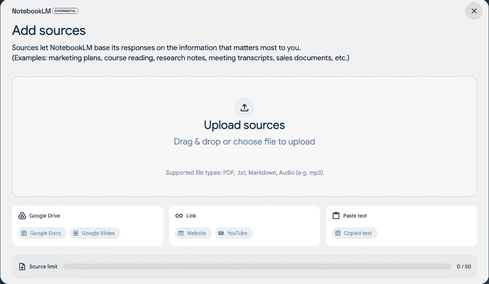
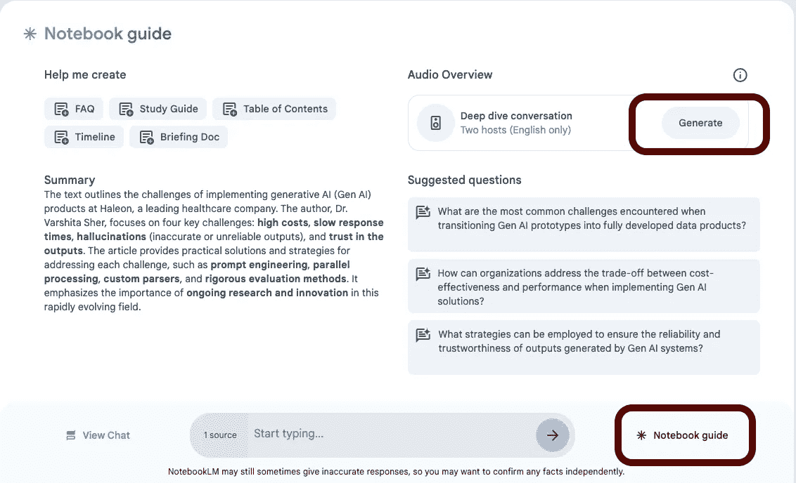

# Google 的 NotebookLM 会颠覆播客行业吗？

> 原文：[`towardsdatascience.com/is-googles-notebooklm-going-to-disrupt-the-podcasting-industry-ea8e1ec7f431?source=collection_archive---------2-----------------------#2024-10-10`](https://towardsdatascience.com/is-googles-notebooklm-going-to-disrupt-the-podcasting-industry-ea8e1ec7f431?source=collection_archive---------2-----------------------#2024-10-10)

## 生成式 AI

## 尤其是，如果只需要点击一下，就能将任何内容转化为播客。

 [Varshita Sher 博士](https://varshitasher.medium.com/?source=post_page---byline--ea8e1ec7f431--------------------------------)

·发表于 [Towards Data Science](https://towardsdatascience.com/?source=post_page---byline--ea8e1ec7f431--------------------------------) ·阅读时间 7 分钟·2024 年 10 月 10 日

--

图片由作者使用 Midjourney 生成

# 什么是 NotebookLM？

对于那些可能不太了解的人，NotebookLM 是一个个性化的 AI 研究助手，基于 Gemini 1.5 Pro 技术，旨在帮助理解复杂信息。除了根据你上传的资料（文档、幻灯片、图表等）回答问题外，它还可以通过自动生成目录、学习指南、简报、常见问题解答等个性化学习材料。虽然它根据上传的资料生成答案，但也会提供内联引用，突出显示用于生成答案的源文档中的特定文本块。

上传的内容可以包括从研究论文和会议记录到有趣书籍的引用、你正在写的小说章节、公司文档等。这些来源可以是 Google 文档、幻灯片、PDF 文件、文本文件、复制的文本，甚至是网页。

# 什么是 NotebookLM 的音频概览？

现在，回到这篇文章的核心内容：上个月，[NotebookLM 发布了一个新功能](https://blog.google/technology/ai/notebooklm-audio-overviews/)——音频概览——该功能引起了广泛关注。这个功能提供了一种与源文档互动的新方式，只需点击一下，就能生成有趣的“深度讨论”，总结源文档中的关键主题。

更令人印象深刻的是，它如何通过生成两位 AI 主持人（一个男性和一个女性），以播客式的格式讨论文档内容，从而将任何内容转化为引人入胜的形式，无论原内容多么枯燥。

如果你在想“播客风格格式”是什么意思，想象一下友好的闲聊、一些笑话、来回的对话、笑声、打断、”嗯“和”你知道“——基本上是所有优秀播客听感的标志。

这些播客风格的对话能够自然地从你的文本中创造出连接和过渡，形成引人入胜的对话。

# 如何创建 NotebookLM 音频概览

为了进行测试，我决定重新利用我的一篇[旧 Medium 文章](https://medium.com/trusted-data-science-haleon/challenges-in-implementing-gen-ai-products-7e4659f84096)，并为它创建一个播客，以迎合更多喜爱音频的听众。

设置过程非常简单。

+   访问[NotebookLM](https://notebooklm.google.com/)。如果你还没有登录，需要使用你的 Google ID 登录。如果是第一次访问，你将看到几个示例笔记本，并且可以通过点击“Create”按钮创建一个新的笔记本。

+   接下来，向你的笔记本添加内容。我使用网站源将我的 Medium 文章导入。你也可以粘贴文本或从 Google Drive 中提取内容。

+   最后，点击笔记本指南中的“Generate”按钮（参见下面的图片）来生成音频。然后去拿一杯☕️，因为根据内容的长度，可能需要几分钟时间。

上传的来源：Medium 文章 — [“实施生成 AI 产品的挑战”](https://medium.com/trusted-data-science-haleon/challenges-in-implementing-gen-ai-products-7e4659f84096)

*附言：从我 1100 字的文章生成 13 分钟的音频大约花了 4 分钟时间。你可以在这里播放并聆听。*

使用 NotebookLM 生成的播客音频

# 我的第一印象

*附言：我最终尝试了用各种来源进行音频概览，包括播客转录、研究论文和数据科学博客。以下的总结是我在这些来源中的经验汇总。*

让我们从好消息开始：

+   令人惊讶的是，我们可以在几分钟内迅速创建一集播客，这让许多人如果愿意的话可以有副业做播客。这是作家重新利用他们的内容的一个绝佳方式，也让其他人可以以一种有趣且易于接触的方式参与到相对复杂的话题中。

+   音频中使用的类比非常引人注目且迷人。以我的 Medium 文章为例，它能够将一个相对冷门（即：无聊的）话题（生成 AI 的扩展性挑战可能对非相关领域的听众不具吸引力）与日常生活中的事物进行联系。

    例如，在某个时刻，主持人讨论了生成式 AI 代币成本，并提供了一个更易理解的例子，将这些成本与移动游戏中的微交易进行对比。类似地，他们用提供完整食谱及测量单位的例子来解释提示工程，而不是简单地说“做一顿美味的饭”。他们还用汽车记住常走路线的类比来解释大型语言模型（LLM）的缓存。

+   两位主持人互相衔接句子的方式非常自然，过渡非常流畅。例如，使用“说到...”这样的短语引入新话题显得非常自然，并没有强行插入的感觉。

+   在恰到好处的时刻强调某些词语有助于吸引听众的注意力。“哇哦”、“哎呀”和“啊”的表达传达了对另一位主持人刚刚说的内容的真实惊讶。自然的停顿，思考正确的词语，使对话听起来像是自发的，而非排练过的。

+   在对几篇深度学习论文进行测试后，我可以自信地说，这将成为解释复杂研究的游戏规则改变者，尤其是那些能从类比和“像五岁孩子一样解释”（ELI5）示例中受益的研究。事实上，他们预先准备的示例笔记本中的指导方针之一，名为*Introduction to NotebookLM*，明确表示该工具是为研究人员、记者、学生和商业专业人士设计的。

在了解了关键优势之后，还有一些局限性需要考虑：

+   有时，主持人之间的对话感觉不真实。很经常，他们会接对方的话，尽管第一位主持人刚刚要求第二位主持人解释一个新概念，但几秒钟后，第一位主持人却自己回答了自己的问题。

+   并非所有输入源都能产生相同质量的音频。在进行压力测试时，我尝试输入了另一档播客的文字稿，主持人似乎更倾向于互相发出幽默的声音——“yayaya”，“哦，是的”，“嗯”，“呃-huh”，“对”，“明白”等等！

+   在讨论某个话题时，拥有大量类比的唯一缺点是，*有时候* AI 会将类比解释错误。例如，在讨论关于预测指标的博客时，AI 使用了这样的类比：“就像在学校中，较低的分数通常是更好的，意味着你的预测更接近现实。”

    这种幻觉现象在不同的生成式 AI 模型中很常见，并且在他们的工具中也作为免责声明加以说明。如果我们提供一个非常小众且高度专业化的话题，例如微小 RNA 在基因调控中的作用（这是 2024 年诺贝尔奖获奖的主题），这种现象可能会更加明显。在这种情况下，由于缺乏相关的内在知识，AI 可能会通过使用类比而开始产生幻觉🤷‍♀。

+   对于非常大的文本，播客往往会突然结束。这表明训练数据可能存在一个截断点，超过这个点后，音频无法适应并提供一个流畅、自然的结尾。

+   （非常小的）一些词，主要是缩写，在音频中被弄乱了。不知为何，RAG 被发音成 ArrrR-G，而不是 R-A-G 这样的单个字母。

+   有时候，主持人之间过于同意对方，使用像“right”和“exactly”这样的填充词，而另一位主持人还在讲话。这种情况可能会让人感觉像是在强迫回应；我的意思是，让那位可怜的家伙把话说完！

现在我们已经讨论了优缺点，接下来我们来谈谈那个价值百万美元的问题：这项新技术足够给播客主持人带来严峻的竞争吗？

我的简单回答是——还不行。原因呢？就是我们刚才讨论的那些问题。而我知道有些人可能不同意，认为这些问题微不足道，你们说得对。如果你只听一个播客，你可能根本注意不到这些问题，但如果你持续听多个节目，尤其是每天或每周听，你会发现大量的类比和“*exactly*”会让人感觉不堪重负。正因为如此，也许谷歌在最初发布时并没有将其定位为一个播客工具。

话虽如此，它无疑会降低许多希望探索这个领域但因各种原因不愿使用自己声音的人的入门门槛。更重要的是，我认为它的使用方式是让复杂的主题以易于消化的格式呈现。

## 最后的思考

Audio Overview 功能的首次发布确实令人印象深刻，超出了我的预期。就个人而言，优点绝对大于缺点，我可以看到这项技术如何在医学研究、法律文件，甚至企业的入职指南等领域带来变革——基本上，任何有乏味文本的领域，都能通过这种技术对听众产生增强效果。

话虽如此，我对未来发布的版本还是有一些期待。首先，最重要的是，希望能有一个 API，允许我绕过 UI，快速将其与我的其他工具进行集成。其次，我希望能够调整输出音频的时长，最后，希望有一个选项来定制类比的上下文/主题（以及数量），以更好地符合我的兴趣。例如，如果我是一个视频游戏爱好者，我会希望类比涉及游戏机制；而如果我是一个厨师，我更喜欢与烹饪技巧相关的类比。

总体来说，这项创新有潜力改变我们沟通复杂信息的方式。如果你已经尝试过，我很想听听你的想法！

快乐学习 ✨
