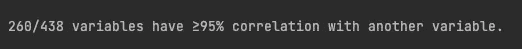
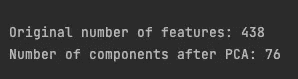
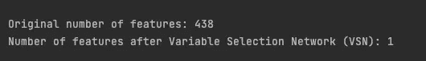
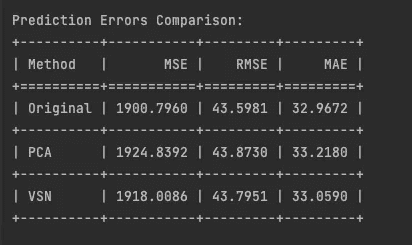
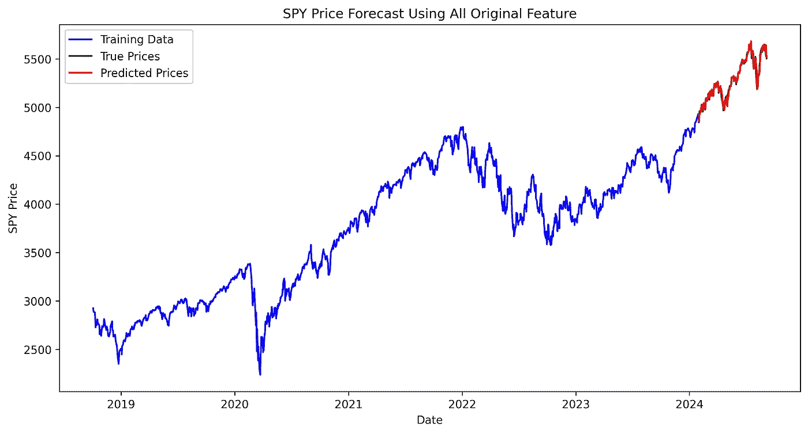
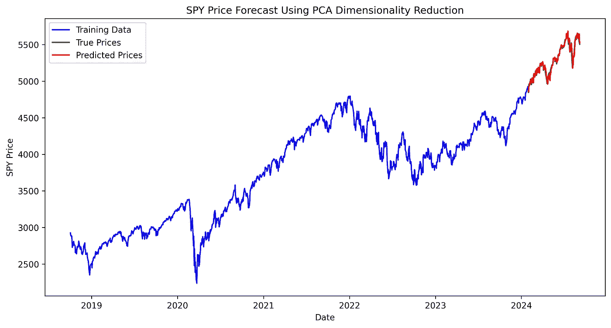
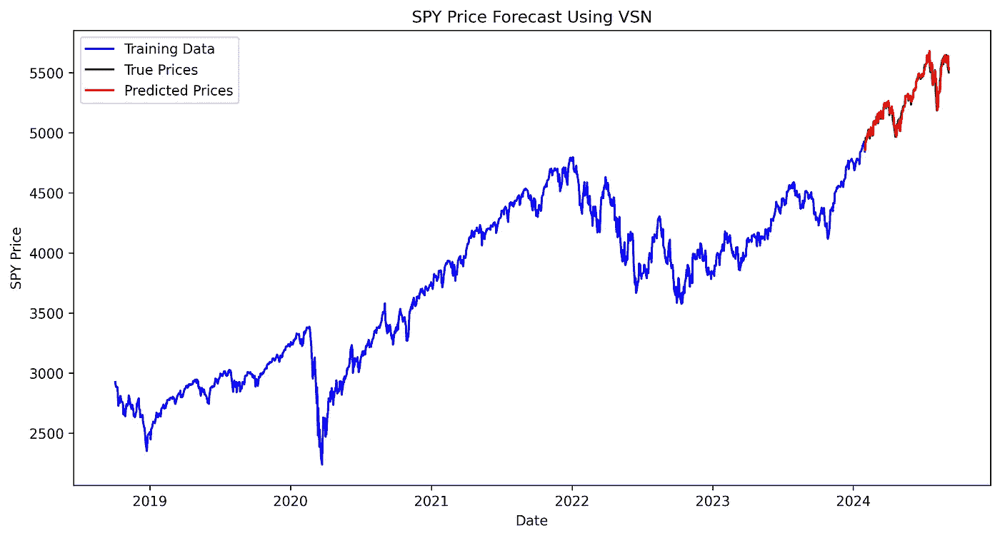

# 少即是多？深度学习预测模型需要特征减少吗？

> 原文：[`towardsdatascience.com/is-less-more-do-deep-learning-forecasting-models-need-feature-reduction-25d8968ac15c?source=collection_archive---------7-----------------------#2024-09-30`](https://towardsdatascience.com/is-less-more-do-deep-learning-forecasting-models-need-feature-reduction-25d8968ac15c?source=collection_archive---------7-----------------------#2024-09-30)

## 是否需要筛选特征，这是一个问题

[](https://ostiguyphilippe.medium.com/?source=post_page---byline--25d8968ac15c--------------------------------)[](https://towardsdatascience.com/?source=post_page---byline--25d8968ac15c--------------------------------) [Philippe Ostiguy, M. Sc.](https://ostiguyphilippe.medium.com/?source=post_page---byline--25d8968ac15c--------------------------------)

·发布于 [Towards Data Science](https://towardsdatascience.com/?source=post_page---byline--25d8968ac15c--------------------------------) ·12 分钟阅读·2024 年 9 月 30 日

--


AI 图像由作者在 MidJourney V6.1 上创建。

时间序列预测是数据科学中的一项强大工具，通过历史模式提供未来趋势的洞察。在我们之前的文章中，我们探讨了 [如何使你的时间序列自动平稳化](https://levelup.gitconnected.com/want-to-decrease-your-models-prediction-errors-by-20-follow-this-simple-trick-97354102098e)，这能显著提高模型性能。但平稳性只是解决方案的一部分。随着我们继续优化预测模型，另一个关键问题出现了：如何处理数据可能呈现的众多特征？

当你处理时间序列数据时，你经常会发现自己面临着许多可能的特征，需要将其包含在模型中。虽然使用所有可用数据很有诱惑力，但添加更多特征并不总是更好的选择。这可能会使你的模型变得更加复杂，训练速度变慢，而不一定会提高模型的性能。

你可能在想：简化特征集是否重要，现有的技术有哪些？这正是我们将在本文中讨论的内容。

这里是我们将要讨论的内容的简要总结：

+   **时间序列中的特征减少** — *我们将解释时间序列分析中特征减少的概念以及它的重要性。*

+   **实际实施指南** — *通过使用 Python，我们将逐步讲解如何评估和选择时间序列模型的特征，提供优化你方法的实用工具。我们还将评估是否需要削减特征以优化我们的预测模型。*

一旦你熟悉了像平稳性和特征减少这样的技术，并且想进一步提升你的模型？可以查看这篇关于[在深度学习模型中使用自定义验证损失](https://medium.com/@ostiguyphilippe/enhancing-deep-learning-model-evaluation-for-stock-market-forecasting-bea30b905b80)的文章，以获得更好的股票预测——这是一个很好的下一步！

# 时间序列中的特征减少：一个简单的解释

特征减少就像是整理工作区，使得你更容易找到所需的东西。在时间序列分析中，这意味着减少模型用于预测的输入变量（特征）的数量。目标是简化模型，同时保留其预测能力。这一点非常重要，因为过多的特征和相关特征会使模型变得复杂、缓慢并降低准确性。

具体来说，简化特征集可以：

+   **降低复杂度**：特征较少意味着模型更简单，这通常使得训练和使用更快。

+   **提高泛化能力**：通过去除噪声、消除相关特征并聚焦于关键信息，它帮助模型学习真实的潜在模式，而不是记住冗余信息。这增强了模型将预测推广到不同数据集的能力。

+   **更易解释**：特征较少的模型通常更容易让人类理解和解释。

+   **计算效率**：较少的特征需要更少的内存和处理能力，这对于大数据集或实时应用至关重要。

还需要注意的是，大多数用于时间序列预测的 Python 包并不会自动进行特征减少。这是你通常需要在使用这些包之前自行处理的一个步骤。

为了更好地理解这些概念，让我们通过一个实际的例子来使用来自美国联邦储备经济数据（FRED）数据库的真实世界日数据。我们在这里跳过数据获取的过程，因为我们已经在[上一篇文章](https://levelup.gitconnected.com/get-free-and-reliable-financial-market-data-machine-learning-ready-246e59b00cea)中详细介绍了如何通过 FRED API 获取免费的可靠数据。你可以通过[这个脚本](https://github.com/philippe-ostiguy/free-fin-data)获取我们将使用的数据。一旦你获取了数据：

+   在当前目录中创建一个`data`目录

```py
mkdir -p /path/to/current_directory/data
```

+   将数据复制到你的目录中

```py
cp -R /path/to/fetcher_directory /path/to/current_directory/data
```

现在我们有了数据，让我们深入探讨特征减少的示例。

我们之前在[另一篇文章](https://levelup.gitconnected.com/get-free-and-reliable-financial-market-data-machine-learning-ready-246e59b00cea)中展示了如何清理从 FRED API 获取的每日数据，因此我们在这里跳过该过程，直接使用文章中步骤得到的`processed_dataframes`（数据框列表）。

```py
import pandas as pd
import os
import warnings
warnings.filterwarnings("ignore")

def is_sp500(df):
    last_date = df['ds'].max()
    last_value = float(df.loc[df['ds'] == last_date, 'value'].iloc[0])
    return 5400 <= last_value <= 5650

initial_model_train = None
for i, df in enumerate(processed_dataframes):
    if df['value'].isna().any():
        continue
    if is_sp500(df):
        initial_model_train = df
        break

TRAIN_SIZE = .90
START_DATE = '2018-10-01'
END_DATE = '2024-09-05'
initial_model_train = initial_model_train.rename(columns={'value': 'price'}).reset_index(drop=True)
initial_model_train['unique_id'] = 'SPY'
initial_model_train['price'] = initial_model_train['price'].astype(float)
initial_model_train['y'] = initial_model_train['price'].pct_change()

initial_model_train = initial_model_train[initial_model_train['ds'] > START_DATE].reset_index(drop=True)
combined_df_all = pd.concat([df.drop(columns=['ds']) for df in processed_dataframes], axis=1)
combined_df_all.columns = [f'value_{i}' for i in range(len(processed_dataframes))]
rows_to_keep = len(initial_model_train)
combined_df_all = combined_df_all.iloc[-rows_to_keep:].reset_index(drop=True)

train_size = int(len(initial_model_train)*TRAIN_SIZE)
initial_model_test = initial_model_train[train_size:]
initial_model_train = initial_model_train[:train_size]
combined_df_test = combined_df_all[train_size:]
combined_df_train = combined_df_all[:train_size]
```

你可能会问，为什么我们将数据划分为训练集和测试集？原因是为了确保在应用任何转换或降维技术之前不会发生数据泄漏。

`initial_model_data`包含标准普尔 500 的每日价格（最初存储在`processed_dataframes`中），这将是我们尝试预测的数据。

接下来，我们需要确保我们的数据是平稳的。关于如何自动使数据平稳并提高 20%模型表现的详细解释，请参阅[这篇文章](https://levelup.gitconnected.com/want-to-decrease-your-models-prediction-errors-by-20-follow-this-simple-trick-97354102098e)。

```py
import numpy as np
from statsmodels.tsa.stattools import adfuller
P_VALUE = 0.05

def replace_inf_nan(series):
    if np.isnan(series.iloc[0]) or np.isinf(series.iloc[0]):
        series.iloc[0] = 0
    mask = np.isinf(series) | np.isnan(series)
    series = series.copy()
    series[mask] = np.nan
    series = series.ffill()
    return series

def safe_convert_to_numeric(series):
    return pd.to_numeric(series, errors='coerce')

tempo_df = pd.DataFrame()
stationary_df_train = pd.DataFrame()
stationary_df_test = pd.DataFrame()

value_columns = [col for col in combined_df_all.columns if col.startswith('value_')]

transformations = ['first_diff', 'pct_change', 'log', 'identity']

def get_first_diff(numeric_series):
    return replace_inf_nan(numeric_series.diff())

def get_pct_change(numeric_series):
    return replace_inf_nan(numeric_series.pct_change())

def get_log_transform(numeric_series):
    return replace_inf_nan(np.log(numeric_series.replace(0, np.nan)))

def get_identity(numeric_series):
    return numeric_series

for index, val_col in enumerate(value_columns):
    numeric_series = safe_convert_to_numeric(combined_df_train[val_col])
    numeric_series_all = safe_convert_to_numeric(combined_df_all[val_col])

    if numeric_series.isna().all():
        continue

    valid_transformations = []

    tempo_df['first_diff'] = get_first_diff(numeric_series)
    tempo_df['pct_change'] = get_pct_change(numeric_series)
    tempo_df['log'] = get_log_transform(numeric_series)
    tempo_df['identity'] = get_identity(numeric_series)

    for transfo in transformations:
        tempo_df[transfo] = replace_inf_nan(tempo_df[transfo])
        series = tempo_df[transfo].dropna()

        if len(series) > 1 and not (series == series.iloc[0]).all():
            result = adfuller(series)
            if result[1] < P_VALUE:
                valid_transformations.append((transfo, result[0], result[1]))

    if valid_transformations:
        if any(transfo == 'identity' for transfo, _, _ in valid_transformations):
            chosen_transfo = 'identity'
        else:
            chosen_transfo = min(valid_transformations, key=lambda x: x[1])[0]

        if chosen_transfo == 'first_diff':
            stationary_df_train[val_col] = get_first_diff(numeric_series_all)
        elif chosen_transfo == 'pct_change':
            stationary_df_train[val_col] = get_pct_change(numeric_series_all)
        elif chosen_transfo == 'log':
            stationary_df_train[val_col] = get_log_transform(numeric_series_all)
        else:
            stationary_df_train[val_col] = get_identity(numeric_series_all)

    else:
        print(f"No valid transformation found for {val_col}")

stationary_df_test = stationary_df_train[train_size:]
stationary_df_train = stationary_df_train[:train_size]

initial_model_train = initial_model_train.iloc[1:].reset_index(drop=True)
stationary_df_train = stationary_df_train.iloc[1:].reset_index(drop=True)
last_train_index = stationary_df_train.index[-1]
stationary_df_test = stationary_df_test.loc[last_train_index + 1:].reset_index(drop=True)
initial_model_test = initial_model_test.loc[last_train_index + 1:].reset_index(drop=True)
```

然后，我们将统计至少与另一个变量有 95%相关系数的变量数量。

```py
CORR_COFF = .95
corr_matrix = stationary_df_train.corr().abs()
mask = np.triu(np.ones_like(corr_matrix, dtype=bool), k=1)
high_corr = corr_matrix.where(mask).stack()
high_corr = high_corr[high_corr >= CORR_COFF]
unique_cols = set(high_corr.index.get_level_values(0)) | set(high_corr.index.get_level_values(1))
num_high_corr_cols = len(unique_cols)

print(f"\n{num_high_corr_cols}/{stationary_df_train.shape[1]} variables have ≥{int(CORR_COFF*100)}% "
      f"correlation with another variable.\n")
```



高度相关的变量数量。图像由作者提供。

如果 438 个变量中有 260 个变量与至少另一个变量的相关性达到 95%或更高，这可能是一个问题。这表明数据集中存在显著的多重共线性。这种冗余可能会导致以下几个问题：

+   使模型变得复杂，但并未增加实质性的新信息

+   可能导致回归系数估计的不稳定

+   增加过拟合的风险

+   使得解释单个变量的影响变得困难

# 特征评估与选择

我们理解特征降维可能很重要，但我们该如何进行呢？我们应该使用哪些技术？这些是我们现在要探讨的问题。

我们将要探讨的第一种技术是主成分分析（PCA）。这是一种常见且有效的降维技术。PCA 识别特征之间的线性关系，并保留解释原始数据集中预定百分比方差的主成分。在我们的使用案例中，我们将`EXPLAINED_VARIANCE`阈值设置为 90%。

```py
from sklearn.preprocessing import StandardScaler
from sklearn.decomposition import PCA
EXPLAINED_VARIANCE = .9
MIN_VARIANCE = 1e-10

X_train = stationary_df_train.values
scaler = StandardScaler()
X_train_scaled = scaler.fit_transform(X_train)
pca = PCA(n_components=EXPLAINED_VARIANCE, svd_solver='full')
X_train_pca = pca.fit_transform(X_train_scaled)

components_to_keep = pca.explained_variance_ > MIN_VARIANCE
X_train_pca = X_train_pca[:, components_to_keep]

pca_df_train = pd.DataFrame(
    X_train_pca,
    columns=[f'PC{i+1}' for i in range(X_train_pca.shape[1])]
)

X_test = stationary_df_test.values
X_test_scaled = scaler.transform(X_test)
X_test_pca = pca.transform(X_test_scaled)

X_test_pca = X_test_pca[:, components_to_keep]

pca_df_test = pd.DataFrame(
    X_test_pca,
    columns=[f'PC{i+1}' for i in range(X_test_pca.shape[1])]
)

print(f"\nOriginal number of features: {stationary_df_train.shape[1]}")
print(f"Number of components after PCA: {pca_df_train.shape[1]}\n")
```



使用主成分分析进行特征降维。图像由作者提供。

令人印象深刻的是：在降维后，438 个特征中只剩下 76 个成分，同时保持了 90%的方差解释！接下来我们将转向一种非线性降维技术。

[时间序列融合变换器（TFT）](https://arxiv.org/pdf/1912.09363.pdf)是一种用于时间序列预测的先进模型。它包含变量选择网络（VSN），这是模型的一个关键组件。它专门设计用于自动识别和关注数据集中的最相关特征。通过为每个输入变量分配学习到的权重，它有效地突出哪些特征对预测任务的贡献最大。

基于 VSN 的方法将是我们第二种降维技术。我们将使用[PyTorch Forecasting](https://pytorch-forecasting.readthedocs.io/en/stable/)来实现，它允许我们利用 TFT 模型中的变量选择网络。

我们将使用一个基础配置。我们的目标不是创建性能最强的模型，而是识别最相关的特征，同时尽量减少资源使用。

```py
from pytorch_forecasting import TemporalFusionTransformer, TimeSeriesDataSet
from pytorch_forecasting.metrics import QuantileLoss
from lightning.pytorch.callbacks import EarlyStopping
import lightning.pytorch as pl
import torch

pl.seed_everything(42)
max_encoder_length = 32
max_prediction_length = 1
VAL_SIZE = .2
VARIABLES_IMPORTANCE = .8
model_data_feature_sel = initial_model_train.join(stationary_df_train)
model_data_feature_sel = model_data_feature_sel.join(pca_df_train)
model_data_feature_sel['price'] = model_data_feature_sel['price'].astype(float)
model_data_feature_sel['y'] = model_data_feature_sel['price'].pct_change()
model_data_feature_sel = model_data_feature_sel.iloc[1:].reset_index(drop=True)

model_data_feature_sel['group'] = 'spy'
model_data_feature_sel['time_idx'] = range(len(model_data_feature_sel))

train_size_vsn = int((1-VAL_SIZE)*len(model_data_feature_sel))
train_data_feature = model_data_feature_sel[:train_size_vsn]
val_data_feature = model_data_feature_sel[train_size_vsn:]
unknown_reals_origin = [col for col in model_data_feature_sel.columns if col.startswith('value_')] + ['y']

timeseries_config = {
    "time_idx": "time_idx",
    "target": "y",
    "group_ids": ["group"],
    "max_encoder_length": max_encoder_length,
    "max_prediction_length": max_prediction_length,
    "time_varying_unknown_reals": unknown_reals_origin,
    "add_relative_time_idx": True,
    "add_target_scales": True,
    "add_encoder_length": True
}

training_ts = TimeSeriesDataSet(
    train_data_feature,
    **timeseries_config
)
```

`VARIABLES_IMPORTANCE`阈值设置为 0.8，这意味着我们将保留由变量选择网络（VSN）确定的排名前 80%的重要特征。有关时间序列融合变换器（TFT）及其参数的更多信息，请参考[文档](https://pytorch-forecasting.readthedocs.io/en/stable/api/pytorch_forecasting.models.temporal_fusion_transformer.TemporalFusionTransformer.html#pytorch_forecasting.models.temporal_fusion_transformer.TemporalFusionTransformer)。

接下来，我们将训练 TFT 模型。

```py
if torch.cuda.is_available():
    accelerator = 'gpu'
    num_workers = 2
else :
    accelerator = 'auto'
    num_workers = 0

validation = TimeSeriesDataSet.from_dataset(training_ts, val_data_feature, predict=True, stop_randomization=True)
train_dataloader = training_ts.to_dataloader(train=True, batch_size=64, num_workers=num_workers)
val_dataloader = validation.to_dataloader(train=False, batch_size=64*5, num_workers=num_workers)

tft = TemporalFusionTransformer.from_dataset(
    training_ts,
    learning_rate=0.03,
    hidden_size=16,
    attention_head_size=2,
    dropout=0.1,
    loss=QuantileLoss()
)

early_stop_callback = EarlyStopping(monitor="val_loss", min_delta=1e-5, patience=5, verbose=False, mode="min")

trainer = pl.Trainer(max_epochs=20,  accelerator=accelerator, gradient_clip_val=.5, callbacks=[early_stop_callback])
trainer.fit(
    tft,
    train_dataloaders=train_dataloader,
    val_dataloaders=val_dataloader

)
```

我们故意设置了`max_epochs=20`，以避免模型训练时间过长。此外，我们还实现了`early_stop_callback`，如果模型在连续 5 个 epoch 中没有改善，将停止训练（`patience=5`）。

最后，使用获得的最佳模型，我们选择由 VSN 确定的最重要特征的 80 百分位。

```py
best_model_path = trainer.checkpoint_callback.best_model_path
best_tft = TemporalFusionTransformer.load_from_checkpoint(best_model_path)

raw_predictions = best_tft.predict(val_dataloader, mode="raw", return_x=True)

def get_top_encoder_variables(best_tft,interpretation):
    encoder_importances = interpretation["encoder_variables"]
    sorted_importances, indices = torch.sort(encoder_importances, descending=True)
    cumulative_importances = torch.cumsum(sorted_importances, dim=0)
    threshold_index = torch.where(cumulative_importances > VARIABLES_IMPORTANCE)[0][0]
    top_variables = [best_tft.encoder_variables[i] for i in indices[:threshold_index+1]]
    if 'relative_time_idx' in top_variables:
        top_variables.remove('relative_time_idx')
    return top_variables

interpretation= best_tft.interpret_output(raw_predictions.output, reduction="sum")
top_encoder_vars = get_top_encoder_variables(best_tft,interpretation)

print(f"\nOriginal number of features: {stationary_df_train.shape[1]}")
print(f"Number of features after Variable Selection Network (VSN): {len(top_encoder_vars)}\n")
```



使用变量选择网络进行特征降维。图片由作者提供。

原始数据集包含 438 个特征，在应用 VSN 方法后，仅剩下 1 个特征！这种剧烈的降维暗示了几种可能性：

1.  许多原始特征可能是冗余的。

1.  特征选择过程可能已过度简化数据。

1.  仅使用目标变量的历史值（自回归方法）可能与包含外生变量的模型表现相当，甚至可能更好。

# 评估特征降维技术

在最后一节中，我们将比较应用于模型的降维技术。每种方法在保持相同模型配置的同时进行测试，唯一区别是所选特征的降维处理。

我们将使用[TiDE](https://arxiv.org/pdf/2304.08424.pdf)，这是一种基于 Transformer 的小型最先进模型。我们将使用[NeuralForecast](https://nixtlaverse.nixtla.io/neuralforecast/models.tide.html)提供的实现。只要它允许外生历史变量，NeuralForecast 的任何模型[这里](https://nixtlaverse.nixtla.io/neuralforecast/docs/capabilities/overview.html)都可以使用。

我们将使用每日 SPY（标普 500ETF）数据训练和测试两个模型。两个模型将具有相同的：

1.  训练-测试分割比例

1.  超参数

1.  单一时间序列（SPY）

1.  预测范围为一步 ahead

这两个模型之间唯一的区别是特征减少技术。就这样！

1.  第一个模型：原始特征（没有特征减少）

1.  第二个模型：使用 PCA 进行特征减少

1.  第三个模型：使用 VSN 进行特征减少

该设置使我们能够隔离每种特征减少技术对模型性能的影响。

首先，我们使用相同的配置训练三个模型，唯一的区别是特征。

```py
from neuralforecast.models import TiDE
from neuralforecast import NeuralForecast

train_data = initial_model_train.join(stationary_df_train)
train_data = train_data.join(pca_df_train)
test_data = initial_model_test.join(stationary_df_test)
test_data = test_data.join(pca_df_test)

hist_exog_list_origin = [col for col in train_data.columns if col.startswith('value_')] + ['y']
hist_exog_list_pca = [col for col in train_data.columns if col.startswith('PC')] + ['y']
hist_exog_list_vsn = top_encoder_vars

tide_params = {
    "h": 1,
    "input_size": 32,
    "scaler_type": "robust",
    "max_steps": 500,
    "val_check_steps": 20,
    "early_stop_patience_steps": 5
}

model_original = TiDE(
    **tide_params,
    hist_exog_list=hist_exog_list_origin,
)

model_pca = TiDE(
    **tide_params,
    hist_exog_list=hist_exog_list_pca,
)

model_vsn = TiDE(
    **tide_params,
    hist_exog_list=hist_exog_list_vsn,
)

nf = NeuralForecast(
    models=[model_original, model_pca, model_vsn],
    freq='D'
)

val_size = int(train_size*VAL_SIZE)
nf.fit(df=train_data,val_size=val_size,use_init_models=True)
```

然后，我们进行预测。

```py
from tabulate import tabulate
y_hat_test_ret = pd.DataFrame()
current_train_data = train_data.copy()

y_hat_ret = nf.predict(current_train_data)
y_hat_test_ret = pd.concat([y_hat_test_ret, y_hat_ret.iloc[[-1]]])

for i in range(len(test_data) - 1):
    combined_data = pd.concat([current_train_data, test_data.iloc[[i]]])
    y_hat_ret = nf.predict(combined_data)
    y_hat_test_ret = pd.concat([y_hat_test_ret, y_hat_ret.iloc[[-1]]])
    current_train_data = combined_data

predicted_returns_original = y_hat_test_ret['TiDE'].values
predicted_returns_pca = y_hat_test_ret['TiDE1'].values
predicted_returns_vsn = y_hat_test_ret['TiDE2'].values

predicted_prices_original = []
predicted_prices_pca = []
predicted_prices_vsn = []

for i in range(len(predicted_returns_pca)):
    if i == 0:
        last_true_price = train_data['price'].iloc[-1]
    else:
        last_true_price = test_data['price'].iloc[i-1]
    predicted_prices_original.append(last_true_price * (1 + predicted_returns_original[i]))
    predicted_prices_pca.append(last_true_price * (1 + predicted_returns_pca[i]))
    predicted_prices_vsn.append(last_true_price * (1 + predicted_returns_vsn[i]))

true_values = test_data['price']
methods = ['Original','PCA', 'VSN']
predicted_prices = [predicted_prices_original,predicted_prices_pca, predicted_prices_vsn]

results = []

for method, prices in zip(methods, predicted_prices):
    mse = np.mean((np.array(prices) - true_values)**2)
    rmse = np.sqrt(mse)
    mae = np.mean(np.abs(np.array(prices) - true_values))

    results.append([method, mse, rmse, mae])

headers = ["Method", "MSE", "RMSE", "MAE"]
table = tabulate(results, headers=headers, floatfmt=".4f", tablefmt="grid")

print("\nPrediction Errors Comparison:")
print(table)

with open("prediction_errors_comparison.txt", "w") as f:
    f.write("Prediction Errors Comparison:\n")
    f.write(table)
```

我们使用模型预测每日回报，然后将这些回报转换为价格。这种方法使我们能够通过价格计算预测误差，并将实际价格与预测价格进行比较，呈现在图表中。



使用不同特征减少技术的预测误差比较。图片由作者提供。

TiDE 模型在原始和减少特征集上表现相似，揭示了一个关键的见解：特征减少并没有像预期那样提高预测精度。这表明可能存在一些关键问题：

+   信息损失：尽管目的是保留重要数据，但降维技术丢弃了与预测任务相关的信息，这解释了在减少特征时预测没有改进。

+   泛化困难：不同特征集之间的一致表现表明模型在捕捉潜在模式方面存在困难，无论特征数量多少。

+   复杂性过度：使用较少特征获得类似结果表明，TiDE 的复杂架构可能过于复杂。一种更简单的模型，例如 ARIMA，可能表现得同样好。

然后，让我们查看图表，看看是否能观察到三种预测方法与实际价格之间有任何显著差异。

```py
import matplotlib.pyplot as plt

plt.figure(figsize=(12, 6))
plt.plot(train_data['ds'], train_data['price'], label='Training Data', color='blue')
plt.plot(test_data['ds'], true_values, label='True Prices', color='green')
plt.plot(test_data['ds'], predicted_prices_original, label='Predicted Prices', color='red')
plt.legend()
plt.title('SPY Price Forecast Using All Original Feature')
plt.xlabel('Date')
plt.ylabel('SPY Price')
plt.savefig('spy_forecast_chart_original.png', dpi=300, bbox_inches='tight')
plt.close()

plt.figure(figsize=(12, 6))
plt.plot(train_data['ds'], train_data['price'], label='Training Data', color='blue')
plt.plot(test_data['ds'], true_values, label='True Prices', color='green')
plt.plot(test_data['ds'], predicted_prices_pca, label='Predicted Prices', color='red')
plt.legend()
plt.title('SPY Price Forecast Using PCA Dimensionality Reduction')
plt.xlabel('Date')
plt.ylabel('SPY Price')
plt.savefig('spy_forecast_chart_pca.png', dpi=300, bbox_inches='tight')
plt.close()

plt.figure(figsize=(12, 6))
plt.plot(train_data['ds'], train_data['price'], label='Training Data', color='blue')
plt.plot(test_data['ds'], true_values, label='True Prices', color='green')
plt.plot(test_data['ds'], predicted_prices_vsn, label='Predicted Prices', color='red')
plt.legend()
plt.title('SPY Price Forecast Using VSN')
plt.xlabel('Date')
plt.ylabel('SPY Price')
plt.savefig('spy_forecast_chart_vsn.png', dpi=300, bbox_inches='tight')
plt.close()
```



使用所有原始特征的 SPY 价格预测。图片由作者提供。



使用 PCA 的 SPY 价格预测。图片由作者提供。



使用 VSN 的 SPY 价格预测。图片由作者提供。

真实价格与预测价格之间的差异在三个模型中看起来一致，性能之间没有明显的差异。

# 结论

我们做到了！我们探讨了特征减少在时间序列分析中的重要性，并提供了一个实用的实现指南：

+   特征降维的目标是简化模型，同时保持预测能力。其好处包括减少复杂性、提高泛化能力、简化解释和计算效率。

+   我们使用 FRED 数据演示了两种降维技术：

1.  主成分分析（PCA），一种线性降维方法，将特征从 438 个减少到 76 个，同时保留了 90%的解释方差。

1.  来自时序融合变换器（Temporal Fusion Transformers）的变量选择网络（VSN），一种非线性方法，通过设置 80 百分位重要性阈值，将特征大幅减少到仅剩 1 个。

+   使用 TiDE 模型进行的评估表明，原始特征集和降维后的特征集在性能上相似，这表明特征降维并不总是能提升预测性能。这可能是由于降维过程中信息丢失、模型难以捕捉潜在模式，或可能是对于这个特定的预测任务，更简单的模型同样有效。

最后一点，我们并没有探索所有的特征降维技术，例如 SHAP（SHapley Additive exPlanations），它提供了跨多种模型类型的统一特征重要性度量。即使我们没有改进模型，进行特征筛选并比较不同降维方法的性能仍然是值得的。这种方法有助于确保在优化模型效率和可解释性的同时，不丢失有价值的信息。

在未来的文章中，我们将把这些特征降维技术应用于更复杂的模型，比较它们对性能和可解释性的影响。敬请关注！

准备将这些概念付诸实践了吗？你可以在[这里](https://github.com/philippe-ostiguy/feature-reduction-ts)找到完整的代码实现。

# 喜欢这篇文章吗？表示你的支持！

👏 鼓掌 50 次

🤝 通过[LinkedIn](https://www.linkedin.com/in/philippe-ostiguy/)向我发送连接请求，保持联系

*你的支持意义重大！* 🙏
