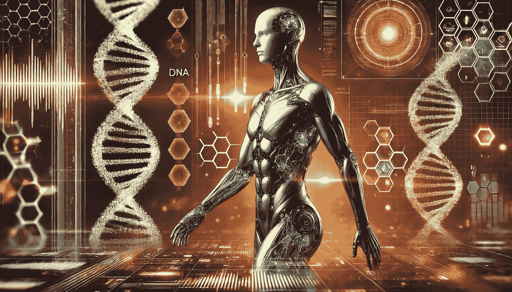

# LLM 的表现是否由其基因编码预先决定？

> 原文：[`towardsdatascience.com/is-llm-performance-predetermined-by-their-genetic-code-74e7bb080dab?source=collection_archive---------6-----------------------#2024-07-08`](https://towardsdatascience.com/is-llm-performance-predetermined-by-their-genetic-code-74e7bb080dab?source=collection_archive---------6-----------------------#2024-07-08)

## |LLM|AI|GENETIC|

## 探索基因算法预测大型语言模型的未来

 [Salvatore Raieli](https://salvatore-raieli.medium.com/?source=post_page---byline--74e7bb080dab--------------------------------)

·发表于[Towards Data Science](https://towardsdatascience.com/?source=post_page---byline--74e7bb080dab--------------------------------) ·阅读时间 9 分钟·2024 年 7 月 8 日

--

图像由作者使用 AI 生成

> 我对基因是数字化的这一理念感到着迷。基因是由一长串编码字母组成的序列，就像计算机中的信息一样。现代生物学正在逐渐成为信息技术的一个分支。 — 理查德·道金斯

目前有大量的[大型语言模型](https://github.com/SalvatoreRa/tutorial/blob/main/artificial%20intelligence/FAQ.md#:~:text=Large%20Language%20Models)（LLMs），无论是闭源还是开源，每天都有数百个在[Hugging Face Hub](https://huggingface.co/docs/hub/en/index)上发布。这不仅展示了社区的兴趣，也证明了语言模型的成功。另一方面，尽管存在这些兴趣，大多数模型并未进行基准测试，而且相关细节较少（缺乏透明度）。

 ## 变换器的挽歌？

### 变换器（Transformer）模型将引领我们进入通用人工智能的时代吗？还是将被取代？

towardsdatascience.com
