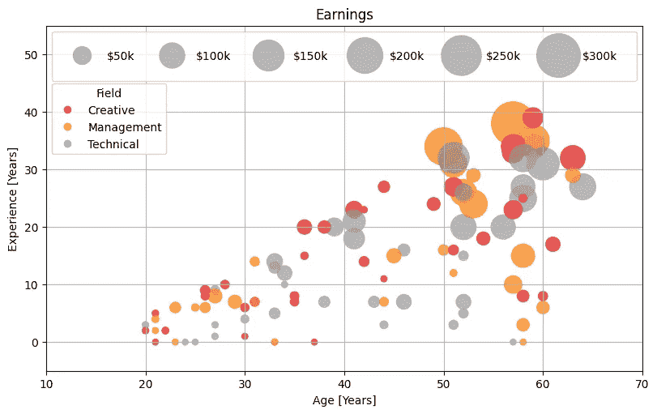

# Matplotlib 仍然是最佳的静态图表绘图库吗？

> 原文：[`towardsdatascience.com/is-matplotlib-still-the-best-python-library-for-static-plots-a933c092cd49?source=collection_archive---------0-----------------------#2024-01-20`](https://towardsdatascience.com/is-matplotlib-still-the-best-python-library-for-static-plots-a933c092cd49?source=collection_archive---------0-----------------------#2024-01-20)

## 可视化

## 这个无处不在的原版仍然是大师吗？

 [Mike Clayton](https://medium.com/@maclayton?source=post_page---byline--a933c092cd49--------------------------------)

·发表于 [Towards Data Science](https://towardsdatascience.com/?source=post_page---byline--a933c092cd49--------------------------------) ·阅读时长 18 分钟·2024 年 1 月 20 日

--

一个 Matplotlib 散点图 — 图像来自作者

**Matplotlib 可能是每个数据科学家或数据分析师第一次接触的绘图库，如果他们使用 Python 编程语言的话。它似乎无处不在。**

**…那么，Matplotlib 是否因为它是最好的可用选项而如此普及？还是它只是存在了很长时间？有哪些替代品，它们如何比较？**

# 介绍

在文章标题中，您可能注意到我特别提到了**静态图表**。

## 静态与动态

尽管仪表板和交互式图表在探索和展示数据方面极为重要，但静态图表始终是必不可少的。

报告、技术论文、文章以及所有印刷材料总是需要静态图表。因此，能够快速、轻松地制作清晰、逻辑性强且美观的静态图表仍然是绝对必要的。考虑到这一点，本文将主要关注静态图表。

## 静态图表带来了额外的挑战
