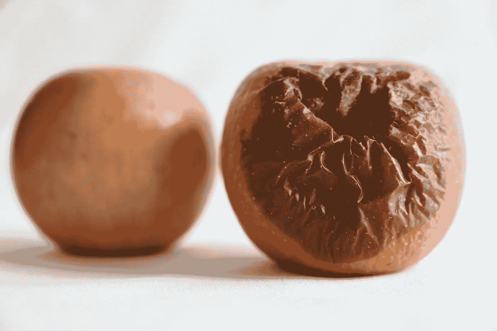

# 你的数据是在提升你，还是在拖累你？

> 原文：[`towardsdatascience.com/is-your-data-lifting-you-up-or-letting-you-down-e2fd7cc75513?source=collection_archive---------9-----------------------#2024-05-09`](https://towardsdatascience.com/is-your-data-lifting-you-up-or-letting-you-down-e2fd7cc75513?source=collection_archive---------9-----------------------#2024-05-09)

## 理解并避免数据的负面回报

 [Elliott Stam](https://medium.com/@elliottstam?source=post_page---byline--e2fd7cc75513--------------------------------)

·发布于[Towards Data Science](https://towardsdatascience.com/?source=post_page---byline--e2fd7cc75513--------------------------------) ·阅读时长 12 分钟·2024 年 5 月 9 日

--

坏数据？照片来源：[Giuseppe CUZZOCREA](https://unsplash.com/@kuzzogiu?utm_source=medium&utm_medium=referral)于[Unsplash](https://unsplash.com/?utm_source=medium&utm_medium=referral)

当我伸手去拿一个苹果时，我充满了期待：它应该是脆的、甜的、清爽的。一个好的苹果可以让我心情愉悦，脸上露出微笑。然而，如果我没有注意到这个苹果已经腐烂，那这个恶心的苹果就会让我失去笑容，并留下难闻的味道。

你的数据和你用它构建的东西与我的苹果有很多相似之处。数据可以是美味的，让你想要更多，但它也可能变坏，让你的业务感到恶心。

在合适的条件下，数据可以成为你团队的巨大资产。数据可以用来指导和帮助决策，它常常有潜力揭示有价值的机会。但要小心：从数据中获得负面回报是可能的。

没有人希望得到负面回报。这是一个糟糕的结果，尤其在当今时代，每个人都知道数据中蕴藏着价值的宝藏。没有哪个数据团队愿意承认他们带来的问题比解决的更多。他们的任务是用数据赋能业务，而不是拖慢进程。

但事实是，我们每个人都咬过烂掉的数据苹果。它们有多种表现形式：仪表盘…
