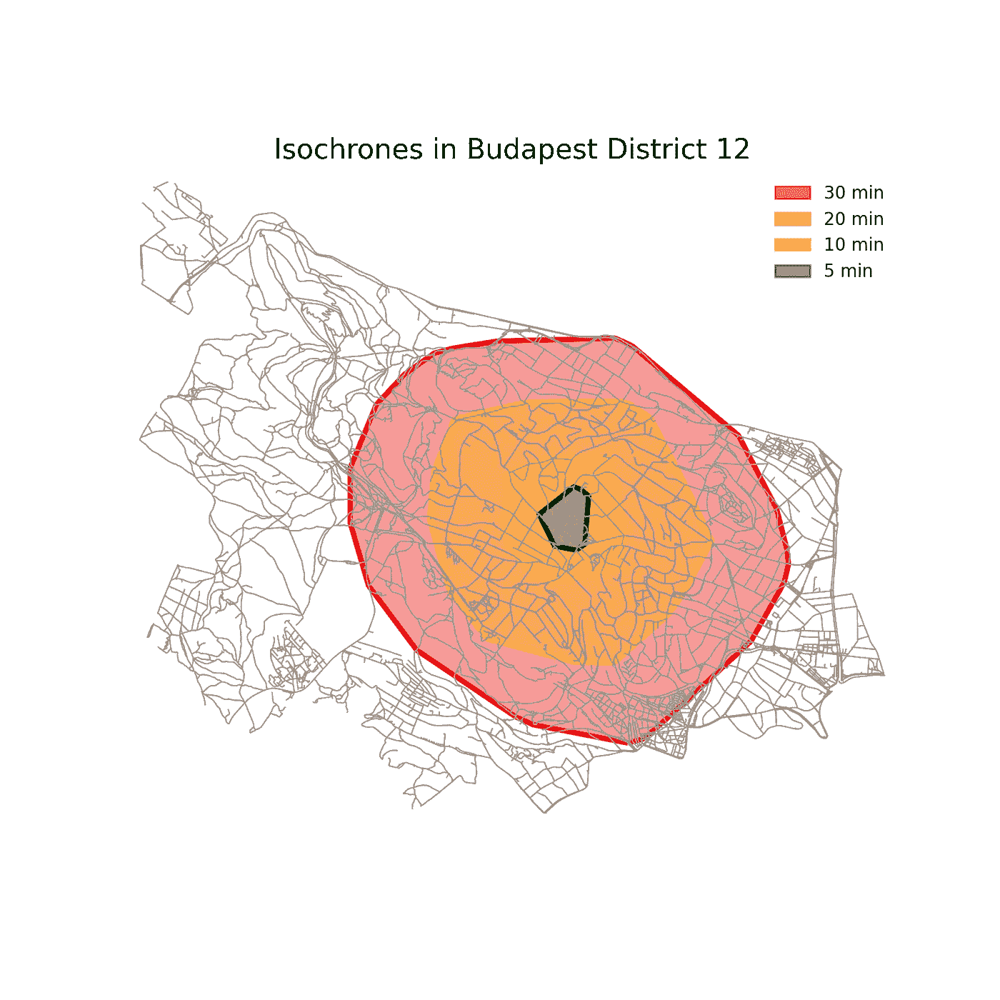

# Python 中的等时线

> 原文：[`towardsdatascience.com/isochrones-in-python-fe21814e5cb1?source=collection_archive---------9-----------------------#2024-07-29`](https://towardsdatascience.com/isochrones-in-python-fe21814e5cb1?source=collection_archive---------9-----------------------#2024-07-29)

## 在 Python 中突出步行可达区域

 [Milan Janosov](https://medium.com/@janosovm?source=post_page---byline--fe21814e5cb1--------------------------------)

·发布于[数据科学前沿](https://towardsdatascience.com/?source=post_page---byline--fe21814e5cb1--------------------------------) ·阅读时间：5 分钟·2024 年 7 月 29 日

--

在地理空间科学和位置智能中，等时线表示从特定点出发，在一定时间内可以到达的地理区域。例如，在步行距离的情况下，等时线是城市规划师等专业人士的有用工具，帮助他们了解给定区域的可达性和连通性。

通过可视化等时线，数据科学可以提供一个快速且易于使用的工具，帮助深入了解邻里之间的连通性和步行可达性，帮助识别连通性良好的区域，并指出可能需要进行基础设施改善的区域。

此外，在本文中，我们将提供一个概述，介绍如何使用 Python 包[NetworkX](https://networkx.org)（用于图分析）和[OSMNnx](https://osmnx.readthedocs.io/en/stable/)（结合 OpenStreetMap 和 NetworkX）生成步行距离等时线，以布达佩斯第 12 区为例。首先，我们下载该区域的道路网络，然后选择一个随机节点（随机交叉口），接着绘制围绕该节点的 5、10、20 和 30 分钟的步行等时线。

*所有图像均由作者创建。*

# 数据获取
