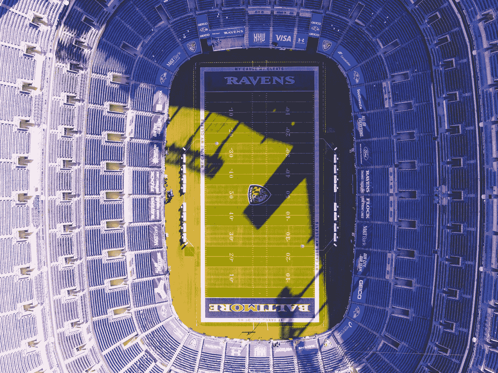

# Jet Sweep：优化路线以访问每支 NFL 球队的主场

> 原文：[`towardsdatascience.com/jet-sweep-route-optimization-to-visit-every-nfl-team-at-home-9a43e0bc4810?source=collection_archive---------3-----------------------#2024-06-03`](https://towardsdatascience.com/jet-sweep-route-optimization-to-visit-every-nfl-team-at-home-9a43e0bc4810?source=collection_archive---------3-----------------------#2024-06-03)

## 用线性规划解决旅行商问题

 [Sejal Dua](https://sejaldua.medium.com/?source=post_page---byline--9a43e0bc4810--------------------------------)

·发表于 [Towards Data Science](https://towardsdatascience.com/?source=post_page---byline--9a43e0bc4810--------------------------------) ·阅读时长 10 分钟·2024 年 6 月 3 日

--

图片来源：[Brendan Beale](https://unsplash.com/@theophilus318?utm_source=medium&utm_medium=referral) 于 [Unsplash](https://unsplash.com/?utm_source=medium&utm_medium=referral)

大多数体育行业人士或狂热粉丝都曾想过，*“一生中能访问每一个 NFL 体育场、NBA 体育馆或 MLB 棒球场不是很酷吗？”* 虽然从我现在的位置来看，这个目标似乎遥不可及，但我足够关注篮球、棒球和美式足球，时不时地会想起这个愿望清单上的项目。我最近还对各种调度和路线优化问题产生了浓厚的兴趣。因此，我为你呈现一个体育迷的梦想假期。随着 2024–25 赛季 NFL 赛程的发布，你正在计划一次旅行，旨在以最优路线访问每一个 NFL 体育场，参加主场比赛。

# NFL 相关背景

从零开始解决这个问题时，我们需要获取一些初步信息：

(1) 每个 NFL 体育场的纬度和经度坐标。

(2) 即将到来的 NFL 赛程，包括日期和主场地点。

## 体育场详情与距离矩阵

我写了一个简单的 Python 脚本，从维基百科中获取每个 NFL 体育场的纬度和经度信息。
