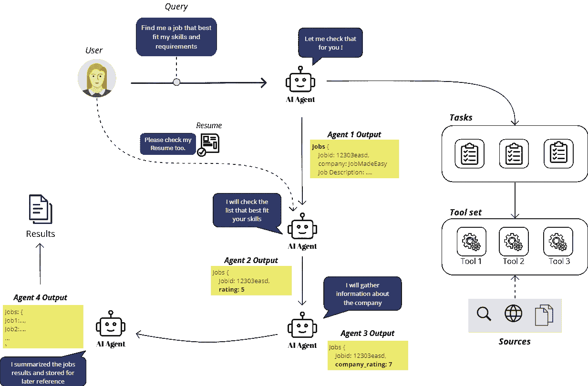

# 使用 AI 代理自动化职位搜索

> 原文：[`towardsdatascience.com/job-search-2-0-turbo-579e1bdb5177?source=collection_archive---------4-----------------------#2024-05-03`](https://towardsdatascience.com/job-search-2-0-turbo-579e1bdb5177?source=collection_archive---------4-----------------------#2024-05-03)

## 逐步指南：构建一个 AI 代理团队，自动化并优化职位搜索和筛选过程，将求职者的技能与职位要求匹配

 [Hussein Jundi](https://husseinjundi.medium.com/?source=post_page---byline--579e1bdb5177--------------------------------)

·发布于 [Towards Data Science](https://towardsdatascience.com/?source=post_page---byline--579e1bdb5177--------------------------------) ·18 分钟阅读·2024 年 5 月 3 日

--

使用 AI 代理的职位搜索 — 作者提供的图像

> 用户：AI 找到最适合我的职位。
> 
> AI：正在处理..

# 目录

## 介绍

1.  影响每个求职者的常见挑战（为什么..）

1.  AI 代理在优化职位搜索过程中的关键角色（什么..）

1.  将 AI 代理能力引入过程（如何做..）

## 动手实践：构建 AI 驱动的职位搜索引擎

1.  项目结构

1.  框架

1.  工具

1.  数据

1.  任务

1.  代理

1.  大型语言模型

1.  输出模型

1.  整合一切：团队

1.  结果分析
