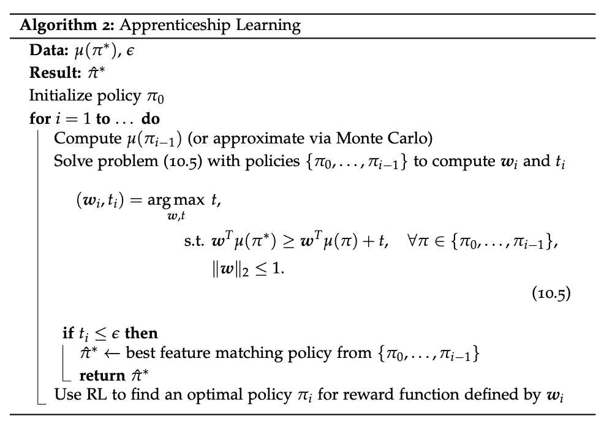

# 共同学习奖励与策略：一个迭代的反向强化学习框架，带有排名合成轨迹

> 原文：[`towardsdatascience.com/jointly-learning-rewards-and-policies-an-iterative-inverse-reinforcement-learning-framework-with-ecf52909e5ef?source=collection_archive---------3-----------------------#2024-11-10`](https://towardsdatascience.com/jointly-learning-rewards-and-policies-an-iterative-inverse-reinforcement-learning-framework-with-ecf52909e5ef?source=collection_archive---------3-----------------------#2024-11-10)

## 一种新颖的可解且可解释的算法，用于从专家演示中学习

 [Hussein Fellahi](https://medium.com/@h.fellahi?source=post_page---byline--ecf52909e5ef--------------------------------)

·发表于 [Towards Data Science](https://towardsdatascience.com/?source=post_page---byline--ecf52909e5ef--------------------------------) ·阅读时间 12 分钟·2024 年 11 月 10 日

--

图片由[Andrea De Santis](https://unsplash.com/@santesson89?utm_source=medium&utm_medium=referral)提供，来源于[Unsplash](https://unsplash.com/?utm_source=medium&utm_medium=referral)

# 介绍

模仿学习（Imitation Learning）近年来在机器学习社区中获得了越来越多的关注，因为它能够通过观察到的行为将专家的知识传递给自主体。一类算法是**行为克隆**（BC），其目标是直接复制专家的演示，将模仿过程视为一种**监督学习**任务，其中自主体试图在给定状态下匹配专家的行为。虽然 BC 方法直观且计算高效，但通常会遭遇过拟合和**较差的泛化能力**问题。

相比之下，**反向强化学习**（IRL）的目标是通过**推断奖励函数**来揭示专家行为背后的潜在意图，这个奖励函数可以解释专家在特定环境下的行为为何是最优的。然而，IRL 的一个重要警告是该问题本质上是**不良条件的**——即存在多个（如果不是可能有无限多个）奖励函数可以使专家的轨迹看起来是最优的。一类广泛采用的方法来解决这种模糊性包括最大熵 IRL 算法，这些算法引入了熵最大化项，以鼓励推断策略中的随机性和鲁棒性。

在本文中，我们选择了一条不同的道路，提出了一种新的迭代式逆强化学习（IRL）算法，该算法仅通过专家演示共同学习**奖励函数**和**最优策略**。通过迭代合成轨迹并**保证其质量不断提高**，我们的方法与传统的 IRL 模型有所不同，提供了一种完全可处理、可解释且高效的解决方案。

文章的组织结构如下：第一部分介绍了逆强化学习（IRL）中的一些基本概念。第二部分概述了我们模型所基于的 IRL 文献中的最新进展。第三部分推导了我们模型收敛的充分条件。这个理论结果是通用的，可以应用于一类算法。第四部分我们正式介绍了完整的模型，最后在第五部分总结了与现有文献的主要差异并提出了进一步的研究方向。

# 1. 背景定义：

首先定义几个概念，从一般的**逆强化学习问题**开始（注意：我们假设与本文使用相同的符号）：

*An* ***逆强化学习（IRL）问题*** *是一个五元组 (S, A, P, γ, τ*)，其中：*

+   *S 是* ***代理可以处于的状态集合***

+   *A 是* ***代理可以采取的行动集合***

+   *P 是* ***转移概率***

+   *γ ∈ (0, 1] 是一个* ***折扣因子***

+   *τ* 是专家演示的集合，即 *τ*ᵢ = (sᵢ, aᵢ) 是专家代理采取的行动序列（有时称为轨迹）*

*逆强化学习的目标是* ***推断奖励函数 R*** *，该函数是从专家轨迹中仅通过 MDP (S, A, R, P, γ) 获得的。假设专家对这个奖励函数有完全的了解，并以最大化其行动奖励的方式进行操作。*

我们还做了一个附加假设，即**奖励函数的线性性**（在 IRL 文献中很常见），即它的形式为：

其中 *ϕ* 是状态-动作空间的**静态**特征映射，*w* 是权重向量。实际上，这个特征映射可以通过经典的机器学习方法（例如 VAE — 请参见[6]中的示例）找到。因此，特征映射可以单独估计，这将 IRL 问题简化为推断权重向量 *w*，而不是完整的奖励函数。

在此背景下，我们最终推导出**特征期望 *μ***，这将在不同的方法中证明是有用的。首先从给定策略 *π* 的值函数开始：

然后我们使用上述引入的奖励函数的线性假设：

同样，*μ* 也可以单独计算 —— 通常通过蒙特卡罗方法。

# 2. 相关工作在 RL 和 IRL 文献中

## 2.1 学徒学习：

从专家演示中学习的一个开创性方法是学徒学习法，首次在[1]中介绍。与纯反向强化学习不同，这里的目标是**同时**找到**最优奖励向量**以及从给定的演示中推断出**专家策略**。我们从以下观察开始：

从数学上看，这可以通过柯西-施瓦茨不等式来理解。这个结果实际上非常强大，因为它使我们能够专注于匹配特征期望，这将保证价值函数的匹配 — **不管奖励权重向量如何**。

在实践中，学徒学习法使用基于**最大边际原则**的迭代算法来逼近*μ(π*)* — 其中*π*是（未知的）专家策略。具体步骤如下：

+   从一个（可能是随机的）初始策略开始，计算其特征期望，并计算专家策略的特征期望，这些专家策略来自演示（通过蒙特卡罗方法估计）

+   对于给定的特征期望，找到能最大化*μ(π*)*和其他*μ(π)*之间边际的权重向量。换句话说，我们希望找到一个权重向量，**尽可能区分**专家策略和训练策略

+   一旦找到这个权重向量*w’*，使用经典的强化学习 — 使用特征映射*ϕ*和*w’*来近似奖励函数 — 来找到下一个训练好的策略

+   重复前两步，直到*μ(π*)*与任何给定策略*μ(π)*之间的最小边际低于某个阈值 — 这意味着在所有训练过的策略中，我们找到了一个在一定ϵ范围内与专家特征期望匹配的策略

更正式地写法：

来源：机器人自主原理 II，第 10 讲 ([2])

## 2.2 带排序的演示的 IRL：

学徒学习中的最大边际原则不对不同轨迹之间的关系做任何假设：当任意一组轨迹达到足够窄的边际时，算法就会停止。然而，演示的亚最优性是反向强化学习中的一个广为人知的问题，尤其是在演示质量的方差上。我们可以利用的附加信息是**演示的排序** — 进而对特征期望进行排序。

更精确地说，考虑排名*{1, …, k}*（从最差到最好）和特征期望*μ₁, …, μₖ*。特征期望*μᵢ*是从排名为*i*的轨迹中计算得出的。我们希望我们的奖励函数**有效地区分不同质量的演示**，即：

在这个背景下，[5]提出了一个**可处理的**问题公式化，转化为一个二次规划（QP），再次使用最大边际原则，即最大化两个不同类别之间的最小边际。形式上：

这实际上与 SVM 模型用于多类分类的优化非常相似。整体优化模型如下——详细内容见[5]：

来源：[5]

## 2.3 基于扰动的奖励外推（D-REX）：

在[4]中提出的 D-REX 算法也使用了这个带排名偏好的 IRL 概念，但应用于**生成**的示范。直觉如下：

+   从专家示范开始，通过行为克隆模仿它们，从而得到一个基准策略*π₀*。

+   通过**注入不同噪声级别**到*π₀*中，生成不同表现度的示范排名集合：在[4]中，作者证明了对于两个噪声级别*ϵ*和*γ*，当*ϵ > γ*（即ϵ比γ“更嘈杂”）时，我们有很高的概率得到*V[π(. | ϵ)] < V[π’. | γ)]-*，其中*π(. | x)*是注入噪声*x*到*π₀*中的策略。

+   给定提供的自动排名，运行基于排名示范的 IRL 方法（T-REX），该方法通过使用**带对偶损失的神经网络训练**来近似奖励函数——更多细节见[3]。

+   利用从 IRL 步骤中得到的奖励函数*R’*的近似，使用*R’*运行一个经典的强化学习方法，以获得最终策略。

更正式地说：

来源：[4]

在[4]中提出的另一个重要理论结果是排名对奖励模糊性的影响：论文设法量化了因增加排名约束而导致的模糊性减少，这优雅地解决了逆强化学习（IRL）中不良问题的本质。

## 2.4 引导强化学习：

如何在拟合**强化学习**模型时利用一些**专家示范**？与其从一个初始的随机策略开始探索，不如考虑利用可用的示范信息——即使它们可能是次优的——作为**热启动**，至少引导强化学习训练的开始。这个想法在[8]中得到了形式化，直觉是：

+   对于每次训练迭代，从专家策略/示范*(πᵍ)*开始——收集“好”的样本，并将智能体置于“好”的状态中。

+   在一个确定的**切换点**之后，让当前训练的策略*(πᵉ)*接管并探索状态——目标是让它**探索专家示范中未曾访问（足够）过的状态**，同时依赖专家对已访问状态的选择。

+   随着进步，*πᵉ*应该更早接管。

更正式地说：

来源：[8]

# 3\. 收敛的充分条件：

在推导完整模型之前，我们建立以下结果，它将提供一个有用的边界 **保证迭代算法中的改进** —— 完整证明见附录：

**定理 1：** *设 (S, A, P, γ, π*) 为具有未知真实奖励函数 R* 的逆强化学习问题。对于使用候选奖励函数 R₁ 和 R₂ 拟合的两个策略 π₁ 和 π₂，形式为 Rᵢ = R* + ϵᵢ，其中 ϵᵢ 是某种误差函数，我们有以下充分条件使得 π₂ 改进 π₁，即 V(π₂, R*) > V(π₁, R*)：*

*其中 TV(π₂, π₁) 是 π₂ 和 π₁ 之间的总变差距离，将策略解释为概率度量。*

该边界提供了一些直观的见解，因为如果我们想要保证在已知策略及其奖励函数上取得改进，边际会随着以下情况增加：

+   两个奖励函数的不同程度

+   两个策略的不同程度

+   原始奖励函数的不精确性

# 4\. 完整的可处理模型

基于前面介绍的模型和定理 1，我们可以推导出我们的新完全可处理模型。直觉是：

+   **初始化：** 从专家轨迹 *(τ*)* 开始，估计初始策略 *π₀*（例如，通过行为克隆），并生成一个代理人跟随 *π₀* 的轨迹 (τ₀)。利用这些轨迹估计奖励权重向量 *w₀*（使得 *R₀ = w₀ ϕ* ）通过第 2.2 节中展示的二次规划来满足 *V(π*, R₀) > V(π₀, R₀)* —— 即此处的排名为：*{2 : τ*, 1: τ₀}*

+   **迭代：** 使用 *wᵢ-₁* 推断策略 *πᵢ*（即 *Rᵢ = wᵢ-₁ϕ*），使得我们有 V*(πᵢ, Rᵢ) > V(πᵢ-₁, Rᵢ-₁)* ***具有足够的边际***，使用引导强化学习。请注意，这里 **我们不一定希望 *πᵢ* 相对于 *Rᵢ* 是最优的**，我们只是希望某个策略能以定理 1 所规定的边际超过当前策略。其背后的原因是我们不希望在 **奖励错误指定**上过拟合。有关此误指定影响的更多细节，请参见 [7]。

+   同样，**生成样本 *τᵢ*** 通过策略 *πᵢ* 并使用可处理的 IRL 模型对以下更新后的排名进行处理：*{i : τ*, i-1: τᵢ, i-2: τᵢ-₁…}*

+   **停止条件：** 当 *V(τ*, wᵢ) — V(τᵢ, wᵢ)* 低于某个阈值 **ϵ** 或二次规划 **不可行**时

严格来说：

该算法做出了一些选择，我们需要牢记：

+   我们做出的一个隐含假设是奖励函数在迭代过程中变得更加精确，即 **噪声项 *ϵᵢ* 的范数逐渐减小并趋向于 0**

+   由于噪声项 *ϵᵢ* 是未知的，我们将其替换为 **预定的边际调度** (*mᵢ)* —— 根据上述假设，我们可以让该调度递减并趋向于 0

+   为什么在 QP 不可行时停止迭代：我们知道 QP 在上一次迭代时**是可行的**，因此使其不可行的主要约束是添加了使用*πᵢ*的轨迹计算的新特征期望*μᵢ*。我们将这种不可行性解释为我们**无法获得足够显著的边际**以区分*μᵢ*和μ，这可能意味着* wᵢ-₁*和*πᵢ*是最优解。

# 5\. 结论和未来工作：

在综合 RL 和 IRL 文献中的多个模型时，这种新的启发式方法在许多方面进行了创新：

+   **完全可处理性**：不使用神经网络进行 IRL 步骤是一种选择，因为它提高了可处理性和可解释性。它还提供了与**QP 可行性**相关的额外见解，可以让算法更早地停止。

+   **效率和易用性**：尽管是一个迭代算法，但每一步的迭代都可以非常高效地完成：QP 可以使用当前的求解器快速求解，RL 步骤只需要**有限的迭代次数**即可满足定理 1 中提出的改进条件。它还提供了额外的灵活性，通过*ϵ*系数，允许用户在需要时“付出”一些次优性以加速收敛。

+   更好地**利用所有可用信息**以最小化噪声：该算法的迭代特性限制了从 IRL 到 RL 的不确定性传播，因为我们总是重新开始拟合（提供了修正的可能性）。引导 RL 步骤还允许**引入对专家示范的健康偏向**。

我们还可以注意到定理 1 是一个**一般性质**，并提供了一个可以应用于大类算法的界限。

进一步的研究自然可以用于扩展该算法。首先，对该算法的**实现和基准测试**与其他方法进行对比，可以提供有趣的见解。另一个方向是深入研究模型的收敛条件，特别是奖励噪声减少的假设。

# 附录：

我们通过类似于[4]中定理 1 的证明，证明了前面引入的定理 1。对于在步骤*i*和*i-1*拟合的两个给定策略，目标不等式为：*V(πᵢ, R*) > V(πᵢ-₁, R*)*。目标是推导出这个不等式成立的充分条件。我们从以下假设开始：

+   *π₁*是使用奖励函数*R₁*在上一次迭代中拟合的策略。

+   RL 步骤使用一种迭代算法形式（例如，值迭代），这意味着在当前迭代中*π₂*也是已知的——即使它只是一个候选策略，如果不符合条件，仍然可以改进。它正在拟合的奖励函数是*R₂*。

+   奖励函数 Rᵢ的形式为：*Rᵢ = R* + ϵ*ᵢ，其中*ϵᵢ*是某种误差函数。

因此，我们得出：

根据所做的假设，*V(π₂, R₂) — V(π₁, R₁)* 在迭代时已知。对于表达式的第二部分，其中涉及*ϵ₁*和*ϵ₂*（这是未知的，因为我们只知道*ϵ₁ — ϵ₂ = R₁ — R₂*），我们推导出其值的上界：

其中*TV(π₁, π₂)*是*π₁*和*π₂*之间的总方差，因为我们将策略解释为概率测量。我们将这个上界重新代入第一个表达式，得到：

因此，这给出了以下条件，以确保策略*π₂*优于*π₁*：

# 参考文献：

[1] P. Abbeel, A. Y. Ng, [通过逆向强化学习进行学徒学习](https://ai.stanford.edu/~ang/papers/icml04-apprentice.pdf) (2004), 斯坦福人工智能实验室

[2] J. Bohg, M. Pavone, D. Sadigh, [机器人自主原理 II](https://web.stanford.edu/class/cs237b/) (2024), 斯坦福 ASL 网站

[3] D. S. Brown, W. Goo, P. Nagarajan, S. Niekum, [通过观察进行逆向强化学习，超越次优示范](https://proceedings.mlr.press/v97/brown19a/brown19a.pdf) (2019), 机器学习研究会论文集

[4] D. S. Brown, W. Goo, P. Nagarajan, S. Niekum, [通过自动排名示范进行优于示范者的模仿学习](https://proceedings.mlr.press/v100/brown20a/brown20a.pdf) (2020), 机器学习研究会论文集

[5] P. S. Castro, S. Li, D. Zhang, [多专家排名逆向强化学习](https://arxiv.org/abs/1907.13411) (2019), arXiv

[6] A. Mandyam, D. Li, D. Cai, A. Jones, B. E. Engelhardt, [核密度贝叶斯逆向强化学习](https://openreview.net/forum?id=B80WUNhTAw) (2024), arXiv

[7] A. Pan, K. Bhatia, J. Steinhardt, [奖励误设定的影响：映射与缓解模型错位](https://arxiv.org/abs/2201.03544) (2022), arXiv

[8] I. Uchendu, T. Xiao, Y. Lu, B. Zhu, M. Yan, J. Simon, M. Bennice, Ch. Fu, C. Ma, J. Jiao, S. Levine, K. Hausman, [跳跃启动强化学习](https://proceedings.mlr.press/v202/uchendu23a.html) (2023), 机器学习研究会论文集
