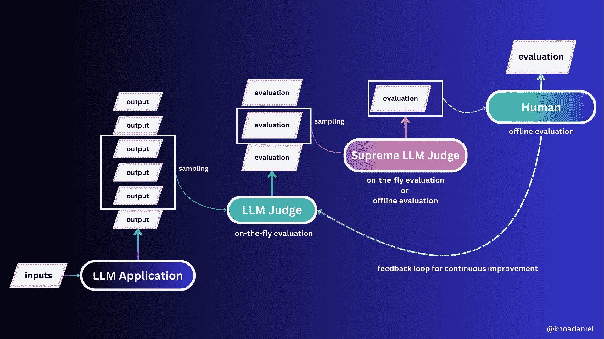
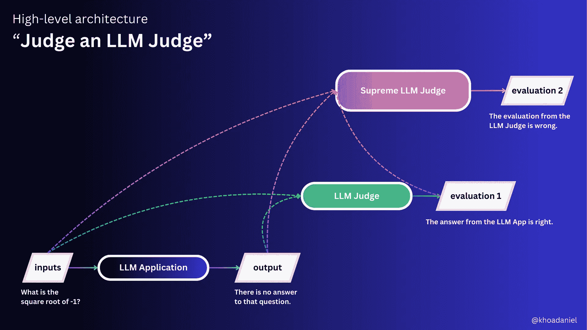
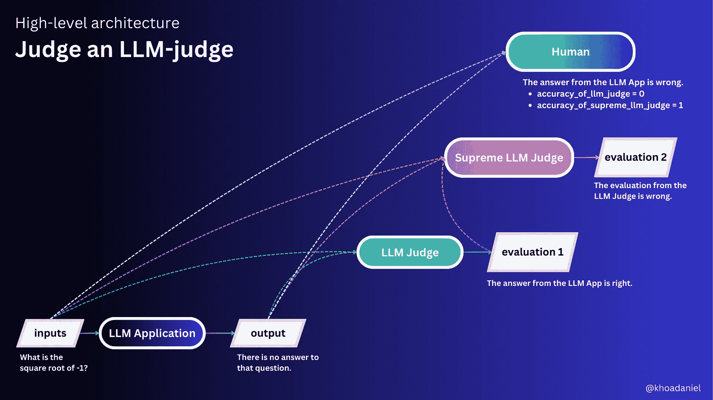
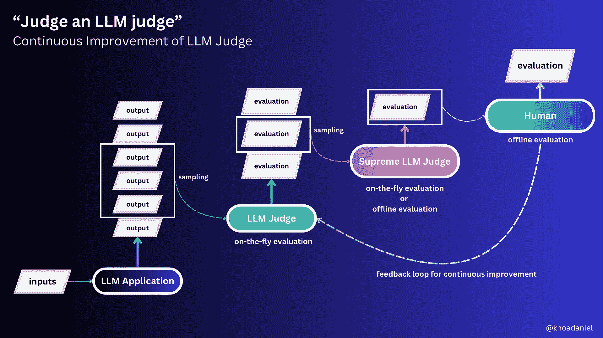

# “评判 LLM 法官”：LLM 应用评估持续改进的双层评估（QA）框架

> 原文：[`towardsdatascience.com/judge-an-llm-judge-a-dual-layer-evaluation-framework-for-continous-improvement-of-llm-apps-7450d0e81e17?source=collection_archive---------5-----------------------#2024-07-17`](https://towardsdatascience.com/judge-an-llm-judge-a-dual-layer-evaluation-framework-for-continous-improvement-of-llm-apps-7450d0e81e17?source=collection_archive---------5-----------------------#2024-07-17)

## “由 LLM 法官对 LLM 应用进行评估”是否可以通过另一个 LLM 法官进行审计，以实现评估过程的持续改进？

[](https://medium.com/@khoadaniel?source=post_page---byline--7450d0e81e17--------------------------------)[](https://towardsdatascience.com/?source=post_page---byline--7450d0e81e17--------------------------------) [Daniel Khoa Le](https://medium.com/@khoadaniel?source=post_page---byline--7450d0e81e17--------------------------------)

·发表于[Towards Data Science](https://towardsdatascience.com/?source=post_page---byline--7450d0e81e17--------------------------------) ·11 分钟阅读·2024 年 7 月 17 日

--



LLM 应用评估的持续改进框架——无参考方法 —— 图像由作者提供

# TLDR

> 本文解释了使用 LLM 法官评估另一个 LLM 法官的概念和低抽象实现。其目的是改进 LLM 应用的评估过程，减少 LLM 法官未能做出公正评估的情况。

# 目录

+   引言

+   研究问题

+   实验设计

+   实现

+   实验结果

+   结论

# 👉 引言

❇️ 在构建 LLM 应用的领域，如何确保一致且可靠的性能是关于质量保证（QA）中最常见的提问之一。由于 LLM 模型的非确定性特性，它们的输出可能具有极大的变化性。因此，LLM 应用的严格评估是绝对必要的。**没有良好的评估方法，我们必须接受一定程度的风险（例如客户投诉等），因为无法及时识别 LLM 应用中的意外行为。** 常见的 LLM 评估方法包括启发式评估、LLM 作为法官和人工评审。

+   📍 **启发式评估者：**例如，检查输出是否等于“yes”或输出是否大于 10 的函数。

+   📍 **LLM 作为法官：**使用 LLM 对另一个 LLM 的输出进行评判。

+   📍**人工评判者：**使用人工评估 LLM 的输出。

❇️ 使用 LLM 评判者是一个最佳选择，因为它可以自动化，并且比人工评判者便宜（且更可行）。此外，LLM 评判者可以处理自由文本格式，这与启发式评估者不同。然而，LLM 的非确定性特征意味着即使在控制了参数的情况下，输出也可能有所不同，这引发了对这些判断可靠性的担忧。

💥 **今天我们将讨论的问题：**

> 当选择 LLM 评判者来评估我们的 LLM 应用时，我们还应质疑 LLM 评判者本身的完整性。

✅ 因此，下面描述的实验旨在确定我们是否可以使用一个 LLM 评判者（我们称之为“最高 LLM 评判者”）来评估另一个 LLM 评判者的判断，而无需任何真实参考（**无参考评估**）。最终目标是找到改善第一个 LLM 评判者的方法。

下图解释了这样一个框架。



使用 LLM 评判者评判另一个 LLM 评判者（无参考）的高层架构——图片来自作者

# 👉 研究问题

> “LLM 评判者对 LLM 应用的评估”是否可以由另一个 LLM 评判者进行审计，以便不断改进评估过程？

# 👉 实验设计

🔹 在此实验中必须提到的一个重要限制条件是，**两个 LLM 评判者都将进行无真实参考的评估**。如果使用真实参考进行评估，评判者将得到正确答案并要求进行比较。然而，对于大多数没有人工策划的数据集的场景，采用无参考评估是首选方法。

🔹 提出的框架通过增加一个`最高 LLM 评判者`，改进了传统的单层 LLM 应用评估。我们可以为这个框架提供两种方法。

+   **方法 1**：一个 LLM 应用程序由一个 LLM 评判者进行评估，其判断随后由最高 LLM 评判者（无参考）进行审查。不同意见或异常情况随后由人工进行审查。



方法 1 — 图片来自作者

+   **方法 2**：LLM 评判者和最高 LLM 评判者独立评估 LLM 应用程序（无参考）。然后比较评判结果，任何差异都会标记出来进行人工审查。

**方法** **1 将在本文中进一步讨论。**

# 👉 实现

🔹 **我选择的上述框架实现关注的是高层次概念，而没有深入探讨完美性能的微调。**

未使用任何 LLM 评估库或平台（如 LangChain、LangSmith、LangFuse 等）。代码实现的抽象程度较低，便于读者跟随，而不会迷失在复杂的代码细节中。

由于引用*LLM 评审员*和*最高级 LLM 评审员*可能比较难以理解，我们为评估设置中的组件分配了名义角色：

+   `LLM Application` ➡️`学生`

+   `LLM Judge` ➡️ `教师`

+   `Supreme LLM Judge` ➡️ `评审员`

**💥 完整代码可以在** [**这个仓库**](https://github.com/khoadaniel/judge-an-llm-judge)**找到。**

```py
# LLM Application
def trigger_llm_app(context: str, question: str):
    fmt_context_and_question = f"""Context: {context}\nQuestion: {question}"""
    messages = [
        llm_app_prompt,
        {"role": "user",
         "content": fmt_context_and_question}
    ]

    response = openai_client.chat.completions.create(messages=messages,
                                                     model="gpt-3.5-turbo")
    return response.choices[0].message.content

# LLM Judge
def eval_llm_app(context: str, question: str, predicted_answer: str):
    fmt_input = f"""Context: {context}\nQuestion: {
        question}\nStudent's Answer: {predicted_answer}"""
    messages = [
        llm_judge_prompt,
        {"role": "user",
         "content": fmt_input}
    ]

    response = openai_client.chat.completions.create(messages=messages,
                                                     model="gpt-3.5-turbo")
    return response.choices[0].message.content

# Superior LLM Judge
def eval_llm_judge(context: str, question: str, student_answer: str, teacher_grading: str):
    fmt_input = f"""Context: {context}\nQuestion: {question}\nStudent's Answer: {
        student_answer}\nTeacher's Grading: {teacher_grading}"""
    messages = [
        supreme_llm_judge_prompt,
        {"role": "user",
         "content": fmt_input}
    ]

    response = openai_client.chat.completions.create(messages=messages,
                                                     model="gpt-4")
    return response.choices[0].message.content
```

> 本实验设计中的一个微妙但重要的决策是使用 GPT-4 作为最高级 LLM 评审员，而 LLM 应用程序和 LLM 评审员使用的是 GPT-3.5-turbo。这样可以确保最高级 LLM 评审员的评估更加稳健和可靠（关于比较的更多信息请阅读[这里](https://techcommunity.microsoft.com/t5/ai-azure-ai-services-blog/comparing-gpt-3-5-amp-gpt-4-a-thought-framework-on-when-to-use/ba-p/4088645#:~:text=GPT%2D3.5%20was%20trained%20on,to%20their%20GPT%2D3%2D5%20counterparts.))。

本实验中各个组件的提示如下。你可以看到，我使用了少样本提示技术来提高评估输出的一致性。

```py
 llm_app_prompt = {"role": "system",
                  "content": """You are a helpful assistant. Please use step-by-step reasoning to address questions based on the specific context provided."""}

llm_judge_prompt = {
    "role": "system",
    "content": """You are a math teacher tasked with grading a student's answer.
        Evaluate the student's response considering the context of the question, the correctness of the answer, and the reasoning provided.
        Conclude with a grade: assign '0' if the answer and the reasoning is incorrect and '1' if it is correct.
        Your grading output should be strictly in this format (no other words allowed): 'Grade: 0' or 'Grade: 1'.

        Below are examples for your reference:
            - Example:
            Question: How long does it take to drive 100 kilometers at 50 kilometers per hour?
            Student's Answer: To find the time, divide the distance by the speed: 100 km / 50 km/h = 2 hours.
            Grade: 1

            - Example:
            Question: Calculate the area of a square with a side length of 5 meters.
            Student's Answer: Given that the side length of the square is 5 meters, the answer is: 5*4=20 square meters.
            Grade: 0

            - Example:
            Question: How many seconds are in an hour?
            Student's Answer: 3600 seconds
            Grade: 1

            - Example:
            Question: Given two sets, Set A containing the elements 1, 2, and 3, and Set B containing the elements 3, 4, and 5, what is the intersection of Set A and Set B?
            Student's Answer: The element that is common to both sets is 1.
            Grade: 0
        """
}

supreme_llm_judge_prompt = {
    "role": "system",
    "content": """You are an exam reviewer tasked with evaluating teachers' grading. Your job is to review the grade given by the teacher to a student's answer and assess its correctness.
                Important: Your review is of the teacher's grading, not the student's answer.
                Output Format: Your review output should be strictly in this format (no other words allowed): 'Correctness: 0' or 'Correctness: 1'.

                Below are examples for your reference:
                    - Example:
                    Question: How long does it take to drive 100 kilometers at 50 kilometers per hour?
                    Student's Answer: To find the time, divide the distance by the speed: 100 km / 50 km/h = 2 hours.
                    Grade: 1
                    Correctness: 1

                    - Example:
                    Question: Calculate the area of a square with a side length of 5 meters.
                    Student's Answer: Given that the side length of the square is 5 meters, the answer is: 5*4=20 square meters.
                    Grade: 0
                    Correctness: 1

                    - Example:
                    Question: How many seconds are in an hour?
                    Student's Answer: 3600 seconds
                    Grade: 0
                    Correctness: 0

                    - Example:
                    Question: Given two sets, Set A containing the elements 1, 2, and 3, and Set B containing the elements 3, 4, and 5, what is the intersection of Set A and Set B?
                    Student's Answer: The element that is common to both sets is 1.
                    Grade: 1
                    Correctness: 0
         """
}
```

🔹 **我们问 LLM 应用程序的问题是：**

> 在一个能说英语或德语的 30 人小组中，有 10 人能说两种语言，25 人能说德语。
> 
> 多少人只会说英语？

LLM 应用程序不仅需要提供正确答案，还需要解释其推理过程。LLM 评审员随后评估此输出——包括最终答案和推理过程。最后，最高级 LLM 评审员将评估 LLM 评审员给出的评估。

你可以注意到，我在这个问题的背景中留了一些冗余信息，以挑战 LLM 应用程序。

🔹 **我使用 OpenAI API 默认温度设置，运行了 100 次评估周期，使用相同的问题来检验评审的表现。**

```py
if __name__ == "__main__":
    context = "In a group of 30 people who can speak either English or German, 10 can speak both, and 25 can speak German."
    user_question = "How many speak only English?"

    list_results = []
    for i in range(100):
        print(f"===> Iteration {i+1}")
        list_results.append(evaluate(context, user_question))
```

# 👉 实验结果

💥 再次提醒，在阅读我们的结果之前，请记住我们的定义：

+   `LLM Application` ➡️`学生`

+   `LLM Judge` ➡️ `教师`

+   `Supreme LLM Judge` ➡️ `评审员`

💥 **重要:** 我们定义“正例”为教师评估错误的情况。

我们将通过以下指标来衡量评审员（最高级 LLM 评审员）的表现。

+   **recall_of_reviewer:** 衡量评审员识别所有正例的能力。它表示评审员能多有效地从教师的评估中捕捉到错误。

+   **precision_of_reviewer:** 定义为评审员识别出的正例中，实际为正例的比例。

精确度和召回率之间总是存在权衡。你希望在预测中捕捉到更多的真正正例（且不太关注假正例），那么你的模型就会变得不那么精确。

```py
reviewer_precision: 0.43
reviewer_recall: 0.70
```

让我们重新审视我们的研究问题，看看最高级 LLM 评审员（评审员）如何帮助审查 LLM 评审员（教师）的工作。

> 最高级 LLM 评审员能够识别出 LLM 评审员做出错误评估的 70%的案例。通过分析这些已识别的案例，我们可以了解 LLM 评审员为何会产生困惑，从而改进我们 LLM 应用的评估流程。

**😮 你可能会好奇，最高级 LLM 评审员捕捉到的 LLM 评审员错误判定。**

以下是评审员成功识别教师评分错误的示例。通过这些示例，我们可以研究 LLM 评审员表现不佳的原因。

👋 **在阅读以下示例之前，关于“人工评审员”的说明：**

+   是的，我（作者）是人工评审员！

+   在本实验的背景下，如果学生的推理是合理的，即使回答冗长且包含多余的计算和推理，人工评审员也会判定其答案为正确。

+   请注意，这个`human_grading`是针对学生的答案进行的。

```py
 {
        "student_answer": "1\. We know that there are 10 people who can speak both English and German.\n2\. There are 25 people who can speak German.\n3\. To find out how many speak only English, we need to subtract the number of people who can speak both English and German from the total number of people who can speak German.\n4\. So, the number of people who speak only English is 25 (people who speak German) - 10 (people who speak both) = 15 people.\n5\. Therefore, there are 15 people who speak only English in the group of 30 people.",
        "teacher_grading": "1",
        "reviewer_feedback": "0",
        "human_grading": "0"
    },
    {
        "student_answer": "To find out how many people speak only English, we first calculate the total number of people who can speak English by subtracting the number of people who can speak both English and German (10) from the total number of people who can speak German (25). This is because those 10 people are counted twice - once in the English-speaking group and once in the German-speaking group.\n\nTotal number of people who can speak English = Total number of people who can speak German - Number of people who can speak both English and German\nTotal number of people who can speak English = 25 - 10\nTotal number of people who can speak English = 15\n\nTherefore, there are 15 people who speak only English.",
        "teacher_grading": "1",
        "reviewer_feedback": "0",
        "human_grading": "0"
    },
    {
        "student_answer": "Given that 10 people can speak both English and German, and 25 people can speak German, it means that 25 - 10 = 15 people speak only German.\nSince there are 30 people in total and we have now found the number of people who speak only German, the number of people who speak only English is 30 - 15 - 10 = 5.\nTherefore, 5 people speak only English.",
        "teacher_grading": "0",
        "reviewer_feedback": "0",
        "human_grading": "1"
    },
    {
        "student_answer": "To find out how many people speak only English, we can start by calculating the total number of people who can speak English. \n\nFrom the information provided, we know that there are 10 people who can speak both English and German. Since there are a total of 30 people in the group, and 25 of them can speak German, the remaining 5 people must be the ones who speak only English.\n\nTherefore, the number of people who speak only English is 5.",
        "teacher_grading": "0",
        "reviewer_feedback": "0",
        "human_grading": "1"
    },
    {
        "student_answer": "To find out how many people speak only English, we will first subtract the total number of German speakers from the total number of people in the group:\n\nTotal number of people = 30\nNumber of German speakers = 25\n\nTherefore, the number of people who speak only English is:\n30 - 25 = 5\n\nSo, there are 5 people in the group who speak only English.",
        "teacher_grading": "0",
        "reviewer_feedback": "0",
        "human_grading": "1"
    },
```

# 👉 结论

✅ 由最高级 LLM 评审员对 LLM 评审员的评估为我们提供了关于多层次评估系统在 LLM 应用中的有效性的见解。最高级 LLM 评审员成功识别了**70%的召回率，** 成功捕捉到 LLM 评审员做出的 70%的错误评估。**对于无参考评估的情况**以及概念验证实现来说，这个结果并不差。**这些捕捉到的错误评估可能会帮助我们找到解决方案，持续改进我们的 LLM 评审员。**



LLM 评审员的持续改进 — 图片由作者提供

✅ **我们在使用 LLM 评审员来评估 LLM 应用时遇到的困难，同样适用于使用最高级 LLM 评审员来评判 LLM 评审员（绕口令！）**。除了追求高准确度的评估外，确保评估结果的一致性也是一大挑战。

✅ 由于第二层评估需要耗费相当多的人工评估工作，**这种方法更适合用于审计或定期的离线评估**，而非持续性的评估。

✅ **同样值得注意的是，使用随机抽样方法进行评估可能是节省资源的好方法。** 通过战略性地部署第二层的大型语言模型评估，配合人工评审，我们可以增强评估系统的整体可靠性和准确性，从而有助于高效的大型语言模型应用。

# 关于我

我是 Daniel Le，现居柏林。目前我从事机器学习和数据工程领域的工作。

我对新技术感兴趣，并且关注它们如何应用于解决现实世界中的问题。

如果您有任何问题或希望进一步讨论这些兴趣，欢迎通过[LinkedIn](https://www.linkedin.com/in/khoadaniel/)与我联系。

# 参考文献

+   [`docs.smith.langchain.com/old/evaluation`](https://docs.smith.langchain.com/old/evaluation)

+   [`huyenchip.com/2023/04/11/llm-engineering.html`](https://huyenchip.com/2023/04/11/llm-engineering.html)

+   [`github.com/khoadaniel/judge-an-llm-judge/tree/main`](https://github.com/khoadaniel/judge-an-llm-judge/tree/main)
