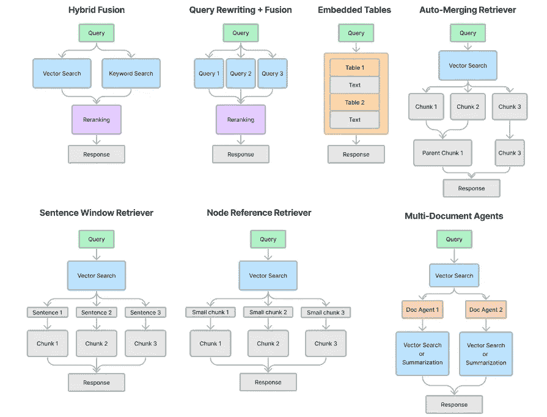

# 使用高级检索 LlamaPacks 启动您的 RAG 流水线，并通过 Lighthouz AI 进行基准测试

> 原文：[`towardsdatascience.com/jump-start-your-rag-pipelines-with-advanced-retrieval-llamapacks-and-benchmark-with-lighthouz-ai-80a09b7c7d9d?source=collection_archive---------4-----------------------#2024-01-29`](https://towardsdatascience.com/jump-start-your-rag-pipelines-with-advanced-retrieval-llamapacks-and-benchmark-with-lighthouz-ai-80a09b7c7d9d?source=collection_archive---------4-----------------------#2024-01-29)

## 探索使用 LlamaPacks、Lighthouz AI 和 Llama Guard 开发强大的 RAG

 [Wenqi Glantz](https://medium.com/@wenqiglantz?source=post_page---byline--80a09b7c7d9d--------------------------------)

·发表于 [Towards Data Science](https://towardsdatascience.com/?source=post_page---byline--80a09b7c7d9d--------------------------------) ·12 分钟阅读·2024 年 1 月 29 日

--

由作者使用 DALL-E 3 生成的图片

自 2023 年 11 月下旬发布以来，LlamaPacks 已策划了超过 50 个包，帮助启动您的 RAG 流水线开发。在这些包中，许多高级检索包应运而生。在本文中，我们将深入探讨七个高级检索包；请参见下方的图表。

图片来源：[LlamaIndex 关于七个高级检索 LlamaPacks 的推文](https://twitter.com/llama_index/status/1729303619760259463)

我们将执行两个步骤：

+   给定一个使用场景，我们将使用 Lighthouz AutoBench 生成基准测试，并通过 Lighthouz Eval Studio 评估这些包，以确定从 LLM 安全角度哪个最适合我们的使用场景。

+   一旦确定了最优包，我们将把 Llama Guard 加入 RAG 流水线，调整其自定义分类法，重新通过 Eval Studio 评估，并观察诸如提示注入等类别的评估分数如何变化。

# 用于高级检索的 LlamaPacks

首先，让我们看看这七个高级检索 LlamaPacks，了解它们如何在…
