# K 最近邻分类器解析：初学者的可视化指南与代码示例

> 原文：[`towardsdatascience.com/k-nearest-neighbor-classifier-explained-a-visual-guide-with-code-examples-for-beginners-a3d85cad00e1?source=collection_archive---------2-----------------------#2024-08-20`](https://towardsdatascience.com/k-nearest-neighbor-classifier-explained-a-visual-guide-with-code-examples-for-beginners-a3d85cad00e1?source=collection_archive---------2-----------------------#2024-08-20)

## 分类算法

## 机器学习中的友好邻居方法

[](https://medium.com/@samybaladram?source=post_page---byline--a3d85cad00e1--------------------------------)[](https://towardsdatascience.com/?source=post_page---byline--a3d85cad00e1--------------------------------) [Samy Baladram](https://medium.com/@samybaladram?source=post_page---byline--a3d85cad00e1--------------------------------)

·发表于 [Towards Data Science](https://towardsdatascience.com/?source=post_page---byline--a3d85cad00e1--------------------------------) ·阅读时间：8 分钟·2024 年 8 月 20 日

--

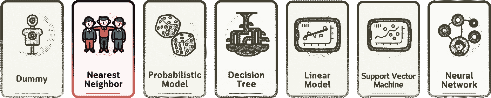

`⛳️ 更多分类算法解析：· 虚拟分类器 ▶ K 最近邻分类器 · 伯努利朴素贝叶斯 · 高斯朴素贝叶斯 · 决策树分类器 · 逻辑回归 · 支持向量分类器 · 多层感知机`

想象一种方法，通过查看之前见过的最相似的例子来做出预测。这就是最近邻分类器的本质——一个简单而直观的算法，它为机器学习带来了一丝现实世界的逻辑。

虽然 [虚拟分类器](https://medium.com/towards-data-science/dummy-classifier-explained-a-visual-guide-with-code-examples-for-beginners-009ff95fc86e)设定了最低的性能标准，但最近邻方法模仿了我们在日常生活中做决策的方式：通过回忆类似的过去经历。这就像是问你的邻居今天根据天气如何穿衣，从而决定你应该穿什么。在数据科学领域，这个分类器通过检查最接近的数据点来做出预测。


所有视觉元素：作者使用 Canva Pro 创建。已优化为适合移动设备；在桌面上可能会显得过大。

# 定义

K 最近邻分类器是一个机器学习模型，它根据特征空间中 K 个最近数据点的多数类别来做出预测。KNN 算法假设相似的事物会存在于近距离内，这使得它直观且易于理解。

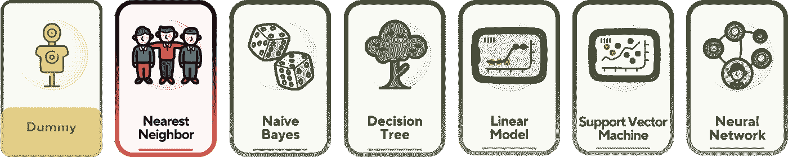

最近邻方法是机器学习中最简单的算法之一。

# 📊 使用的数据集

在本文中，我们将使用这个简单的人工高尔夫数据集（灵感来自 [1]）作为例子。这个数据集预测一个人是否会根据天气条件打高尔夫。它包括天气、温度、湿度和风等特征，目标变量是是否打高尔夫。

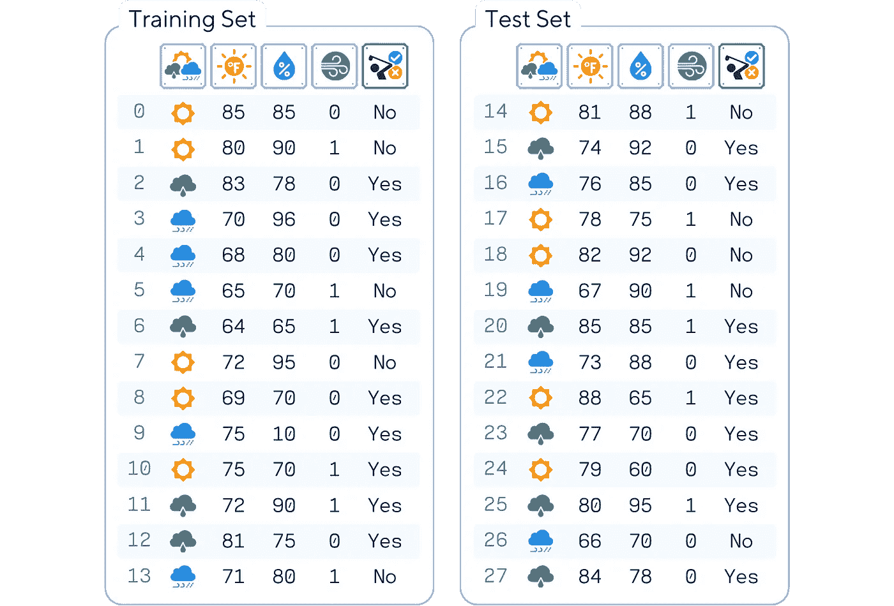

列：‘Outlook’（天气）、‘Temperature’（温度）、‘Humidity’（湿度）、‘Wind’（风）和‘Play’（目标特征）

```py
# Import libraries
from sklearn.model_selection import train_test_split
from sklearn.metrics import accuracy_score
import pandas as pd
import numpy as np

# Make the dataset
dataset_dict = {
    'Outlook': ['sunny', 'sunny', 'overcast', 'rainy', 'rainy', 'rainy', 'overcast', 'sunny', 'sunny', 'rainy', 'sunny', 'overcast', 'overcast', 'rainy', 'sunny', 'overcast', 'rainy', 'sunny', 'sunny', 'rainy', 'overcast', 'rainy', 'sunny', 'overcast', 'sunny', 'overcast', 'rainy', 'overcast'],
    'Temperature': [85.0, 80.0, 83.0, 70.0, 68.0, 65.0, 64.0, 72.0, 69.0, 75.0, 75.0, 72.0, 81.0, 71.0, 81.0, 74.0, 76.0, 78.0, 82.0, 67.0, 85.0, 73.0, 88.0, 77.0, 79.0, 80.0, 66.0, 84.0],
    'Humidity': [85.0, 90.0, 78.0, 96.0, 80.0, 70.0, 65.0, 95.0, 70.0, 80.0, 70.0, 90.0, 75.0, 80.0, 88.0, 92.0, 85.0, 75.0, 92.0, 90.0, 85.0, 88.0, 65.0, 70.0, 60.0, 95.0, 70.0, 78.0],
    'Wind': [False, True, False, False, False, True, True, False, False, False, True, True, False, True, True, False, False, True, False, True, True, False, True, False, False, True, False, False],
    'Play': ['No', 'No', 'Yes', 'Yes', 'Yes', 'No', 'Yes', 'No', 'Yes', 'Yes', 'Yes', 'Yes', 'Yes', 'No', 'No', 'Yes', 'Yes', 'No', 'No', 'No', 'Yes', 'Yes', 'Yes', 'Yes', 'Yes', 'Yes', 'No', 'Yes']
}
original_df = pd.DataFrame(dataset_dict)

print(original_df)
```

KNN 算法要求首先对数据进行缩放。[将类别列转换](https://encoding-categorical-data-explained-a-visual-guide-with-code-example-for-beginners-b169ac4193ae)为 0 和 1，并且 [缩放数值特征](https://scaling-numerical-data-explained-a-visual-guide-with-code-examples-for-beginners-11676cdb45cb)，以确保没有单个特征主导距离度量。

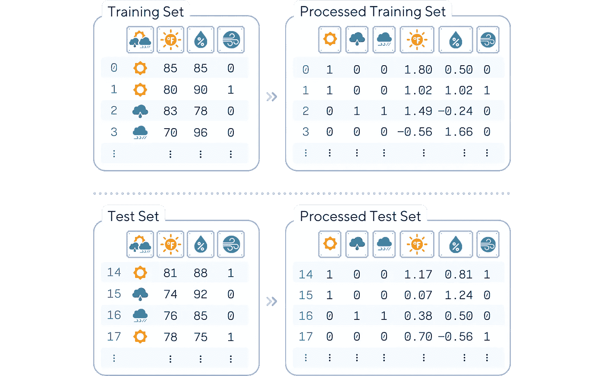

类别列（天气和风）使用独热编码进行编码，而数值列则使用标准化缩放（z 标准化）。此过程分别在训练集和测试集上进行。

```py
from sklearn.model_selection import train_test_split
from sklearn.preprocessing import StandardScaler

# Preprocess data
df = pd.get_dummies(original_df, columns=['Outlook'], prefix='', prefix_sep='', dtype=int)
df['Wind'] = df['Wind'].astype(int)
df['Play'] = (df['Play'] == 'Yes').astype(int)
df = df[['sunny','rainy','overcast','Temperature','Humidity','Wind','Play']]

# Split data and standardize features
X, y = df.drop(columns='Play'), df['Play']
X_train, X_test, y_train, y_test = train_test_split(X, y, train_size=0.5, shuffle=False)

scaler = StandardScaler()
float_cols = X_train.select_dtypes(include=['float64']).columns
X_train[float_cols] = scaler.fit_transform(X_train[float_cols])
X_test[float_cols] = scaler.transform(X_test[float_cols])

# Print results
print(pd.concat([X_train, y_train], axis=1).round(2), '\n')
print(pd.concat([X_test, y_test], axis=1).round(2), '\n')
```

# 主要机制

KNN 分类器通过找到离新数据点最近的 K 个邻居，然后对这些邻居中最常见的类别进行投票来进行工作。以下是其工作原理：

1.  计算新数据点与训练集中的所有点之间的距离。

1.  根据这些距离选择 K 个最近的邻居。

1.  对这 K 个邻居的类别进行多数投票。

1.  将多数类别分配给新数据点。


对于我们的高尔夫数据集，KNN 分类器可能会查看过去 5 个最相似的天气条件，以预测某人今天是否会打高尔夫。

# 训练步骤

与许多其他算法不同，KNN 没有明确的训练阶段。相反，它记住整个训练数据集。以下是其过程：

1.  选择一个 K 值（要考虑的邻居数量）。

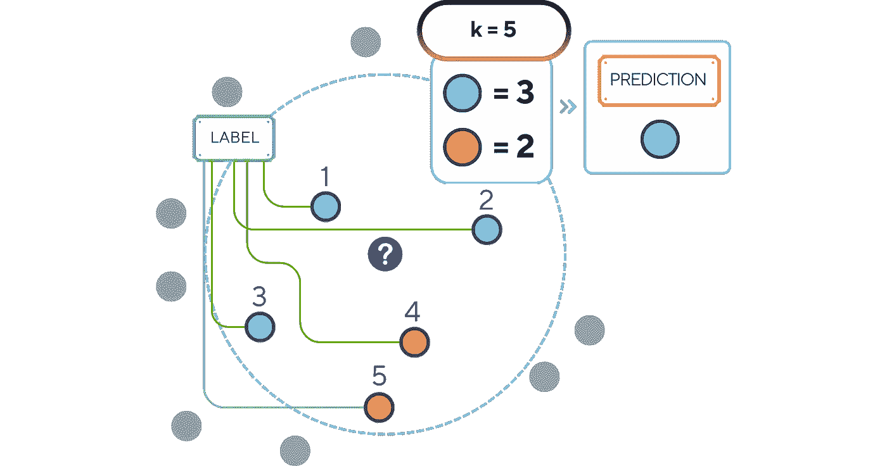

在 2D 设置中，就像是找出最接近的颜色的多数。

```py
from sklearn.neighbors import KNeighborsClassifier

# Select the Number of Neighbors ('k')
k = 5
```

2\. 选择一个距离度量（例如，欧几里得距离、曼哈顿距离）。

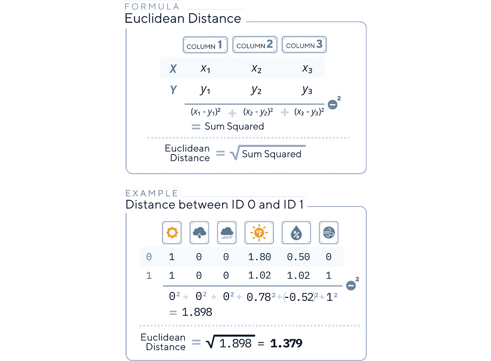

最常见的距离度量是欧几里得距离。这就像是找出两个点之间的直线距离。

```py
import numpy as np

# Choose a Distance Metric
distance_metric = 'euclidean'

# Trying to calculate distance between ID 0 and ID 1
print(np.linalg.norm(X_train.loc[0].values - X_train.loc[1].values))
```

3\. 存储/记住所有训练数据点及其对应的标签。

```py
# Initialize the k-NN Classifier
knn_clf = KNeighborsClassifier(n_neighbors=k, metric=distance_metric)

# "Train" the kNN (although no real training happens)
knn_clf.fit(X_train, y_train)
```

# 分类步骤

一旦最近邻分类器被“训练”（即训练数据已存储），它将如何为新实例做出预测：

1.  **距离计算**：对于新的实例，使用选择的距离度量计算其与所有存储的训练实例之间的距离。

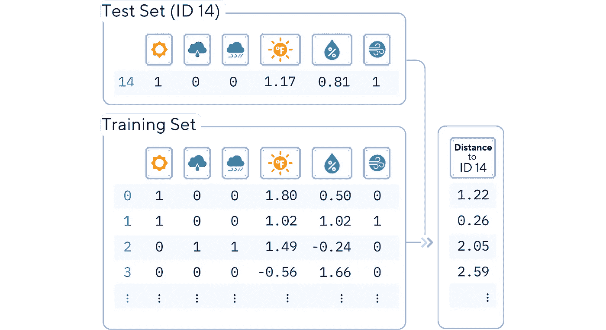

对于 ID 14，我们计算其与训练集每个成员（ID 0 — ID 13）之间的距离。

```py
from scipy.spatial import distance

# Compute the distances from the first row of X_test to all rows in X_train
distances = distance.cdist(X_test.iloc[0:1], X_train, metric='euclidean')

# Create a DataFrame to display the distances
distance_df = pd.DataFrame({
    'Train_ID': X_train.index,
    'Distance': distances[0].round(2),
    'Label': y_train
}).set_index('Train_ID')

print(distance_df.sort_values(by='Distance'))
```

2\. **邻居选择与预测**：基于计算的距离，识别 K 个最近的邻居，然后将这些邻居中最常见的类作为新实例的预测类。

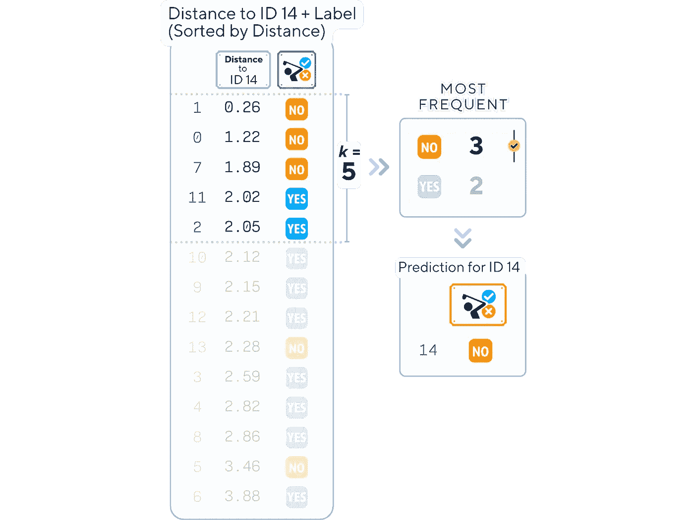

在计算了它与所有存储数据点的距离，并按从低到高排序后，我们识别出 5 个最近的邻居（前 5）。如果这些邻居中大多数（3 个或更多）标记为“NO”，我们为 ID 14 预测“NO”。

```py
# Use the k-NN Classifier to make predictions
y_pred = knn_clf.predict(X_test)
print("Label     :",list(y_test))
print("Prediction:",list(y_pred))
```

# 评估步骤

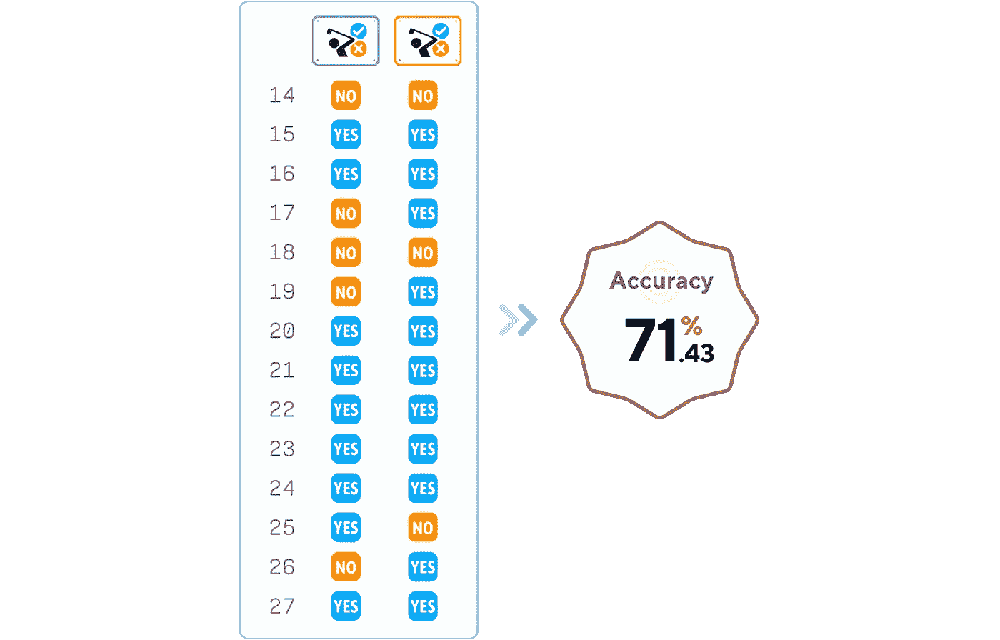

通过这个简单的模型，我们能获得足够好的准确性，远远优于[随机猜测](https://medium.com/towards-data-science/dummy-classifier-explained-a-visual-guide-with-code-examples-for-beginners-009ff95fc86e)!

```py
from sklearn.metrics import accuracy_score

# Evaluation Phase
accuracy = accuracy_score(y_test, y_pred)
print(f'Accuracy: {accuracy.round(4)*100}%')
```

# 关键参数

虽然 KNN 在概念上简单，但它确实有一些重要的参数：

1.  **K**：要考虑的邻居数量。较小的 K 值可能导致对噪声敏感的结果，而较大的 K 值可能会平滑决策边界。

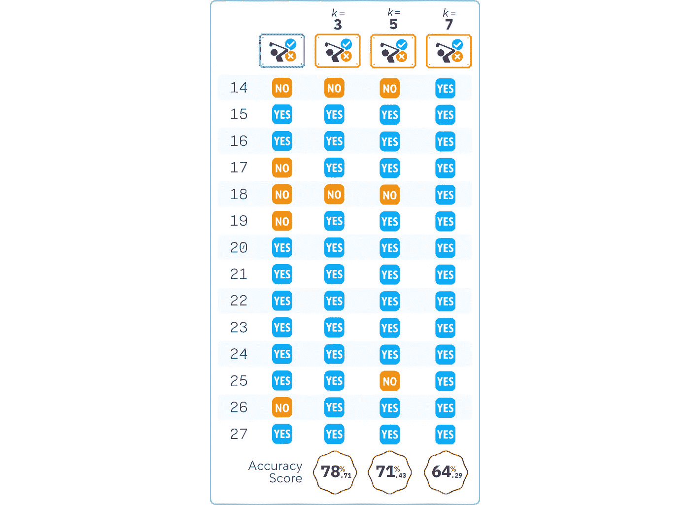

k 值越大，越有可能选择大多数类（“YES”）。

```py
labels, predictions, accuracies = list(y_test), [], []

k_list = [3, 5, 7]
for k in k_list:
    knn_clf = KNeighborsClassifier(n_neighbors=k)
    knn_clf.fit(X_train, y_train)
    y_pred = knn_clf.predict(X_test)
    predictions.append(list(y_pred))
    accuracies.append(accuracy_score(y_test, y_pred).round(4)*100)

df_predictions = pd.DataFrame({'Label': labels})
for k, pred in zip(k_list, predictions):
    df_predictions[f'k = {k}'] = pred

df_accuracies = pd.DataFrame({'Accuracy ': accuracies}, index=[f'k = {k}' for k in k_list]).T

print(df_predictions)
print(df_accuracies)
```

2\. **距离度量**：这决定了点与点之间相似度的计算方式。常见选项包括：

+   欧几里得距离（直线距离）

+   曼哈顿距离（绝对差值之和）

+   闵可夫斯基距离（欧几里得距离和曼哈顿距离的泛化）

3\. **权重函数**：这决定了如何对每个邻居的贡献进行加权。选项包括：

+   ‘uniform’：所有邻居的权重相等。

+   ‘distance’：较近的邻居比较远的邻居对结果有更大的影响。

# 优缺点

就像机器学习中的任何算法一样，KNN 也有其优点和局限性。

## 优点：

1.  **简洁性**：容易理解和实现。

1.  **无假设**：不对数据分布做任何假设。

1.  **多功能性**：可以用于分类和回归任务。

1.  **无需训练阶段**：可以快速整合新数据，无需重新训练。

## 缺点：

1.  **计算开销大**：每次预测时需要计算所有训练样本的距离。

1.  **内存密集型**：需要存储所有训练数据。

1.  **对无关特征敏感**：可能会受到与分类无关的特征的干扰。

1.  **维度灾难**：在高维空间中，性能会下降。

# 最后备注

K 最近邻（KNN）分类器作为机器学习中的基础算法，因其直观且高效的分类方法而脱颖而出。其简单性使其成为初学者的理想起点，而其多功能性确保了对经验丰富的数据科学家的价值。KNN 的强大之处在于，它能够根据数据点的接近度进行预测，无需复杂的训练过程。

然而，必须记住，KNN 只是庞大机器学习工具箱中的一个工具。在数据科学旅程中前进时，可以将 KNN 作为理解更复杂算法的垫脚石，在选择模型时始终考虑你的数据特性和问题需求。通过掌握 KNN，你将获得对分类技术的宝贵见解，为应对更复杂的机器学习挑战奠定坚实的基础。

# 🌟 k 最近邻分类器代码总结

```py
# Import libraries
import pandas as pd
from sklearn.neighbors import KNeighborsClassifier
from sklearn.model_selection import train_test_split
from sklearn.preprocessing import StandardScaler
from sklearn.metrics import accuracy_score

# Load data
dataset_dict = {
    'Outlook': ['sunny', 'sunny', 'overcast', 'rainy', 'rainy', 'rainy', 'overcast', 'sunny', 'sunny', 'rainy', 'sunny', 'overcast', 'overcast', 'rainy', 'sunny', 'overcast', 'rainy', 'sunny', 'sunny', 'rainy', 'overcast', 'rainy', 'sunny', 'overcast', 'sunny', 'overcast', 'rainy', 'overcast'],
    'Temperature': [85.0, 80.0, 83.0, 70.0, 68.0, 65.0, 64.0, 72.0, 69.0, 75.0, 75.0, 72.0, 81.0, 71.0, 81.0, 74.0, 76.0, 78.0, 82.0, 67.0, 85.0, 73.0, 88.0, 77.0, 79.0, 80.0, 66.0, 84.0],
    'Humidity': [85.0, 90.0, 78.0, 96.0, 80.0, 70.0, 65.0, 95.0, 70.0, 80.0, 70.0, 90.0, 75.0, 80.0, 88.0, 92.0, 85.0, 75.0, 92.0, 90.0, 85.0, 88.0, 65.0, 70.0, 60.0, 95.0, 70.0, 78.0],
    'Wind': [False, True, False, False, False, True, True, False, False, False, True, True, False, True, True, False, False, True, False, True, True, False, True, False, False, True, False, False],
    'Play': ['No', 'No', 'Yes', 'Yes', 'Yes', 'No', 'Yes', 'No', 'Yes', 'Yes', 'Yes', 'Yes', 'Yes', 'No', 'No', 'Yes', 'Yes', 'No', 'No', 'No', 'Yes', 'Yes', 'Yes', 'Yes', 'Yes', 'Yes', 'No', 'Yes']
}
df = pd.DataFrame(dataset_dict)

# Preprocess data
df = pd.get_dummies(df, columns=['Outlook'], prefix='', prefix_sep='', dtype=int)
df['Wind'] = df['Wind'].astype(int)
df['Play'] = (df['Play'] == 'Yes').astype(int)

# Split data
X, y = df.drop(columns='Play'), df['Play']
X_train, X_test, y_train, y_test = train_test_split(X, y, train_size=0.5, shuffle=False)

# Standardize features
scaler = StandardScaler()
float_cols = X_train.select_dtypes(include=['float64']).columns
X_train[float_cols] = scaler.fit_transform(X_train[float_cols])
X_test[float_cols] = scaler.transform(X_test[float_cols])

# Train model
knn_clf = KNeighborsClassifier(n_neighbors=3, metric='euclidean')
knn_clf.fit(X_train, y_train)

# Predict and evaluate
y_pred = knn_clf.predict(X_test)
print(f"Accuracy: {accuracy_score(y_test, y_pred)}")
```

## 进一步阅读

若想详细了解 [KNeighborsClassifier](https://scikit-learn.org/stable/modules/generated/sklearn.neighbors.KNeighborsClassifier.html) 及其在 scikit-learn 中的实现，读者可以参考官方文档 [2]，该文档提供了关于其用法和参数的详细信息。

## 技术环境

本文使用 Python 3.7 和 scikit-learn 1.5。虽然所讨论的概念通常适用，但不同版本之间的具体代码实现可能会有所不同。

## 插图说明

除非另有说明，所有图片均由作者创作，融合了 Canva Pro 的授权设计元素。

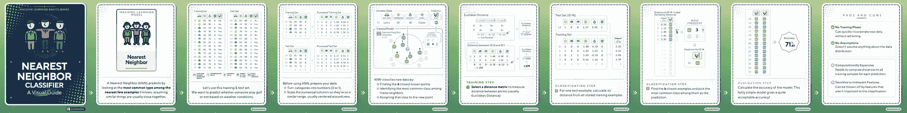

如需简明的 K 最近邻视觉总结，请查看 [配套 Instagram 帖子。](https://www.instagram.com/p/C-ssgsAyFSI)

## 参考文献

[1] T. M. Mitchell, [机器学习](https://www.cs.cmu.edu/afs/cs.cmu.edu/user/mitchell/ftp/mlbook.html)（1997），麦格劳-希尔科学/工程/数学， 第 59 页

𝙎𝙚𝙚 𝙢𝙤𝙧𝙚 𝘾𝙡𝙖𝙨𝙨𝙞𝙛𝙞𝙘𝙖𝙩𝙞𝙤𝙣 𝘼𝙡𝙜𝙤𝙧𝙞𝙩𝙝𝙢𝙨 𝙝𝙚𝙧𝙚:


[Samy Baladram](https://medium.com/@samybaladram?source=post_page-----a3d85cad00e1--------------------------------)

## 分类算法

[查看列表](https://medium.com/@samybaladram/list/classification-algorithms-b3586f0a772c?source=post_page-----a3d85cad00e1--------------------------------)8 个故事

𝙔𝙤𝙪 𝙢𝙞𝙜𝙝𝙩 𝙖𝙡𝙨𝙤 𝙡𝙞𝙠𝙚:


[Samy Baladram](https://medium.com/@samybaladram?source=post_page-----a3d85cad00e1--------------------------------)

## 回归算法

[查看列表](https://medium.com/@samybaladram/list/regression-algorithms-b0b6959f1b39?source=post_page-----a3d85cad00e1--------------------------------)5 个故事

[Samy Baladram](https://medium.com/@samybaladram?source=post_page-----a3d85cad00e1--------------------------------)

## 集成学习

[查看列表](https://medium.com/@samybaladram/list/ensemble-learning-673fc83cd7db?source=post_page-----a3d85cad00e1--------------------------------)4 个故事
