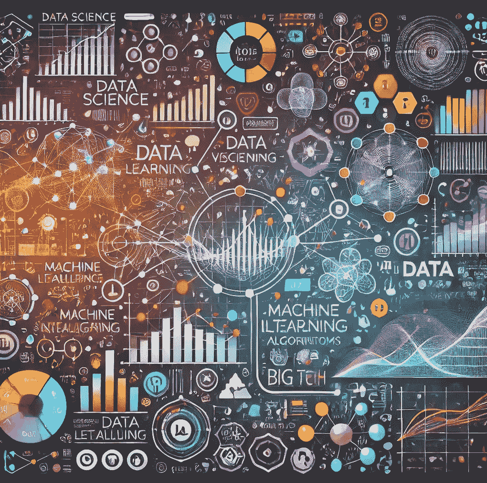

# 启动你的数据科学之旅——数据科学家入门指南

> 原文：[`towardsdatascience.com/kickstart-your-data-science-journey-a-guide-for-aspiring-data-scientists-96e5072bd19a?source=collection_archive---------3-----------------------#2024-11-06`](https://towardsdatascience.com/kickstart-your-data-science-journey-a-guide-for-aspiring-data-scientists-96e5072bd19a?source=collection_archive---------3-----------------------#2024-11-06)

## 启动数据科学职业生涯所需的关键技术技能

 [Saankhya Mondal](https://saankhya.medium.com/?source=post_page---byline--96e5072bd19a--------------------------------)

·发表于[Towards Data Science](https://towardsdatascience.com/?source=post_page---byline--96e5072bd19a--------------------------------) ·15 分钟阅读·2024 年 11 月 6 日

--

你对数据科学感到好奇吗？数学和人工智能让你兴奋吗？你想探索数据科学并计划从事数据科学职业吗？无论你不确定从哪里开始，还是刚刚迈出数据科学的第一步，你都来对地方了。相信我，这份指南将帮助你自信地迈出第一步！

非会员可以点击[这里](https://medium.com/towards-data-science/kickstart-your-data-science-journey-a-guide-for-aspiring-data-scientists-96e5072bd19a?sk=fc5e1cd546b7b858925252b2f09214a8)阅读完整文章。

数据科学是最令人兴奋的工作领域之一。它是一个多学科的领域，结合了各种技术和工具来分析复杂的数据集，构建预测模型，并在商业、研究和技术中指导决策。

数据科学应用于多个行业，如金融、医疗、社交媒体、旅游、电子商务、机器人、军事和间谍活动。

使用 GPT 4o 生成的图像

# 关于数据科学的神话与真相

互联网上有大量关于如何开始数据科学的资料，这也导致了关于数据科学的神话和误解。最重要的两个误解是——
