# 了解 Kolmogorov–Arnold 网络（KAN）

> 原文：[`towardsdatascience.com/kolmogorov-arnold-networks-kan-e317b1b4d075?source=collection_archive---------1-----------------------#2024-05-07`](https://towardsdatascience.com/kolmogorov-arnold-networks-kan-e317b1b4d075?source=collection_archive---------1-----------------------#2024-05-07)

## 为什么 KAN 有可能成为 MLP 和当前机器学习格局的替代方案？让我们通过论文来一探究竟。

 [Hesam Sheikh](https://medium.com/@itshesamsheikh?source=post_page---byline--e317b1b4d075--------------------------------)

·发表于[Towards Data Science](https://towardsdatascience.com/?source=post_page---byline--e317b1b4d075--------------------------------) ·10 分钟阅读·2024 年 5 月 7 日

--

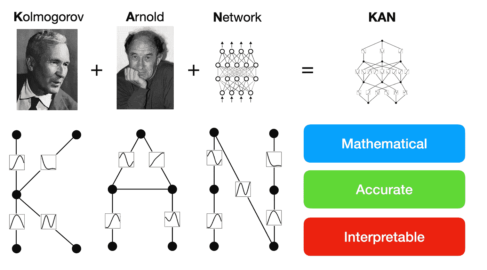

一篇名为[**KAN：Kolmogorov–Arnold 网络**](https://arxiv.org/abs/2404.19756)的新研究论文在机器学习社区中引发了热议。它为神经网络提供了新的视角，并提出了一个可能替代多层感知机（MLP）的方案，MLP 是当前机器学习的基石。

*✨这是付费文章。如果你不是 Medium 会员，你可以在我的通讯中免费阅读此文：* [***Qiubyte***](https://hesamsheikh.substack.com/)***.***

受[**Kolmogorov-Arnold 表示定理**](https://en.wikipedia.org/wiki/Kolmogorov%E2%80%93Arnold_representation_theorem)的启发，KAN 与传统的多层感知机（MLP）不同，它通过将**固定激活函数**替换为**可学习的函数**，有效地消除了线性权重矩阵的需求。

如果你对更细节的内容和实验感兴趣，我强烈建议阅读这篇论文。不过，如果你更喜欢简洁的介绍，我已经准备了这篇文章来解释 KAN 的核心要点。

+   *注：本文中使用的图片/图形来源于“KAN：Kolmogorov–Arnold 网络”论文，除非另有说明。*

# 理论

这些新型网络的理论支柱是一位由两位苏联数学家[弗拉基米尔·阿诺德](https://en.wikipedia.org/wiki/Vladimir_Arnold)和[安德烈·柯尔莫哥洛夫](https://en.wikipedia.org/wiki/Andrey_Kolmogorov)提出的理论。

> 在[安德烈·科尔莫哥洛夫](https://en.wikipedia.org/wiki/Andrey_Kolmogorov)的指导下，阿诺德在 1957 年证明了任何多个变量的连续函数都可以通过有限个二元函数构造出来，从而解决了[希尔伯特第十三问题](https://en.wikipedia.org/wiki/Hilbert%27s_thirteenth_problem)。（来源：[维基百科](https://en.wikipedia.org/wiki/Vladimir_Arnold)）

他们所研究并最终发展的理论是基于多变量连续函数的概念。根据这个理论，任何多变量连续函数**f**都可以写成若干个单变量连续函数的有限组合，并将其相加。

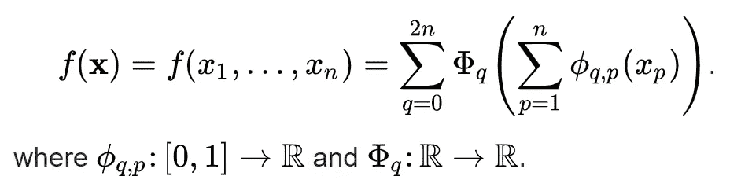

科尔莫哥洛夫–阿诺德表示定理的数学公式。（来源：[维基百科](https://en.wikipedia.org/wiki/Kolmogorov%E2%80%93Arnold_representation_theorem)）

## 这个定理如何融入机器学习？

在机器学习中，**高效**且**准确**地近似复杂函数是一个重要课题，尤其是在数据维度增加时。当前主流模型，如多层感知器（MLP），通常在处理高维数据时存在困难——这一现象被称为[**维度灾难**](https://en.wikipedia.org/wiki/Curse_of_dimensionality)。

然而，科尔莫哥洛夫-阿诺德定理为构建能够克服这一挑战的网络（如 KAN）提供了理论基础。

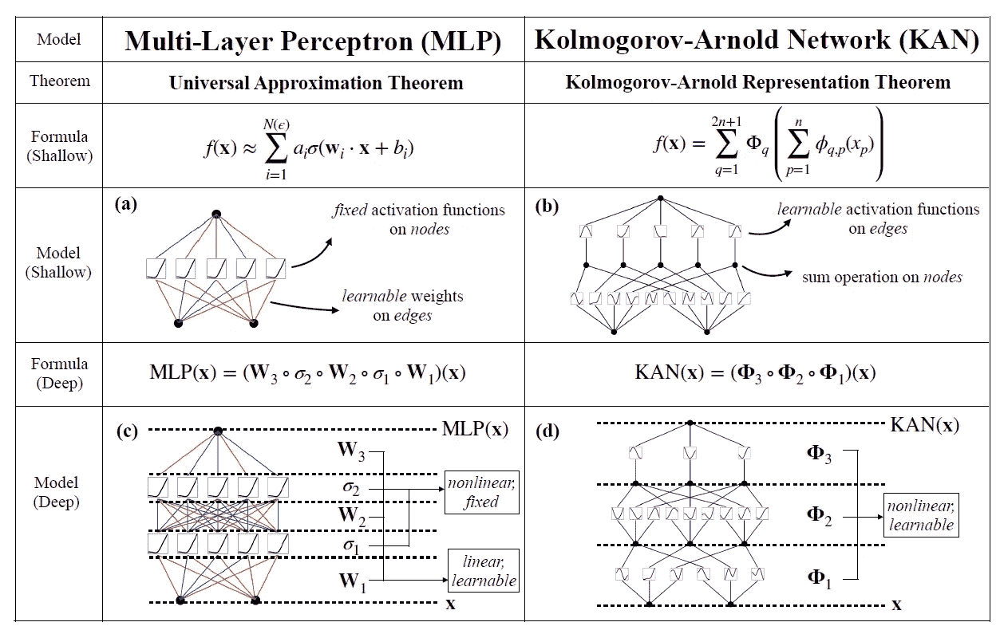

MLP 和 KAN 的概述比较。

**KAN 如何避免维度灾难？**

这个定理允许将复杂的高维函数分解为更简单的单维函数的组合。通过专注于优化这些一维函数，而不是整个多变量空间，KAN 减少了所需的复杂性和参数数量，从而实现了准确建模。此外，由于处理的是更简单的一维函数，KAN 可以成为简单且可解释的模型。

 ## 柏拉图式表现：人工智能深度网络模型是否趋同？

### 人工智能模型是否正在朝着统一的现实表现形式发展？柏拉图式表现……

towardsdatascience.com

# 什么是科尔莫哥洛夫–阿诺德网络（KAN）？

Kolmogorov-Arnold 网络（简称 KAN）是一种受 Kolmogorov-Arnold 表示定理启发的神经网络架构。与使用**固定激活函数**的传统神经网络不同，KAN 使用**可学习的激活**函数，这些激活函数位于网络的**边缘**。这使得 KAN 中的每个权重参数都可以由一个单变量函数替代，通常参数化为**样条**，从而使其具有高度的灵活性，能够用较少的参数建模复杂的函数，并增强可解释性。

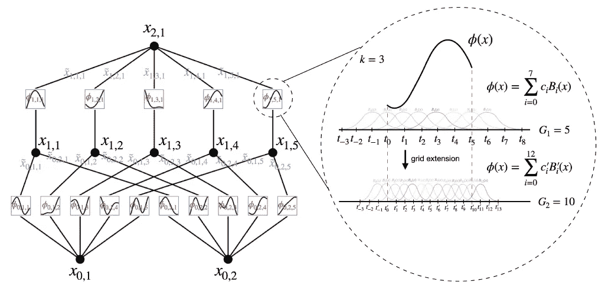

KAN 利用 MLP 的结构，同时受益于样条。

## KAN 架构

Kolmogorov-Arnold 网络（KAN）的架构围绕着一个新颖的概念展开，即将传统的权重参数替换为网络边缘上的单变量函数参数。KAN 中的每个节点将这些函数的输出求和，而不应用任何非线性变换，这与包括线性变换后跟非线性激活函数的 MLP 相对立。

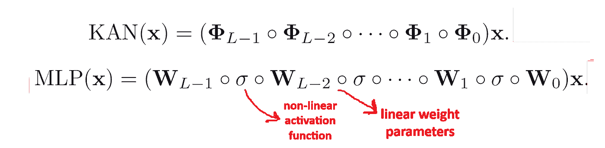

KAN 与 MLP 公式对比。

## B 样条：KAN 的核心

惊人的是，论文中最重要的图形之一竟然容易被忽视。那就是样条的描述。样条是 KAN 学习机制的核心。它们替代了神经网络中通常使用的传统权重参数。

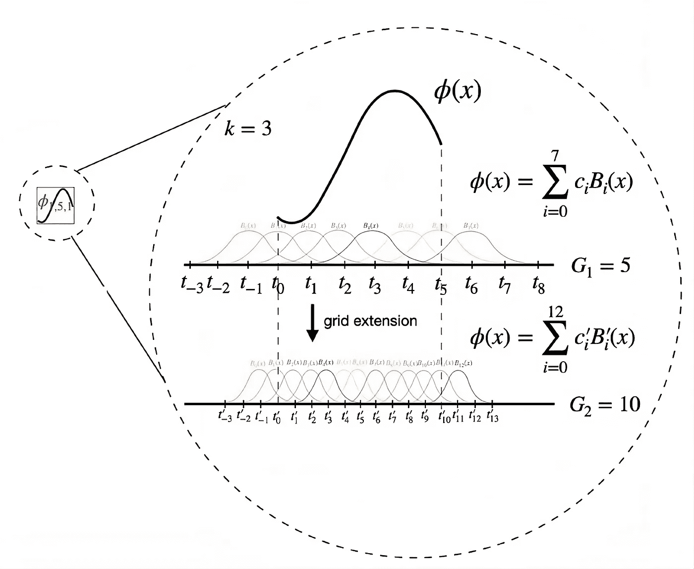

样条结构的详细视图。

样条的灵活性使得它们能够自适应地建模数据中的复杂关系，通过调整其形状以最小化逼近误差，从而增强网络从高维数据集中学习微妙模式的能力。

在 KAN 上下文中，样条的一般公式可以使用 B 样条表示如下：

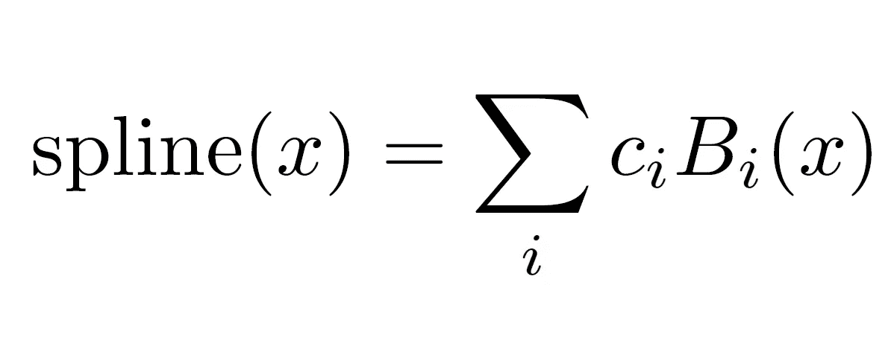

这里，*𝑠pline(𝑥)* 代表样条函数。c*i*​ 是在训练过程中优化的系数，𝐵𝑖(𝑥) 是在网格上定义的 B 样条基函数。网格点定义了每个基函数 𝐵𝑖​ 激活并显著影响样条的**形状**和**平滑度**的区间。你可以把它们看作是影响网络准确度的**超参数**。更多的网格意味着**更多的控制**和**精确度**，同时也意味着更多的参数需要学习。

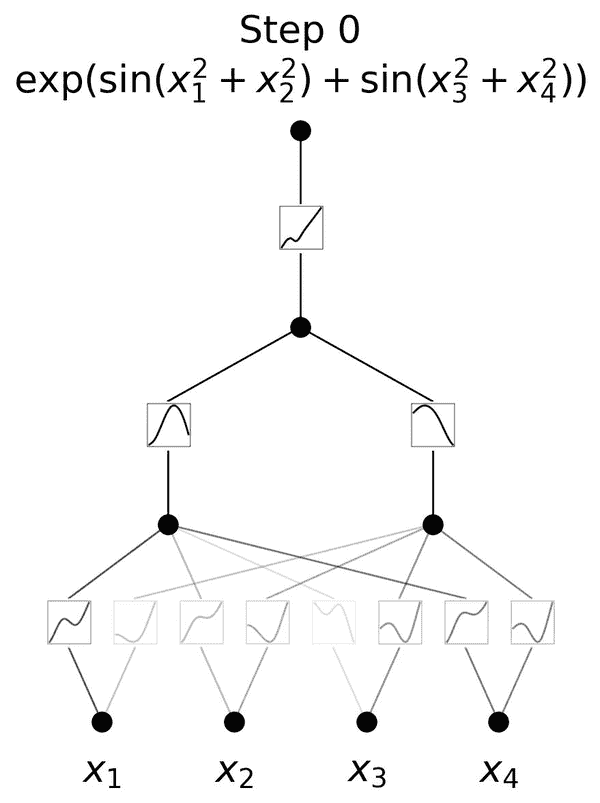

通过多个步骤训练一个 KAN。（来源：[GitHub](https://github.com/KindXiaoming/pykan)）

在训练过程中，这些样条的*ci*参数（基函数*Bi(x)* 的系数）会被优化，以**最小化损失函数**，从而调整样条的形状，使其最适合训练数据。这个优化通常涉及像[梯度下降](https://en.wikipedia.org/wiki/Gradient_descent)这样的技术，每次迭代更新样条参数，以减少预测误差。

## 两全其美

虽然 KAN 基于**Kolmogorov-Arnold 表示定理**，但它同样受到 MLP 的启发，*“利用它们各自的优势，避免它们各自的弱点*”。KAN 在外部受益于 MLP 的结构，在内部则受益于样条。

> 结果是，KAN 不仅能够学习特征（得益于其与 MLP 的外部相似性），还能够优化这些学习到的特征，达到极高的准确性（得益于其与样条的内部相似性）。

# 网络简化

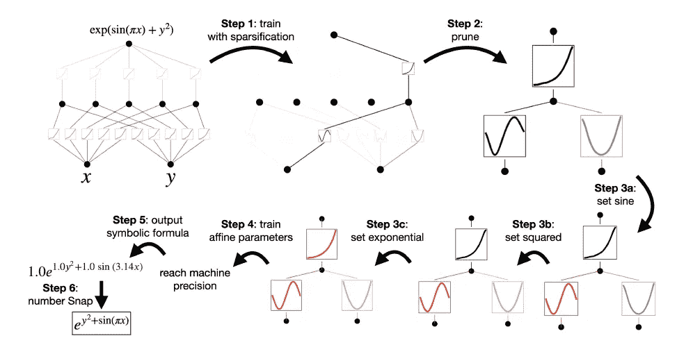

网络符号化概述。

论文接着解释了一些简化网络的方法和我们对它们的理解。我将仅讨论其中两种方法，它们让我感到非常有趣。

1.  **符号化**：KAN 是通过使用更简单、通常可以解释的函数的组合来近似构造函数的。这使得它们具有独特的能力，可以输出**可解释的数学公式**，如上图所示。

1.  **剪枝**：论文中讨论的 KAN 的另一个方面是通过**去除不重要的节点**或连接来优化网络架构，尤其是在网络训练后。这一过程有助于减少复杂性和大小。剪枝的重点是识别并消除对输出贡献最小的部分，从而使网络更轻量化，并有可能变得更加可解释。

# KAN 是新的吗？

Kolmogorov-Arnold 表示定理并不新鲜，**那么为什么在机器学习中使用它的实践之前没有被研究过呢？**正如论文所解释的，曾经进行过多次尝试……

> 然而，大多数工作依然停留在原始的深度为 2、宽度为(2n + 1)的表示形式，并没有机会利用更现代的技术（例如反向传播）来训练网络。

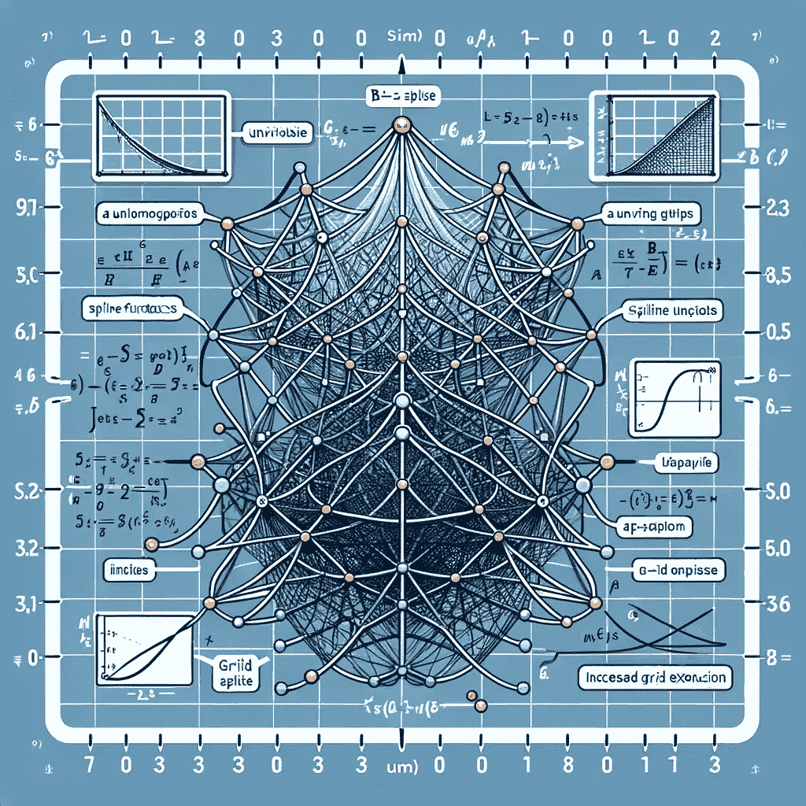

KAN 的可视化表示，由 DALLE-3 创建。

该论文的创新之处在于将这一理念适应并应用于当前机器学习的领域。通过使用任意的网络架构（深度、宽度）并采用反向传播和剪枝等技术，KAN 比以往的研究更接近实际应用场景。

> Kolmogorov-Arnold 表示定理在机器学习中基本上被宣判为死刑，被认为是理论上健全，但在实践中无用。

尽管已经有尝试将 Kolmogorov-Arnold 表示定理应用于机器学习，但可以公平地说，KAN 是一种新颖的方法，因为它意识到机器学习今天所处的位置。它是对之前在有限规模上探索过的一个想法的很好更新。

# 4 个迷人的例子

论文对 KAN 和 MLP 在几个标准上的比较，其中大多数都很吸引人。在这一部分，我将列出一些这些有趣的例子。有关这些例子以及更多详细内容，请参见论文。

## 合适的符号公式

这是训练各种 MLP 和 KAN 以拟合不同输入维度的某些函数的示例。从下图可以看出，与 MLP 相比，KAN 在**可扩展性**方面有明显优势（至少在这个参数范围内）。

> 这突显了更深层 KAN 的更强表达能力，这对于 MLP 也是一样的：更深的 MLP 比浅层的有更强的表达能力。

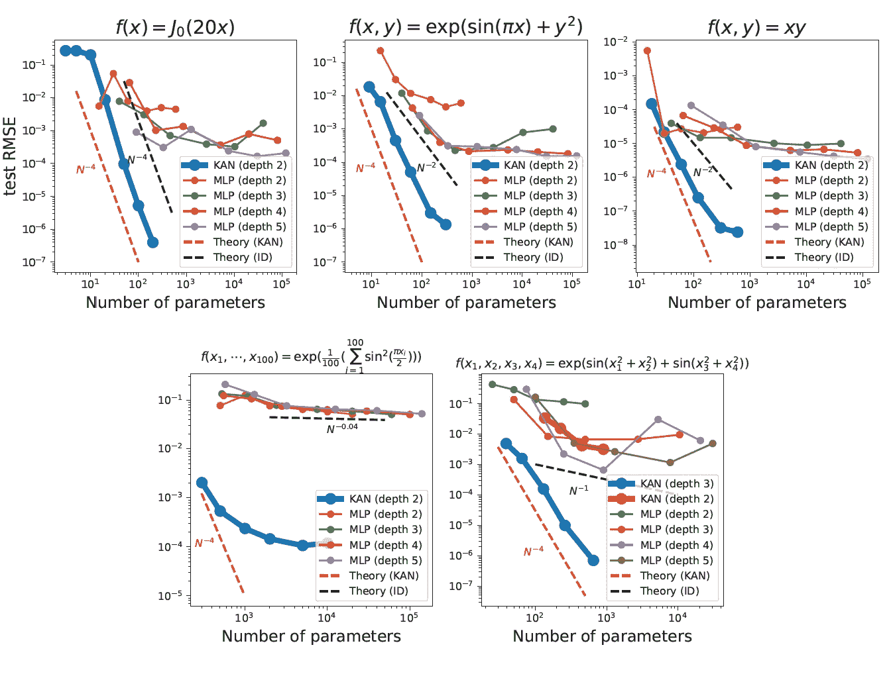

## 特殊函数

论文中的另一个例子是比较 KAN 和 MLP 在拟合数学和物理中常见的 15 个特殊函数上的表现。结果表明，在几乎所有这些函数中，KAN 在拥有相同参数数量的情况下，比 MLP 具有**更低的训练/测试损失**。

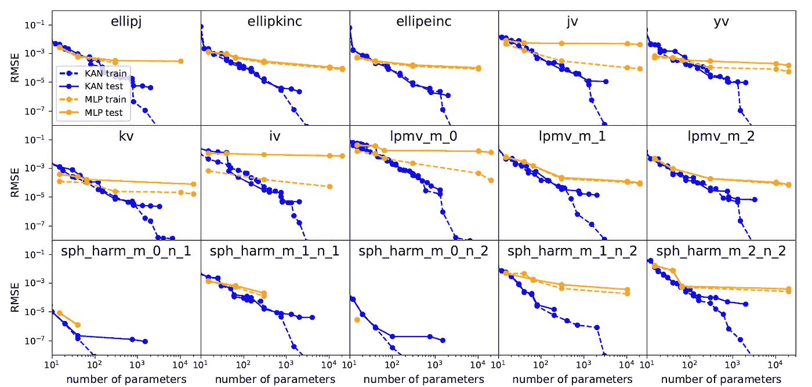

## 持续学习

持续学习是指网络在时间推移中如何适应新信息而不忘记先前学到的知识。这是神经网络训练中的一大挑战，尤其是在避免**灾难性遗忘**的问题上，当获取新知识时，可能会迅速侵蚀先前建立的信息。

KAN 展示了保持已学信息并适应新数据的能力，而不会发生灾难性遗忘，这得益于样条函数的**局部性质**。与依赖全局激活（可能无意中影响模型远离部分）的 MLP 不同，KAN 每次新样本仅修改有限的相邻样条系数。这种集中调整保护了样条中其他部分已存储的信息。

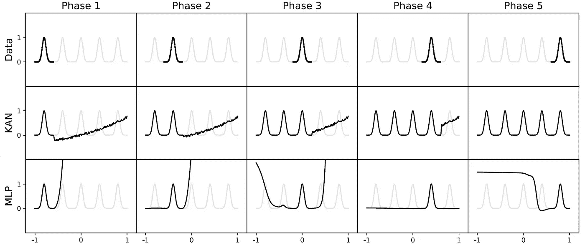

## 偏微分方程求解

> 偏微分方程求解，一个 2 层宽度为 10 的 KAN 比一个 4 层宽度为 100 的 MLP 准确度高 100 倍（10⁻⁷与 10⁻⁵均方误差）且在参数效率上高 100 倍（102 与 104 个参数）。

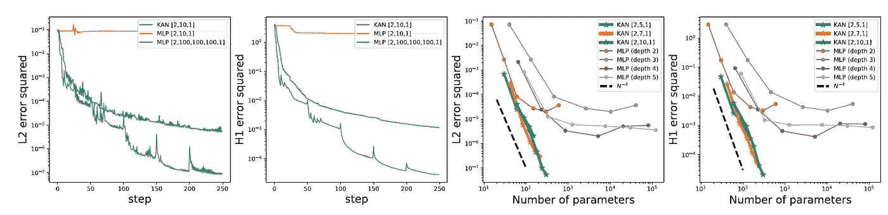

论文继续展示更多实验。其中之一是将 KAN 应用于[**几何结不变量**](https://en.wikipedia.org/wiki/Knot_invariant#:~:text=A%20knot%20invariant%20is%20a%20quantity%20defined%20on%20the%20set,quantity%20defined%20on%20knot%20diagrams.)问题，使用一个**200**参数的 KAN 实现了**81.6%**的测试准确率，而谷歌 DeepMind 的 MLP 模型在**~ 3 * 10⁵**个参数下取得了**78%**的准确率。这个实验是在

# 最终思考

## KAN 的炒作值得吗？

这取决于你的视角。之所以目前在讨论 KAN，是因为它可能是机器学习（ML）隧道尽头的一线曙光。我在[**“人工智能遇到无法突破的瓶颈”**](https://www.linkedin.com/feed/update/urn:li:activity:7192221468741582848/)中讨论了我们如何需要新的创新来引导我们突破机器学习的未来障碍，即**数据**和**计算**。虽然不是有意为之，KAN 可能是走出去的一个途径。

KAN 是以人工智能的科学应用为设计初衷的，但现在人们已经开始将它用于混合各种机器学习（ML）模型，包括多头注意力（Multihead Attention）。

***更新：你可以阅读我在 MNIST 数据集上训练 KAN 的实验，以测试它在计算机视觉任务中的表现，不要错过👇***

## KAN + LLM？

论文主要集中在 Kolmogorov-Arnold 网络（KAN）在**人工智能 + 科学**应用方面的潜力，因为它们能够有效地建模和发现复杂的科学规律和模式。KAN 特别适用于需要**理解**和**解释**基础物理原理的任务，因为它们的结构允许将函数分解成符号化的数学表达式。这使得它们非常适合科学研究，在科学研究中发现这种关系至关重要，而不像大规模语言模型（LLM），后者的主要目标通常是处理庞大的数据集，以进行自然语言理解和生成。

## 作者注释

我鼓励你也阅读 GitHub 页面上的[作者注释](https://github.com/KindXiaoming/pykan?tab=readme-ov-file#authors-note)。它提供了对 KAN 初衷的视角，以及未来可能的发展。

> 最近我被问到最多的问题是 KAN 是否会成为下一代 LLM。我对此没有很好的直觉。KAN 是为那些注重高准确性和/或可解释性的应用设计的。我们当然关心 LLM 的可解释性，但可解释性对于 LLM 和科学来说可能意味着截然不同的事情。我们是否关心 LLM 的高准确性？我不知道，缩放法则似乎表明是这样，但可能并不需要非常高的精度。另外，准确性对 LLM 和科学来说也有不同的意义。这种微妙的差异使得我们很难将论文中的结论直接应用于 LLM 或一般的机器学习任务。

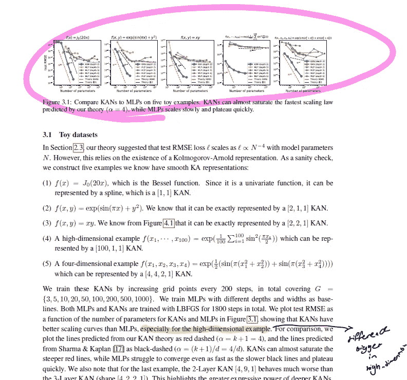

“KAN: Kolmogorov–Arnold 网络”论文。

## 结论

在我看来，最好是从 KAN 本身的角度来看待它，而不是从我们希望它成为的角度来看。并不意味着 KAN **不可能**与大规模语言模型（LLM）集成，实际上已经有一个高效的[**PyTorch 实现 KAN**](https://github.com/Blealtan/efficient-kan)。但需要指出的是，现在称 KAN 为 *革命性* 或 *改变游戏规则* 还为时过早。KAN 仍然需要社区专家进行更多的实验。

尽管 KAN 在某些特定情境下提供了显著的优势，但它也有一些限制和考虑因素，需要谨慎对待：

1.  **复杂性与过拟合：** KANs 可能会发生过拟合，尤其是在数据有限的情况下。它们构建复杂模型的能力可能会将噪声当作重要模式捕捉，导致泛化能力差。

1.  **计算：** 由于 KAN 的专业化特性，它们可能面临 GPU 优化的挑战，这可能会破坏并行处理。这种架构可能会导致 GPU 上的操作变慢，迫使进行序列化，导致内存使用效率低下，从而可能使得 CPU 成为这些网络的更合适平台。

1.  **适用性：** KANs 主要设计用于科学和工程任务，在这些任务中，理解潜在功能至关重要。它们可能在需要大规模模式识别或分类的领域（例如图像识别或自然语言处理）中效果不如那些更简单或更抽象的模型。

我必须补充，这篇论文真的很棒，读起来非常令人兴奋。跳出框框思考总是很有趣，而 KAN 无疑做到了这一点。

💬 你如何看待 KAN 的潜力？它会专注于科学领域，还是将在我们的日常 AI 产品中发挥重要作用？

**🌟 加入 1000+人一起学习**

Python🐍，机器学习/MLOps/人工智能🤖，数据科学📈，以及 LLM 🗯

[**关注我**](https://medium.com/@itshesamsheikh/subscribe)并查看我的[**X/Twitter**](https://twitter.com/itsHesamSheikh)，在这里我每天为你更新：

感谢阅读，

— Hesam
