# Label Studio 定制化后端用于半自动化图像分割标注

> 原文：[`towardsdatascience.com/label-studio-customized-backend-for-semiautomatic-image-segmentation-labeling-324c2310d756?source=collection_archive---------6-----------------------#2024-04-20`](https://towardsdatascience.com/label-studio-customized-backend-for-semiautomatic-image-segmentation-labeling-324c2310d756?source=collection_archive---------6-----------------------#2024-04-20)

## 定制化后端；GCP 部署；通过 GCS 集成进行数据版本控制

[](https://medium.com/@AlisonYuhanYao?source=post_page---byline--324c2310d756--------------------------------)[](https://towardsdatascience.com/?source=post_page---byline--324c2310d756--------------------------------) [Alison Yuhan Yao](https://medium.com/@AlisonYuhanYao?source=post_page---byline--324c2310d756--------------------------------)

·发表于[Towards Data Science](https://towardsdatascience.com/?source=post_page---byline--324c2310d756--------------------------------) ·13 分钟阅读·2024 年 4 月 20 日

--

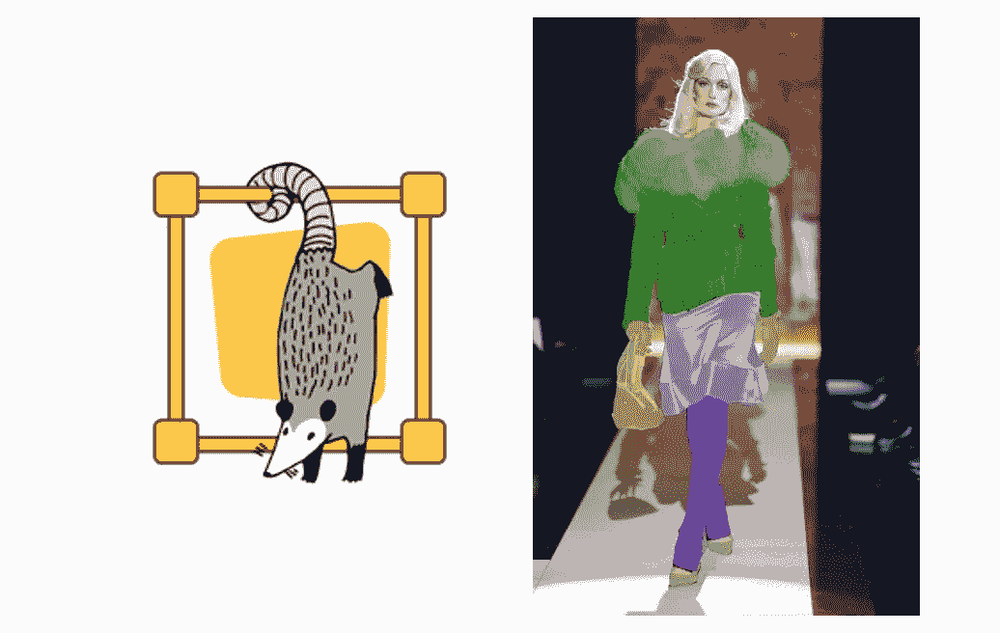

作者提供的图像

## 目录

· 介绍

· 概览

∘ 目标

∘ 为什么是半自动化？

∘ 进入 Label Studio

∘ 1 前端 + 2 后端

· 实现（本地）

∘ 1. 安装 git 和 docker 并下载后端代码

∘ 2. 设置前端以获取访问令牌

∘ 3. 设置后端容器

∘ 4. 连接容器

∘ 5. 快乐标注！

· GCP 部署

∘ 1. 选择项目/创建新项目并设置账单账户

∘ 2. 创建虚拟机实例

∘ 3. 设置虚拟机环境

∘ 4. 跟随前一部分，在虚拟机上设置所有内容

· GCS 集成

∘ 1. 设置 GCS 存储桶

∘ 2. 创建并设置服务账户密钥

∘ 3. 重建后端容器

∘ 4. SDK 从源存储桶上传图像

∘ 5. 设置目标存储

· 致谢

· 参考资料

# 介绍

为图像分割任务创建训练数据仍然是个人和小团队面临的一大挑战。如果你像我一样是学生研究者，找到一种具有成本效益的方法尤其重要。在这篇文章中，我将分享我在[我的毕业设计项目](https://seas.harvard.edu/news/2024/05/masters-student-capstone-spotlight-ai-fashion)中使用的一种解决方案，我们一个 9 人团队在一周内成功标注了 400+张图像。

多亏了米兰理工大学的[吉安弗朗科·费雷研究中心](https://www.centroricercagianfrancoferre.it/home/FGFhome.php?lang=en)，我们从吉安弗朗科·费雷的档案数据库中获取了成千上万张时装 T 台秀的图像。为了探索、管理、丰富和分析这个数据库，我使用了*图像分割*进行更智能的分类和精细化研究。T 台秀照片的图像分割也为创建信息丰富的文本描述打下了基础，从而提升搜索引擎和文本生成图像 AI 的效果。因此，本文将详细介绍：

+   如何在现有的[Segment Anything 后端](https://labelstud.io/blog/get-started-using-segment-anything/)基础上，使用[label studio](https://labelstud.io/)创建您自己的后端，以便进行半自动化图像分割标注，

+   如何在 Google Cloud Platform 上托管以便进行小组协作，并且

+   如何使用 Google Cloud Storage 存储桶进行数据版本控制。

> 本文中的代码可以在这个[GitHub 仓库](https://github.com/AlisonYao/label-studio-customized-ml-backend)找到。

# 概述

## 目标

分割并识别 T 台秀图像中时尚服装项目的名称和类型，如第一张图所示。

## 为什么是半自动化？

如果某个训练好的分割模型能够完美地识别 T 台秀图像中的每一件服装，那该多好？遗憾的是，目前还没有这样的模型。虽然存在针对时尚或服装图像的训练模型，但没有一个能完美匹配我们的数据集。每个时装设计师都有自己对某些服装款式、颜色和纹理的偏好，因此即使一个分割模型的准确率达到 60%，我们也算是胜利了。然后，我们仍然需要人工干预来纠正分割模型的错误。

## 进入 Label Studio

Label Studio 提供了一个开源、可定制并且免费的社区版本，适用于各种类型的数据标注。用户可以创建自己的后端，以便将 Label Studio 前端与上述提到的训练分割模型后端连接，从而让标注员进一步改进自动预测结果。此外，Label Studio 已经具备了一个界面，类似于 Photoshop，并且拥有一系列分割工具，可以为我们提供很大的帮助：

+   刷子与橡皮擦

+   用于相似颜色像素选择的[魔法棒](https://labelstud.io/tags/magicwand)

+   [Segment Anything](https://labelstud.io/blog/get-started-using-segment-anything/)后端，利用[Meta 的 SAM](https://segment-anything.com/)的强大功能，允许你识别你绘制的边界框内的物体。

## 1 个前端 + 2 个后端

到目前为止，我们希望 2 个后端能够与前端连接。一个后端可以进行分割预测，第二个后端可以在预测错误时加速标注员的修改。

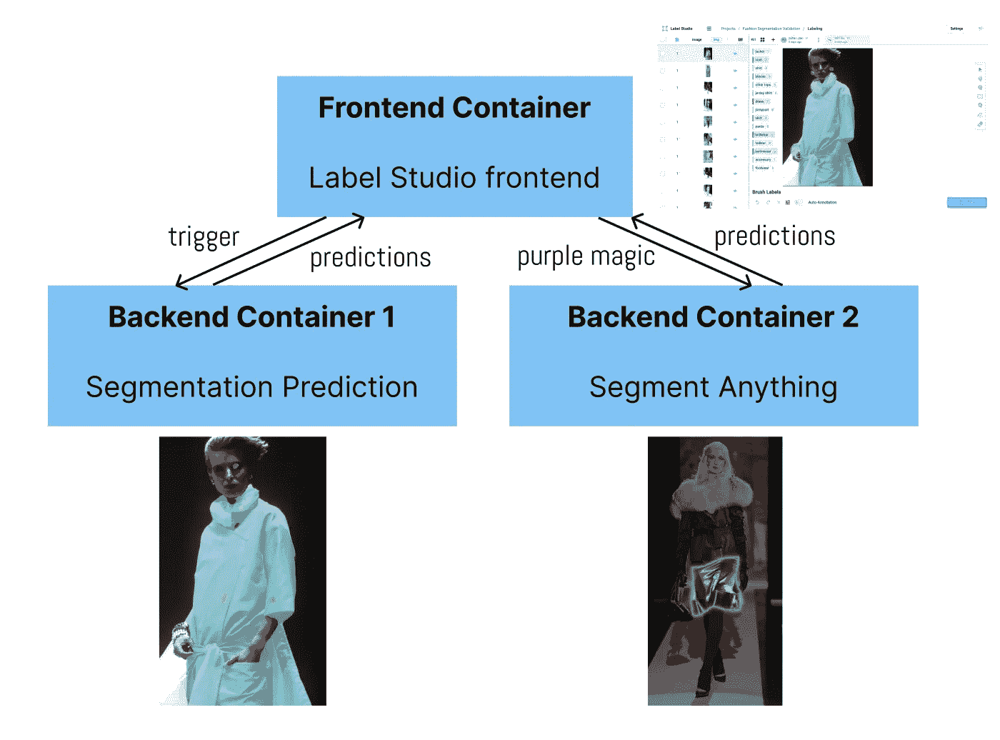

图片来自作者

# 实现（本地）

现在，让我们在本地启动应用程序。也就是说，你可以在笔记本电脑或本地机器上完全免费地使用这个应用程序，但目前无法邀请你的标注团队在他们的笔记本上协作。我们将在下一节中讨论如何与 GCP 进行团队协作。

## 1\. 安装 git 和 docker & 下载后端代码

如果你的笔记本电脑或本地机器上还没有安装[git](https://git-scm.com/downloads)或[docker](https://www.docker.com/products/docker-desktop/)，请先安装它们。（注意：如果你从[这个 GitHub 仓库](https://github.com/AlisonYao/label-studio-customized-ml-backend)下载了压缩包，理论上可以跳过安装 git 这一步。如果你这么做，请跳过下面的步骤。）

然后，打开你的终端并将[这个仓库](https://github.com/AlisonYao/label-studio-customized-ml-backend)克隆到你想要的目录。

```py
git clone https://github.com/AlisonYao/label-studio-customized-ml-backend.git
```

如果你在代码编辑器中打开`label-studio-customized-ml-backend`文件夹，你会看到大部分代码都改编自[Label Studio ML 后端](https://github.com/HumanSignal/label-studio-ml-backend)仓库，但这个目录还包含了改编自[Label Studio SDK](https://github.com/HumanSignal/label-studio-sdk)的前端模板代码和 SDK 代码。

## 2\. 设置前端以获取访问令牌

按照[segment anything](https://labelstud.io/blog/get-started-using-segment-anything/)的官方指南，在终端中执行以下操作：

```py
cd label-studio-customized-ml-backend/label_studio_ml/examples/segment_anything_model

docker run -it -p 8080:8080 \
    -v $(pwd)/mydata:/label-studio/data \
    --env LABEL_STUDIO_LOCAL_FILES_SERVING_ENABLED=true \
    --env LABEL_STUDIO_LOCAL_FILES_DOCUMENT_ROOT=/label-studio/data/images \
    heartexlabs/label-studio:latest
```

接着，打开浏览器，输入[`0.0.0.0:8080/`](http://0.0.0.0:8080/)，你将看到 Label Studio 的前端界面。继续使用你的电子邮件地址注册。现在没有项目，所以我们需要通过点击**创建项目**来创建我们的第一个项目。为你的项目创建一个名称和描述（可选）。

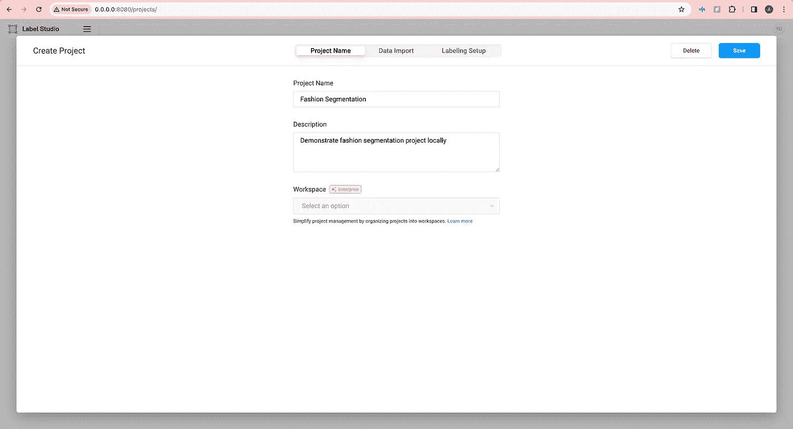

图片来源：作者

本地上传一些图片。（稍后我们将讨论如何使用云存储。）

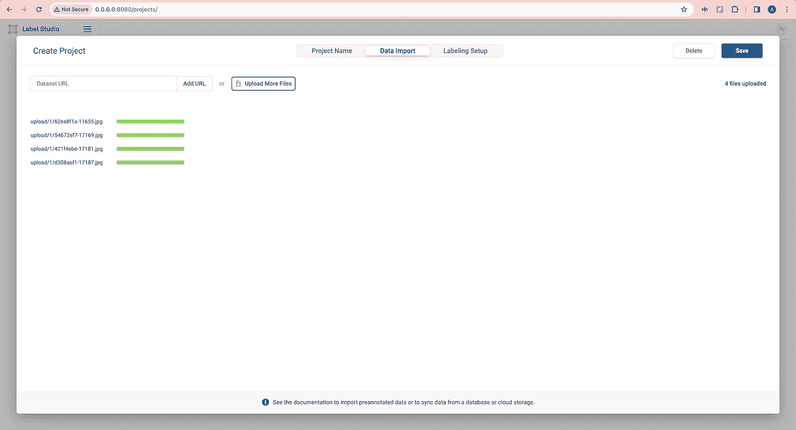

图片来源：作者

对于标注设置，点击左侧的**自定义模板**，并从`label-studio-customized-ml-backend/label_studio_frontend/view.html`文件中复制粘贴 HTML 代码。如果你不想在标注界面显示图像元数据，可以不需要那四行 Header 代码。你可以根据需要修改此代码，或者点击**可视化**来添加或删除标签。

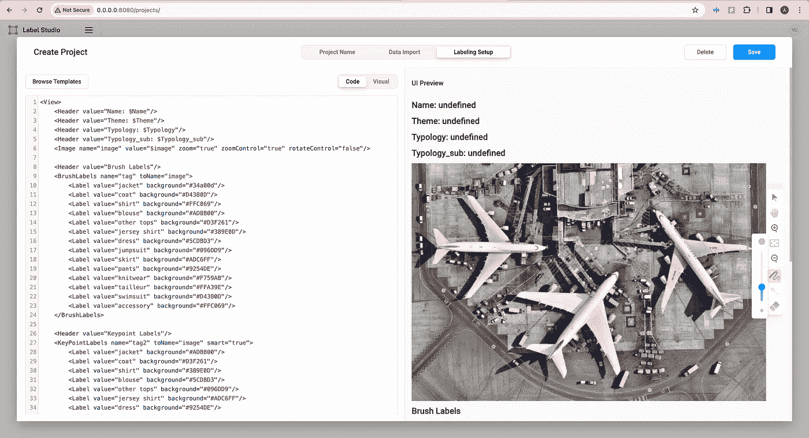

图片来源：作者

现在，点击**保存**，你的标注界面应该准备好了。

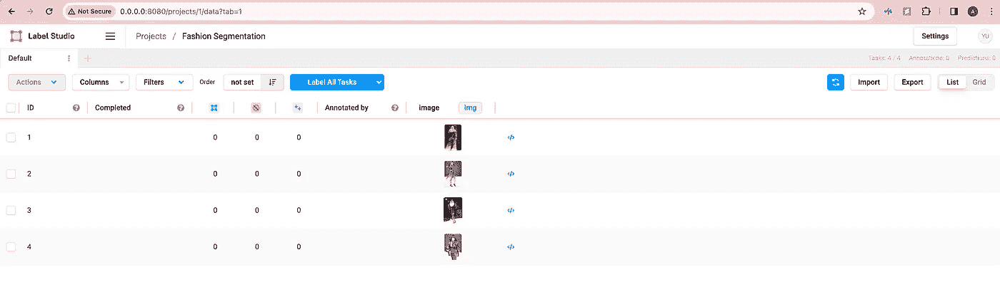

图片来源：作者

在右上角，点击用户设置图标，然后点击**账户与设置**，你应该能够复制你的访问令牌。

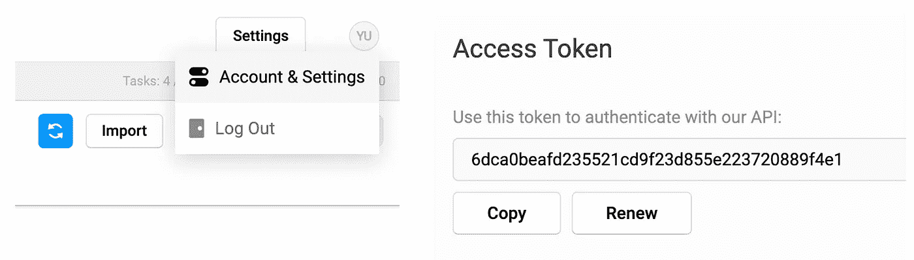

图片来源：作者

## 3\. 设置后端容器

在`label-studio-customized-ml-backend`目录中，感谢 Label Studio 开发者，里面有许多后端。我们将使用定制的`./segmentation`后端进行分割预测（容器 1），以及`./label_studio_ml/examples/segment_anything_model`进行更快速的标注（容器 2）。前者将使用 7070 端口，后者将使用 9090 端口，这样可以与前端的 8080 端口区分开来。

现在，将你的访问令牌粘贴到`./segmentation`和`./label_studio_ml/examples/segment_anything_model`文件夹中的 2 个`docker-compose.yml`文件中。

```py
environment:
  - LABEL_STUDIO_ACCESS_TOKEN=6dca0beafd235521cd9f23d855e223720889f4e1
```

打开一个新的终端，像之前那样进入`segment_anything_model`目录，然后启动分割任何物体容器。

```py
cd label-studio-customized-ml-backend/label_studio_ml/examples/segment_anything_model

docker build . -t sam:latest
docker compose up
```

然后，打开另一个新的终端，进入`segmentation`目录，并启动分割预测容器。

```py
cd label-studio-customized-ml-backend/segmentation

docker build . -t seg:latest
docker compose up
```

到目前为止，我们已经成功启动了所有 3 个容器，你可以再次检查确认。

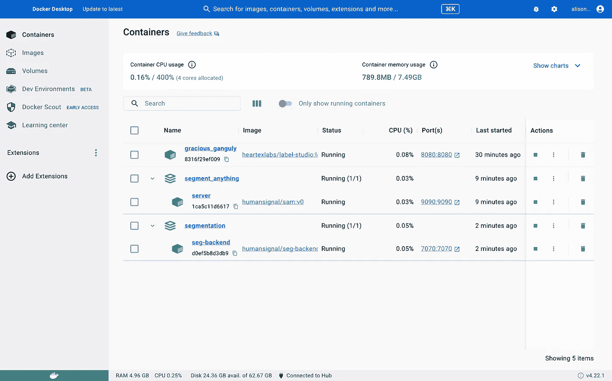

图片来源：作者

## 4\. 连接容器

之前，我们通过访问令牌连接了容器，所以我们已经差不多完成了。现在，去打开你之前启动的前端，并点击右上角的**设置**。在左侧点击**机器学习**，然后点击**添加模型**。

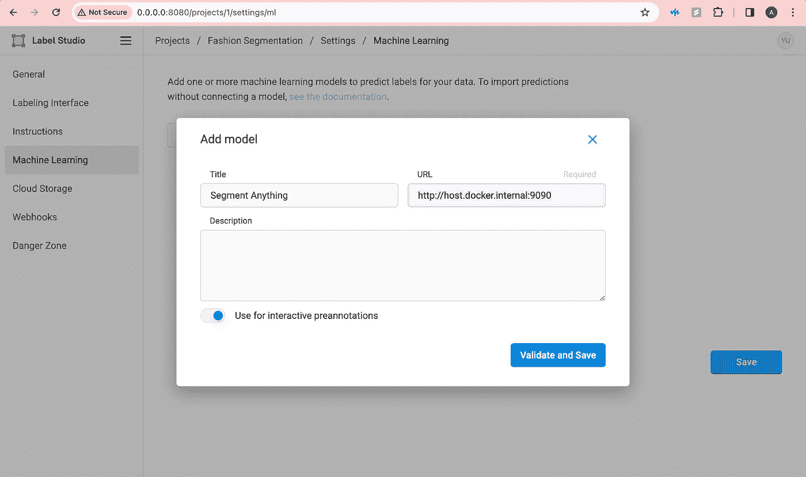

图片来源：作者

确保使用带有 9090 端口的 URL，并启用交互式预标注功能。点击**验证并保存**完成添加。

同样，执行相同操作来设置分割预测后端。

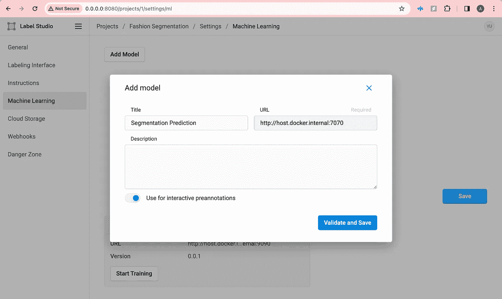

图片来源：作者

然后，我喜欢启用**加载任务时自动获取预测**。这样，每次刷新标注页面时，分割预测将会自动触发并加载。

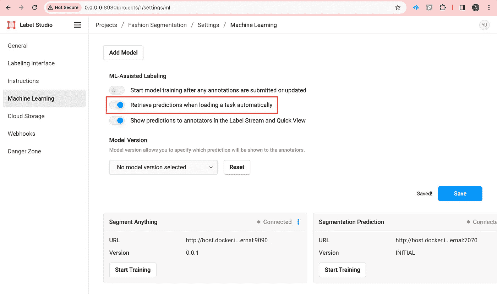

图片来源：作者

## 5\. 快乐标注！

这是按照上述步骤操作后，你应该看到的演示。

视频来源：作者

如果我们不满意预测结果，比如说裙子的部分，我们可以删除裙子并使用紫色魔法（分割任何物体）快速标注。

视频来源：作者

我相信你能自己搞定刷子、橡皮擦和魔法棒的使用！

如果你是单独工作，那就万事俱备。但如果你在考虑如何与团队协作而又不订阅 Label Studio Enterprise，我们需要将一切托管到云端。

# GCP 部署

我选择了 GCP，因为有教育信用，但你可以使用任何你喜欢的云平台。关键是将应用托管在云端，这样你标注团队中的任何人都可以访问并使用你的 Label Studio 应用。

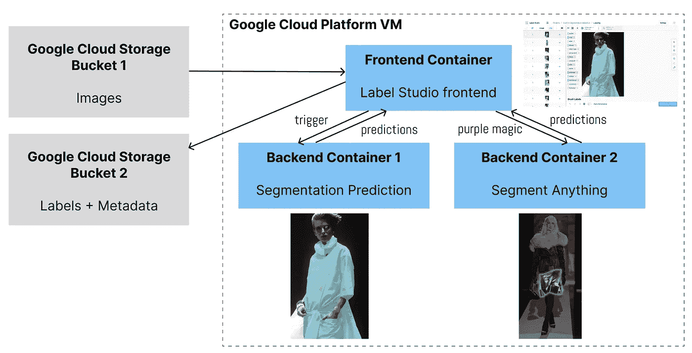

图片来源：作者

## 1\. 选择项目/创建新项目并设置账单账户

如果你没有现有项目，可以前往[GCP 控制台](https://console.cloud.google.com/)创建一个新项目，并按要求设置计费账户信息（不幸的是，云服务是收费的）。在这里，我将使用我创建的*Fashion*项目来演示。

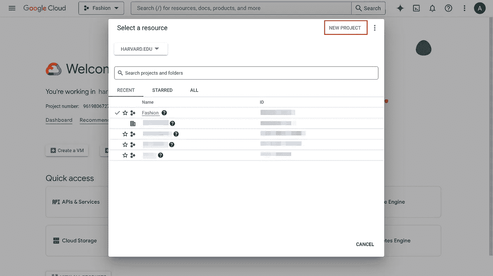

图片来自作者

## 2\. 创建虚拟机实例

为了给标注团队提供公共 IP 地址，我们需要在 GCP 上创建一个虚拟机（VM）并将一切部署到这里。进入你创建或选择的项目后，在搜索框中搜索**计算引擎**，第一个弹出的选项应该是**VM 实例**。点击**创建实例**，根据需要选择设置。

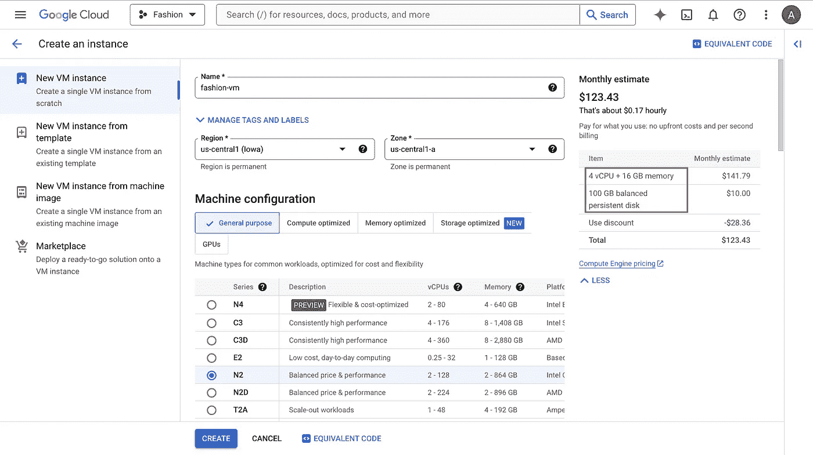

图片来自作者

默认的 10GB 持久磁盘会给你带来问题，所以请增加磁盘空间。另外，更重要的是，允许 HTTP 流量。

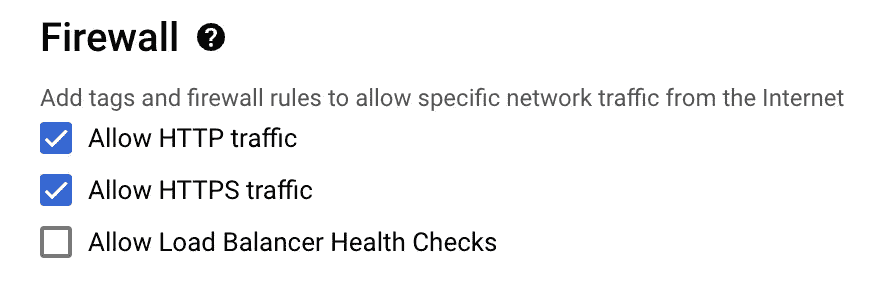

图片来自作者

稍后修改这些设置会有点麻烦，所以在点击创建之前，尽量先想清楚。

## 3\. 设置虚拟机环境

你可以将虚拟机想象成云端的某台计算机，类似于你的笔记本电脑，但你只能通过终端或命令行要求它做事。所以现在，我们需要在虚拟机上像在本地一样设置所有内容（请参见上一部分）。

点击 SSH，授权并打开命令行界面。

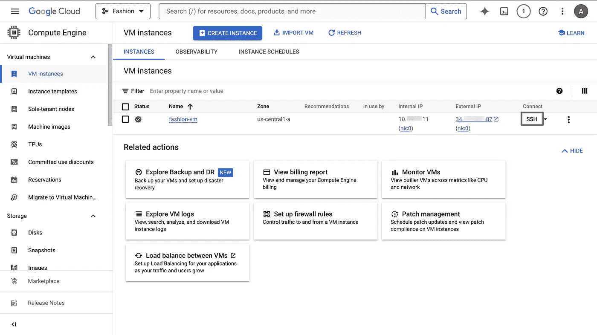

图片来自作者

进行常规更新，并安装 docker、docker compose、git 和 Python。

```py
sudo apt-get update

curl -fsSL https://get.docker.com -o get-docker.sh
sudo sh get-docker.sh
sudo docker --version

sudo apt-get install docker-compose-plugin

sudo apt install git

sudo apt install python3-pip
```

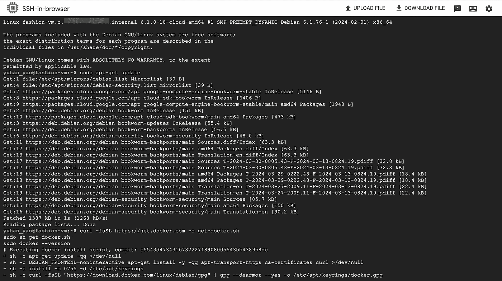

图片来自作者

## 4\. 按照上一部分的步骤，在虚拟机上设置所有内容

现在，你可以按照上一部分的步骤 1–4 进行操作，但有一些变化：

1.  当你遇到 docker 权限被拒绝错误时，添加**sudo**。

1.  如果遇到数据权限错误，可以使用类似`sudo chmod -R 777 mydata`的命令来修改权限。然后你就应该能够运行前端容器了。

1.  服务器不再位于[`0.0.0.0:8080`](http://0.0.0.0:8080)。相反，将 0.0.0.0 替换为虚拟机的外部 IP 地址。一个例子是[`34.1.1.87:8080/`](http://34.1.1.87:8080/)。你可以在之前点击的**SSH**按钮旁边找到外部 IP 地址。然而，你可能仍然无法访问前端。你需要在 GCP 控制台搜索防火墙，然后点击**防火墙（VPC 网络）**，接着点击**default-allow-http**。现在，修改设置如下，你就应该能够访问前端了。

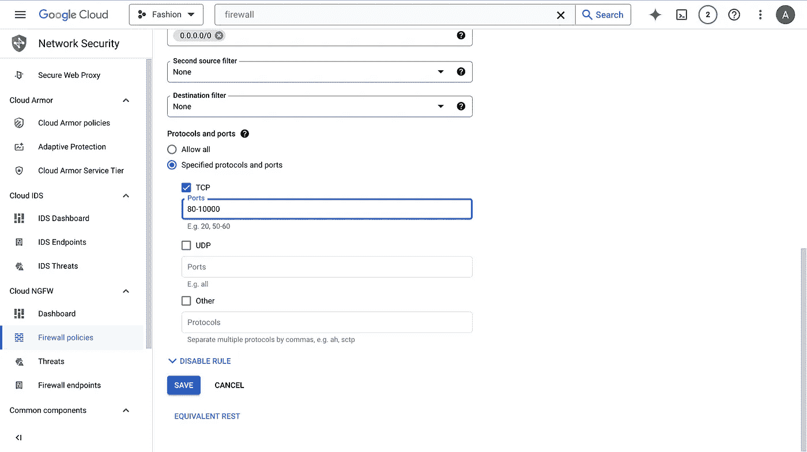

图片来自作者

4\. 编辑`docker-compose.yml`文件时，除了复制粘贴访问令牌，还要修改`LABEL_STUDIO_HOST`。同样，将`host.docker.internal`替换为虚拟机的外部 IP 地址。一个例子是[`34.1.1.87:8080`](http://34.1.1.87:8080)。

5\. 同样，当在前端设置中添加*机器学习*时，也使用[`34.1.1.87:9090`](http://34.1.1.87:9090)和 http://34.1.1.87:7070。

然后，你可以导出你的标注结果并根据需要进行定制。

如果你只有几张图片需要标注，或者你愿意从本地上传图片，那完全没问题。但对于我的项目，有成千上万张图片，因此我更倾向于使用 Google Cloud Storage 来自动化数据传输和数据版本控制。

# GCS 集成

## 1\. 设置 GCS 存储桶

在 GCP 控制台中搜索存储桶并导航到 Cloud Storage 存储桶。创建 2 个存储桶：一个用于存放图片（源），另一个为空（目标）。第二个存储桶将在开始标注时填充数据。

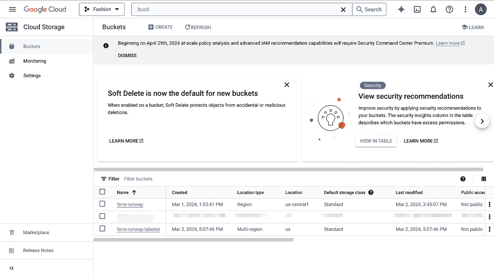

作者提供的图片

然后，根据[官方文档](https://labelstud.io/guide/storage.html#Google-Cloud-Storage)，我们需要为存储桶设置跨域资源共享（CORS）访问权限。点击右上角的**激活云终端**，然后运行以下命令。

```py
echo '[
   {
      "origin": ["*"],
      "method": ["GET"],
      "responseHeader": ["Content-Type","Access-Control-Allow-Origin"],
      "maxAgeSeconds": 3600
   }
]' > cors-config.json

gsutil cors set cors-config.json gs://ferre-runway # use your bucket name
gsutil cors set cors-config.json gs://ferre-runway-labeled # use your bucket name
```

如果你希望为标注结果设置数据版本控制，可以点击存储桶并在**保护**中开启版本控制。

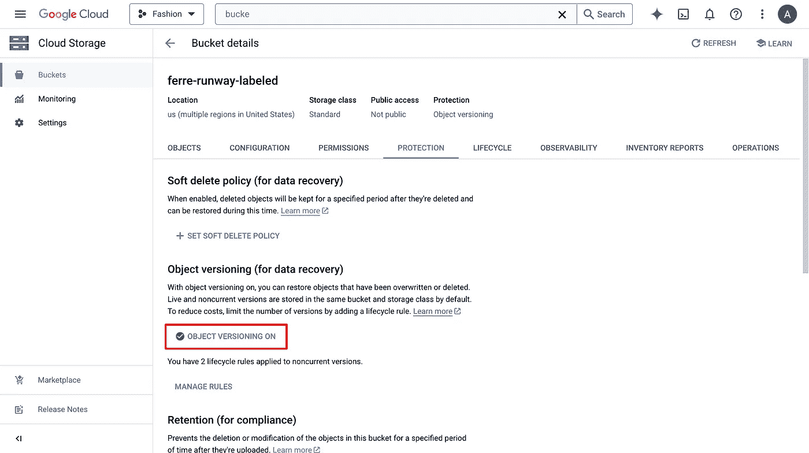

作者提供的图片

## 2\. 创建并设置服务账户密钥

很可能你不希望你的存储桶是公开的，那么 Label Studio 需要认证才能访问这些图片。点击**创建服务账户**，并授予**存储管理员**角色，这样我们就可以读写 GCS 存储桶。你应该能够在存储桶的权限列表中看到这个服务账户。

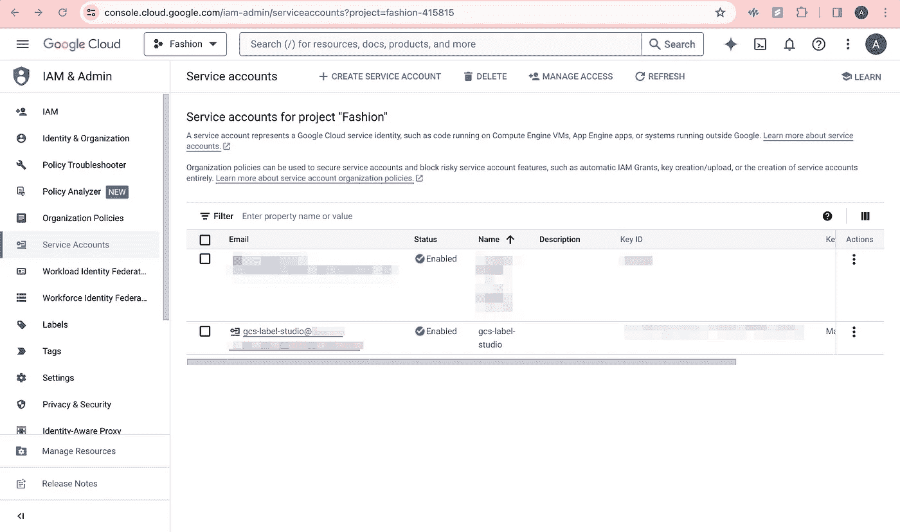

作者提供的图片

现在，点击新创建的服务账户并点击**密钥**。接着添加一个新密钥，并确保将 JSON 文件下载到安全的地方。

现在，打开你的本地终端并编码 JSON 文件。

```py
base64 -i service_account_key.json -o service_account_key_encoded.txt
cat service_account_key_encoded.txt
```

你可以看到随机的字符和数字字符串并复制它。现在我们将其作为元数据粘贴到虚拟机中。点击你的虚拟机，点击**编辑**，并添加你的自定义元数据。例如，我的键是 GOOGLE_APPLICATION_CREDENTIALS_BASE64。

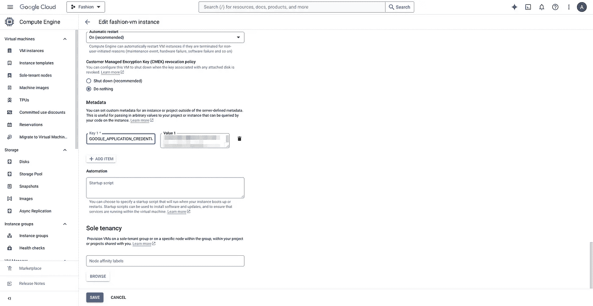

作者提供的图片

我们接着会解码服务账户密钥以便在 Python 代码中进行认证。

## 3\. 重新构建后端容器

由于我们修改了`docker-compose.yml`文件，因此需要运行新的脚本并重新构建后端容器。

```py
# Check running containers and their IDs, find the backends you need to kill
sudo docker ps

sudo docker kill a5a5e21537cb
sudo docker kill 54e51b0ae78f

# navigate to the right folders like before and build new containers
sudo docker compose up
```

现在，你应该能看到新的容器。

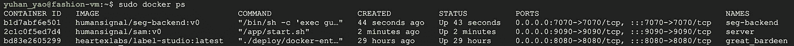

作者提供的图片

## 4\. SDK 从源存储桶上传图片

如果你只是想上传图片而不带元数据，你可以跳过此部分，直接执行与第 5 步相同的操作（见下文）。所谓元数据，是指每张图片在标注界面上有用的信息，这些信息可能有助于更准确地进行标注。

基于 Label Studio SDK 仓库中的示例，您可以修改`./label_studio_sdk/annotate_data_from_gcs.ipynb`文件中的元数据内容以及导入方式。运行本地的 Python 笔记本后，您应该能在前端看到您的图片和元数据。

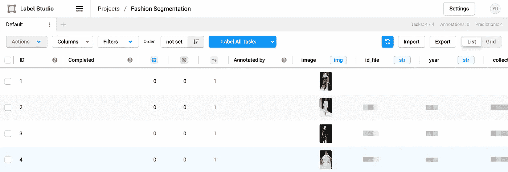

图片来自作者

您还应该查看设置中的源存储桶。请勿点击同步存储（Sync Storage），因为它将直接从存储桶同步，可能会扰乱我们导入的元数据。

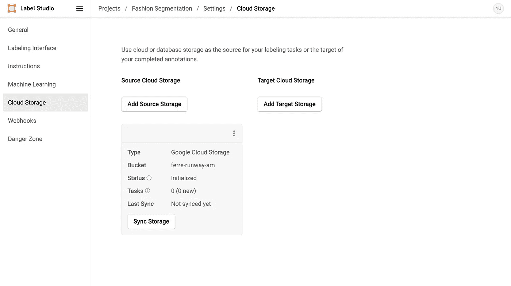

图片来自作者

## 5\. 设置目标存储

点击**添加目标存储**，并根据提示填写信息。将您的服务账户密钥复制粘贴到 Google 应用凭据文本框中，您就完成设置了。

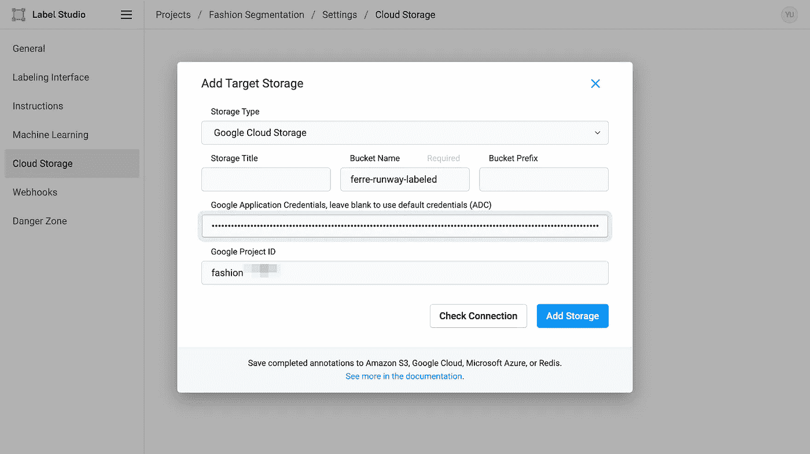

图片来自作者

每次您点击目标云存储中的**同步存储**时，它将把标注结果以文本格式同步到 GCS 存储桶中。点击同步一次后，提交标注结果时该过程应该会自动触发，但请检查是否需要定期手动同步。

祝您标注愉快！

# 致谢

很高兴能作为一部分参与[Data Shack 2024](https://sites.google.com/view/datashack-harvard-polimi/data-shack-2024?authuser=0)，与米兰理工大学[Gianfranco Ferré研究中心](https://www.centroricercagianfrancoferre.it/home/FGFhome.php?lang=en)合作。我要感谢[Pavlos Protopapas 教授](https://medium.com/u/69c7cfe8dc8e?source=post_page---user_mention--324c2310d756--------------------------------)和 Paola Bertola 教授的指导，以及感谢您们使这个项目得以启动。我要感谢[Chris Gumb](https://medium.com/u/afb3db007f0b?source=post_page---user_mention--324c2310d756--------------------------------)和 Marco Brambilla 教授的技术支持，以及 Federica Vacca 教授和[Angelica Vandi 博士](https://medium.com/u/e391affa9647?source=post_page---user_mention--324c2310d756--------------------------------)在时尚领域的专业知识支持。最后，我要感谢我的队友[Luis Henrique Simplicio Ribeiro](https://medium.com/u/48b7440feb38?source=post_page---user_mention--324c2310d756--------------------------------)、[Lorenzo Campana](https://medium.com/u/10478e152ee4?source=post_page---user_mention--324c2310d756--------------------------------)和 Vittoria Corvetti 在过程中给予的帮助以及与我一起解决问题。还要特别感谢 Emanuela Di Stefano、Jacopo Sileo、Bruna Pio Da Silva Rigato、Martino Fois、Xinxi Liu 和 Ilaria Trame 的持续支持和辛勤工作。

# 参考文献

+   11655 Gianfranco Ferré，成衣系列，2004 年秋冬季。由 Gianfranco Ferré研究中心提供。

+   13215 Gianfranco Ferré，成衣系列，春夏 1991\. 感谢 Gianfranco Ferré 研究中心提供。

感谢阅读！希望这篇博客对你有所帮助。

> 本文中的代码可以在这个[GitHub 仓库](https://github.com/AlisonYao/label-studio-customized-ml-backend)找到。
