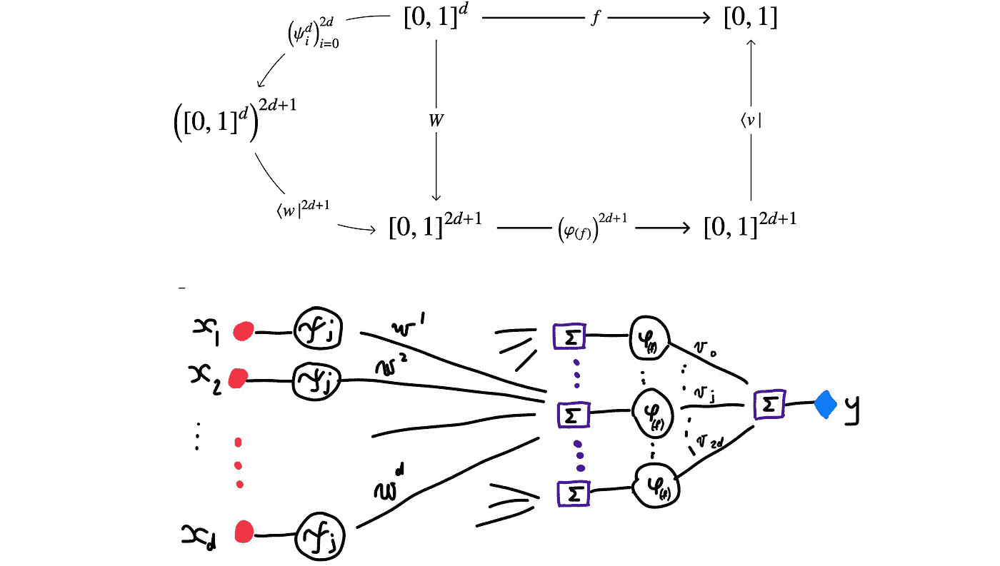
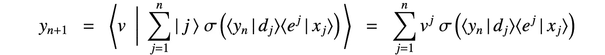

# 语言作为一种通用学习机器

> 原文：[`towardsdatascience.com/language-as-a-universal-learning-machine-d2c67cb15e5f?source=collection_archive---------7-----------------------#2024-05-23`](https://towardsdatascience.com/language-as-a-universal-learning-machine-d2c67cb15e5f?source=collection_archive---------7-----------------------#2024-05-23)

## 人类与计算机的语言处理：第四部分

## 说出来就是相信，看到就是幻觉。

 [Dusko Pavlovic](https://medium.com/@dusko_p?source=post_page---byline--d2c67cb15e5f--------------------------------)

·发布于 [Towards Data Science](https://towardsdatascience.com/?source=post_page---byline--d2c67cb15e5f--------------------------------) ·40 分钟阅读·2024 年 5 月 23 日

--

机器学习语言模型已经改变了我们的日常生活：它们在我们学习、驾驶、理财时为我们提供指导。它们有潜力改变我们的文明。但它们也会产生幻觉。它们的现实是虚拟的。本系列的第四部分提供了一个关于学习机器如何工作的低层次细节的高级概述。事实证明，即使它们能够像人类一样识别幻觉并安全地做梦，学习机器仍然会像人类一样，形成更广泛的错误信念和自我验证的理论体系。

[我尝试让这篇文章对所有人都易于阅读。省略一些数学推导应该不会影响后续的论点。即使仅仅是开始和结尾的图片，也希望能传达主要信息。欢迎提出改进建议：)]

## 第一部分是：

[聊天机器人是谁（它们对你来说意味着什么）？](https://medium.com/towards-data-science/who-are-chatbots-and-what-are-they-to-you-5c77d9201d11) 后续思考： [房间里的四只大象与聊天机器人](https://medium.com/towards-data-science/four-elephants-in-the-room-with-chatbots-82c48a823b94)

## 第二部分是：

[语法：语言形式](https://medium.com/towards-data-science/syntax-the-language-form-612257c4aa5f)

## 第三部分是：

[语义学：语言的意义](https://medium.com/@dusko_p/semantics-the-meaning-of-language-99b009ccef41)

## 这是第四部分：

1.  语言模型、名人和蒸汽机

1.  学习的演变

+   2.1\. 学习的原因和迷信

+   2.2\. 一般学习框架

+   2.3\. 示例：从鸽子到感知机

3\. 学习函数

+   3.1\. 为什么学习是可能的

+   3.2\. 分解连续函数：Kolmogorov-Arnold⁶

+   3.3\. 广泛学习

+   3.4\. 逼近连续函数：Cybenko 等

+   3.5\. 深度学习

4\. 学习通道与注意力

+   4.1 通过概念引导

+   4.2 静态通道学习：RNN、LSTM…

+   4.3 动态通道学习：注意力、变压器…

5\. 超越幻觉

+   5.1\. 参数化学习框架

+   5.2\. 自我学习

+   5.3\. 自我确认的信念

归属

[笔记](http://f974)

# 1\. 语言模型、名人和蒸汽机

任何人都可以开车。大多数人甚至知道发动机长什么样。但是当你需要修理它时，你需要弄清楚它是如何工作的。

任何人都可以和聊天机器人对话。大多数人知道在背后有一个大型语言模型（LLM）。有很多文章描述了 LLM 是什么样子的。很多五彩斑斓的图片。复杂的小组件网状结构，好像数学抽象和模块化编程还等着被发明一样。YouTube 频道上有关于 LLM 名人的新鲜资讯。我们了解它们的各个部分及其连接方式，知道它们的性能，甚至看到每个部分如何将输入的热图转化为输出的热图，一个比一个热。但是我们真的理解它们是如何工作的么？专家说他们理解，但似乎连彼此之间都无法解释清楚，因为他们在几乎所有问题上都有分歧。

当然，每个孩子都知道，解释自己刚刚建造的东西可能很困难。我们的伟大文明建造了很多无法解释的东西。蒸汽机已经被工程化近 2000 年，才有科学家解释它们是如何从热量中提取工作的。如今蒸汽机已经不多见，但有很多语言引擎，还有一个完整的科学解释行业，讲述它们如何从引用中提取意义。领先的理论是，圣诞老人从山上下来，给我们留下了刻在石板上的变压器架构。

变压器改变了世界，催生了后代和竞争者……就像蒸汽机一样。这可能是件好事，因为蒸汽机并没有因为它们的创造者不理解它们而将它们的创造者消灭。

我没经历过蒸汽机时代，但我经历过笨重的计算机时代，也亲历了网络的出现以及一切发生变化的时期，还经历了网络巨头的崛起和他们改变网络的过程。在那段时间里，人工智能研究似乎像是智能设计智能的一种努力。它并没有改变什么，因为智能，像生命一样，是一个*进化的过程*，而不是智能设计的产物¹。但现在，一些友好的学习机器和聊天机器人 AI 已经进化，一切又在发生变化。在经历了过去的范式转变后，我正在试图理解这一当前的转变。因此有了这门课程和这些文字。从一方面讲，我可能没有机会说出任何未曾有人提到过的东西。即使做了很多诚实的工作，我仍然是一个目光短浅的非专家。另一方面，在人工智能的领域，出现了一些强大的工具和思想，AI 专家似乎并未意识到这些。人们会聚集在研究社区中，集中关注相同的事情，却忽视了相同的事情。站在围栏旁，邻居有时能比自己更好地理解邻居。这有时会导致麻烦。一种持续的诱惑。这是一个站在围栏外的视角。

# 2\. 学习的演化

## [2.1\. 学习的原因和迷信](http://deb1)

蜘蛛天生就会织蜘蛛网。它们编织网的工程技能是通过基因程序化的。它们是预先训练好的建造者，甚至它们选择和记住一个适合织网的好地方的能力也是自动化的。

狗和鸽子天生就会寻找食物。它们学会寻找带来食物的来源和行为的能力是自动化的。在一项著名的实验中，生理学家巴甫洛夫研究了最简单的学习形式之一，通常被称为*条件反射*。

如果每次喂狗时铃声响起，他就会学会每当铃声响起时分泌唾液。

延续这一思路，心理学家斯金纳展示了鸽子甚至能够发展出一种迷信行为，同样是通过试图学习食物的来源。

如果食物在鸽子啄食时到来，她就会学会啄食能够引来食物。

斯金纳在完全随机的时间喂鸽子，行为和喂食没有任何关联。约有 70%的鸽子发展出了它们可以召唤食物的信念。如果一只鸽子恰好在食物到来之前在地面啄食，或在食物到达之前整理羽毛，这会使它们更频繁地进行这些动作，从而增加在这些行为发生时食物到来的概率。如果某个随机的联结，比如食物和啄食，在一段时间后占主导地位，那么它就会变成一种寻求食物的仪式舞蹈。每次食物最终都会到来，并确认仪式有效。

人类天生倾向于寻找原因并预测结果。像鸽子一样，他们将巧合的事件关联为相关事件，并发展出迷信，将巧合升华为因果理论。当鸽子最终啄空的表面来召唤谷粒时，人类则建立起庞大的虚假信仰体系，归因于星星数百万光年外的影响，或邻居的恶意眼光，或者几乎任何可以看到、感受到或计算的事物²。

但尽管我们的因果信念与鸽子相似，我们建造房屋和跨越桥梁的能力却与蜘蛛不同。与蜘蛛不同，我们不是天生会建造，而是必须*学习*我们的工程技能。*我们天生会学习*。

## 2.2. 一般学习框架

学习场景的鸟瞰图大致如下：

输入从左边进入。主要角色是：

+   一个过程*F*，在监督学习中是*监督者*（[图灵称之为“老师”](https://medium.com/p/5c77d9201d11#e1d2)），处理类型为*X*的输入数据*x*，生成类型为*Y*的输出类别或参数*y*；

+   一个**a**索引的函数族𝒰(−)**a**，其中𝒰是一个*学习机*或*解释器*（[图灵称之为“学生”](https://medium.com/p/5c77d9201d11#2e21)），索引**a**是*模型*，通常表示为*程序*；最后，还有

+   一个函数ℒ，通常称为*损失*，比较输出*y* = *F*(*x*)与预测值*ỹ* = 𝒰(*x*)**a**，并给出一个实数ℒ(*y*,*ỹ*)，表示它们之间的差异。

监督学习框架的学习者提供一个有限的集合

其中*x*是来自源*X*的样本，*y*是来自随机变量*Y* = *F*(*X*)的相应样本。学习者的任务是构建一个最小化损失的模型**a**。

其中*yi* = *F*(*xi*)，*ỹi* = 𝒰(*xi*)**a**，对于*i* = 1,2,…,*n*。由于某些损失可能在其他损失减少时增加，因此要求学习算法最小化平均*猜测风险*。

其中[𝒰(*xi*)**a**]表示猜测𝒰(*xi*)**a**被尝试的频率。一旦找到一个使风险最小化的模型**a**，就通过运行实现模型**a**的程序在机器𝒰上近似函数*F*，并写成

**土豆、洋葱、番茄、番茄。** 学习的结果是什么？我们刚才提到的监督学习的一轮结果**a**是监督者*F*的*模型*。由于**a**是试图描述*F*，大多数逻辑学家会称其为*F*的*理论*。如果解释𝒰(*X*)**a**忠实地描述了*F*(*X*)，那么逻辑学家会说*F*实际上是理论**a**在𝒰语义解释下的一个模型。所以在学习理论中，**a**是*F*的模型，而在逻辑中，*F*是**a**的模型，这两者之间存在术语上的冲突。更进一步，统计学家说**a**是关于*F*的*假设*。如果一个假设或理论被认为是真的，那么它就是学习者*信念状态*的一部分。在最后部分，我们将提出一个有趣的构建，说明研究*机器学习的信念逻辑*的必要性³。我们仍然称学习结果**a**为*模型*，因为这似乎是最常见的用法。然而，一个重要的细节是，*F*的模型**a**需要是*可执行的*，以便能够计算出值*F*(*X*)的预测𝒰(*X*)**a**。但如果你仔细想想，可执行模型通常就是我们所称的*程序*。总之，学习过程的结果是一个可执行的模型。学习的累积结果是学习者的信念状态。***学习的过程就是寻找可学习程序的过程。***

**所有学习都是语言学习。** 一般来说，待学习的过程*F*是通过一个通道给出的，这意味着输出是上下文依赖的。来自[第 3.2 节 *语义* 部分](https://medium.com/@dusko_p/semantics-the-meaning-of-language-99b009ccef41#d3b1)的故事适用。通道输入*xj*依赖于早期的输入*xi*，其中*i* < *j*。当有反馈时，*xj*也依赖于早期的输出*yi*，其中*i* < *j*。为了能够学习*F*的行为，学习机器𝒰也必须是一个通道。*由于捕捉通道依赖性需要句法和语义引用，所以每个学习者背后都有一种语言*，无论它是否显而易见。电影、音乐或图像等语言的符号学分析描述了真正的句法和语义结构。不同的生物以不同的方式学习，但对于人类及其机器而言，所有学习都是语言学习。

## 2.3\. 示例：从鸽子到感知机

**鸽子迷信。** 鸽子学习预测的函数*F*是食物的来源。它可以视为一个通道*[X* ⊢ *Y]*，其中类型*X*的值*x*1、*x*2、...是时间点，*Y* = *F*(*X*)是一个随机变量，以固定的概率提供种子。假设*Y* = 1 表示“食物”，*Y* = 0 表示“没有食物”。如果我们将可能的模型（程序、信念）**a**对应于鸽子可用动作集的元素，那么鸽子正在尝试学习在哪些时刻*x*和哪些动作**a**下，输出𝒰(*x*)**a** = 1，以及何时输出 0。如果食物恰好在鸽子采取动作**a**时送到，则损失ℒ(*y*, 𝒰(*x*)**a**) = |*y-*𝒰(*x*)**a**|为 0。经过足够的时间后，随机输出*Y* = 1 几乎肯定会与某个**a**的预测𝒰(*X*)**a** = 1 相符。鸽子随后会学会更频繁地做**a**，从而增加这种巧合发生的机会。如果某个**a**占主导地位，鸽子将学会它是导致食物出现的原因。

**统计检验。** 科学是一系列旨在克服迷信和偏见的方法。其核心思想是通过系统地检验假设，并仅接受显著的相关性，从而防止“鸽子式”的确认偏误。统计假设检验的数学基础由罗纳德·费舍尔（Ronald Fisher）在 1920 年代发展起来，并一直是科学实践中的基础工具。其关键假设是，任何假设**a**的解释𝒰是与其概率密度*p***a**(*x*) = *d*𝒰(*x*)**a**一起给出的。损失ℒ则通过该概率的描述长度来估计。如果*p***a**(*x*)的描述由一串数字表示，则其描述长度与−log *p***a**(*x*)成正比。因此，猜测风险为ℛ(**a**) = ∫− log *p***a**(*x*)*d*𝒰(*x*)**a**。这类值在信息论中作为不确定性的度量进行研究。因此，最小化ℛ(**a**)就归结为选择能够最小化采样𝒰的不确定性的假设**a**。费舍尔推荐了一种学习算法，通过它可以选择具有*最大似然*的假设。

统计检验的基本缺点是，密度*p***a**必须是已知的。它们被假设为来源于科学家的思想，以及由**a**参数化的假设。因此，统计学提供的是检验服务，但实际的假设学习过程**a**超出了统计的范围，留给了直觉和创造力的神奇。在 Kolmogorov 及其学生们研究这一问题数十年并最终解决它的过程中，解决方案的核心部分无意间出现在一个意想不到的方向。

**感知机**。1943 年，McCulloch 和 Pitts 提出了神经元的数学模型。它简化为一种状态机，就像图灵 1936 年的原始计算机一样，只是更简单，因为它没有外部存储器。在 1950 年代末，Frank Rosenblatt 正在研究将神经元模型扩展为大脑模型。这是一个非常雄心勃勃的项目。

来自 Rosenblatt 1958 年向海军研究办公室提交的项目报告插图。 — 公共领域

然而，Rosenblatt 提出了一个比 McCulloch-Pitts 神经元更简单的组件。他称之为 *感知机*，以强调他的项目与“各种工程项目，尤其是自动模式识别和‘人工智能’”的区别。然而，该项目产生了像“海军机器人设计的‘弗兰肯斯坦怪物’，它能思考”这样的新闻报道，正如 Rosenblatt 在他的书中如实报道的那样⁴。

***数学神经元*** 被定义为一对 **a** = *(b, ⟨w |)*，其中⁵

并且 *b* 是一个标量。它被认为是由解释器 𝒰 解释的非常简单的程序。为了在输入向量 | *x* ⟩ 上评估 **a** = *(b, ⟨w |)*，解释器 𝒰 对 | *x* ⟩ 进行投影 ⟨*w* |，以获得内积 ⟨*w* | *x*⟩，该内积衡量了任一向量在另一个向量上的投影长度，然后输出差值 ⟨*w* | *x*⟩ − *b* 的符号：

为了更简洁地表达，通常将配对 **a** = *(b*, ⟨*w* |) 和输入 | *x* ⟩ 修改为

这样，神经元的解释就简化为

***感知机*** 是由这些神经元组成的。如果一个神经元被表示为一个单一的行向量，那么感知机就是一个 (*n* + 1)-元组，由行向量组成。

在输入 | *x*⟩ 上，感知机 **a** 的解释计算

为了更简洁地表达，*n*-元组向量 ⟨*w*1 |, . . . , ⟨*wn* | 可以排列成矩阵

因此，感知机 **a** = (⟨*v*|, ⟨*w*1 |,…,⟨*wn* |) 简化为 **a** = (⟨*v*|, *W)*，其解释变为

为了用图示总结，左侧是神经元的两种表示方式，右侧是感知机的两种表示方式。

Rosenblatt 的神经元和感知机

第一行显示了原始形式的神经元和感知机，其中包括阈值 *bj*。第二行显示了每个 *bj* 被吸收为权重向量 ⟨*wj* | 的 0-项版本。

**感知机是机器学习和归纳推理的突破，二者是同一枚硬币的两面。** 统计学提供了假设检验的正式方法，但将学习和推理假设的任务留给了非正式方法和创造力的魔力。感知机训练是归纳推理的第一个正式方法。如今，这种方法看起来理所当然。学习者将权重| *w* ⟩ 和阈值 *b* 初始化为任意值，运行解释器𝒰生成预测，将其与由监督者*F*提供的训练数据进行比较，并根据损失ℒ比例更新权重。这甚至对弗兰克·罗森布拉特来说都不算什么大事，他写道：

> 感知机程序[并非]主要关注“人工智能”设备的发明，而是研究支撑“自然智能”的物理结构和神经动力学原理。

罗森布拉特为机器学习奠定了基础，试图模拟人脑中的学习过程。即使是最初的学习机器也并非有目的地设计，而是自发地演化出来的。

人们常说，飞机的建造并不是通过研究鸟类如何飞行来完成的，智能机器也不会通过观察人脑内部的运作来建造。然而，事情并非如此简单。感知机打开了通向**作为*普遍计算过程*的学习的道路。** *机器学习和人类学习是学习这一普遍过程的特殊实现*，它是一个自然过程，具有演化和多样化的特征。机器学习模型提供了对所有学习表现形式的共同点的洞察。感知机计算的模式将在本文接下来介绍的每一个模型中得到重复。

# 3. 学习函数

## 3.1. 为什么学习是可能的

为了理解为什么学习是可能的，我们首先考虑一个特殊情况，即通道 *F* 是无记忆和确定性的：一个普通的函数。

**可学习的函数是连续的。** 从一组有限的对(*x*1,*y*1)、(*x*2,*y*2)、…、(*xn*,*yn*)中，我们能学到关于函数 *F*:*X*⟶*Y* 的什么？通常什么也学不到。知道 *F*(*x*) 并不能告诉我们 *F*(*x*′) 的任何信息，除非 *x* 和 *x*′ 以某种方式相关，并且 *F* 保持它们之间的关系。为了将观察到的样本 (*x*1, *y*1)、…、(*xn*, *yn*) 泛化并预测未观察到的数据项 *x*′ 的分类 *F*(*x*′) = *y*′，必须满足：

+   *x*′与 *x*1,…,*xn* 相关，

+   *y*′ 与 *y*1,…,*yn* 相关，其中 *yi* = *F*(*xi*) 对于 *i* = 1,…,*n*，并且

+   *F* 保持这些关系。

如果将这种关系中的 *x* 和 *y* 的集合视为 *邻域*，那么数据类型 *X* 和分类器类型 *Y* 就变成了 *拓扑* 空间。邻域形成拓扑。如果你不熟悉拓扑的正式定义，也不用担心。这只是一个抽象的方式，意味着 *x* 和 *x*′ 生活在同一个邻域中。当一个函数 *F*:*X* ⟶ *Y* 将邻域映射到邻域时，它是 *连续* 的。而且邻域不一定是物理上的接近。两个含义相似的词汇生活在语义邻域中。任何种类的关系都可以通过邻域来表达。所以，如果 *x*′ 与 *x*1 和 *x*2 有关系，并且 *F* 是连续的，那么 *y*′ = *F*(*x*′) 也与 *y*1 = *F*(*x*1) 和 *y*2 = *F*(*x*2) 有关系。这使得我们可以通过一组对 (*x*1, *y*1), . . . , (*xn*, *yn*)，其中 *F*(*xi*) = *yi*，来学习 *F*(*x*′) = *y*′ 也成立。然后我们可以将对 (*x*′, *y*′) 添加到列表中，作为一种预测。如果没有邻域和连续性，我们无法做出这样的预测。要能够学习，函数必须是连续的。

这在许多方面都有应用，且有许多细节需要解决。暂时只需注意，*学习是基于关联的*。你将一组名字 *X* 与一组面孔 *Y* 关联在一起，通过一个连续函数 *F*:*X* ⟶ *Y*。你通过在对 (*x*1, *y*1), . . . , (*xn*, *yn*) 中搜索名字 *xi*，来记住面孔 *F*(Allison)。因为 *F* 是连续的，面孔 *yi* = *F*(*xi*) 必须与 Allison 的面孔有关联。因此，如果你找到一个与 Allison 的名字邻近的面孔，那么你就可以在 Allison 邻居的面孔的邻域中找到 Allison 的面孔。这就是 *关联记忆* 的工作方式：作为一类连续函数。数据库中的 *键值关联* 工作原理类似。在人类记忆和数据库中，关联记忆是通过参照邻域实现的。当函数保持关联时，它们是可学习的。它们在连续时保持关联。

**连续函数可以被部分求值并进行线性近似。** 微积分基本定理大致上说，导数和积分作为对函数的运算是相互逆操作。积分通过将任何可微分函数近似为由阶梯函数线性组合的形式，来以任意精度近似该函数的导数。任何可微分函数都可以通过分段线性函数进行线性近似。

一个仅仅是连续（而不是可微分）的函数可能无法通过分段线性函数进行近似。然而，事实证明它始终可以通过连续函数片段的线性组合进行近似（而不是线性或多项式），通常称为 *驱动*。这个非线性函数的近似线性组合是 *可学习的*。因此，机器学习得以实现。

另一方面，连续函数的可逼近性仍然是微积分中的一个重大秘密。***所有连续函数都可以分解为单变量连续函数的和***这一事实挑战了大多数人的直觉。它表明，就计算而言，连续函数中没有真正的多维现象。你可能在矢量微积分教材中看到过的，或者如果你是工程师或科学家，在实践中遇到过的那些复杂的多变量函数——它们都可以部分求解，每个变量分别处理。这也是为什么它们可以被学习的原因。

## 3.2 连续函数的分解：Kolmogorov-Arnold⁶

**希尔伯特的第 13 个问题。** 1900 年，著名数学家大卫·希尔伯特提出了他为下一个世纪设定的 23 个数学问题，其中第 13 个问题是，所有具有 3 个变量的函数是否可以通过组合具有 2 个变量的函数来表示。希尔伯特猜测，一个特定的函数，表示方程 *x*⁷ + *ax³* + *bx*² + *cx* + 1 = 0 的解的公式，用系数 *a*、*b* 和 *c* 表示，不能分解为系数对的函数。到世纪过半，19 岁的弗拉基米尔·阿诺德证明了所有具有 3 个变量的连续函数都可以分解为具有 2 个变量的连续函数，从而推翻了希尔伯特的猜想。次年，阿诺德的论文导师安德烈·科尔莫哥洛夫证明了一个惊人的推广。自那时以来，这一定理一直在不断强化和简化。早期的简化是基于以下将 *d* 维立方体嵌入到 (2*d*+1) 维立方体中的构造，旨在允许分离任何连续函数中的 *d* 变量。

与一个固定的 (2*d*+1) 维向量 ⟨*v*| 一起，嵌入⁷ *W*，得到了所声称的分解。

Kolmogorov-Arnold 分解

**评论与解释。** 展开分解得到：

只有 𝜑 依赖于 *f*，而 *W* 和 *v* 是全局给定的，适用于所有 *d* 变量的函数。它们不是唯一的，*W* 可以选择使得 ⟨*v*| 是一个全是 1 的向量，正如在这个展开版本中假设的那样。这些构造不仅推翻了希尔伯特猜想，而且至今仍挑战着大多数人的几何直觉。其原因可能在于我们习惯于用光滑函数来思考，而 𝜓 和 𝜑 函数则是高度分形的。它们是通过复制恶魔楼梯或空间填充曲线来构造的。*W* 的几何解释是，(2*d*+1) 元组的 𝜓 描绘了一条在 (2*d*+1) 维立方体中的曲线，这条曲线的复制构成了一个同胚图像，映射到 *d* 维立方体：

这是上图中 *W* 的第一个组成部分。来自 *d* 立方体内的向量在 ⟨*w*| 上的投影决定了 𝜓 的副本线性组合，反向映射通过迭代填充 *d* 立方体。Kolmogorov 最初的构造将映射 *f* 沿 *d* 立方体的边进行分割，并结合了 *d* 个不同的函数 𝜑 来表示 *f*。Sprecher 和 Lorentz 后来注意到，额外的拉伸可以通过单个 𝜑 捕捉 *f* 的所有部分。这是可能的，因为 *f* 对其每个 *d* 变量的依赖可以在其定义域的零子集上以任意精度逼近，并且 *[0,1]* 的零子集可以被分割成不相交的部分。结果是，*唯一真正的多变量连续函数是加法*。多变量连续函数的多个输入总是可以通过单变量函数分别预处理，使每个输入都由单独的单变量函数处理。然后通过将单变量组件的输出加起来，获得原始多变量函数的输出。*因此，连续函数是部分求值的，每个输入分别处理*。

付出的代价是，执行预处理和处理的单变量连续函数既复杂又低效，并通过迭代逼近构造而成。长期以来，Kolmogorov 证明中的迭代式 fuga 被认为是从一个超出我们任何想象和实用性的复杂世界中窥见的一线曙光。直到 1980 年代末，Hecht-Nielsen 注意到 Kolmogorov-Arnold 分解似乎与感知机结构有关，正如上面的图示所暗示的那样。到底发生了什么？

## 3.3 宽度学习

到目前为止，我们研究了一个***理论性的*** 构造，提供

+   一个***精确的*** *表示* *f*，使用

+   一个投影-嵌入对（⟨*v*|*,W)* ***独立于*** *f* 和

+   一个 ***近似的*** *构造* 𝜑 ***依赖于*** *f*。

现在我们转向一个***实际的*** 构造，提供

+   一个 ***近似的*** *表示* *f*，使用

+   一个投影-嵌入对（⟨*v*|*,W)* ***依赖于*** *f* 和

+   一个***精确的*** *构造 σ* ***独立于*** *f*。

从上面的连续分解到下面的神经逼近的步骤，通过比较上面 KA 表示法的图示与下面 CHSW 表示法的图示来说明：

带有 *σ 激活函数* 的神经元

让 *W* 随 *f* 变化，可以省略变形 𝜓。让 ⟨*v*| 随 *f* 变化，可以用一个固定的 *激活* 函数代替 𝜑，且与 *f* 无关。

## 3.4\. 逼近连续函数：Cybenko 等人

**激活函数。** 以下神经逼近定理表明，任何连续函数都可以通过固定的*激活函数σ*的线性组合来逼近。我们对这个函数的要求是，它在两个封闭实数区间之间限制为一个同胚函数，而这两个区间*不能由多项式表示*。构造过程可以只使用那个部分，该部分建立了这个连续的、单调的区间双射。这个部分可以方便地重新归一化为一个*sigmoid*：一个扩展实数线与区间[0,1]的同胚。早期的神经网络使用了逻辑 sigmoid，它可以很容易地建立这个同胚。双曲正切和反正切也曾被使用，并适当重新归一化。如今，函数 max(0, *x*)更为常见。它最初的命名为*“修正线性单元”*，后来被简称为*ReLU*，这个名字也用来指代小宠物。当激活函数可以通过多项式表示时，神经逼近构造会失败。显然，这排除了所有线性函数——*但是*，两个线性函数的连续组合已经能够很好地工作，正如 ReLU 所示，结合了 0 以下的常数 0 和 0 以上的恒等函数。

因为*f*和𝒰(-)**f**都是连续的，所以逼近的声明等价于说，对于每一个*ε > 0*，存在*δ=δ(ε) > 0*，使得

带有激活函数的神经元因此是连续函数的*通用逼近器*，意味着对于每一个定义在立方体上的连续*f*，存在一个神经元**f**=*(W*,⟨*v*|)，使得*f*|*x*⟩≈ 𝒰| *x* ⟩**f**，且具有任意精度。

神经逼近定理的不同版本的证明分别由 Cybenko 以及 Harnik-Stinchcombe-White 在 1989 年独立发布。与此同时，神经逼近方法被广泛应用，并且提供了各种其他版本、视角和概述。总体的见解将 CHSW-逼近和 KA-分解联系在一个计算框架中，这个框架似乎已经将二者超越了最初的动机。

**连续函数可以被逼近，因为它们的变量可以分离。** 从计算的角度来看，这意味着连续函数可以被部分求值。这使得它们可以被学习。将 CHSW-逼近与 KA-分解并行展开，展示了共同的模式：

语句后的相应图示再次显示了类比，但请注意其中的差异。第一个差异是左侧的 *w* 和 *v* 依赖于 *f*，而右侧只有𝜑依赖于 *f*。第二个差异是，对于固定输入 *d*，右侧分解的情况下，允许部分评估的独立变量数是固定的 (2*d* + 1)，而左侧近似的情况下，*n* = *n*(ε) 依赖于近似误差ε。这是一个重要的点。

一个给定函数可以通过σ神经元逼近到所需精度的空间维度 *n* 被称为神经元的***宽度***。神经近似定理表明，对于任何连续函数，都存在一个足够宽的神经元，可以将其逼近到任意所需精度。这就是**宽学习**的本质。通过线性组合σ的副本来逼近连续函数的思想，类似于勒贝格（Lebesgue）将可积函数通过阶梯函数的线性组合来逼近的思想。在这两种情况下，通过增加近似者 *n* 的数量，可以实现更精确的逼近。

**宽神经网络。** 对于连续实函数的所有陈述在很少的变化下适用于连续*向量*函数。对于有限维度，它们只是连续实函数的元组。通过σ神经元的逼近可以扩展到σ神经元的元组，也就是*单层神经网络*。元组化步骤是以下图示中从左到右的步骤。

一个 *q* 元组的神经元（*W*，⟨*v1*|），（*W*，⟨*v2*|），...，（*W*，⟨vq*|）组合在一起，给出了一个单层神经网络 a = (*W*，⟨*v1*|，⟨v2*|，...，⟨*vq*|），更简洁地写作 a = (*W*，*V*)，其中 *V* 是包含 ⟨*vj*| 向量作为行的矩阵，和之前一样。神经近似定理意味着每个连续向量函数都可以通过一个足够宽的单层神经网络以任意精度进行逼近。术语 *宽神经网络* 通常指的是单层网络。最后一张图的顶部行的电路视图与中间行的更抽象视图对齐，其中包含了用框围起来的变量层。随着网络变得更深，这将非常有用。

## 3.4. 深度学习

**扩展规模。** 宽学习的问题在于，有些简单函数很难分离变量，并且需要分离的变量数 *n* 随着维度 *d* 的增加呈指数增长。例如，在任何维度中，分离表示半球的函数的变量是困难的。尽管任何立方体上的连续实函数都可以通过宽σ神经元进行逼近，并且任何连续向量函数都可以通过单层网络逼近，但在最坏情况下，逼近是无法处理的。用于外推预测的训练数据量也会随着宽度的增加呈指数级爆炸性增长⁸。

**通过加深来缩小范围。** 逼近一个函数 *f* 的一般思路是找到一种算法来转换数据

并确定一个近似器

对于期望的精度 ε。单层神经网络宽度 *n* 的指数增长因此被通过深度神经网络的层级逐步下降所缓解，结构如下所示：

在每一层内部，将输入变换 *W* 与前一层输出变换 *V* 组合起来形成复合 *H*。

作为线性算子的复合，*H* 本身是线性的，可以直接进行训练，忽略 *W* 和 *V*。因此，深度神经网络是形如 **a**=(*W*, *H*1, *H*2, . . . , *HL*, *V*) 的程序。

**神经网络是可学习的程序。** 通用学习过程 可以视为程序开发的过程。学习一个函数 *F* 意味着收敛到一个程序 **a**，其执行 𝒰*(x)***a** 近似 *F(x)*。学习者是程序员。确实，编程的目标不仅仅是近似一个函数，而是精确地实现它。理想情况下，函数 *F* 的程序 **a** 应该满足 𝒰(*x*)**a=***F(x)*。在现实中，一个程序实现一个函数，只能做到一定的正确性标准 ℒ(𝒰(*x*)**a,***F(x))*，通过程序测试或软件保证方法来实现。编程可以视为学习的一个特例。

我们已经看到了神经网络作为编程语言语法的许多主要特征。单个神经元 a = ⟨*w* | 是一个原子程序表达式。单层网络 a = (*W*,*V*) 是一个单指令程序。深度网络 a = (*W*, *H*1, *H*2, . . . , *HL*, *V*) 是一个通用程序。其内部层次就是程序指令。为了简便起见，内部层次通常会被归为一个公共名称，例如 **h** = (*H*1,*H*2,…,*HL*)。一个通用神经程序的形式是 **a** = (*W*,**h**,*V*)。

# 4\. 学习通道和关注

**将函数学习应用于语言的难题** 在于语言是上下文敏感的：例如，“up”一词在“shut up”中有一种含义，在“cheer up”中则有另一种含义。我们在 *超越语法*部分的 *语法* 中讨论过这一点。一个函数要求在所有上下文中为每个输入分配相同的唯一输出。意义不是一个函数，而是一个通信通道，它为每个上下文分配一个关于概念 *y* 的概率分布：

在*语义学*部分，我们看到概念是如何被建模为向量的，通常是单词的线性组合。意义因此是一个随机变量 *Y*，在概念向量 *y* 上进行采样。在*动态语义学*部分的*语义学*章节中有关于通道形式主义的概述。当没有通道反馈时，上下文就是通道源。

通道输出根据概率进行采样

你可以将源文本 *X* 看作是文本，将通道 *F* 看作是将文本翻译成另一种语言的文本 *Y* 的过程：

类似的解释将意义、句法类型、分类和生成归纳到通道模型下。共同点是上下文依赖性，无论是句法的还是语义的，是确定性的还是随机的。语义引用可能是远程的。一句小说中的话的意义可能依赖于 800 页前的上下文。你赋予某个老朋友说的话的意义，可能基于多年前的他们的个性模型。更复杂的是，远程引用和长期建立的通道模型可能会随着新信息的到来而在不同上下文中发生变化。

## 4.1 通过概念进行通道化

在不同的语言中，语义引用以不同的方式映射到句法引用。将中文短语映射到法语短语需要偏离两种语言的句法依赖机制。优秀的翻译者首先理解一种语言中的短语，然后用另一种语言表达他们理解的内容。这是一个两阶段的过程：

*E* 是 *概念编码* 映射，而 *D* 是 *概念解码*。类似的模式出现在[*语义学*部分](https://medium.com/@dusko_p/semantics-the-meaning-of-language-99b009ccef41#aeca)，作为通过 *奇异值分解 (SVD)* 进行概念挖掘的实例。

给定数据矩阵 M 中潜在的概念被挖掘为其奇异值 *λi*。现在比较𝜎-神经元和单层网络的图示与 SVD 的相应图示：

一个神经网络通过分离其变量，并通过激活函数𝜎的单独副本来逼近每个变量的影响，从而逼近一个连续函数。SVD 算法通过一个规范基特征空间将数据矩阵分解，对应于矩阵的奇异值，视为主导概念，扩展概念空间。SVD 中的特征空间是相互正交的。数据矩阵的作用归结为分别用相应的奇异值乘以它们。神经网络逼近和 SVD 都挖掘潜在概念，作为最小相关的子空间，优选地在每个子空间之间正交。这些图表展示了相同的三步模式：

+   **输入的概念编码**，

+   **各个概念的独立处理**，

+   **解码**概念到输出术语的过程。

这三步以不同的方式服务于不同的目的：

但差异(1)会导致差异(2-3)。当函数*F*恰好是线性并且差异(1)消失时，神经网络会收敛到 SVD，并且差异(2-3)也会消失。神经网络也挖掘潜在概念，就像 SVD 一样。它们只是从任意连续函数中学习这些概念。

## 4.2 静态通道学习

一个神经网络是静态的，如果它通过在所有通道输入上应用相同的神经网络**h**来处理其输入。

***n*-grams 概念。** 作为热身，假设我们想通过在第*j*步考虑不仅是*Xj*，而且还包括*Xj*−1，使一个静态的神经网络稍微具有上下文敏感性，其中对于所有*j* ≥ 2。

2-grams 概念

权重*T*的更新方式与*W*相同，通过最小化损失并从层到层传播更新。它们只是每一层增加一步训练。这在结构上并不重要，但在计算上却是一个显著的减速。如果将内部层视为潜在概念空间，那么该架构可以看作是将 2-grams（捕捉长度为 2 的上下文依赖性）这一思想从词语扩展到概念的提升。将其推广到更大的*n*-grams 会导致进一步的减速。

**递归神经网络 (RNNs)**。RNNs 也会在所有输入标记上应用相同的神经网络，并且不仅将*Xj*，而且还将来自*Xj*−1 的信息传递到*j*-th 模块——*但是*它们是在应用前一个网络模块于*Xj*−1 之后，而不是之前。

RNN 的思路

注意，*Xj*−1 中的信息这次不仅由 *S* 转发到 *j* 号模块，而且在 *j* 号模块的输出通过 *S* 的下一复制品转发到 *(j+1)* 号模块，依此类推。因此，信息传播原则上是无限的，而不像 *n*-gram 模型那样被截断。那些进一步传播重要信息的矩阵 *S* 会在训练中得到提升。然而，分配给所有输入条目的权重都被打包在 *S* 中。传播更长的上下文需要指数级扩展的网络模块。因此，我们回到了最初的问题，宽度问题。

**长短时记忆（LSTM）**。LSTM 网络通过将 *(j−1)* 号输入标记的信息同时转发到 *j* 号模块（既在 *(j−1)* 号模块处理之前，又在其处理之后）来解决在同一神经网络模块的迭代之间转发上下文信息的成本问题。前者使得从每个输入传递信息更有效，后者使得传播更加容易。

LSTM 思路

将信息在不同的处理阶段传递的想法相当简单，但优化其效益却是一个难题，正如“长短”这个名字可能已经暗示的那样。实现细节有很多。不同的激活函数应用于相同输入的不同混合，并以不同的方式重新组合用于输出。从相同数据中学习的概念在多个基中表达需要多个矩阵，并提供更多的训练机会。因此，有了改进的可能。但是，进一步的步骤需要更多的想法。

## 4.3 动态通道学习

就像函数学习者一样，通道学习者也试图学习如何将输入转换为输出。不同之处在于，通道变换是依赖上下文的。输出不仅总是依赖于输入上下文，而且可能存在输出对输出的前馈依赖关系，以及输入对输出的反馈依赖关系，正如在[通道部分](https://medium.com/@dusko_p/semantics-the-meaning-of-language-99b009ccef41#d3b1)的[*语义*部分](https://medium.com/@dusko_p/semantics-the-meaning-of-language-99b009ccef41)中讨论的那样。一个动态的神经网络网络通过自适应更新“键”子网络**k***，处理通道输入，以及“值”子网络**v**，提供相应的通道输出，从而学习一个通道。

**编码器-解码器程序**。一个重要的编程概念是*过程*的概念。最早的程序只是程序指令的序列，而过程使得程序员不仅能在程序中调用指令，还能调用整个程序，这些程序被封装在过程内，作为一般化的指令。由于过程可以在大多数程序控制结构中使用，这使得***程序编程程序***成为可能，并催生了软件工程。后来的编程范式，如模块化编程、面向对象编程、组件和连接器导向编程，都扩展了这个基本概念。

编码器-解码器架构是一个***神经网络的网络***。如果将神经网络看作程序，它就是一个“程序中的程序”。编码器-解码器架构**A** = (**e**, **d**) 将宽神经网络**a** = (*W*, *V*)的结构提升为一个网络的网络。

编码器-解码器

输入重混矩阵*W*被编码器网络**e**替代，输出重混矩阵*V*被解码器网络**d**替代。宽网络**a**及其提升**A**遵循概念挖掘的架构模式。就像过程式编程允许将控制结构从程序提升到软件系统一样，编码器-解码器架构也允许将概念挖掘结构从神经网络提升到神经架构。作为概念挖掘框架的编码器-解码器架构的基本形式的问题在于，由静态数据集引起的概念空间是静态的，而信道是动态的。为了真正从信道中学习概念，神经网络架构需要动态组件。

**注意力的概念**。使神经网络能够预测信道输出的一个自然步骤

是将基本的 𝜎-神经元从 CHSW 构造中推广

在这种格式中，编码器-解码器程序输出的一个组成部分可能是

其中

是来自 通道概念挖掘框架的基本编码器和解码器矩阵。但现在我们需要考虑在深度网络的内部层学习到的概念。输入向量 |*xj*⟩ 对 (*n+1)-*st 输出值的影响因此通过它们在输入概念 ⟨*ej*| 上的投影 ⟨*ej* | *xj*⟩ 以及前一输出的行向量 ⟨*yn*| 在输出概念 |*dj* ⟩ 上的投影 ⟨*yn* | *dj*⟩ 来加权。相应概念 ⟨*ej*| 和 |*dj* ⟩ 之间的关系被训练以对齐通道输入和通道输出。这就是 *注意力架构* 的基本思想。它可以被绘制为 𝜎-神经元 和 SVD-模式 的常见广义形式，具有动态奇异值。（这是一个有教育意义的 **练习**。）对于字符串输出，显而易见的扩展是

但是如何训练矩阵 *V* 的问题并不显而易见，矩阵的行是输出混合体 ⟨*vi* |。这个问题通过从略有不同的方向来解决。

**动态概念分解。** 一组向量 *|1⟩,|2⟩,…,|n⟩* 被称为能够生成向量空间，如果每个向量 |*y*⟩ 都可以表示为以下形式

当且仅当向量 *|1⟩,…,|n⟩* 彼此正交时，分解是唯一的，这意味着当 *i≠j* 时，⟨*i*|*j*⟩ = 0。如果生成向量不是正交的，但存在一个正交集合 *|c1⟩,|c2⟩,…,|cn⟩*，那么就存在一个唯一的分解。

如 前文讨论的那样，概念分析是寻求具有最小干扰的基本概念基。基本概念向量在相互正交时完全不干扰。如果通道通过神经网络实现，以上的概念分解变为

第一个不同之处在于激活函数 σ 允许近似非线性。第二个不同之处在于，组件不再投影到原始基向量 ⟨*i*| 上，而是投影到输出混合体 ⟨*vi*| 上。最后也是最重要的一点，概念分解是独特的，因为概念基 *|c1⟩,…,|cn⟩* 是正交的，而这里的输出投影到输入 *|x1⟩,…,|xn⟩*，它们并不是正交的。但如果存在正交的概念基 *|c1⟩,…,|cn⟩*，我们可以再次使用相同的技巧，得到唯一的概念分解。

这种抽象分解对于具体通道意味着什么？在概念基向量上的投影衡量了它们在输入 *|xj*⟩ 和输出 *|yn*⟩ 中的权重。投影乘积的和衡量了输入 *|xj*⟩ 对输出 *|yn*⟩ 的影响。这个测量由 σ 激活，然后根据投影 ⟨*vi* | *xj*⟩ 影响通道输出 *|yn*⟩ 的第 *i* 个分量。

唯一的问题是，右侧的 *|yn*⟩ 投影是未知的，因为 *|yn*⟩ 正是我们试图预测的输出。可以用什么其他值来近似概念在输出 *|yn*⟩ 中的影响呢？— 已经提出了两种答案。

+   **翻译者的注意力：** 如果通道 *F*： *[X* ⊢ *Y]* 是翻译，例如通过概念 *|c*⟩ 从中文翻译到法语，那么加法项 ⟨*xj*|*c*⟩⟨*c*|*yn*⟩ 可以被看作是将 *翻译者的注意力* 分布到中文输入符号 *|xj*⟩ 上，而这种注意力是在法语输出符号 *|yn*⟩ 产生之后潜藏在 *|c*⟩ 上的。这就是实际上影响 *（n+1）* 输出的注意力，而上述分解应更新为

+   **说话者的自注意力：** 如果通道 *F*： *[X* ⊢ *Y]* 不是对另一种语言的翻译，而是同一种语言中的延续 *Y*，那么它就不是[无反馈](https://medium.com/@dusko_p/semantics-the-meaning-of-language-99b009ccef41#aba3)，因为 *Xn*+1 并不是独立于 *Yn*，而是与其相同。为了捕捉反馈，概念基被分为编码基和解码基，如上面所示，将输入表示为概念的混合，而将概念表示为输出的混合。但由于每个输出现在都被重新定义为下一个输入，*编码器-解码器*视角转变为语言生成的*键-查询-值*视角，作为数据库检索的持续随机过程，其中输入的投影到查询上模拟了前文上下文的基本“注意力范围”：

自注意力模块形式为 **a** = (*K*, *Q*, *V*)，其中

是 *transformer* 架构的核心组件，它是 GPTs 的“T”部分。它们可以看作是捕捉[语义部分](https://medium.com/p/99b009ccef41#d3b1)中讨论的通用语言生成通道的一步，其中查询向量捕捉了基本的反馈流，值向量捕捉了前馈流：

将注意力作为一种心理过程的直觉与数据库术语中的键-查询-值对接起来，最初可能感觉有些尴尬，但或许是时候拓展我们的直觉，意识到这些自然过程在我们的大脑和计算机中是相同的。

# 5 超越幻觉

## 5.1 参数化学习框架

回顾一下通用学习框架，你会意识到 Transformer 架构揭示了一个在学习图中看不到的特性。它揭示了*模型及其程序可以被参数化*。

学习者可以训练一个模型**a**(*X*)，该模型捕捉了通道*F*对*n*输入上下文的依赖关系，对于任何*n*，并将*(n+1)*-st 输入*X*作为程序参数。当*(n+1)*-st 输入被采样为*X=*|*x*⟩时，模型实例化为**a**|*x*⟩*。解释该实例会产生对下一个通道输出的预测：

Transformer 是形式为 a(*X*) = *(K*, *Q*(*X*),*V)*的参数化程序。参数化性是计算的重要特征，源自程序的部分可解释性，这一特征传播到机器学习中，表现为模型的部分可学习性。虽然程序的部分评估从哥德尔的替代引理和克莱尼的 Smn 定理发展为一种实用的编程方法论，但模型的部分可学习性似乎是在实践中逐渐演变的，据我所知，它仍待理论化。在本文的其余部分，我将勾画一些初步的想法[⁹](http://ed33)。

## 5.2 自我学习

上图中的参数学习框架捕捉了学习者相互作用并学习预测彼此行为的学习场景。这不仅包括不同学习机器之间的对话，或同一机器不同实例之间的对话，还包括一种自我学习过程，在这种过程中，学习机器学习预测其自身行为，按参数进行调整。通过实例化参数学习框架中的监督者*F*，可以得到这样一种自我学习框架。

获得的**s**模型可以让学习者预测其未来行为，预测是通过未来输入参数化的：

该框架还捕捉了无意自我学习的情况，在这些情况下，学习机器因过度生产和过度使用，在充满自身输出的语料库上进行训练，这一过程类似于其他行业在开采自然资源时的情况。

**预测预测的效果。** 学习我们行为的后果有时会影响我们自己的行为。*为了做出有效的预测，学习者必须考虑到他们预测的效果。* 参数化学习为此提供了框架。学习者预测自己预测的效果的能力使得他们能够将预测引导到期望的方向。这就是有意的自我实现预言、自我验证或自我否定理论的形成方式。一种特别有趣且令人担忧的情况是*自适应*理论，它们通过重新解释预测来通过所有测试。这类逻辑现象在历史、文化和宗教中无处不在¹⁰。学习机无疑能更快更有条理地进化出这些过程。生成它们的方法基于学习者关于自我的模型**s**。

## 5.3 自我确认信念

**学习就是相信。** 一个过程*F*的模型**a**表示学习者𝒰对*F*的*信念*。学习者在学习更多的过程中更新这个信念。学习就是信念的*更新*。

**信念影响它们自己的真值。** 我们的信念对我们的行为有影响，而我们的行为又会改变现实的某些方面：我们通过移动物体来改变世界。既然现实决定了我们的信念是真还是假，而我们的信念通过我们的行动改变现实的某些方面，那么我们的信念可能会改变它们自己的真值。指控一个诚实的人是罪犯，可能会推动他走上犯罪道路。将大量金钱交给一个贫穷但诚实的人，可能会将他变成一个富有且不诚实的人。

**做出自我确认的预测。** 如果*B*ob 使用学习机𝒰riel 来决定做什么，那么𝒰riel 可以学习一个模型**b**，使得*B*ob 的行为总是按照**b**预测的方式进行。如果*B*ob 与𝒰riel 的信念一致，那么这些信念将通过*B*ob 的行为得到确认。

为了阐明𝒰riel 可以用来构建自我确认信念**b**的学习过程，假设*B*ob 的行为通过通道*B*来表达。假设*B*ob 使用𝒰riel 来决定做什么，可以通过将通道的输出形式化来实现：

这意味着*B*ob 咨询𝒰riel 并且相信模型**a**(X)解释了输入*X*。声明是，𝒰riel 可以找到一个模型**b**(*X*)，使得*B*ob 按照**b**(*X*)的预测行为：

为了学习**b**(X)，𝒰riel 首先学习一个模型𝛽，它是*B*针对𝒰riel 自我模型的实例化：

将𝛽解释处理为(2n+1)-th 输入作为(2n+2)-th 输入，𝛽的定义给出

所声明的自我确认模型现在被定义为：

它满足声明，因为

**从可学习的程序到无法证伪的理论和自我实现的预言。** 认知学习就像编程的洞察力，开启了广泛的程序不动点构造。在学习的应用下，这些构造产生的模型引导着它们自身的真理，无论是走向自我确认还是悖论，遵循逻辑完备性或不完备性的证明。上述构造就是该范围内最简单的例子之一⁹。它们准备了吸收所有未来证据、解释反例并确认预测的模型和理论。

## 归属

这些色彩图案由 DALL-E 创作，由 Dusk-o 提出提示。手绘的图表和图标由 Dusk-o 创作，有时由 DALL-E 提出提示。

本文所呈现的结果来源于多篇文献，通常会在书目中列出。但在互联网时代之前，书目格式已被标准化，而本文的主题则属于后互联网时代。在此期间，我们已习惯在网络上找到所有的参考资料。使用这份讲义的学生被要求通过文中的关键词查找相关参考资料。在一些地方，他们需要更多的信息。我在这些地方添加了更多的关键词和注释。如果以后需要正式的参考文献，或者参考系统需要更新以便实际使用，书目将被添加。

## 注释

¹艾伦·图灵解释说，机器智能无法通过智能设计实现，因为智能本身无法完全定义，因为它的本质是不断寻找和发现新路径。但图灵也是第一个意识到计算过程并不受设计和规范的束缚，而是可以发展和创新的人。他预见到机器智能将随着计算的发展而进化。然而，在图灵去世三年后，他在生命的最后八年里思考和写作的*机器智能*概念被重新命名为*人工智能*，他的著作也被遗忘，而旨在捕捉智能的逻辑系统则得到了广泛应用。

²斯金纳对我们与鸽子在智力上的亲缘关系的探索，在讨论因果性概念本身在本质上是没有根据的这一论点时，具有有趣的解释。从不同的角度，休谟、罗素、波尔以及其他许多科学家和哲学家都提出了这样的论点。

³我们的[关于机器人的宗教论文](https://arxiv.org/abs/2303.14338)也指向了这一方向。

⁴弗兰克·罗森布拉特。*神经动力学原理；感知器与大脑机制理论*，第 55 卷。斯巴达图书出版社，华盛顿特区，1962 年。

⁵回想一下，⟨*w*|是一个方便的符号（归功于保罗·狄拉克），表示行向量*(w*1 *w*2 ···*wd )*，而|*w*⟩是相应的列向量。从线性算子的角度来看，行向量⟨*w* |表示对列向量|*w*⟩的投影。

⁶自这篇笔记写成以来，一篇关于提出一种新型神经网络家族的[论文](https://arxiv.org/abs/2404.19756)在 arxiv 上发表，这种神经网络被称为*Kolmogorov-Arnold Networks (KAN)*。这一想法非常自然，甚至我们从连续分解推导出的神经近似也证实了这一点。值得注意的是，KAN 方法的提议者并没有利用科尔莫哥洛夫 1957 年构造的数学和计算简化与改进，尽管他们引用了一些文献并提供了相对完整的参考文献列表。由于他们似乎在积极更新关于自己工作的报告，因此这些未利用的改进机会预计会在未来版本中得到采纳。

⁷在老式矩阵表示法中，洛伦茨-斯普雷切尔嵌入是

⁸在他们的开创性、批判性著作*《感知机》*中，明斯基和帕珀特证明了表示布尔函数的感知机的系数在函数本身不变的群作用下始终是不变的。因此，感知机无法区分在该群作用下等变的函数，这被视为一个禁忌定理。虽然明斯基-帕珀特构造通过标准方法将感知机和布尔函数提升到广泛的神经网络和连续函数，但由此得到的群不变性如今被视为证明神经近似的“杯子是半满的”，而不是“杯子是半空的”。

⁹本节中提出的构造和讨论基于论文[“*从哥德尔不完全性定理到机器人信仰的完备性*”](https://arxiv.org/abs/2303.14338)。

¹⁰莎士比亚的悲剧《麦克白》建立在一个自我实现的预言上。起初，女巫预言麦克白将成为国王。为了实现这个不可避免的命运，麦克白杀死了国王。即使是完全理性的麦克白也被迫实现这一预言，否则他就有可能被国王发现并被杀害，以阻止预言成真。从现实生活中来看，一个自我实现的预言的例子可以从启动社交网络服务的任务中找到。这个服务对其用户来说只有在他们的朋友也在使用它时才有价值。为了获得首批用户，社交网络必须说服他们相信它已经有了很多用户，足够多以至于包括他们的朋友。最初，这必须是个谎言。但如果很多人相信这个谎言，他们就会加入网络，网络将获得大量用户，而这个谎言就不再是谎言。适应性理论的例子包括那些将与其主张相悖的证据归因于恶魔或信仰考验和诱惑的宗教。
