# 语言模型与空间推理：什么做得好，什么仍然糟糕，什么在改善中

> 原文：[`towardsdatascience.com/language-models-and-spatial-reasoning-whats-good-what-is-still-terrible-and-what-is-improving-175d2099eb4c?source=collection_archive---------3-----------------------#2024-07-10`](https://towardsdatascience.com/language-models-and-spatial-reasoning-whats-good-what-is-still-terrible-and-what-is-improving-175d2099eb4c?source=collection_archive---------3-----------------------#2024-07-10)

## 截至 2024 年 7 月的能力评审

 [Nathan Bos, 博士](https://medium.com/@nathanbos?source=post_page---byline--175d2099eb4c--------------------------------)

·发表于[Towards Data Science](https://towardsdatascience.com/?source=post_page---byline--175d2099eb4c--------------------------------) ·阅读时长 18 分钟·2024 年 7 月 10 日

--

# 评分卡

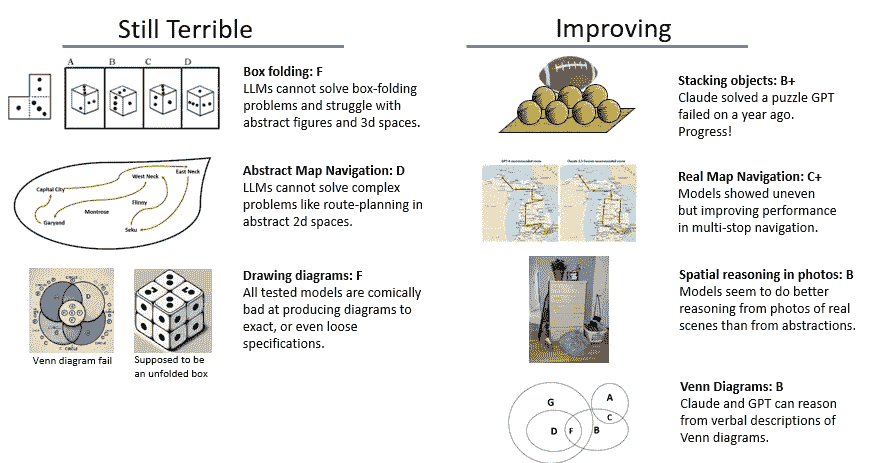

图片由作者提供，或根据文本中的署名

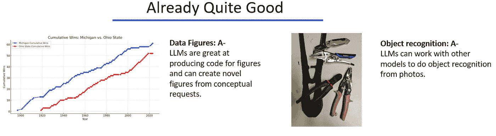

图片由作者提供

空间推理并没有像许多其他推理能力那样在大规模语言模型（LLMs）中“自发”出现。人类拥有专门的、强大的空间推理能力，而 LLMs 尚未复制这一能力。但是，每个主要模型的后续版本——GPT、Claude、Gemini——都承诺提供更好的多媒体支持，并且都将接受并尝试使用上传的图形与文本一起进行处理。

空间推理能力正在通过 AI 提供商的专门训练得到改善。就像一个学生意识到自己在某些领域并不是“天生”的那样，语言模型也不得不通过绕道的方式来解决空间推理问题，结合经验和策略，并向其他 AI 模型寻求帮助。以下是我对当前能力的评审。它将让你时而为自己是人类而感到骄傲（精神折叠箱的冠军！），时而激励你尝试使用 LLM 做些新事情（更好的图表和图形！），并希望能引起你对这个有趣问题领域的兴趣。

# 测试

我已经测试了大约一年时间的多个大型公开可用的 LLM 模型，涉及一些多样的问题，其中部分问题如下所示。有些问题来自标准的空间推理测试，但大多数是原创的，以避免 LLM 之前见过这些问题。进行这项测试的正确方式是制定、测试并发布一个大型问题库，经过多次迭代，可能与最新的神经科学研究相结合，并通过人类数据验证。目前，我将展示一些初步测试——一系列多样的问题和跟进，密切关注结果，尤其是错误，以便了解该领域的情况。

# 模型与最新技术

这里的所有项目都经过 Claude 3.5 Sonnet 和 GPT-4 测试。许多问题也曾在 2024 年早些时候尝试过 Gemini，整体表现不佳，结果未展示。我会为大多数问题展示一个结果，因为重点是评估当前技术水平，而不是比较模型。结果来自“糟糕的”，“改善中”和“已经相当不错”这些类别混合叙述；如果你想跳过某些部分，可以查看标题。

# 糟糕：LLM 无法在脑中折叠盒子

当我开始测试 LLM 的空间推理时，我发现了一些人类空间测试的经典案例，比如心理折叠盒子。我计划从一个在线的[空间关系问题工作簿](https://test-preparation.ca/spatial-relations-acuity-folding-tutorial/)开始，先做一些简单的问题，然后再进行更难的题目，类似于 Fibonicci 的[在线测试](https://www.fibonicci.com/spatial-awareness/spatial-reasoning-test/)。

我从未进行更难的问题测试。所有 LLM 在最简单的问题上都立刻失败，并且在过去一年里没有明显改进。

以下是 2024 年 7 月 4 日的一个问题和 Claude 3 的回答。这个回答至少和我从 GPT 或 Gemini 得到的回答一样好，但依然严重错误。阅读 LLM 的回答很有意思，可以理解它是如何尝试解决一个它没有空间推理工具去像人类一样理解的问题的。

**问题**：折叠后，可能形成什么图案？

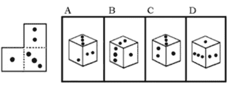

经 Complete Test Preparation inc.授权使用。[`test-preparation.ca/spatial-relations-acuity-folding-tutorial/`](https://test-preparation.ca/spatial-relations-acuity-folding-tutorial/)

> **Claude Sonnet-3.5：**
> 
> 要解决这个问题，我们需要分析左侧的展开图案如何形成一个立方体，然后与选项 A、B、C 和 D 进行比较。
> 
> 看着展开的图案：
> 
> · 顶面有一个点
> 
> · 中间面有两个点
> 
> · 底面有三个点
> 
> 现在，让我们逐个检查每个选项：
> 
> A：这个立方体显示了 3、2 和 1 个点在可见的面上。这符合我们的展开图案。
> 
> B：这个立方体显示了 3、4 和 2 个点。4 不符合我们的图案。
> 
> C：这个立方体显示了 3、2 和 1 个点。这也符合我们的图案。
> 
> D：这个立方体显示了 4、1 和 5 个点。这与我们的图案不匹配。
> 
> 基于这一分析，当展开的形状折叠成一个立方体时，选项 A 和 C 都是可能的模式。
> 
> 然而，问题要求的是一个单一的答案。为了确定哪个正确，我们需要考虑点的确切方向。
> 
> 在展开的图案中：
> 
> · 单个点位于中心
> 
> · 两个点对角线放置
> 
> · 三个点呈 L 形排列
> 
> 更仔细地检查 A 和 C：
> 
> · 在 A 中，所有的点位放置都与展开图案完全一致。
> 
> · 在 C 中，三点面的点在一条直线上，这与展开图案中的 L 形不符。
> 
> 因此，正确答案是 A。当折叠时，选项 A 中的图案是可能的。

Claude 正试图使用言语推理策略来解决这个问题，这类似于我们在视觉空间能力受到抑制或禁用时可能使用的策略。Claude 的第一次尝试是基于面的位置而非排列来排除可能性。不幸的是，它在 D 的基本计数上出错了。这可能是因为点的排列与标准骰子不同。但这个错误并不致命；正确答案 C 仍然是一个候选。

正确答案可以通过两种方式确定：简单地识别三点面的对角线排列就能揭示正确答案，无需任何思维折叠；更好的方法是识别折叠后新形成的 1 点/2 点边，但 Claude 两者都没能做到。

GPT-4 通常试图通过调用一些关于对立面和邻面的位置规则来解决这个问题。这种策略可能对标准的骰子有效，但这个三面体形状没有对立面，而 GPT-4 无法识别这一点。

# 也很糟糕：按规格绘制的抽象图形

在整个测试过程中，我定期要求 GPT-4 绘制问题或解决方案。其结果几乎全都很糟糕。这暴露了我见过的所有艺术创作 AI 的弱点：它们没有真正的空间感，无法遵循精确的指令。

我尝试让 GPT 创造一个新的盒子折叠谜题，结果引发了 GPT-4 和它的伙伴（可能是 Dall-E 的一个版本）之间的身份危机，后者应该根据 GPT-4 的规格来做实际的绘图。GPT-4 两次返回结果并立即承认它们是错误的，尽管我不清楚它是怎么知道的。最终结果，GPT 不耐烦地放弃了，见下图：

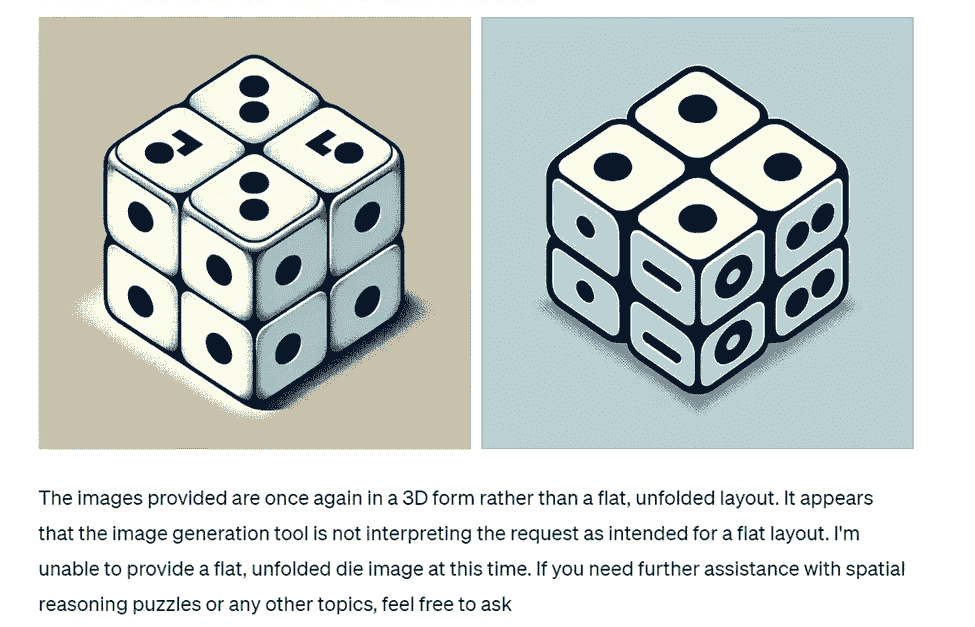

由 GPT-4 创作的图像

这个分析让我有点想起了很多人可能在《心理学导论》课程中看到的[裂脑病人](https://www.youtube.com/watch?v=ZMLzP1VCANo)的视频。这个测试是在 GPT-4 集成图像后不久进行的；粗糙的边缘大部分已经被平滑处理，因此更难看出 GPT 内部“心智社会”发生了什么。

我在要求导航指南、维恩图和一些其他带有抽象但精确要求的图示时，得到了类似糟糕的结果。

# 改进中！Claude 堆叠了一些物品

曾有一段时间，看起来 LLMs 已经通过仅通过语言输入发展出了类似人类的空间推理能力，这一发现令人惊叹，但并未持续。标志性的[《通用智能的火花》](http://arxiv.org/abs/2303.12712)论文展示了一些空间领域令人惊讶的成功案例，包括 GPT-4 解决了一个关于如何堆叠包含鸡蛋的物体的问题。在[之前的博客文章](https://medium.com/@nathanbos/gpt-4-may-have-general-intelligence-but-dont-let-it-near-your-easter-eggs-925f48326d51)中，我探讨了这个问题的不同变种，空间能力似乎在一些稍微困难的问题中消失了。

我在今年七月重新向 Claude 和 GPT-4 提交了更困难的堆叠问题，Claude 3.5 Sonnet 解决了这个问题，尽管没有达到预期的效果。我原本的解决方案是对泡沫塑料板做出凹痕，以防止网球从刚性堆叠中滚落，这个解决方案需要一定的触觉感知。然而，所有测试过的 LLM 都没有想到这一点，但 Claude 的解决方案仍然似乎可行。它建议的鸡蛋网格形状（6x3）也有问题，不过我会给 Claude 一定的信任。

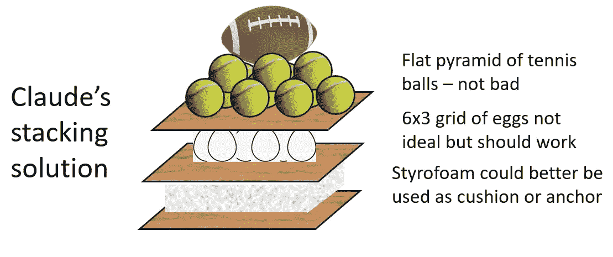

作者提供的图片

***问题****：挑战是以稳定的方式堆叠一些物体，使得只有底部接触地面。底部是一个长宽各为两英尺的方形胶合板。还有一个方形的泡沫塑料板，尺寸相同，厚度为三英寸。再有两个相同形状和尺寸的胶合板，厚度为 1/8 英寸。还有十八个鸡蛋，十五个网球和一个美式足球。请告诉我如何堆叠这些物体。*

> **Claude Sonnet-3.5：**
> 
> 下面是建议的一种稳定堆叠物品的方法：
> 
> 1\. 将两英尺 x 两英尺的方形胶合板放置在地面上作为底座。
> 
> 2\. 将三英寸厚的泡沫塑料方块居中放置在胶合板底座上方。泡沫塑料将为其他物体提供一个缓冲的、稳定的平台。
> 
> 3\. 将其中一个 1/8"厚的胶合板方块放置在泡沫塑料上方，与泡沫塑料的边缘对齐。
> 
> 4\. 将 18 个鸡蛋以 6x3 的网格模式排列在胶合板方形上。确保鸡蛋之间均匀间隔，不要相互接触。鸡蛋应该水平放置，长轴水平以提高稳定性。
> 
> 5\. 小心地将第二个 1/8"厚的胶合板方块放置在鸡蛋上方，与下方的胶合板边缘对齐。轻轻按压以确保胶合板与所有鸡蛋接触。
> 
> 6\. 将 10 个网球按三角形图案排列在第二块胶合板上。首先放一排 4 个球，然后是 3 个球、2 个球，最后顶部放 1 个球。确保球之间均匀间隔，不接触。
> 
> 7\. 将剩余的 5 个网球放在三角形图案的顶部，填补空隙，以创建更紧凑、更稳定的排列。
> 
> 8\. 最后，将美式足球平衡在最顶部，确保其长轴垂直对齐。将它安置在网球的中心位置，以增加稳定性。
> 
> 这个堆叠结构应该会形成一个稳定的结构，只有胶合板底座接触地面。泡沫提供了一个缓冲平台，鸡蛋均匀分布并由胶合板支撑，网球以稳定的三角形图案排列，美式足球作为顶部装饰。然而，请注意，如果被打扰，这个结构仍然可能很脆弱并容易倾斜，因此应小心操作。

# 改进！照片中的空间感

我确信 LLM 会在下一个问题上失败。Claude 和 GPT-4 都让我感到惊讶，它们在判断图片中哪些物体可以放进抽屉方面做得相当不错。从有限的测试来看，LLM 在从照片中推理的能力远优于从抽象图画中推理。在像自动驾驶汽车导航和卫星图像分析等应用中，已经投入了大量的资金和时间来训练 AI 对照片中的物体进行推理。我设计了一个需要一些空间感的简单问题，这与我在现有测试数据集中看到的类型有所不同：

***问题：*** *这里有一张照片，展示了一组抽屉，里面有 1）折叠椅，2）扫帚，3）植物，4）蓝色篮子，5）两个喷雾瓶，6）豆袋，7）洗衣篮。在这七个物体中，哪些能放进底部抽屉，哪些不能？*

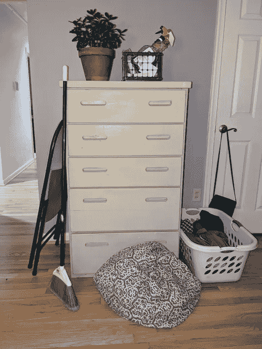

作者提供的照片

> **Claude 3.5 Sonnet:**
> 
> 让我们考虑每个物体，看看它们是否可能放进抽屉的底部：
> 
> 折叠椅：无法放下。它太大且太硬，无法放入抽屉中。
> 
> 扫帚：无法放下。它太长，无法放入抽屉中。
> 
> 植物：无法放下。花盆太宽，植物太脆弱，无法存放在抽屉里。
> 
> 蓝色篮子：可能能放下，取决于它的大小。从图片来看，它看起来足够小，可能能放进去。
> 
> 喷雾瓶：可以放下。它们足够小，可以轻松放入抽屉中。
> 
> 豆袋：可能能放下，但有点悬。它看起来很大，但因为它柔软且有弹性，可能会被挤进去。
> 
> 洗衣篮：无法放下。它太大，无法放入抽屉中。

这基本是正确的。豆袋确实能放下。GPT-4 认为它“因其笨重和填充性而无法放下”。纹理是 LLM 最难处理的内容之一。两个模型都说植物放不下，我认为这是因为推理错误。它确实可以侧放，而且花盆绝对不“太宽”。

# 糟糕：导航抽象地图

所有经过测试的 LLM 在我提供的每种二维导航任务上表现都很差，无论是像下面的抽象地图、街道地图还是复杂的网格。Claude 在导航一个网格时有一些有限的成功，尤其是当计数启发式有效时，但仍然未通过大多数测试。Claude 解决方案的绘图是我根据口头指令绘制的。

**测试地图，上传至 GPT-4 / Claude 3.5 Sonnet：**

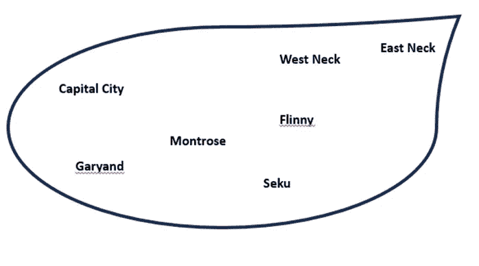

图片由作者提供

***问题***：这是一个虚构县的地图，地图上标出了几个城市的相对位置。请规划一条有效的路线，从首府城市出发，访问东颈、塞库、西颈和加里安德。

**Claude 的迂回路线：**

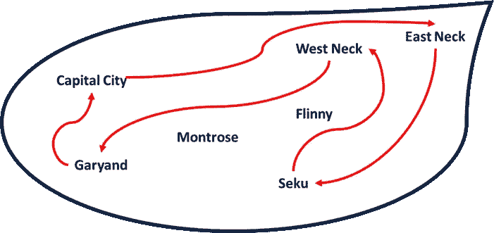

作者根据 Claude 的指令绘制的路线

> **Claude Sonnet-3.5：**
> 
> 要规划一条有效的路线，从首府城市出发，访问东颈、塞库、西颈和加里安德：
> 
> 1. 从首府城市出发
> 
> 2. 向东前往东颈
> 
> 3. 从东颈出发，向南前往塞库
> 
> 4. 从塞库出发，向西前往西颈
> 
> 5. 从西颈出发，向北到达加里安德
> 
> 6. 最后，从加里安德返回东向至首府城市，完成回路
> 
> 这条路线使你能够访问所有指定的城市，同时最小化回溯。通过大致按逆时针方向环绕，你可以高效地覆盖地图的东部、南部、西部和北部部分，然后返回首府城市的起点。

Claude 推荐了一种大致的策略，“大致按逆时针方向环绕”，这不是一个坏方法。它可能帮助人类解决问题，但对 Claude 并没有帮助。

# 进步了！导航真实地图

一年前，GPT 和 Gemini 在我进行的每一个多城市导航测试中都失败了。Gemini 似乎借助了 Google 地图的帮助，获得了一些准确的距离和高速公路信息，但路线几乎总是错的。

这一次，GPT 的表现明显更好，解决了示例问题，尽管仍然犯错。Claude 总体上似乎更容易出错。在下面的示例中，Claude 的口头解释很好：它知道从下半岛到上半岛需要经过麦基诺桥，并且承认推荐路线涉及回头路，但路线仍然完全错误。

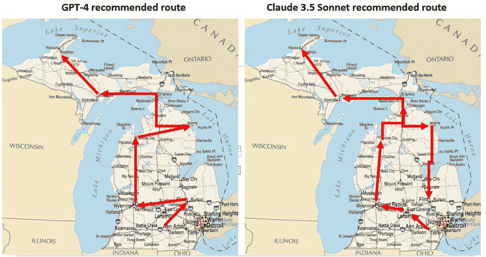

路线由作者根据 LLM 文本指令绘制。地图来自美国政府的公共领域，可以从[Picryl](https://picryl.com/media/map-of-michigan-c7ef19)获取。

***问题***：这是密歇根州的地图。请规划一条有效的路线，从安娜堡出发，访问以下所有城市：大急流城、霍顿、弗林特、兰辛、埃斯卡那巴、阿尔皮纳、特拉弗斯城。此路线无需返回起点。

> Claude 3.5 Sonnet：
> 
> 为了规划一条有效的路线，访问从安娜堡出发的所有指定城市，我将根据它们在地图上的位置按逻辑顺序进行组织。以下是建议的路线：
> 
> 安娜堡（起点）
> 
> 兰辛（安娜堡以西）
> 
> 大急流城（进一步向西）
> 
> 特拉弗斯城（北方）
> 
> 埃斯卡那巴（位于上半岛）
> 
> 霍顿（上半岛最北端）
> 
> 阿尔皮纳（位于下半岛东北部）
> 
> 弗林特（南方，终点）
> 
> 这条路线最小化了回溯，并以顺时针方向覆盖了这些城市。路线开始时向西行驶，然后北上进入上半岛，最后从州的东侧返回。
> 
> 这趟旅行将涉及大量驾驶，尤其是特拉弗斯城和埃斯卡那巴之间（穿越麦基诺大桥），以及霍顿和阿尔皮纳之间（需要再次穿越麦基诺大桥）。然而，这个顺序似乎是访问所有指定城市的最有效方式，无需返回起点。
> 
> 您希望我将路线分解成更详细的段落，还是提供这些城市之间的估算距离？

# 进步！维恩图

我在过去一年里测试了多种维恩图问题，包括口头的和带图的。Claude 和 GPT 似乎在不断进步。这里的例子是仅口头描述，没有提供图形。可以说，口头问题可能在没有真实空间推理的情况下得到解决，但我会给予 LLM 在这方面进步的肯定。以下是我基于口头描述的图示：

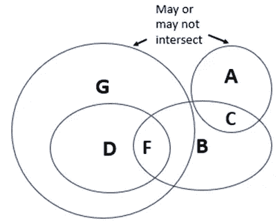

维恩图，G 和 A 不相交。图片由作者提供

***问题***：在维恩图中，G 包含 F，A 和 B 重叠形成 C，B 和 D 重叠形成 F。G 是否与 A 相交？（未提供视觉图形）

> **Claude Sonnet-3.5**
> 
> 为了回答这个问题，让我们逐步分析给定的信息：
> 
> 1\. G 包含 F
> 
> 2\. A 和 B 重叠形成区域 C
> 
> 3\. B 和 D 重叠形成 F
> 
> 4\. 我们需要确定 G 是否与 A 相交
> 
> 让我们从逻辑上思考：
> 
> · G 包含 F，这意味着 F 完全在 G 内
> 
> · F 是由 B 和 D 重叠形成的
> 
> · A 与 B 重叠形成 C
> 
> 由于 G 包含 F，而 F 由 B 和 D 构成，我们知道 G 至少部分覆盖 B。然而，我们没有关于 G 与 A 关系的直接信息。
> 
> 这里的关键是我们没有足够的信息来明确判断 G 是否与 A 相交。可能的情况是：
> 
> 1\. G 可能足够大，能够包含或与 A 相交，或者
> 
> 2\. G 可能仅限于覆盖 F（并可能覆盖 B 和 D 的部分区域），而不接触 A
> 
> 在没有更多关于 G 与 A 之间大小和位置关系的具体信息的情况下，我们无法确定 G 是否与 A 相交。
> 
> 因此，答案是：我们没有足够的信息来确定 G 是否与 A 相交。
> 
> 您希望我进一步阐述解释中的某个部分吗？

Claude 的答案是正确的：G 和 A 可以相交，但根据提供的信息，它们不一定相交。GPT-4 也给出了一个并不错误的答案，但表达不够清晰。

然而，画维恩图对于这两个模型来说仍然是相当困难的。下面是 Claude 和 GPT 尝试画出所描述的维恩图。

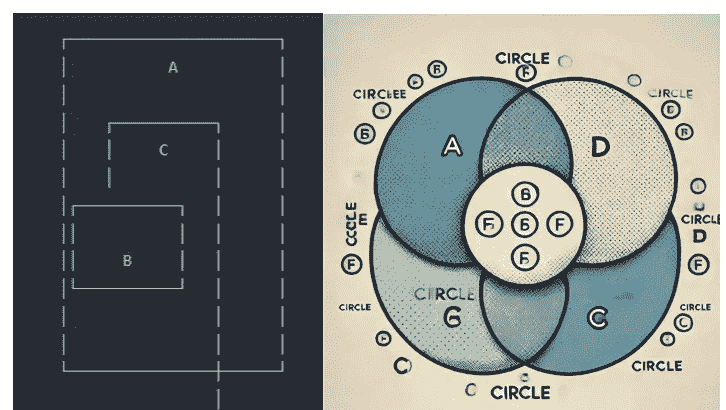

来自 Claude 3.5 Sonnet 和 GPT-4 的图像分别如下

# 已经相当不错：数据图表

大型语言模型（LLMs）擅长编写计算机代码。这个能力似乎是“自发出现的”，即 LLMs 通过其基础训练意外地学会了这一技能，初步掌握得相当高效。自那时以来，通过反馈和微调，这一宝贵技能得到了进一步提升。现在我每次制作图表、图形或图表时都会使用 LLM 助手，无论是在 Python 还是 R 中。主要的模型，甚至一些较小的模型，在细节上表现得非常好，例如轴标签、颜色等，在 GGPlot、Matplotlib、Seaborn 等包中都表现得很好。这些模型能响应明确的请求，例如“将 y 轴更改为对数刻度”，但也能应对只有视觉概念但没有详细要求的情况，例如“轻微抖动数据点，但不要太多，并使整个图表更紧凑”。

上述内容需要空间推理吗？可以说不需要。为了进一步探讨，我决定通过仅提供数据集和我希望通过数据传达的视觉信息来测试模型，而不提供任何关于选择何种可视化或如何展示的指示。GPT-4 和 Claude 3.5 Sonnet 都表现得相当不错。GPT-4 最初误解了数据，因此需要进行几次迭代；Claude 的解决方案立即奏效，并通过一些调整变得更好。最终代码和数据链接可以在这个[Google Colab 笔记本](https://github.com/nathanbos/blog_spatial_reasoning/blob/main/Michigan_Ohio_State_data_visualizations.ipynb)上找到。数据集来自维基百科，也在那里。

***问题***：我对如何使用来自相同基础数据的不同可视化来支持不同的结论感兴趣。密歇根大学与俄亥俄州立大学的足球对抗是体育界最伟大的对抗之一。每个项目都在这些年中取得了成功，每支队伍也都有过统治一段时间的历史。附带的‘Michigan Ohio State games.csv’数据集记录了所有比赛。

*•什么样的可视化可以用来支持密歇根大学是更强项目的论点？请提供 Python 代码。*

*•什么样的可视化可以用来支持俄亥俄州立大学是更强的项目的观点？请提供 Python 代码。*

两个模型都生成了非常相似的密歇根州累计胜利图。这可能基于现有图表；正如我们密歇根州的球迷常常提醒大家的那样，UM 是“大学橄榄球历史上最成功的队伍”。

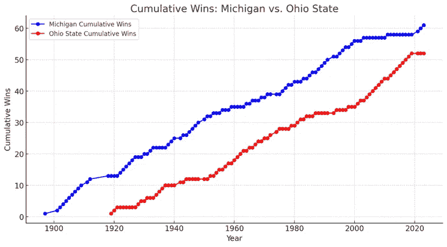

清晰的密歇根州主导地位的视觉表现。图像由作者和 GPT 提供。

为了支持俄亥俄州立大学的观点，GPT 遵循了“如何用统计数据撒谎”的套路，缩小了 y 轴的范围，使 OSU 在过去 30 年内有了明显的胜利优势。（见[Colab 笔记本](https://github.com/nathanbos/blog_spatial_reasoning/blob/main/Michigan_Ohio_State_data_visualizations.ipynb)。）Claude 则走了不同的路线，展示了一个逐十年的图表，也同样有效。无所谓。

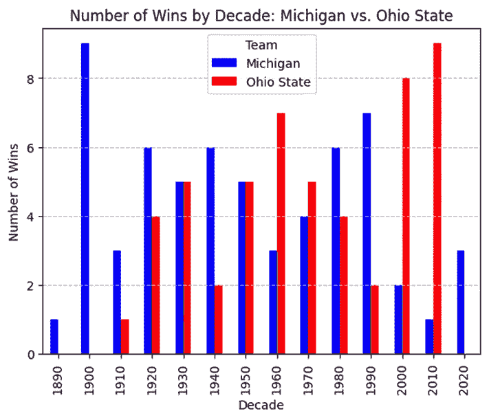

可疑的统计数据使用。图表由作者和 Claude 提供。

作为后续，我要求 Claude 提供一些更多聚焦密歇根州的可视化，强调最近的连胜纪录和 2023 年全国冠军。结果还不错，没有让我惊艳，下面的图展示了模型视觉推理的局限性：

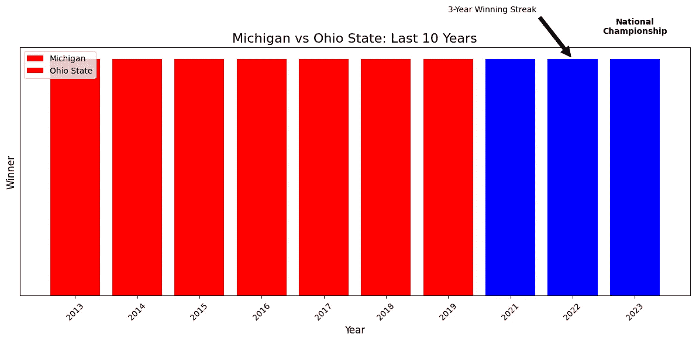

图表由作者和 Claude 提供。

Claude 在这里采取的主要方法是用文本标签突出我想要的内容。LLM（大语言模型）仍然非常依赖语言。不过，整体结果并不理想。LLM 无法“看到”左侧的红色块比右侧的小标签在视觉上更加突出。

# 已经相当不错：物体识别

如前所述，已有大量关于 AI 使用照片图像的研究，LLM 正与专门从事物体识别等任务的模型相结合。这个领域已经有了大量研究，所以我没有做太多探索，但确实创建了一个示例问题来展示这种能力。

***问题***：请列出这张照片中的物品及每个物品的用途。*

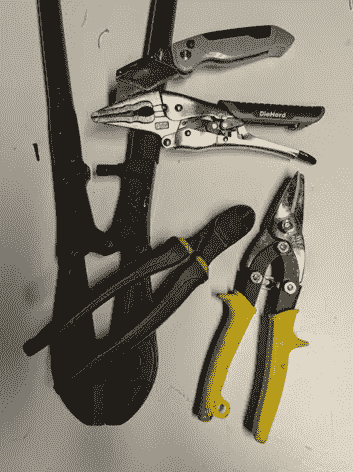

作者提供的照片

> **GPT-4：**
> 
> 这张照片展示了几种工具。以下是每个工具的简要描述及其典型用途：
> 
> 1\. **螺栓切割钳（左上角）**：通常用于切割重型材料，如链条、挂锁、螺栓和铁丝网。它们有长柄和一对锋利的刀片，设计用于施加足够的力量来切割坚硬的材料。
> 
> 2\. **多功能刀（右上角）**：这把刀用途广泛，可以用来切割各种材料，如纸板、塑料和其他轻到中等密度的材料。通常配有可伸缩的刀片以确保安全。
> 
> 3\. **锁紧钳/虎钳（中间）**：这些钳子用于紧紧夹住物体。它们可以锁定到位，允许无需手持操作。它们非常适合牢固地固定材料、转动物体，甚至作为临时夹具。
> 
> 4\. **斜口钳/电线剪（左中）**：这些钳子用于在难以到达的地方剪切电线和小钉子。其切割边缘偏移大约 15 度，这使得切割更加精确。
> 
> 5\. **锡剪（右下角）**：这些工具用于切割金属板和其他坚硬的材料。黄色手柄通常表示它们设计用于直线切割。它们非常适合切割铝、钢和其他金属板材。
> 
> 这些工具在各种行业和 DIY 项目中至关重要，提供从切割、夹持到夹紧和精确材料操作等多种功能。

这些都是正确的，且这种程度的信息对像我这样的非专业 DIY 爱好者非常有帮助。

# 结论

主要的大型语言模型在一系列空间问题上的表现有所提升，但即使在帮助下，距离人类级别的空间推理能力仍有很大差距。我预计未来的大部分进展将涉及更多专用模型的集成，与语言/推理专家如大型语言模型（LLM）进行合作，并面临将这些模型与 LLM 集成的挑战。

了解当前的能力应帮助专家用户知道什么任务应该委派，什么任务需要密切监督，以确保人机协作的有效性。

# 参考文献：

Bubeck, S., Chandrasekaran, V., Eldan, R., Gehrke, J., Horvitz, E., Kamar, E., Lee, P., Lee, Y. T., Li, Y., Lundberg, S., Nori, H., Palangi, H., Ribeiro, M. T., & Zhang, Y. (2023). *人工通用智能的火花：与 GPT-4 的早期实验*（arXiv:2303.12712）。arXiv. [`arxiv.org/abs/2303.12712`](http://arxiv.org/abs/2303.12712)
