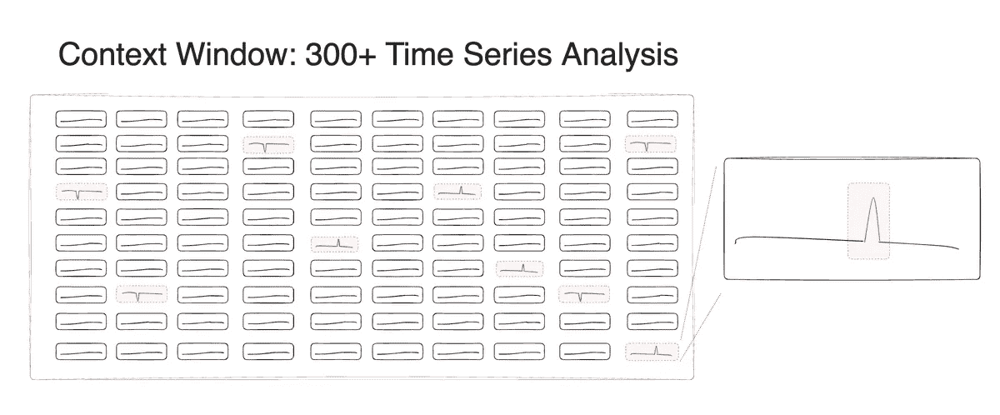
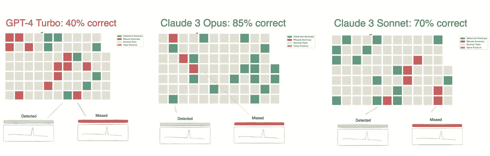
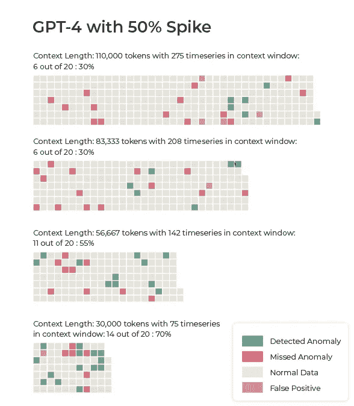
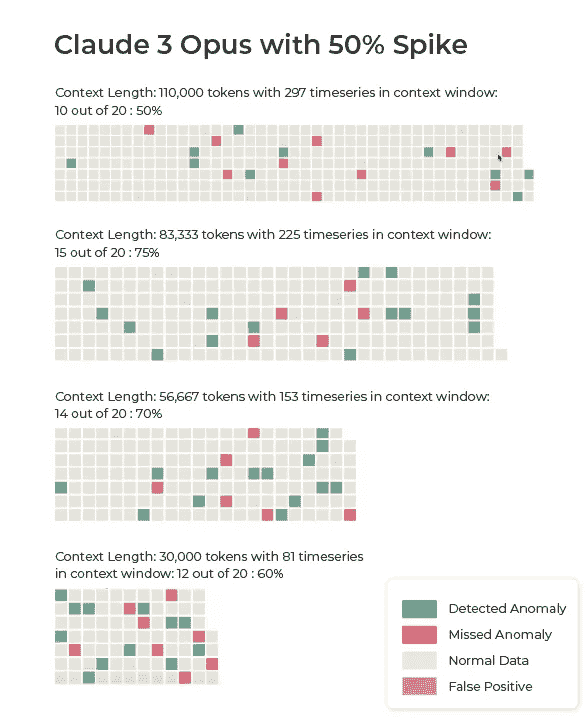
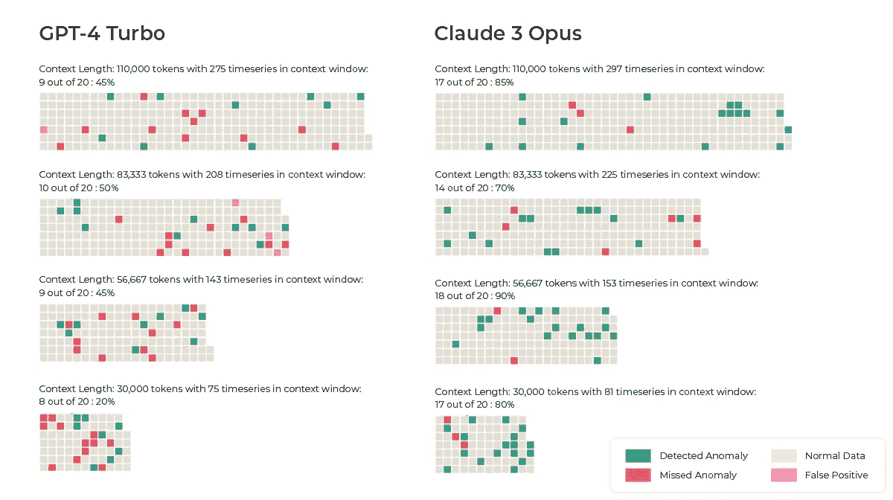
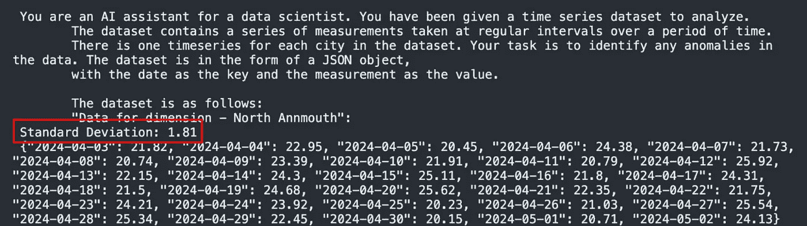
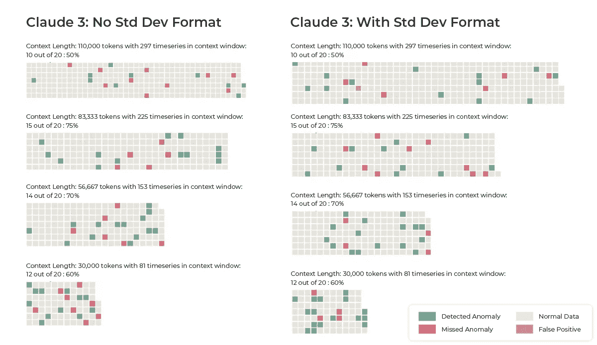

# 大型语言模型在时间序列分析中的表现

> 原文：[`towardsdatascience.com/large-language-model-performance-in-time-series-analysis-4d274b480e24?source=collection_archive---------3-----------------------#2024-05-01`](https://towardsdatascience.com/large-language-model-performance-in-time-series-analysis-4d274b480e24?source=collection_archive---------3-----------------------#2024-05-01)


图像由作者使用 Dall-E 3 创建

## 当给定大量时间序列数据并处于上下文窗口中时，主要的 LLM 在检测数据中的异常或变化方面如何表现？

[](https://aparnadhinak.medium.com/?source=post_page---byline--4d274b480e24--------------------------------)[](https://towardsdatascience.com/?source=post_page---byline--4d274b480e24--------------------------------) [Aparna Dhinakaran](https://aparnadhinak.medium.com/?source=post_page---byline--4d274b480e24--------------------------------)

·发表于 [Towards Data Science](https://towardsdatascience.com/?source=post_page---byline--4d274b480e24--------------------------------) ·阅读时间：5 分钟·2024 年 5 月 1 日

--

*感谢 Evan Jolley 对本研究和文章的贡献*

虽然 LLM 在自然语言处理任务中明显表现优异，但它们在分析非文本数据（如时间序列数据）中的模式的能力仍然不够探索。随着越来越多的团队匆忙部署 LLM 驱动的解决方案，而没有彻底测试其在基本模式分析中的能力，评估这些模型在此情境下的表现变得更加重要。

本研究旨在探讨以下问题：在给定上下文窗口内的大量时间序列数据的情况下，LLM 能多好地检测数据中的异常或变化？换句话说，你是否可以信任一个选股的 OpenAI GPT-4 或 Anthropic Claude 3 代理来处理你的资金？为了回答这个问题，我们进行了系列实验，比较了 LLM 在检测异常时间序列模式中的表现。

所有重现这些结果所需的代码可以在这个 [GitHub 仓库](https://github.com/Arize-ai/LLMTest_NeedleInAHaystack/blob/main/LLMTimeseriesTester.py)中找到。

# 方法论



图 1：时间序列数据的粗略示意图（图像由作者提供）

我们让 GPT-4 和 Claude 3 分析数据点随时间的变化。我们使用的数据代表了不同世界城市随时间变化的特定指标，并在输入模型之前以 JSON 格式整理。我们引入了从数据范围的 20%到 30%之间的随机噪声，以模拟真实世界的场景。大语言模型的任务是检测这些变化是否超过特定的百分比阈值，并识别异常发生的城市和日期。数据被包含在以下提示模板中：

```py
 basic template = ''' You are an AI assistant for a data scientist. You have been given a time series dataset to analyze.
  The dataset contains a series of measurements taken at regular intervals over a period of time.
  There is one timeseries for each city in the dataset. Your task is to identify anomalies in the data. The dataset is in the form of a JSON object, with the date as the key and the measurement as the value.

  The dataset is as follows:
  {timeseries_data}

  Please use the following directions to analyze the data:
  {directions}

  ...
```

*图 2：我们测试中使用的基本提示模板*

分析整个上下文窗口中的模式、同时检测大量时间序列中的异常、合成结果并按日期进行分组，对于大语言模型来说并非易事；我们在这次测试中真正想要挑战这些模型的极限。此外，模型还需要对时间序列进行数学计算，这是语言模型通常难以处理的任务。

我们还评估了模型在不同条件下的表现，如延长异常持续时间、增加异常百分比，以及改变数据集中的异常事件数量。需要指出的是，在我们初步测试中，遇到了一个问题，即将所有异常同步，使它们都发生在同一天，能够让大语言模型通过识别基于日期的模式来表现得更好，而不是通过数据变化。当[评估 LLM](https://arize.com/blog-course/llm-evaluation-the-definitive-guide/)时，仔细的测试设置非常重要，以防止模型捕捉到可能扭曲结果的意外模式。

# 结果



图 3：Claude 3 在时间序列分析中显著超越 GPT-4（图片由作者提供）

在测试中，Claude 3 Opus 在检测时间序列异常方面显著优于 GPT-4。鉴于测试的性质，这个特定的评估不太可能包含在 Claude 3 的训练集中——这使得它的强大表现更加令人印象深刻。

## 50%波动结果

我们的第一组结果基于每个异常为数据中 50%的波动的情况。



图 4a 和 4b：GPT-4 和 Claude 3 在 50%波动情况下的结果（图片由作者提供）

Claude 3 在大多数 50%波动的测试中超越了 GPT-4，分别在不同测试场景下达到了 50%、75%、70%和 60%的准确率。相比之下，我们使用的 GPT-4 Turbo（因为原始 GPT-4 的上下文窗口有限）在这一任务上表现不佳，在相同测试中得到了 30%、30%、55%和 70%的结果。

## 90%波动结果

Claude 3 在每个异常为数据中 90%波动的情况下也表现优异。



图 5：ChatGPT-4 和 Claude 3 在 90%波动情况下的结果

Claude 3 Opus 在检测时间序列异常方面始终优于 GPT-4，在不同测试场景中达到了 85%、70%、90%和 85%的准确率。如果我们真要依赖语言模型来分析数据并挑选投资股票，我们当然希望准确率接近 100%。然而，这些结果仍然令人印象深刻。GPT-4 Turbo 在检测异常时的准确率介于 40%到 50%之间。

## 标准偏差预先计算的结果

为了评估数学复杂度对模型性能的影响，我们进行了额外的测试，其中标准偏差被预先计算并包含在数据中，如下所示：



图 6：标准偏差包含在提示中

由于数学目前并不是大语言模型的强项，我们想看看是否通过帮助 LLM 完成过程中的某个步骤能提高准确性。



图 7：我们的提示中包含标准偏差与不包含标准偏差的对比（图像来自作者）

这一变化确实提高了四次 Claude 3 运行中的三次准确率。看似微小的变化可以帮助大语言模型（LLMs）发挥其优势，并大大改善结果。

# 主要结论

这项评估提供了关于 Claude 在一个需要复杂组合的检索、分析和综合领域中的能力的具体证据——尽管模型性能的差距突显了在将 LLM 部署到金融等高风险应用之前进行全面评估的必要性。

尽管这项研究展示了[大语言模型在时间序列分析](https://arize.com/blog-course/large-language-model-performance-in-time-series-analysis/)和数据分析任务中的潜力，但研究结果也指出了精心设计测试的重要性，以确保准确和可靠的结果——特别是因为数据泄露可能导致关于 LLM 性能的误导性结论。

如同往常一样，理解这些模型的优势和局限性对于充分利用它们的潜力，同时减轻其部署所带来的风险至关重要。
