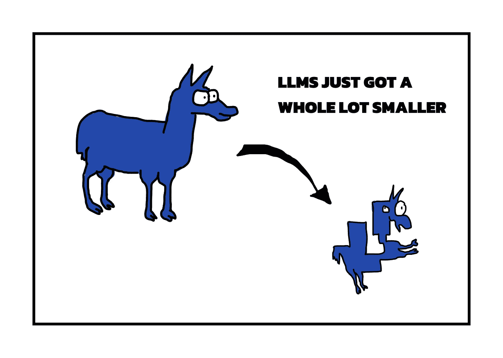

# 大型语言模型变得更小了

> 原文：[`towardsdatascience.com/large-language-models-just-got-a-whole-lot-smaller-f93425ee59a2?source=collection_archive---------1-----------------------#2024-03-20`](https://towardsdatascience.com/large-language-models-just-got-a-whole-lot-smaller-f93425ee59a2?source=collection_archive---------1-----------------------#2024-03-20)

## 这可能如何改变软件初创公司的竞争格局

 [Ari Joury, PhD](https://arijoury.medium.com/?source=post_page---byline--f93425ee59a2--------------------------------)

·发表于 [Towards Data Science](https://towardsdatascience.com/?source=post_page---byline--f93425ee59a2--------------------------------) ·15 分钟阅读·2024 年 3 月 20 日

--

LLM 正在变得越来越小、越来越高效！图片灵感来自 Benjamin Marie

**本文由** [**David Meiborg**](https://medium.com/u/8523370997f4?source=post_page---user_mention--f93425ee59a2--------------------------------)**共同撰写。**

*TLDR：大型语言模型（简称 LLMs）目前非常庞大，运行成本高，而且具有* [*显著的碳足迹*](https://arxiv.org/abs/2309.14393)*。然而，近期在模型压缩和系统级优化方法上的进展可能会增强 LLM 的推理能力。特别是，使用具有三元结构的参数的方法，有可能绕过当前标准的成本高昂的矩阵乘法。这对那些生产专用芯片的硬件初创公司以及那些使用或定制自己 LLM 的软体初创公司来说，带来了激动人心的前景。那些帮助客户部署 LLM 的初创公司也可能会迎来更多的商业机会。*

现在的大型语言模型非常庞大。可以说，真的很大。如果你想加载一个 LlaMa-2–70B 模型，你需要 140 GB 的显存（这相当于 70 亿个参数，每个参数占用 2 字节）。相比之下，像 NVIDIA RTX 3090 或 4090 这样的 GPU 只有 24 GB 的显存——这只是所需显存的一小部分。

有一些量化的变通方法，但这些方法通常很麻烦。你很可能仍然需要让你的 GPU 工作长达 15 小时，直到模型加载完成。更不用说你仍然...
