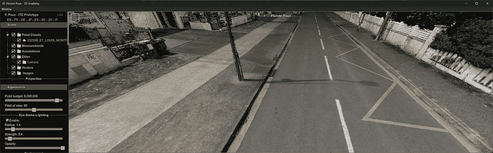

# 学习使用无代码工具可视化庞大的点云和 3D 网格

> 原文：[`towardsdatascience.com/learn-to-visualize-massive-point-clouds-3d-mesh-with-no-code-tools-1835dd4be37f?source=collection_archive---------3-----------------------#2024-10-22`](https://towardsdatascience.com/learn-to-visualize-massive-point-clouds-3d-mesh-with-no-code-tools-1835dd4be37f?source=collection_archive---------3-----------------------#2024-10-22)

## 3D 点云

## 一个无代码教程，使用 2 个开源解决方案来管理庞大的点云（超过 2.5 亿个点）和 3D 网格。

 [Florent Poux, Ph.D.](https://medium.com/@florentpoux?source=post_page---byline--1835dd4be37f--------------------------------)

·发布于[数据科学前沿](https://towardsdatascience.com/?source=post_page---byline--1835dd4be37f--------------------------------) ·11 分钟阅读·2024 年 10 月 22 日

--

一个 100GB 的庞大 3D 点云，我们可以在不到一秒钟的时间内，在一台 5 年历史的笔记本电脑上进行可视化和交互。[© Florent Poux](https://learngeodata.eu/)

可视化庞大的点云可能会让人头痛。如果你在处理庞大的点云——我说的是十亿级点云——或拥有大量三角形的庞大 3D 网格，处理各种文件格式时感到困难，而你又没有编码技能来自动化这一切，那么我有一个解决方案可以提供给你。

这个简短的教程展示了如何在本地计算机上开始处理和可视化这些数据。

另一个带颜色的点云（超密集）。[© Florent Poux](https://learngeodata.eu/)

# 我的 3D 前言

现在我们有了独特的工具，使得即使没有编码，也能轻松快速地处理大数据。这为分享和协作处理 3D 数据开辟了无限可能，即使是对技术不熟悉的人也能使用。

让我详细介绍一个简单的工作流程，结合了三种强大的无代码解决方案：

+   一个命令行界面（CLI），

+   一个具有 CLI 的软体…
