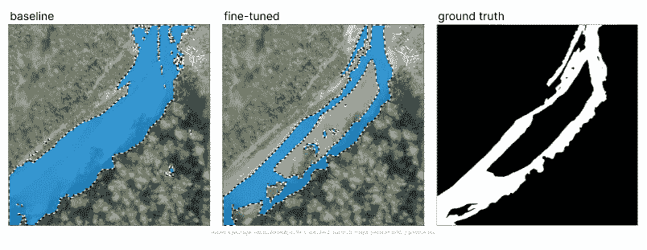
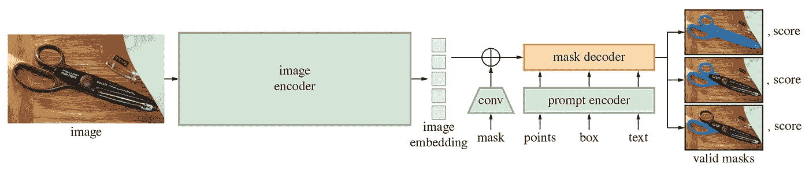
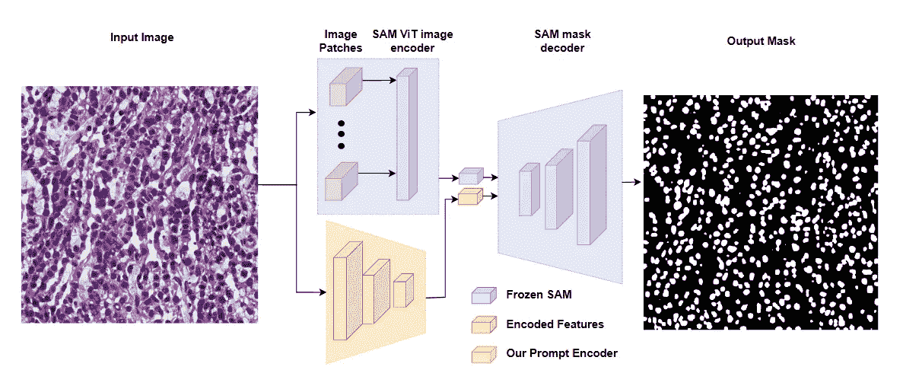
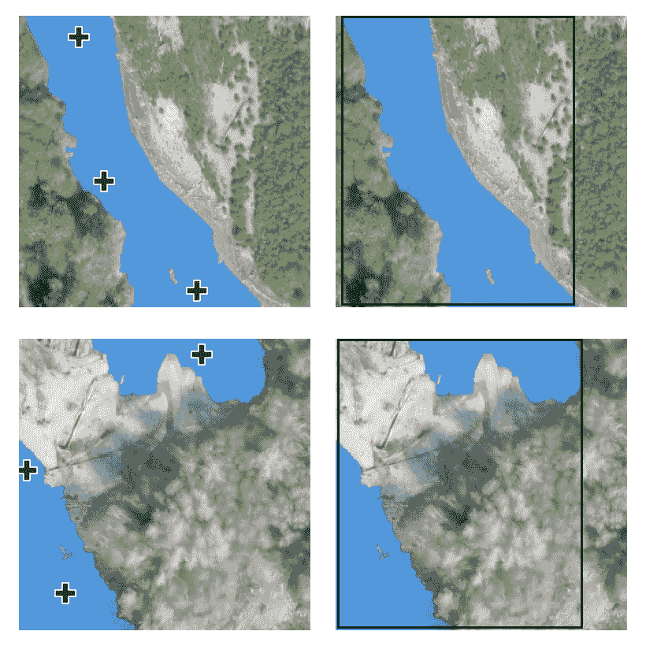
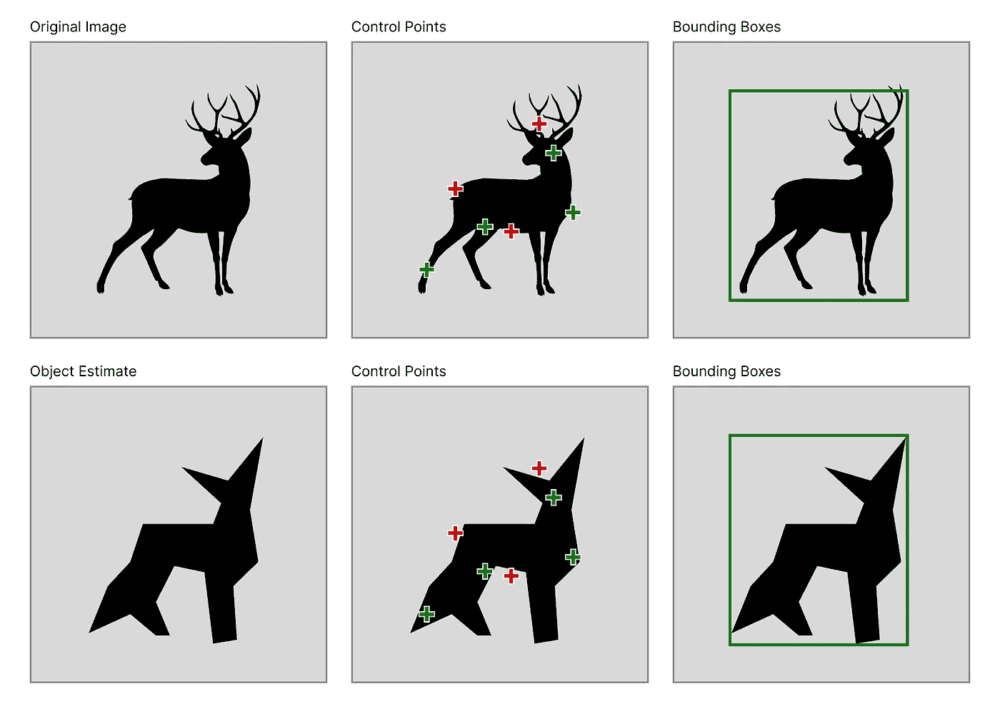
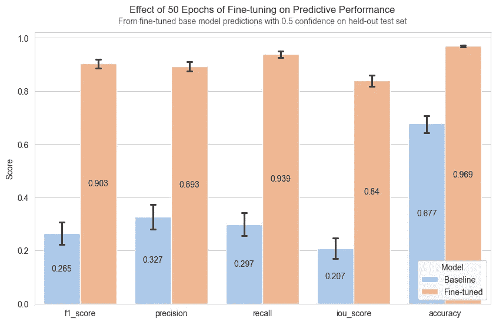
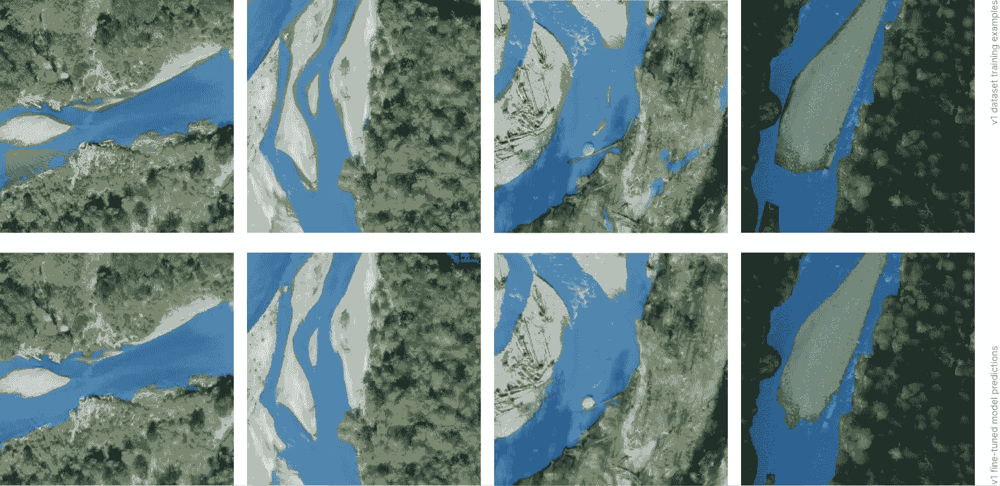

# 学习 Transformer 微调与 Segment Anything

> 原文：[`towardsdatascience.com/learn-transformer-fine-tuning-and-segment-anything-481c6c4ac802?source=collection_archive---------0-----------------------#2024-06-30`](https://towardsdatascience.com/learn-transformer-fine-tuning-and-segment-anything-481c6c4ac802?source=collection_archive---------0-----------------------#2024-06-30)

## 训练 Meta 的 Segment Anything Model（SAM），为任何领域分割高保真掩模

[](https://todoran.medium.com/?source=post_page---byline--481c6c4ac802--------------------------------)[](https://towardsdatascience.com/?source=post_page---byline--481c6c4ac802--------------------------------) [Stefan Todoran](https://todoran.medium.com/?source=post_page---byline--481c6c4ac802--------------------------------)

·发表于[Towards Data Science](https://towardsdatascience.com/?source=post_page---byline--481c6c4ac802--------------------------------) ·11 分钟阅读·2024 年 6 月 30 日

--

几个强大的开源基础模型的发布以及微调技术的进步，带来了机器学习和人工智能领域的新范式。这场革命的核心是[transformer 模型](https://arxiv.org/pdf/1706.03762)。

尽管高准确度的领域特定模型曾经只属于资金雄厚的公司，但如今，基础模型的范式使得即使是学生或独立研究者所拥有的有限资源，也能够取得与最先进的专有模型相媲美的成果。



微调可以显著提升在分布外任务上的表现（图片来源：作者提供）。

本文探讨了 Meta 的 Segment Anything Model（SAM）在遥感任务中应用于河流像素分割。如果你想直接跳入代码，项目的源文件可以在[GitHub](https://github.com/geo-smart/water-surf/blob/main/book/chapters/masking_distributed.ipynb)上找到，数据也在[HuggingFace](https://huggingface.co/datasets/stodoran/elwha-segmentation-v1)上发布，尽管建议先阅读完整的文章。

# 项目要求

第一步是找到或创建一个合适的数据集。根据现有文献，适合 SAM 的微调数据集应该至少包含 200 到 800 张图像。过去十年深度学习发展的一个关键经验是，更多的数据总是更好，因此更大的微调数据集是不会错的。然而，基础模型的目标是使得即使是相对较小的数据集也足以获得强劲的表现。

还需要一个 HuggingFace 账户，可以在[此处创建](https://huggingface.co/join)。通过 HuggingFace，我们可以轻松地在任何设备上随时存储和获取我们的数据集，这使得协作和可重复性变得更加容易。

最后的要求是有一台配备 GPU 的设备，我们可以在其上运行训练工作流。Nvidia T4 GPU，通过[Google Colab](https://colab.research.google.com/)免费提供，足够强大，可以在 12 小时内对 1000 张图像进行 50 个 epoch 的训练，并训练出最大的 SAM 模型检查点（sam-vit-huge）。

为避免因托管运行时的使用限制而丢失进度，您可以挂载 Google Drive 并将每个模型检查点保存到那里。或者，部署并连接到[GCP 虚拟机](https://console.cloud.google.com/marketplace/product/colab-marketplace-image-public/colab)以绕过这些限制。如果您以前从未使用过 GCP，您将有资格获得 300 美元的免费信用，这足以让您至少训练模型十二次。

# 理解 SAM

在我们开始训练之前，我们需要了解 SAM 的架构。该模型包含三个组件：一个经过最小修改的[掩膜自编码器](https://arxiv.org/pdf/2111.06377)作为图像编码器，一个能够处理多种提示类型的灵活提示编码器，以及一个快速轻量的掩膜解码器。设计的一个动机是允许在边缘设备（例如浏览器）上实现快速、实时的分割，因为图像嵌入只需要计算一次，掩膜解码器可以在 CPU 上约 50 毫秒内运行。



SAM 的模型架构展示了模型接受的输入以及需要训练的模型部分（图像来源：[SAM GitHub](https://github.com/facebookresearch/segment-anything)）。

理论上，图像编码器已经学会了嵌入图像的最佳方式，能够识别形状、边缘和其他一般视觉特征。类似地，理论上，提示编码器已经能够优化地编码提示。掩膜解码器是模型架构的一部分，它接收这些图像和提示的嵌入，并通过操作图像和提示嵌入来实际创建掩膜。

因此，一种方法是在训练过程中冻结与图像和提示编码器相关的模型参数，只更新掩膜解码器的权重。这种方法的好处是能够同时支持监督学习和无监督学习的下游任务，因为控制点和边界框提示既可以自动化，也可以由人类使用。



展示冻结的 SAM 图像编码器和掩膜解码器，以及在 AutoSAM 架构中使用的超载提示编码器的示意图（来源：[AutoSAM 论文](https://arxiv.org/pdf/2306.06370)）。

另一种方法是重载提示编码器，冻结图像编码器和掩膜解码器，并简单地不使用原始 SAM 掩膜编码器。例如，AutoSAM 架构使用基于 Harmonic Dense Net 的网络来根据图像本身生成提示嵌入。在本教程中，我们将介绍第一种方法，即冻结图像和提示编码器，仅训练掩膜解码器，但关于这种替代方法的代码可以在 AutoSAM 的[GitHub](https://github.com/talshaharabany/AutoSAM/blob/main/inference.py)和[论文](https://arxiv.org/pdf/2306.06370)中找到。

# 配置提示

下一步是确定模型在推理时将收到哪种类型的提示，以便我们在训练时可以提供这种类型的提示。个人而言，我不建议在任何严肃的计算机视觉管道中使用文本提示，因为自然语言处理具有不可预测/不一致的特性。这使得点和边界框成为选择，最终的选择取决于特定数据集的性质，尽管文献表明边界框通常比控制点更有优势。

造成这种情况的原因尚不完全清楚，但可能是以下因素之一，或它们的某种组合：

+   在推理时（当真实掩膜未知时），选择好的控制点比选择边界框更为困难。

+   点提示的可能空间比边界框提示的可能空间大几个数量级，因此它尚未被充分训练。

+   原始 SAM 的作者关注于模型的零-shot 和少量-shot（按人类提示交互次数计算）能力，因此预训练可能更侧重于边界框。

不管怎样，河流分割实际上是一个特殊案例，其中点提示比边界框更有效（尽管即使在非常有利的领域中，差异也非常小）。鉴于任何一张河流图像中的水域几乎都会从图像的一端延伸到另一端，任何包含的边界框几乎总是会覆盖图像的大部分。因此，河流的不同部分的边界框提示看起来会非常相似，理论上意味着边界框提供给模型的信息远少于控制点，从而导致较差的表现。



控制点、边界框提示以及在两张样本训练图像上叠加的真实分割掩膜（图片来源：作者提供）。

请注意，在上面的插图中，尽管两部分河流的真实分割掩膜完全不同，但它们各自的边界框几乎相同，而它们的点提示（相对来说）差异更大。

另一个需要考虑的重要因素是如何在推理时轻松生成输入提示。如果你预期在流程中会有人参与，那么无论是边界框还是控制点，在推理时都相对容易获取。然而，如果你打算实现完全自动化的流程，那么回答这个问题就变得更加复杂。

无论是使用控制点还是边界框，生成提示通常首先涉及估计目标物体的粗略掩膜。边界框可以只是包裹粗略掩膜的最小矩形框，而控制点需要从粗略掩膜中采样。这意味着当地面真值掩膜未知时，边界框更容易获得，因为目标物体的估计掩膜只需要大致匹配真实物体的大小和位置，而对于控制点，估计的掩膜需要更精确地匹配物体的轮廓。



使用估计掩膜而不是地面真值时，控制点的放置可能会包括误标的点，而边界框通常会在正确的位置（图片来源：作者提供）。

对于河流分割，如果我们同时能够访问 RGB 和 NIR 图像，那么可以使用光谱指数阈值方法来获得我们的粗略掩膜。如果我们只能访问 RGB 图像，我们可以将图像转换为 HSV 格式，并对特定色相、饱和度和明度范围内的所有像素进行阈值处理。然后，我们可以移除小于某一尺寸阈值的连通组件，并使用 `skimage.morphology` 中的 `erosion` 操作，确保掩膜中只有位于大蓝色斑点中心的像素。

# 模型训练

为了训练我们的模型，我们需要一个包含所有训练数据的数据加载器，以便在每个训练周期中进行迭代。当我们从 HuggingFace 加载数据集时，它的形式是一个 `datasets.Dataset` 类。如果数据集是私有的，确保首先安装 HuggingFace CLI 并使用 `!huggingface-cli login` 登录。

```py
from datasets import load_dataset, load_from_disk, Dataset

hf_dataset_name = "stodoran/elwha-segmentation-v1"
training_data = load_dataset(hf_dataset_name, split="train")
validation_data = load_dataset(hf_dataset_name, split="validation")
```

接下来，我们需要编写我们自己的自定义数据集类，该类不仅返回任何索引的图像和标签，还返回提示。以下是一个可以处理控制点和边界框提示的实现。要初始化它，需要传入一个 HuggingFace `datasets.Dataset` 实例和一个 SAM 处理器实例。

```py
from torch.utils.data import Dataset

class PromptType:
    CONTROL_POINTS = "pts"
    BOUNDING_BOX = "bbox"

class SAMDataset(Dataset):
    def __init__(
        self, 
        dataset, 
        processor, 
        prompt_type = PromptType.CONTROL_POINTS,
        num_positive = 3,
        num_negative = 0,
        erode = True,
        multi_mask = "mean",
        perturbation = 10,
        image_size = (1024, 1024),
        mask_size = (256, 256),
    ):
        # Asign all values to self
        ...

    def __len__(self):
        return len(self.dataset)

    def __getitem__(self, idx):
        datapoint = self.dataset[idx]
        input_image = cv2.resize(np.array(datapoint["image"]), self.image_size)
        ground_truth_mask = cv2.resize(np.array(datapoint["label"]), self.mask_size)

        if self.prompt_type == PromptType.CONTROL_POINTS:
            inputs = self._getitem_ctrlpts(input_image, ground_truth_mask)
        elif self.prompt_type == PromptType.BOUNDING_BOX:
            inputs = self._getitem_bbox(input_image, ground_truth_mask)

        inputs["ground_truth_mask"] = ground_truth_mask
        return inputs
```

我们还需要定义 `SAMDataset._getitem_ctrlpts` 和 `SAMDataset._getitem_bbox` 函数，尽管如果你只打算使用一种提示类型，那么可以重构代码，使其直接在 `SAMDataset.__getitem__` 中处理该类型并移除辅助函数。

```py
class SAMDataset(Dataset):
    ...

    def _getitem_ctrlpts(self, input_image, ground_truth_mask):
        # Get control points prompt. See the GitHub for the source
        # of this function, or replace with your own point selection algorithm.
        input_points, input_labels = generate_input_points(
            num_positive=self.num_positive,
            num_negative=self.num_negative,
            mask=ground_truth_mask,
            dynamic_distance=True,
            erode=self.erode,
        )
        input_points = input_points.astype(float).tolist()
        input_labels = input_labels.tolist()
        input_labels = [[x] for x in input_labels]

        # Prepare the image and prompt for the model.
        inputs = self.processor(
            input_image,
            input_points=input_points,
            input_labels=input_labels,
            return_tensors="pt"
        )

        # Remove batch dimension which the processor adds by default.
        inputs = {k: v.squeeze(0) for k, v in inputs.items()}
        inputs["input_labels"] = inputs["input_labels"].squeeze(1)

        return inputs

    def _getitem_bbox(self, input_image, ground_truth_mask):
        # Get bounding box prompt.
        bbox = get_input_bbox(ground_truth_mask, perturbation=self.perturbation)

        # Prepare the image and prompt for the model.
        inputs = self.processor(input_image, input_boxes=[[bbox]], return_tensors="pt")
        inputs = {k: v.squeeze(0) for k, v in inputs.items()} # Remove batch dimension which the processor adds by default.

        return inputs
```

将所有内容结合起来，我们可以创建一个函数，该函数接收 HuggingFace 数据集的任一分割，并生成并返回一个 PyTorch 数据加载器。编写返回数据加载器的函数，而不是仅仅执行包含相同代码的单元，不仅是编写灵活且可维护代码的好实践，而且如果你计划使用[HuggingFace Accelerate](https://huggingface.co/docs/accelerate/index)进行分布式训练，这也是必须的。

```py
from transformers import SamProcessor
from torch.utils.data import DataLoader

def get_dataloader(
        hf_dataset,
        model_size = "base",  # One of "base", "large", or "huge" 
        batch_size = 8, 
        prompt_type = PromptType.CONTROL_POINTS,
        num_positive = 3,
        num_negative = 0,
        erode = True,
        multi_mask = "mean",
        perturbation = 10,
        image_size = (256, 256),
        mask_size = (256, 256),
    ):
    processor = SamProcessor.from_pretrained(f"facebook/sam-vit-{model_size}")

    sam_dataset = SAMDataset(
        dataset=hf_dataset, 
        processor=processor, 
        prompt_type=prompt_type,
        num_positive=num_positive,
        num_negative=num_negative,
        erode=erode,
        multi_mask=multi_mask,
        perturbation=perturbation,
        image_size=image_size,
        mask_size=mask_size,
    )
    dataloader = DataLoader(sam_dataset, batch_size=batch_size, shuffle=True)

    return dataloader
```

之后，训练就变得简单了，只需要加载模型、冻结图像和提示编码器，并进行所需次数的训练迭代。

```py
model = SamModel.from_pretrained(f"facebook/sam-vit-{model_size}")
optimizer = AdamW(model.mask_decoder.parameters(), lr=learning_rate, weight_decay=weight_decay)

# Train only the decoder.
for name, param in model.named_parameters():
    if name.startswith("vision_encoder") or name.startswith("prompt_encoder"):
        param.requires_grad_(False)
```

以下是训练循环代码的基本大纲。请注意，`forward_pass`、`calculate loss`、`evaluate_model`和`save_model_checkpoint`函数为了简洁起见没有展示，但实现代码可以在 GitHub 上找到。前向传播代码会根据提示类型有所不同，损失计算也需要根据提示类型做特殊处理；在使用点提示时，SAM 会为每个输入点返回一个预测掩码，因此，为了获得一个可以与真实值进行比较的单一掩码，需要对预测掩码进行平均，或者选择最佳预测掩码（基于 SAM 预测的 IoU 分数）。

```py
train_losses = []
validation_losses = []
epoch_loop = tqdm(total=num_epochs, position=epoch, leave=False)
batch_loop = tqdm(total=len(train_dataloader), position=0, leave=True)

while epoch < num_epochs:
    epoch_losses = []

    batch_loop.n = 0  # Loop Reset
    for idx, batch in enumerate(train_dataloader):
        # Forward Pass
        batch = {k: v.to(accelerator.device) for k, v in batch.items()}
        outputs = forward_pass(model, batch, prompt_type)

        # Compute Loss
        ground_truth_masks = batch["ground_truth_mask"].float()
        train_loss = calculate_loss(outputs, ground_truth_masks, prompt_type, loss_fn, multi_mask="best")
        epoch_losses.append(train_loss)

        # Backward Pass & Optimizer Step
        optimizer.zero_grad()
        accelerator.backward(train_loss)
        optimizer.step()
        lr_scheduler.step()

        batch_loop.set_description(f"Train Loss: {train_loss.item():.4f}")
        batch_loop.update(1)

    validation_loss = evaluate_model(model, validation_dataloader, accelerator.device, loss_fn)
    train_losses.append(torch.mean(torch.Tensor(epoch_losses)))
    validation_losses.append(validation_loss)

    if validation_loss < best_loss:
        save_model_checkpoint(
            accelerator,
            best_checkpoint_path,
            model,
            optimizer,
            lr_scheduler,
            epoch,
            train_history,
            validation_loss,
            train_losses,
            validation_losses,
            loss_config,
            model_descriptor=model_descriptor,
        )
        best_loss = validation_loss

    epoch_loop.set_description(f"Best Loss: {best_loss:.4f}")
    epoch_loop.update(1)
    epoch += 1
```

# 微调结果

对于 Elwha 河项目，最佳设置使用 GCP 实例在 12 小时内训练了“sam-vit-base”模型，数据集包含超过 1000 个分割掩码。

与基线 SAM 相比，微调显著提高了性能，中位掩码从不可用变为高度准确。



微调 SAM 大大改善了相对于基线 SAM 和默认提示的分割性能（图片来源：作者）。

一个需要注意的重要事实是，训练数据集中的 1000 张河流图像并不完美，分割标签在正确分类像素的数量上差异很大。因此，上面展示的度量是基于一个保留的 225 张河流图像的像素完美数据集计算得出的。

一个有趣的观察行为是，模型学会了从不完美的训练数据中进行泛化。当我们在包含明显误分类的训练示例上的数据点上进行评估时，我们可以观察到模型的预测避免了这些错误。请注意，显示训练样本的顶行图片中的掩码并没有完全覆盖河流到达河岸，而底行的模型预测则更紧密地分割了河流的边界。



即使使用不完美的训练数据，微调 SAM 也能实现令人印象深刻的泛化。请注意，预测结果（底行）相比训练数据（顶行）有更少的误分类，并且更好地填充了河流区域。*图片来源：作者。*

# 结论

恭喜你！如果你已经走到这里，你已经学到了完全微调 Meta 的 Segment Anything Model 以适应任何下游视觉任务所需的所有知识！

尽管你的微调工作流程无疑会与本文教程中展示的实现有所不同，但从阅读中获得的知识不仅会转移到你的分割项目上，还会对你未来的深度学习项目及其他项目产生帮助。

继续探索机器学习的世界，保持好奇心，一如既往，祝你编码愉快！

# 附录

本示例中使用的数据集是[Elwha V1 数据集](https://huggingface.co/datasets/stodoran/elwha-segmentation-v1)，由华盛顿大学的[GeoSMART 研究实验室](https://geo-smart.github.io/)创建，用于一个关于将微调的大型视觉变换器应用于地理空间分割任务的研究项目。本文中的教程代表了即将发布论文的简化和更易接近的版本。总体而言，Elwha V1 数据集由 SAM 检查点模型的后处理预测组成，该模型使用由[Buscombe 等人](https://zenodo.org/records/10155783)发布并在 Zenodo 上公开的标注正射影像子集进行微调。
