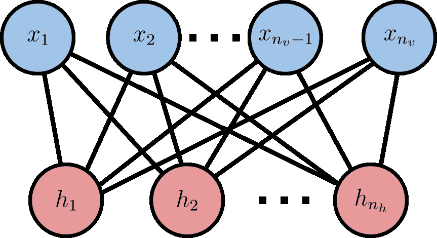
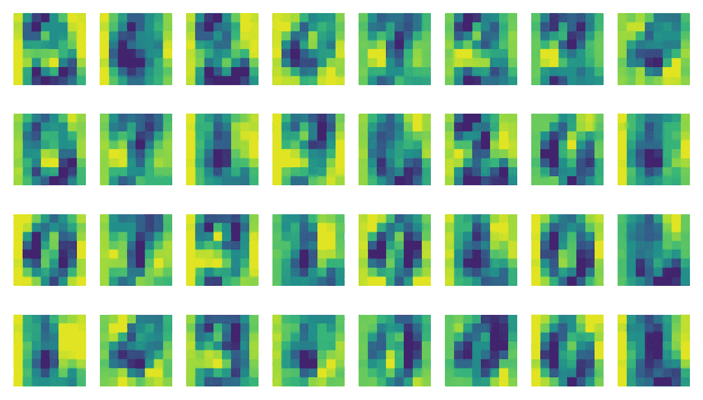
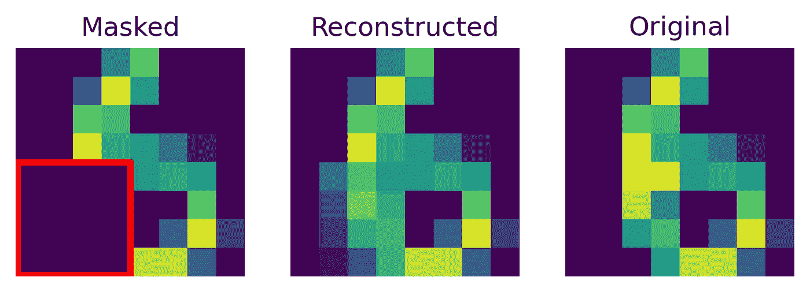

# 使用和谐网络学习离散数据：第一部分，基础知识

> 原文：[`towardsdatascience.com/learning-discrete-data-with-harmoniums-part-i-the-essentials-be54e0e293b4?source=collection_archive---------13-----------------------#2024-01-05`](https://towardsdatascience.com/learning-discrete-data-with-harmoniums-part-i-the-essentials-be54e0e293b4?source=collection_archive---------13-----------------------#2024-01-05)

## 来自档案：00 年代的生成式 AI

[](https://medium.com/@hylke.donker?source=post_page---byline--be54e0e293b4--------------------------------)[](https://towardsdatascience.com/?source=post_page---byline--be54e0e293b4--------------------------------) [Hylke C. Donker](https://medium.com/@hylke.donker?source=post_page---byline--be54e0e293b4--------------------------------)

·发表于 [Towards Data Science](https://towardsdatascience.com/?source=post_page---byline--be54e0e293b4--------------------------------) ·阅读时间：7 分钟·2024 年 1 月 5 日

--

我想带你回到上一个生成式 AI 的篇章，回到 00 年代初期。在这段时间里，深度学习的奠基人之一 Geoff Hinton 发表了一篇具有影响力的论文，详细介绍了对比散度算法[1]。这一发现使得 Smolensky 的和谐网络[2]——Hinton 称之为限制玻尔兹曼机——能够高效地进行训练。很快人们意识到，这一模型可以用于各种用途：初始化前馈神经网络[3]，作为深度信念网络的一部分[4]，等等。至少在十年的时间里，和谐网络一直是 AI 的支柱之一，直到我们发现了更好的优化器来训练前馈网络。尽管和谐网络现在已经不再流行，但它仍然在建模离散数据方面保持着重要的价值。

在本系列的第一篇文章中，我们将专注于基本内容：什么是和谐网络，它们何时有用，以及如何开始使用*scikit-learn*。在后续的文章中，我们将更详细地探讨技术细节。

# 什么是和谐网络？



图 1：**和谐网络的图形表示。** 感受野是连接可见单元***x***与隐藏单元**h**的边，形成一个二分图网络。图像由作者提供。

经典的哈莫纽姆——或限制玻尔兹曼机——是一个处理二进制数据的神经网络[2]。这些网络由两种类型的变量组成：输入 ***x*** 和隐藏状态 ***h***（见图 1）。输入由零和一组成，*xᵢ* ∈ {0, 1}，我们称这些观测值——***x***——为网络的*可见状态*或*单元*。相反，隐藏单元 ***h*** 是潜在的，不是直接观察到的；它们位于网络内部。像可见单元一样，隐藏单元 ***h*** 也是零或一，*hᵢ* ∈ {0, 1}。  

标准的前馈神经网络通过将一层的输出传递到下一层的输入来顺序处理数据。而在哈莫纽姆中则有所不同。相反，模型是一个*无*向网络。网络结构决定了概率分布如何在图中分解。反过来，网络拓扑结构源自 **能量函数** *E*(***x***, ***h***)，它量化了可见单元 ***x*** 和隐藏单元 ***h*** 的特定配置的偏好。由于哈莫纽姆是通过能量函数定义的，因此我们称它为 **基于能量的模型**。  

## 能量函数  

最简单的网络直接通过 *E*(***x***, ***h***) = ***x***ᵀ***Wh*** 将观测值 ***x*** 与隐藏状态 ***h*** 连接，其中 ***W*** 是感受野。***x*** 和 ***h*** 的有利配置具有低能量 *E*(***x***, ***h***)，而不太可能的组合则具有高能量。反过来，能量函数控制着可见单元的概率分布。  

*p*(***x***,***h***) = exp[-*E*(***x***, ***h***)] / *Z,*  

其中因子 *Z* 是一个常数，称为分区函数。分区函数确保 *p*(***x***,***h***) 是归一化的（总和为 1）。通常，我们会在能量函数中加入额外的偏置项，分别是可见状态 ***a*** 和隐藏状态 ***b***：  

*E*(***x***, ***h***) = ***x***ᵀ***a*** + ***x***ᵀ***Wh*** + ***b***ᵀ***h.***  

在结构上，*E*(***x***, ***h***) 在 ***x*** 和 ***h*** 之间形成了一个二分法（见图 1）。因此，我们可以通过对分布进行采样，轻松地将观测值 ***x*** 转换为隐藏状态 ***h***：  

*p*(*hᵢ*=1|***x***) = *σ*[-(***W***ᵀ***x***+***b***)],  

其中 *σ*(*x*) = 1/[1 + exp(-*x*)] 是 sigmoid 激活函数。如你所见，***h*** | ***x*** 的概率分布在结构上类似于一个单层前馈神经网络。对于给定潜在观测的可见状态，类似的关系也成立：*p*(*xᵢ*=1|***h***) = *σ*[-(***Wh***+***a***)]。  

这个恒等式可以用来基于潜在状态 ***h*** **推断**（生成新的）输入变量。诀窍是通过在 *p*(***x***|***h***) 和 *p*(***h***|***x***) 之间交替进行 Gibbs 采样。更多内容将在本系列的第二部分中讨论。  

# 何时使用哈莫纽姆  

在实践中，当以下情况成立时，可以考虑使用哈莫纽姆：

**1. 你的数据是离散的（具有二进制值）。**  

哈莫纽姆有着坚实的理论基础：事实证明，该模型足够强大，能够描述*任何*离散分布。也就是说，哈莫纽姆是通用近似器[5]。因此，理论上，当你的数据集是离散的时，哈莫纽姆是一种通用模型。实际上，哈莫纽姆在自然位于区间[0, 1]的数据上也表现良好。

**2. 用于表示学习。**

网络内部的隐藏状态，***h***，可以独立使用。例如，***h***可以作为降维技术来学习***x***的压缩表示。可以将其视为主成分分析，但针对离散数据。潜在表示***h***的另一个应用是将其作为分类器的特征，用于下游任务。

**3. 以引出变量中的潜在结构。**

哈莫纽姆是具有感受野的神经网络，用来描述一个示例***x***与其潜在状态***h***之间的关系：神经元如果连接在一起，就会一起激活。我们可以使用感受野作为读取输出，识别自然配对的输入变量（聚类）。换句话说，模型描述了可见单元之间的不同关联（或相关性）模块。

**4. 用于数据插补。**

由于哈莫纽姆（harmonium）是生成模型，它们可以用于补全缺失数据（即插补）或生成全新的（合成）示例。传统上，它们被用于图像修复：补全被遮挡的图像部分。另一个例子是推荐系统：哈莫纽姆曾在 Netflix 比赛中用于改善电影推荐。

# 开始使用 scikit-learn

现在你已经了解了基本要点，接下来让我们展示如何训练一个模型。

作为我们的运行示例，我们将使用[UCI MLR 手写数字数据库](https://archive.ics.uci.edu/dataset/80/optical+recognition+of+handwritten+digits)（CC BY 4.0），这是*scikit-learn*的一部分。虽然严格来说，哈莫纽姆需要二进制数据作为输入，但实际上使用二进制概率（而不是其样本）效果也很好。因此，在训练之前，我们将像素值归一化到单位区间[0, 1]。

```py
from sklearn.datasets import load_digits
from sklearn.model_selection import train_test_split
from sklearn.preprocessing import MaxAbsScaler

# Load dataset of 8x8 pixel handwritten digits numbered zero to nine.
digits = load_digits()
X = MaxAbsScaler().fit_transform(digits.data)  # Scale to interval [0, 1].
X_train, X_test = train_test_split(X)
```

方便的是，*scikit-learn*提供了现成的实现：[BernoulliRBM](https://scikit-learn.org/stable/modules/generated/sklearn.neural_network.BernoulliRBM.html)。

```py
from sklearn.neural_network import BernoulliRBM

harmonium = BernoulliRBM(n_components=32, learning_rate=0.05)
harmonium.fit(X_train)
receptive_fields = -harmonium.components_  # Energy sign convention.
```

在模型的内部，依赖于持久对比散度算法来拟合模型的参数[6]。（要了解更多算法细节，敬请关注。）



图 2：每个哈莫纽姆隐藏单元的感受野**W**。图片由作者提供。

要解释数据中的关联——哪些输入像素一起激活——你可以检查感受野 ***W.*** 在 *scikit-learn* 中，***W*** 的 NumPy 数组可以通过在拟合 `BernoulliRBM` 模型后访问 `BernoulliRBM.components_` 属性来获取（图 2）。[请注意：*scikit-learn* 在能量函数中使用了不同的符号约定：*E*(***x***,***h***) -> -*E*(***x***,***h***)。]

对于**表示学习**，通常使用确定性值 *p*(*hᵢ*=1|***x***) 作为表示，而不是随机样本 *hᵢ ~ p*(*hᵢ*|***x***)。由于 *p*(*hᵢ*=1|***x***) 等于给定 ***x*** 的期望隐藏状态 <*hᵢ>*，它在推理过程中是一个方便的度量，因为我们更倾向于确定性（而非随机性）。在 *scikit-learn* 中，潜在表示 *p*(*hᵢ*=1|***x***) 可以通过以下方式直接获得：

```py
H_test = harmonium.transform(X_test)
```

最后，为了演示**填充**或图像修复，我们使用包含数字六的图像并删除 25% 的像素值。

```py
import numpy as np

mask = np.ones(shape=[8,8])  # Mask: erase pixel values where zero.
mask[-4:, :4] = 0  # Zero out 25% pixels: lower left corner.
mask = mask.ravel()
x_six_missing = X_test[0] * mask  # Digit six, partly erased.
```

我们现在将使用和谐模型来填充已删除的变量。诀窍是使用马尔科夫链蒙特卡罗（MCMC）方法：利用我们已观测到的像素值来模拟缺失的像素值。事实证明，吉布斯采样——一种特定的 MCMC 方法——在和谐模型中尤其容易实现。



图 3：红色方框中的像素值丢失（左），并通过和谐模型进行填充（中）。为了对比，右侧显示了原始图像（UCI MLR 手写数字数据库，CC BY 4.0）。图片由作者提供。

以下是操作步骤：首先，使用你想要填充的样本初始化多个马尔科夫链（例如，100 条链）。然后，使用吉布斯采样对链进行多次迭代（例如，1000 次），同时固定观测到的值。最后，从链中聚合样本，以获得缺失值的分布。代码实现如下：

```py
# Impute the data by running 100 parallel Gibbs chains for 1000 steps:
X_reconstr = np.tile(x_six_missing, reps=(100, 1))  # Initialise 100 chains.
for _ in range(1_000):
    # Advance Markov chains by one Gibbs step.
    X_reconstr = harmonium.gibbs(X_reconstr)
    # Clamp the masked pixels.
    X_reconstr = X_reconstr * (1 - mask) + x_six_missing * mask
# Final result: average over samples from the 100 Markov chains.
x_imputed = X_reconstr.mean(axis=0)
```

结果如图 3 所示。正如你所见，和谐模型在重建原始图像方面表现相当不错。

# 结论

生成性 AI 并不是什么新鲜事，它已经有很长历史了。我们已经看过了和谐模型，它是一种基于能量的无监督神经网络模型，二十年前曾非常流行。虽然如今它不再是关注的中心，但和谐模型在今天仍然在特定的细分领域中非常有用：从离散数据中学习。由于它是生成模型，和谐模型可以用来填充（或补全）变量值，或者生成全新的示例。

在这篇两部分系列文章的第一篇中，我们已经了解了基本要点。足够让你入门。请继续关注第二部分，我们将更深入地探讨训练这些模型的技术细节。

## 致谢

我要感谢[Rik Huijzer](https://huijzer.xyz/)和 Dina Boer 的校对。

## 参考文献

[1] Hinton “[通过最小化对比散度训练专家产品](https://www.cs.utoronto.ca/~hinton/absps/nccd.pdf)” *神经计算* 14.8, 1771–1800 (2002)。

[2] Smolensky “[信息处理在动态系统中的应用：和谐理论的基础](https://apps.dtic.mil/sti/pdfs/ADA620727.pdf)” 194–281 (1986).

[3] Hinton-Salakhutdinov, “[使用神经网络减少数据的维度](https://doi.org/10.1126/science.1127647)” *科学* 313.5786, 504–507 (2006).

[4] Hinton-Osindero-Teh. “[深度信念网络的快速学习算法](https://doi.org/10.1162/neco.2006.18.7.1527)” *神经计算* 18.7, 1527–1554 (2006).

[5] Le Roux-Bengio, “[限制玻尔兹曼机和深度信念网络的表示能力](https://www.microsoft.com/en-us/research/wp-content/uploads/2016/02/representational_power.pdf)” 神经计算 20.6, 1631–1649 (2008).

[6] Tieleman, “[使用似然梯度的近似训练限制玻尔兹曼机](https://dl.acm.org/doi/pdf/10.1145/1390156.1390290?casa_token=KA8SOPhKmvIAAAAA%3AulezajFrxWkXlhByFI-M_T8BhZBe7snX8eaFql0D0IMDw0igH710rVMYtCmK-r4Vz2VcjMPXGysT)” *第 25 届国际机器学习大会论文集*。2008 年。
