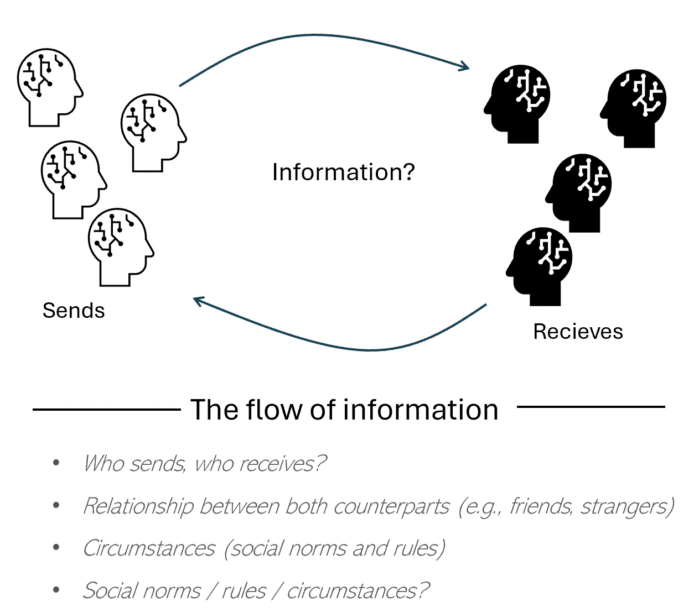
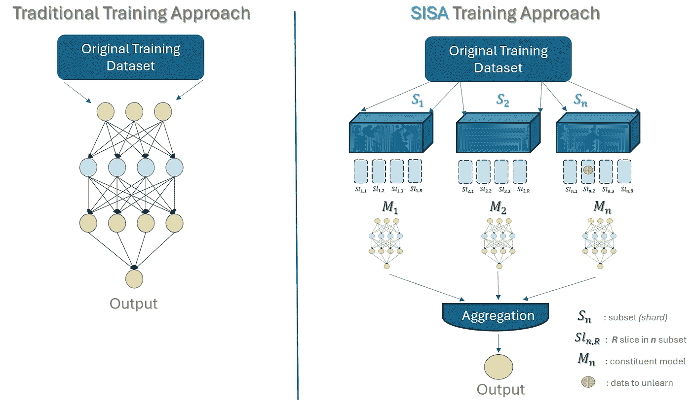

# 学会遗忘：为什么数据科学家和 AI 从业者应该理解机器遗忘

> 原文：[`towardsdatascience.com/learning-to-unlearn-why-data-scientists-and-ai-practitioners-should-understand-machine-unlearning-866af9e5d712?source=collection_archive---------8-----------------------#2024-08-22`](https://towardsdatascience.com/learning-to-unlearn-why-data-scientists-and-ai-practitioners-should-understand-machine-unlearning-866af9e5d712?source=collection_archive---------8-----------------------#2024-08-22)


图片由 [Sue Winston](https://unsplash.com/@winniepix?utm_source=medium&utm_medium=referral) 提供，来源于 [Unsplash](https://unsplash.com/?utm_source=medium&utm_medium=referral)

## 探讨隐私与 AI 的交集，并通过使用 SISA 技术应用于卷积神经网络（CNNs）的 Python 示例，指导如何去除单个数据点对 AI 训练的影响。

[](https://medium.com/@raul.vizcarrach?source=post_page---byline--866af9e5d712--------------------------------)[](https://towardsdatascience.com/?source=post_page---byline--866af9e5d712--------------------------------) [Raul Vizcarra Chirinos](https://medium.com/@raul.vizcarrach?source=post_page---byline--866af9e5d712--------------------------------)

·发表于 [Towards Data Science](https://towardsdatascience.com/?source=post_page---byline--866af9e5d712--------------------------------) ·阅读时间：20 分钟·2024 年 8 月 22 日

--

截至本文撰写之时，根据[世界银行数据](https://data.worldbank.org/country)，全球超过 32%的人口（大约 80 亿人）年龄在二十岁以下。这意味着大约 26 亿人出生在社交媒体时代，而且几乎可以确定，他们几乎所有的生活都已经在线记录，由他们的父母、亲密圈子，最终可能是他们自己*(取决于他们对社交媒体的依赖以及他们的网络)*。如果再加上二十到五十岁之间的人群，我们就有另外 33 亿人，在某种程度上，他们的生活的一部分已经在线记录，涵盖不同的来源和格式*(如图片、评论、视频等)*。当然，我们可以根据超过五十岁的人群进行调整，或者考虑到并非每个人都有互联网接入或使用互联网*（*[*根据世界银行 2021 年估算，至少有 35%的人无法接入或使用互联网*](https://data.worldbank.org/indicator/IT.NET.USER.ZS?locations=ET%2F)*)*，但我相信你明白我的意思。今天的数字世界中，确实有大量的我们生活的记录。

另一个高概率或也许是确定的*（*[*我们可以再问一下 OpenAI 的 CTO*](https://youtu.be/mAUpxN-EIgU?feature=shared)*🙄)*是，这些数据中的大部分已经被用来训练今天部署的所有“最先进”模型，从大语言模型（LLM）到可以处理图像、视频或文本等信息的多模态 AI 模型。在这种背景下，当谈到数据、技术和隐私时，我们常常看到两方在寻找中间立场的过程中展开斗争。一方是每个人与技术之间的社会契约，我们愿意为获得技术带来的利益而交换部分数据权利。另一方面，是必须划定界限的问题，正如这一立场的支持者所说，***“仅仅因为数据是可访问的，并不意味着它可以自由收集和使用”***。

在本文中，我们将探讨在讨论**人工智能中的隐私**时出现的一些挑战，包括对**机器遗忘**和**SISA 训练方法（分片、隔离、切片和聚合训练）**的简要概述，SISA 是一种最近开发的机器遗忘框架，旨在帮助管理或减少个体数据点在 AI 训练中的影响，并解决与“**被遗忘权**”相关的合规性挑战。


照片由[Tingey Injury Law Firm](https://unsplash.com/@tingeyinjurylawfirm?utm_source=medium&utm_medium=referral)提供，来源于[Unsplash](https://unsplash.com/?utm_source=medium&utm_medium=referral)

# 壁中低语的，将在屋顶上大声宣告。

历史上最早倡导**隐私权**的出版物之一是由两位美国律师塞缪尔·D·沃伦和路易斯·布兰代斯于 1890 年代发表的一篇文章。该文章标题为[***隐私权***](https://www.cs.cornell.edu/~shmat/courses/cs5436/warren-brandeis.pdf)，旨在提高人们对未经授权的照片和早期报纸企业影响的认识，他们认为这些影响将八卦变成了一种商品，侵害了个人享受生活的权利，即**被独立对待的权利**。

> 个人在身体和财产上的完全保护是与普通法同样古老的原则；但随着时间的推移，有时需要重新定义这种保护的确切性质和范围。….近期的发明和商业方法提醒我们，必须采取下一步措施来保护个人，并保障个体的权利，正如库利法官所称的“被独立对待的权利”（塞缪尔·D·沃伦，路易斯·布兰代斯，1890 年）。

自《隐私权》一书发布以来，时代已经发生了变化，但沃伦和路易斯·布兰代斯在一件事上并没有错；**技术、政治、社会和经济的变革不断挑战现有或新兴的权利**。对此，普通法应始终保持开放的态度，以应对社会的新需求，认识到社会的保护主要通过承认个人的权利来实现。

从那时起，隐私常常与**传统的做法**相联系，即**保护我们关心和想要隐藏的东西，保持其不为公众所见，并控制其访问和使用**。但同样的事实是，随着时间的推移，隐私的边界被颠覆性技术所挑战；摄影和视频设定了新的边界，最近则是数据的指数增长。然而，基于数据的技术不仅影响了数据合规的格局；它们还对我们的信仰和习惯产生了一些影响。社交媒体平台或超级应用就是一个例子，在这些平台上，我们愿意为了技术带来的好处而交换部分数据隐私。这意味着**语境很重要**，在某些情况下，分享我们的敏感信息更多依赖于像信任这样的价值观，而不一定是考虑隐私泄露。

> *“数据不仅仅是‘私密’或‘非私密’、‘敏感’或‘非敏感’的。语境很重要，社会的规范性价值观也是...”*（[*《高级 AI 助手的伦理》. Google DeepMind 2024*](https://storage.googleapis.com/deepmind-media/DeepMind.com/Blog/ethics-of-advanced-ai-assistants/the-ethics-of-advanced-ai-assistants-2024-i.pdf)）

**语境与隐私之间的关系**是一个有趣的思维方向，被称为信息隐私模型。

**“情境完整性” *(***[*Nissenbaum, 2004*](https://digitalcommons.law.uw.edu/cgi/viewcontent.cgi?article=4450&context=wlr)*)***.** 它指出，在发送者和接收者之间的每一次信息交换或流动中，都有社会规则来规范它。理解这些规则对确保信息交换得到适当监管至关重要。



图 01 来源：作者自创

一个清晰的例子可能是，例如，关于我孩子在学校表现的信息。如果一位老师将我孩子的成绩记录与其他家长或校外陌生人共享，我可能会认为这是隐私侵犯。然而，如果同样的老师将这些信息与其他教我孩子的老师共享，以便交流经验并改善我孩子的学校表现，我可能就不会那么担心，反而会依赖于信任、价值观和老师的良好判断。因此，**在情境完整性方法下**，隐私不再仅仅被看作是“独立生活的权利”这一僵化的状态。相反，**重要的是信息流动应当得到适当的监管**，考虑到其中的背景和治理规范，以界定其边界。隐私作为一项基本权利不应改变，但可以重新思考。

> **隐私的固有概念是否应该保持不变？还是我们应该首先理解支配信息流动的社会规则？**

随着人工智能继续塑造未来，这一重新思考挑战着我们考虑是否需要适应现有的权利，或可能引入新的数字权利。

# 机器“遗忘”

无论你是将隐私视为一个僵化的概念，还是考虑情境完整性方法，我认为我们大多数人都会同意，我们所有人都应当享有公平处理个人数据的权利，且在需要时能获得我们的同意，并有权纠正或删除数据。

尽管《通用数据保护条例》（GDPR）促进了数据与隐私的共存，**在监管框架中平衡隐私与人工智能仍然是一个不同的挑战**。尽管我们可以从数据集删除或修改敏感数据，但在 AI 模型中这样做要复杂得多。AI 模型并非每天都重新训练，而且在大多数情况下，需要数月时间才能确保其可靠性。为了解决在 AI 模型中选择性地删除特定训练数据点（*及其影响*）而不显著牺牲模型性能的任务，像**机器“遗忘”**这样的技术应运而生，并正在进行研究，以寻找解决隐私问题的方案，遵守可能强制实施的法规，并保护用户删除或更正数据的法定权利。

与可以追溯到一百多年前的隐私政策研究相比，机器“遗忘”是一个相对较新的领域，最初的研究大约出现在 10 年前（[Y. Cao 和 J. Yang, 2015](https://www.ieee-security.org/TC/SP2015/papers-archived/6949a463.pdf)）。

***那么我们为什么要关注机器遗忘呢？*** 无论你是推动人工智能边界的 AI 研究员，还是在为终端用户优化 AI 解决方案的从业者，以下是将机器遗忘技术应用于机器学习流程的一些好理由：

· **被遗忘权（RTBF）：** 大型语言模型（LLMs）和最先进的基础模型以复杂且快速发展的方式处理数据。如同《通用数据保护条例》（GDPR）所见，用户请求**删除权**并将其纳入 AI 相关法规的制定，已只是时间问题。这将要求任何使用 AI 的公司调整流程以符合这些规定，并响应用户要求，从预训练模型中移除个人数据。

· **非零影响：** 如今，**差分隐私**等框架的存在是为了通过引入噪音来确保对敏感数据集的一定隐私保护，从而隐藏单个数据点的贡献。然而，虽然差分隐私有助于减轻单个数据点的影响，但这种努力仍然是“**非零的**”。这意味着，目标数据点仍然有可能对模型产生某种影响。在需要**完全删除**数据点的情况下，可能需要采取不同的差分隐私方法。

· **性能优化：** 众所周知，基础模型需要大量数据进行训练，这需要大量的时间和计算资源。**从头开始重新训练完整模型以删除单个数据点可能是最有效的方式**，以消除该数据点在模型中的任何影响，**但这并不是最高效的做法** *(模型需要频繁重新训练😨)*。机器遗忘领域通过考虑时间和计算资源作为反向处理或消除特定数据点对模型参数影响的约束，来解决这个问题。

· **网络安全：** 模型并不免受对手的攻击，这些攻击通过注入数据来操控模型行为，从而泄露用户的敏感信息。机器遗忘可以帮助去除有害数据点，保护用于训练模型的敏感信息。

在机器遗忘领域，我们可以找到两种思路：**精确机器遗忘**和**近似机器遗忘**。**精确机器遗忘**侧重于通过完全删除特定数据点来消除其影响 *(就好像这些数据从未被引入模型一样)*，而**近似机器遗忘**旨在高效地减少训练模型中某些数据点的影响 *(使模型的行为接近于如果这些数据点从未引入过模型的状态)*。这两种方法都提供了多样化的技术来应对用户的删除权问题，同时考虑到模型性能下降、计算资源、时间消耗、存储资源、特定学习模型或数据结构等限制。

为了更好地理解该领域的最新研究工作，我推荐两篇有趣的阅读材料：[*机器去学习：解决方案与挑战（2024）*](https://arxiv.org/pdf/2308.07061) 和 [*学会去学习：机器去学习的见解（2023）*](https://arxiv.org/pdf/2305.07512)。这两篇论文很好地回顾了近年来机器去学习领域科学家和研究人员的非凡工作。

# SISA **（分片、隔离、切片和聚合）**

**SISA 框架是“精确机器去学习”思想的一部分**，旨在去除数据而无需对模型进行完全重新训练。该框架从这样一个前提出发：虽然从头开始重新训练，排除需要去学习的数据点，是与“被遗忘权”原则对齐的最直接方式（*提供证明并确保不需要的数据已被移除*），但它也认识到，对于使用大量数据集训练的复杂基础模型而言，这种方法可能会被视为一种天真的策略，因为这类模型训练需要高资源。因此，为了应对去学习过程的挑战，任何技术都应该满足以下要求：

1.  **易于理解（可理解性）：** 该技术应易于理解和实现。

1.  **准确性：** 虽然某些准确性可能会丢失是合理的，但这一差距应该很小。

1.  **时间/计算效率：** 它应比从头排除数据点所需的时间更少，并且所需的计算资源应类似于现有训练过程所用的资源。

1.  **易于验证（可证明的保证）：** 该技术应清楚地表明所请求的数据点已被去学习，而不会影响模型参数，并且证明可以轻松解释（即使是非专家也能理解）。

1.  **与模型无关：** 它应适用于各种性质和复杂度的模型。

> **我们如何保证特定训练数据点的完全移除？我们如何验证去学习过程的成功？**

SISA 框架（分片、隔离、切片和聚合）最初在 2019 年由 Bourtoule 等人提出，发表于论文 *“*[*机器去学习*](https://arxiv.org/abs/1912.03817)*”*，旨在提出一个**替代解决方案，用于解决从机器学习模型中去除数据的问题，确保移除保证易于理解**。该论文在引言部分易于阅读，但如果你不熟悉机器学习领域，可能会变得复杂。因此，我将尝试总结一些我认为有趣的技术特征，但如果你有时间，我强烈建议阅读这篇论文，它值得一读！*(你还可以观看作者在 IEEE 安全与隐私研讨会上进行的* [*这篇视频演示*](https://youtu.be/xUnMkCB0Gns?feature=shared) *，其中对论文的发现进行了有趣的展示)*

SISA 训练方法**包括多次复制模型**，每个副本**在数据集的不同子集上进行训练**（*称为一个分片*）。**每个模型被称为“构成模型”**。在每个分片内，**数据进一步被划分为“切片”**，并应用增量学习，相应地归档参数。每个构成模型在训练阶段主要与其分配的分片一起工作，同时在每个分片内使用切片来管理数据并支持增量学习。训练后，来自每个分片的子模型会被汇总，形成最终模型。在推理过程中，**来自不同构成模型的预测结果会结合在一起，产生整体预测结果**。**图 02**说明了 SISA 训练方法的工作原理。



图 02 来源：作者基于 Bourtoule 等人论文（2019）自行创作

**当需要去学习某些数据时**，只有包含需要去学习数据点的分片中的构成模型会被重新训练（*数据点会从特定分片中的某个切片中去学习*）。

## 应用 SISA：针对图像识别的 CNN 模型去学习与再训练

为了理解如何应用 SISA，我将使用 Python 进行一个案例示例。最近，我使用 PyTorch、计算机视觉技术和卷积神经网络（CNN）构建了一个基本的设置，用于追踪冰球球员和球队，并收集一些基本的表现统计数据*（[*你可以在这里访问完整的文章*](https://medium.com/towards-data-science/spicing-up-ice-hockey-with-ai-player-tracking-with-computer-vision-ce9ceec9122a)）*。


使用计算机视觉进行球员追踪

尽管秘鲁滑旱冰曲棍球协会（APHL）已同意将 40 秒的视频用于该项目，但**我们设想一个 SISA 应用案例的场景：某个球员抱怨自己的图像被使用，并行使删除权，要求从分类每个球员所属队伍的 CNN 预训练模型中移除他的图像**。这将要求我们从训练数据集中移除该图像，并重新训练整个模型。然而，通过应用 SISA 技术，我们只需处理包含这些图像的分片和切片，从而避免了从头开始重新训练整个模型，节省了时间。

原始 CNN 模型结构如下：

```py
# ************CONVOLUTIONAL NEURAL NETWORK-THREE CLASSES DETECTION**************************
# REFEREE
# WHITE TEAM (white_away)
# YELLOW TEAM (yellow_home)

import os
import torch
import torch.nn as nn
import torch.optim as optim
import torch.nn.functional as F
import torchvision.transforms as transforms
import torchvision.datasets as datasets
from torch.utils.data import DataLoader
from sklearn.metrics import accuracy_score, precision_score, recall_score, f1_score
import matplotlib.pyplot as plt

#******************************Data transformation********************************************
# Training and Validation Datasets
data_dir = 'D:/PYTHON/teams_sample_dataset'

transform = transforms.Compose([
    transforms.Resize((150, 150)),
    transforms.ToTensor(),
    transforms.Normalize(mean=[0.5, 0.5, 0.5], std=[0.5, 0.5, 0.5])
])

# Load datasets
train_dataset = datasets.ImageFolder(os.path.join(data_dir, 'train'), transform=transform)
val_dataset = datasets.ImageFolder(os.path.join(data_dir, 'val'), transform=transform)

train_loader = DataLoader(train_dataset, batch_size=32, shuffle=True)
val_loader = DataLoader(val_dataset, batch_size=32, shuffle=False)

#********************************CNN Model Architecture**************************************
class CNNModel(nn.Module):
    def __init__(self):
        super(CNNModel, self).__init__()
        self.conv1 = nn.Conv2d(3, 32, kernel_size=3, padding=1)
        self.pool = nn.MaxPool2d(kernel_size=2, stride=2, padding=0)
        self.conv2 = nn.Conv2d(32, 64, kernel_size=3, padding=1)
        self.conv3 = nn.Conv2d(64, 128, kernel_size=3, padding=1)
        self.fc1 = nn.Linear(128 * 18 * 18, 512)
        self.dropout = nn.Dropout(0.5)
        self.fc2 = nn.Linear(512, 3)  #Three Classes

    def forward(self, x):
        x = self.pool(F.relu(self.conv1(x)))
        x = self.pool(F.relu(self.conv2(x)))
        x = self.pool(F.relu(self.conv3(x)))
        x = x.view(-1, 128 * 18 * 18)
        x = F.relu(self.fc1(x))
        x = self.dropout(x)
        x = self.fc2(x)  
        return x

#********************************CNN TRAINING**********************************************

# Model-loss function-optimizer
model = CNNModel()
criterion = nn.CrossEntropyLoss()
optimizer = optim.Adam(model.parameters(), lr=0.001)

#*********************************Training*************************************************
num_epochs = 10
train_losses, val_losses = [], []

for epoch in range(num_epochs):
    model.train()
    running_loss = 0.0
    for inputs, labels in train_loader:
        optimizer.zero_grad()
        outputs = model(inputs)
        labels = labels.type(torch.LongTensor)  
        loss = criterion(outputs, labels)
        loss.backward()
        optimizer.step()
        running_loss += loss.item()

    train_losses.append(running_loss / len(train_loader))

    model.eval()
    val_loss = 0.0
    all_labels = []
    all_preds = []
    with torch.no_grad():
        for inputs, labels in val_loader:
            outputs = model(inputs)
            labels = labels.type(torch.LongTensor)  
            loss = criterion(outputs, labels)
            val_loss += loss.item()
            _, preds = torch.max(outputs, 1)  
            all_labels.extend(labels.tolist())
            all_preds.extend(preds.tolist())

#********************************METRICS & PERFORMANCE************************************

    val_losses.append(val_loss / len(val_loader))
    val_accuracy = accuracy_score(all_labels, all_preds)
    val_precision = precision_score(all_labels, all_preds, average='macro', zero_division=1)
    val_recall = recall_score(all_labels, all_preds, average='macro', zero_division=1)
    val_f1 = f1_score(all_labels, all_preds, average='macro', zero_division=1)

    print(f"Epoch [{epoch + 1}/{num_epochs}], "
          f"Loss: {train_losses[-1]:.4f}, "
          f"Val Loss: {val_losses[-1]:.4f}, "
          f"Val Acc: {val_accuracy:.2%}, "
          f"Val Precision: {val_precision:.4f}, "
          f"Val Recall: {val_recall:.4f}, "
          f"Val F1 Score: {val_f1:.4f}")

#*******************************SHOW METRICS & PERFORMANCE**********************************
plt.plot(train_losses, label='Train Loss')
plt.plot(val_losses, label='Validation Loss')
plt.legend()
plt.show()

# SAVE THE MODEL FOR THE GH_CV_track_teams CODE
torch.save(model.state_dict(), 'D:/PYTHON/hockey_team_classifier.pth')
```

如你所见，这是一个三层（conv1，conv2，conv3）的神经网络结构，使用 ReLU 作为激活函数，经过大约 90 张分类为三个类别的图像训练：裁判员、Team_Away（白色球衣的球员）和 Team_Home（黄色球衣的球员），并完成了 10 轮的完整周期。

考虑到这种初步方法，删除图像的请求将涉及从训练集和验证集中删除图像，并重新训练模型。虽然对于像我们这样的小数据集来说这可能很容易，但对于更大的数据集，比如当前大语言模型（LLM）所使用的数据集，这将是一次资源的巨大消耗。此外，反复执行此过程也可能成为一个限制。

现在，让我们假设在构建模型时，我们意识到用户有删除或更正的权利，并考虑应用 SISA 技术。这种方法将为模型做好准备，以应对未来可能需要将图像从训练数据集中永久删除的情况，以及 CNN 在学习过程中可能捕获的任何特征。第一步是将上述初始模型调整为包含 SISA 技术的四个步骤：分片（Sharding）、隔离（Isolating）、切片（Slicing）和聚合（Aggregation）。

**步骤 01：分片和切片**

在前面代码中指定的转换步骤之后，我们将通过将数据集划分为多个分片来开始应用 SISA。在代码中，您将看到这些分片是多样化的，并且被分割成大小相等的部分，以确保每个分片包含具有代表性的样本数量，并在我们要预测的不同类别之间保持平衡*（在我们的案例中，我们正在预测三类）*。

```py
 #******************************Sharding the dataset**************************

def shard_dataset(dataset, num_shards):
    indices = list(range(len(dataset)))
    np.random.shuffle(indices)
    shards = []
    shard_size = len(dataset) // num_shards
    for i in range(num_shards):
        shard_indices = indices[i * shard_size : (i + 1) * shard_size]
        shards.append(Subset(dataset, shard_indices))
    return shards

#******************************Overlapping Slices***************************
def create_overlapping_slices(shard, slice_size, overlap):
    indices = list(shard.indices)
    slices = []
    step = slice_size - overlap
    for start in range(0, len(indices) - slice_size + 1, step):
        slice_indices = indices[start:start + slice_size]
        slices.append(Subset(shard.dataset, slice_indices))
    return slices
```

您会注意到，在切片过程中，我没有像 SISA 技术建议的那样为每个分片分配独占的切片。相反，我们使用了重叠的切片。这意味着每个切片不仅仅由来自一个分片的数据点组成；一些数据点也会出现在下一个切片中。

***那么，为什么我让切片重叠呢？*** 正如你可能已经猜到的那样，我们的数据集很小*（大约 90 张图像）*，因此如果每个分片都使用独占的切片，将无法保证每个切片都有足够平衡的数据集来维持模型的预测能力。**重叠切片** 使得模型能够更好地利用可用数据并提高泛化能力。对于较大的数据集，非重叠切片可能更高效，因为它们需要的计算资源更少。**最终，创建分片和切片需要考虑数据集的大小、计算资源以及维持模型预测能力的需求。**

最后，在定义了函数之后，我们继续设置分片和切片过程的超参数：

```py
 #**************************Applying Sharding and Slicing*******************

num_shards = 4  
slice_size = len(full_train_dataset) // num_shards // 2
overlap = slice_size // 2
shards = shard_dataset(full_train_dataset, num_shards)

#************************Overlapping slices for each shard*****************
all_slices = []
for shard in shards:
    slices = create_overlapping_slices(shard, slice_size, overlap)
    all_slices.extend(slices)
```

数据集被分为 4 个碎片，但我应该提到，最初我使用了 10 个碎片。这导致每个碎片只包含少量的样本，这没有正确代表整个数据集的类别分布，导致模型性能指标（准确率、精确度和 F1 分数）显著下降。由于我们处理的是一个小数据集，减少碎片数量到四个是一个明智的决定。最后，切片过程将每个碎片划分为两个具有 50% 重叠的切片，意味着每个切片中的一半图像与下一个切片重叠。

**步骤 02：隔离特定数据点**

在这一步骤中，我们继续隔离最终用户可能希望修正或从模型学习过程中删除的特定数据点。首先，我们定义一个函数，将指定的数据点从每个切片中移除。接下来，我们根据图像的文件名来确定图像的索引。然后，这些索引用来更新每个切片，移除包含这些数据点的部分。

```py
 #**************************+*Isolate datapoints******************************
def isolate_data_for_unlearning(slice, data_points_to_remove):
    new_indices = [i for i in slice.indices if i not in data_points_to_remove]
    return Subset(slice.dataset, new_indices)

#*****Identify the indices of the images we want to rectify/erasure**********
def get_indices_to_remove(dataset, image_names_to_remove):
    indices_to_remove = [] #list is empty
    image_to_index = {img_path: idx for idx, (img_path, _) in enumerate(dataset.imgs)}
    for image_name in image_names_to_remove:
        if image_name in image_to_index:
            indices_to_remove.append(image_to_index[image_name])
    return indices_to_remove

#*************************Specify and remove images***************************
images_to_remove = []
indices_to_remove = get_indices_to_remove(full_train_dataset, images_to_remove)
updated_slices = [isolate_data_for_unlearning(slice, indices_to_remove) for slice in all_slices]
```

**目前，列表为空（images_to_remove = []），**因此此阶段没有删除任何图像，但当请求到达时，设置已准备好使用（*稍后我们将在本文中看到一个例子*）。

实施 SISA 技术的完整模型应该是这样的：

```py
 import os
import numpy as np
import torch
import torch.nn as nn
import torch.optim as optim
import torch.nn.functional as F
import torchvision.transforms as transforms
import torchvision.datasets as datasets
from torch.utils.data import DataLoader, Subset
from sklearn.metrics import accuracy_score, precision_score, recall_score, f1_score
import matplotlib.pyplot as plt

#******************************Data transformation********************************************
# Training and Validation Datasets
data_dir = 'D:/PYTHON/teams_sample_dataset'

transform = transforms.Compose([
    transforms.Resize((150, 150)),
    transforms.ToTensor(),
    transforms.Normalize(mean=[0.5, 0.5, 0.5], std=[0.5, 0.5, 0.5])
])

# Load data
full_train_dataset = datasets.ImageFolder(os.path.join(data_dir, 'train'), transform=transform)
val_dataset = datasets.ImageFolder(os.path.join(data_dir, 'val'), transform=transform)

#******************************Sharding the dataset**************************

def shard_dataset(dataset, num_shards):
    indices = list(range(len(dataset)))
    np.random.shuffle(indices)
    shards = []
    shard_size = len(dataset) // num_shards
    for i in range(num_shards):
        shard_indices = indices[i * shard_size : (i + 1) * shard_size]
        shards.append(Subset(dataset, shard_indices))
    return shards

#******************************Overlapping Slices***************************
def create_overlapping_slices(shard, slice_size, overlap):
    indices = list(shard.indices)
    slices = []
    step = slice_size - overlap
    for start in range(0, len(indices) - slice_size + 1, step):
        slice_indices = indices[start:start + slice_size]
        slices.append(Subset(shard.dataset, slice_indices))
    return slices

#**************************Applying Sharding and Slicing*******************

num_shards = 4  
slice_size = len(full_train_dataset) // num_shards // 2
overlap = slice_size // 2
shards = shard_dataset(full_train_dataset, num_shards)

#************************Overlapping slices for each shard*****************
all_slices = []
for shard in shards:
    slices = create_overlapping_slices(shard, slice_size, overlap)
    all_slices.extend(slices)

#**************************+*Isolate datapoints******************************
def isolate_data_for_unlearning(slice, data_points_to_remove):
    new_indices = [i for i in slice.indices if i not in data_points_to_remove]
    return Subset(slice.dataset, new_indices)

#*****Identify the indices of the images we want to rectify/erasure**********
def get_indices_to_remove(dataset, image_names_to_remove):
    indices_to_remove = []
    image_to_index = {img_path: idx for idx, (img_path, _) in enumerate(dataset.imgs)}
    for image_name in image_names_to_remove:
        if image_name in image_to_index:
            indices_to_remove.append(image_to_index[image_name])
    return indices_to_remove

#*************************Specify and remove images***************************
images_to_remove = []
indices_to_remove = get_indices_to_remove(full_train_dataset, images_to_remove)
updated_slices = [isolate_data_for_unlearning(slice, indices_to_remove) for slice in all_slices]

#********************************CNN Model Architecture**************************************

class CNNModel(nn.Module):
    def __init__(self):
        super(CNNModel, self).__init__()
        self.conv1 = nn.Conv2d(3, 32, kernel_size=3, padding=1)
        self.pool = nn.MaxPool2d(kernel_size=2, stride=2, padding=0)
        self.conv2 = nn.Conv2d(32, 64, kernel_size=3, padding=1)
        self.conv3 = nn.Conv2d(64, 128, kernel_size=3, padding=1)
        self.fc1 = nn.Linear(128 * 18 * 18, 512)
        self.dropout = nn.Dropout(0.5)
        self.fc2 = nn.Linear(512, 3)  # Output three classes

    def forward(self, x):
        x = self.pool(F.relu(self.conv1(x)))
        x = self.pool(F.relu(self.conv2(x)))
        x = self.pool(F.relu(self.conv3(x)))
        x = x.view(-1, 128 * 18 * 18)
        x = F.relu(self.fc1(x))
        x = self.dropout(x)
        x = self.fc2(x)
        return x

#********************************CNN TRAINING**********************************************

# Model-loss function-optimizer
model = CNNModel()
criterion = nn.CrossEntropyLoss()
optimizer = optim.Adam(model.parameters(), lr=0.001)

#*********************************Training*************************************************
num_epochs = 10
train_losses, val_losses = [], []

for epoch in range(num_epochs):
    model.train()
    running_loss = 0.0
    for slice in updated_slices:
        train_loader = DataLoader(slice, batch_size=32, shuffle=True)
        for inputs, labels in train_loader:
            optimizer.zero_grad()
            outputs = model(inputs)
            labels = labels.type(torch.LongTensor)
            loss = criterion(outputs, labels)
            loss.backward()
            optimizer.step()
            running_loss += loss.item()

    train_losses.append(running_loss / (len(updated_slices)))

    model.eval()
    val_loss = 0.0
    all_labels = []
    all_preds = []
    with torch.no_grad():
        val_loader = DataLoader(val_dataset, batch_size=32, shuffle=False)
        for inputs, labels in val_loader:
            outputs = model(inputs)
            labels = labels.type(torch.LongTensor)
            loss = criterion(outputs, labels)
            val_loss += loss.item()
            _, preds = torch.max(outputs, 1)
            all_labels.extend(labels.tolist())
            all_preds.extend(preds.tolist())

#********************************METRICS & PERFORMANCE************************************

    val_losses.append(val_loss / len(val_loader))
    val_accuracy = accuracy_score(all_labels, all_preds)
    val_precision = precision_score(all_labels, all_preds, average='macro', zero_division=1)
    val_recall = recall_score(all_labels, all_preds, average='macro', zero_division=1)
    val_f1 = f1_score(all_labels, all_preds, average='macro', zero_division=1)

    print(f"Epoch [{epoch + 1}/{num_epochs}], "
          f"Loss: {train_losses[-1]:.4f}, "
          f"Val Loss: {val_losses[-1]:.4f}, "
          f"Val Acc: {val_accuracy:.2%}, "
          f"Val Precision: {val_precision:.4f}, "
          f"Val Recall: {val_recall:.4f}, "
          f"Val F1 Score: {val_f1:.4f}")

#*******************************SHOW METRICS & PERFORMANCE**********************************
plt.plot(train_losses, label='Train Loss')
plt.plot(val_losses, label='Validation Loss')
plt.legend()
plt.show()

# SAVE THE MODEL
torch.save(model.state_dict(), 'hockey_team_classifier_SISA.pth') 
```

现在，让我们进入擦除场景。假设模型已经部署了几个月，一名冰球运动员请求从 CNN 模型的训练数据中删除他们的图像。假设在这个例子中，该运动员出现在训练和验证数据集中三张图像中：**Away_image03.JPG, Away_image04.JPG 和 Away_image05.JPG**。为了从训练过程中删除这些图像，只需在代码的 **“指定并删除图像”** 部分指定这些图像（如上所示）。只有包含这些图像的切片需要重新训练。

```py
#*************************Specify and remove images***************************
images_to_remove = ["Away_image03.JPG", "Away_image04.JPG", "Away_image05.JPG"]
indices_to_remove = get_indices_to_remove(full_train_dataset, images_to_remove)
updated_slices = [isolate_data_for_unlearning(slice, indices_to_remove) for slice in all_slices]
```

最后，我想分享一些将 SISA 框架应用到我的模型中的关键经验：

+   **弱学习者和性能权衡：** 由于每个构成模型都在小的子集（*碎片和切片*）上进行训练，人们可能会认为它们的准确度会低于在整个数据集上训练的单一模型，从而降低模型的泛化能力。令人惊讶的是，在我们的案例中，模型的性能显著提升，这可能是因为在处理一个小的、重叠的数据集时，导致了某种程度的过拟合。在涉及大数据集的使用案例中，**需要考虑潜在的性能权衡**。

+   **适当的分片：** 我最初使用了大量的分片，导致每个分片只有很少的样本，这对模型性能产生了负面影响。**不要低估分片和切片过程的重要性**。适当的分片有助于模型避免过拟合，并在验证集上更好地泛化。

我希望你觉得这个应用 SISA 技术进行机器“忘记”的项目有趣。你可以在这个[GitHub 仓库](https://github.com/rvizcarra15/MachineUnlearning_SISA_framework)访问完整的代码。

# **最后的思考**

我的姐姐和我有一个固定的习惯，我们会交换社交媒体平台每天提醒我们五年、十年或十五年前发布的内容的图片。我们经常会对当时分享的内容或评论大笑（*显然，因为我们大多数人在社交媒体刚出现时并不完全理解它*）。随着时间的推移，我学会了更明智地使用我的社交媒体存在，欣赏社交媒体生态系统之外的周围环境，以及我们生活中某些方面应当拥有的隐私。但事实是，我和我的姐姐已经不再是十或十五年前的我们，尽管过去是我们现在身份的重要部分，但它并不定义我们（*在数字世界中，并非所有事情都必须“刻在石板上”*）。我们每个人都有权选择是否让这些数据停留在数字世界中，并决定是否用于定义我们的选择/偏好或他人的选择。

的确，AI 在使用与将要使用它的用户相似的数据进行训练时表现更好（《先进 AI 助手的伦理问题》，谷歌 DeepMind 2024）。然而，[***“隐私要求透明”***](https://s899a9742c3d83292.jimcontent.com/download/version/1648135848/module/8350351463/name/Rotenberg-GPA2021.pdf)。因此，使用机器学习并且涉及预训练敏感数据的公司，如何以及何时实施“被遗忘权”对于朝着我们都希望拥有的可信 AI 迈进至关重要。

*感谢您的阅读！* 一如既往，欢迎您的建议，并保持对话的进行。
