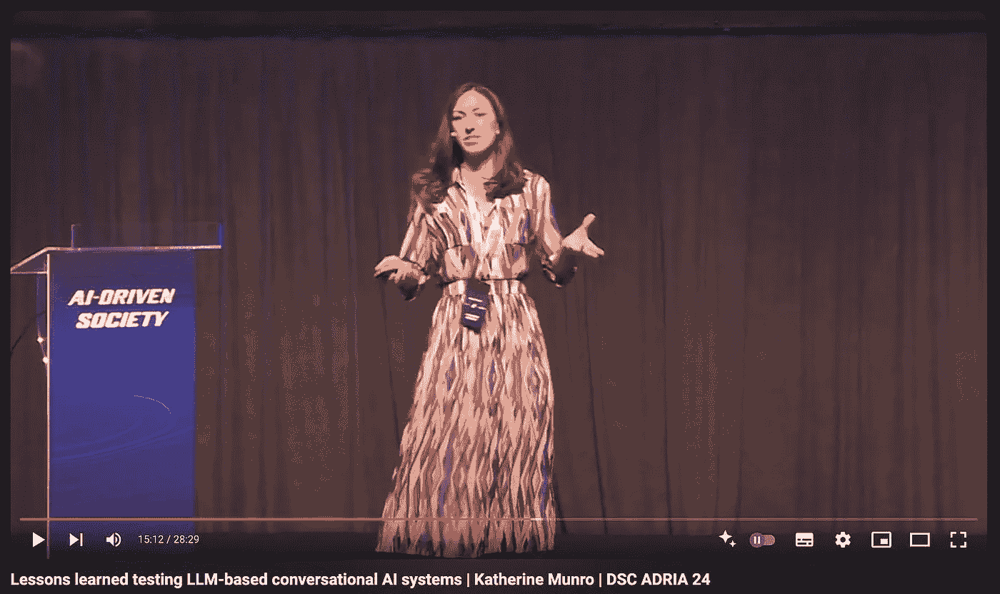

# 没有基准？没有标准？没关系！一种敏捷聊天机器人开发的实验性方法

> 原文：[`towardsdatascience.com/lessons-from-agile-experimental-chatbot-development-73ea515ba762?source=collection_archive---------3-----------------------#2024-08-26`](https://towardsdatascience.com/lessons-from-agile-experimental-chatbot-development-73ea515ba762?source=collection_archive---------3-----------------------#2024-08-26)

## 将基于大语言模型的产品推向生产环境的经验教训

 [Katherine Munro](https://katherineamunro.medium.com/?source=post_page---byline--73ea515ba762--------------------------------)

·发表于 [Towards Data Science](https://towardsdatascience.com/?source=post_page---byline--73ea515ba762--------------------------------) ·阅读时间：12 分钟·2024 年 8 月 26 日

--

今天的文章回顾了我最近的演讲，讲述了将基于大语言模型的产品推向生产环境的经验教训。你可以在[这里](https://www.youtube.com/watch?v=kOpapPHt2JQ&t=221s)查看该视频。

当你拿到一个已经在四种不同语言中为成千上万的客户提供服务的工作聊天机器人时，试图使用大语言模型来提供更好的体验会发生什么？这是个好问题。

大家都知道，评估和比较大语言模型（LLM）是非常棘手的。基准数据集很难获取，而诸如 BLEU 等度量标准也并不完美。但这些主要是学术上的问题：那么，行业中的数据团队在将大语言模型应用到生产项目时，如何解决这些问题呢？

在我作为对话式人工智能工程师的工作中，我正是在做这件事。这也让我在最近的一场数据科学会议上成为了焦点，进行了题为“No baseline? No benchmarks? No biggie!”的（乐观标题的）演讲。今天的文章是该演讲的总结，内容包括：

+   评估一个不断发展的、基于大语言模型（LLM）驱动的概念验证（PoC）与一个正在运行的聊天机器人的挑战

+   我们如何在从概念验证到生产的过程中，在不同阶段使用不同类型的测试

+   不同测试类型的实际优缺点
